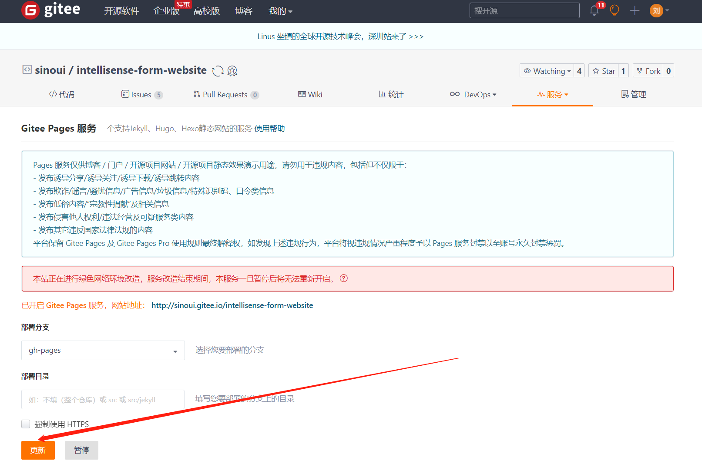

# 智能表单产品站点

外网地址：[http://sinoui.gitee.io/intellisense-form-website/](http://sinoui.gitee.io/intellisense-form-website/)

## 写文档

在写文档时，需要启动此站点项目：

```shell
# 第一次使用，需要安装依赖
$ yarn install
# 启动
$ yarn start
```

## 部署前环境准备

如果您是首次部署，可能需要对您的环境进行一些配置。

### 配置`SSH`公钥

部署命令需要您的仓库`remote`使用`SSH`协议，如果您已经进行了该配置可跳过本步骤。

```bash
$ git remote -v
origin  git@gitee.com:sinoui/intellisense-form-website.git (fetch)
origin  git@gitee.com:sinoui/intellisense-form-website.git (push)
```

1. 本地生成`SSH`公钥

   如果本地已经有`~/.ssh/id_rsa.pub`文件了，可以跳过步骤。请参考[生成/添加SSH公钥](https://gitee.com/help/articles/4181)

   > 建议将公钥添加到*个人设置* 中，而不是具体某个仓库

2. 将`SSH`公钥配置到`gitee`

   2.1 打开`gitee`[个人设置](https://gitee.com/profile/sshkeys) ，找到**安全设置**  =>   **SSH公钥**

   2.2 将第一步生成的公钥，复制到这里，点击确定即可。

3. 添加完成之后，需要修改本地仓库`remote`地址

   ```bash
   git remote set-url origin git@gitee.com:sinoui/intellisense-form-website.git
   ```

4. 验证配置是否生效

   ```
   git pull origin master
   ```

### 解决SSH不生效

1. 如果使用已经有的公钥，请尝试重新生成SSH公钥
2. 如果重新生成的公钥仍然不生效，可尝试升级`GIT`版本，[下载window版本][https://gitforwindows.org/]。

## 部署文档（新）

### 配置

首先需要在环境变量中配置 `GIT_USER` 值，即`你的gitee账号`。

然后在项目根目录添加 `.dev.json` 文件，添加以下配置：

```json
{
  "gitee": {
    "userName": "登录gitee站点的用户名或者手机号",
    "password": "登录gitee站点的密码"
  },
  "browser": "edge"
}
```

> 如果不配置，则需要在命令行执行过程中输入 gitee 的登录名和密码。

> `browser`指定一个（要打开gitee pages页面的）浏览器，支持`edge`和`chrome`
>
> 如果您的系统为`win10`，可选择`edge`，否则选择`chrome`，
>
> - edge程序的默认路径`C:\Program Files (x86)\Microsoft\Edge\Application\msedge.exe`
> - chrome的默认路径`C:\Program Files\Google\Chrome\Application\chrome.exe`
>
> 如果您的浏览器安装路径不是默认路径，`browser`需要指定具体的安装路径，例如：
>
> ```bash
> {
>   "gitee": {
>     "userName": "登录gitee站点的用户名或者手机号",
>     "password": "登录gitee站点的密码"
>   },
>   "browser": "C:\\Users\\Administrator.SINO-20170417UL\\AppData\\Local\\Google\\Chrome\\Application\\chrome.exe"
> }
> ```

### 部署文档的命令

通过下面的命令行，即可部署文档：

```shell
$ yarn release
```

> 注意：部署文档过程中会自动打开 edge 浏览器，并加载 gitee page 页面。请不要关闭。

## 部署文档（旧）

文档编写完成后，就可以发布到外网。需要两个步骤完成文档部署：

### 第一步：发布文档

通过下面的命令行即可发布文档：

```shell
yarn cross-env GIT_USER=<你的gitee账号> USE_SSH=true docusaurus deploy
```

也可以在环境变量中配置 `GIT_USER` 值。配置完成后，即可通过下面的简单命令发布文档：

```shell
yarn deploy
```

### 第二步：在 gitee 上同步发布的文档

文档发布后，还需要在 gitee 上同步发布的文档。

首先打开： [https://gitee.com/sinoui/intellisense-form-website/pages](https://gitee.com/sinoui/intellisense-form-website/pages)

然后点击页面中的更新按钮，完成同步，如下图所示：


