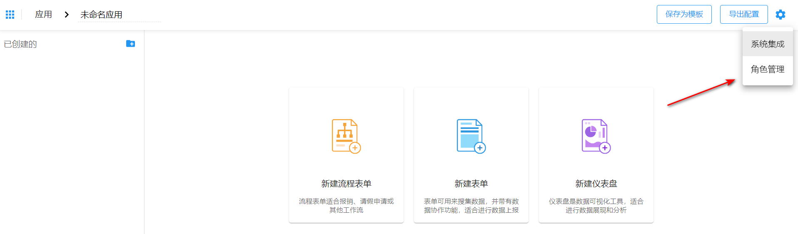
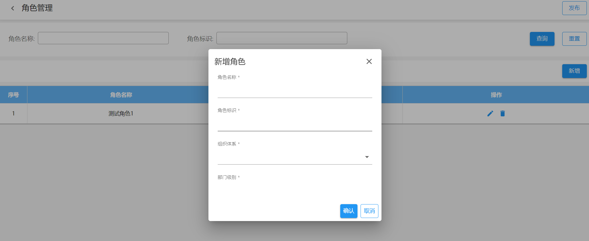
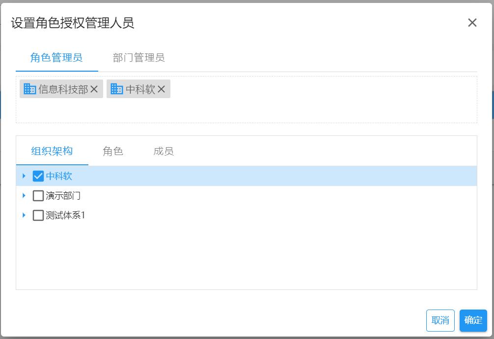
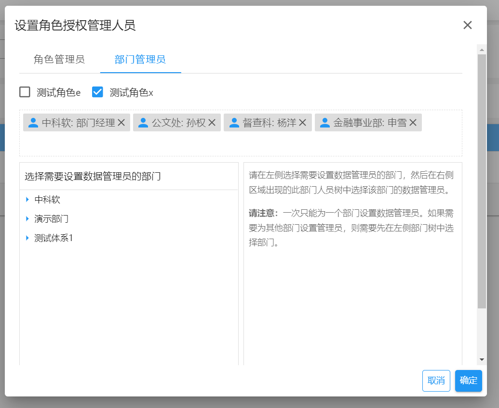
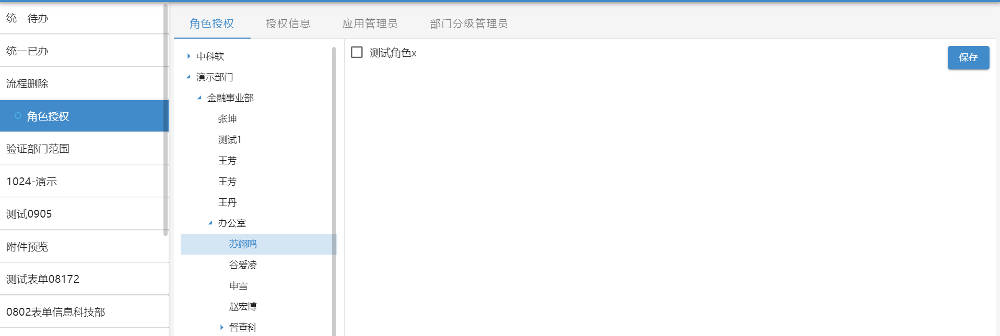
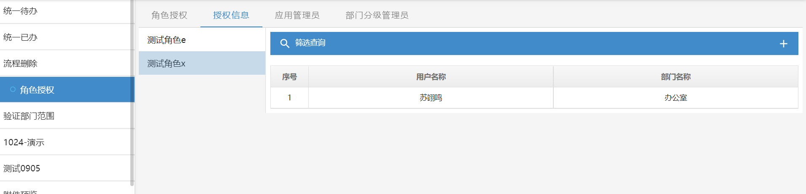
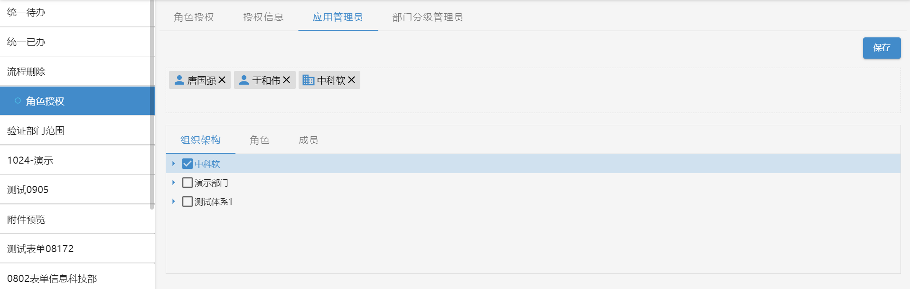
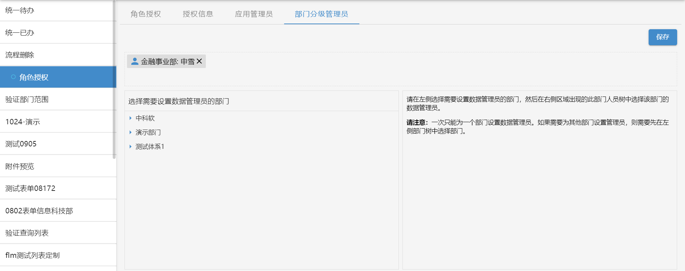

项目组可以在表单设计器的应用中创建和维护应用角色，这些角色具有普通的系统角色一样的功能，区别之处在于在应用角色是跟应用绑定的，只能在相对应的应用中使用。

下面我们通过应用角色的创建和授权的功能不同来分阶段介绍如何使用应用角色。

## 应用角色维护和发布

应用角色的入口在表单设计器中应用右上角的更多设置列表中。

点击后进入应用角色的维护界面，在弹窗界面中我们可以对应用角色进行增删改查和角色发布操作。

应用角色的字段说明：

- 角色名称。应用角色的中文名称
- 角色标识。应用角色的英文标识
- 组织体系。业务系统中所有的顶级部门集合。
- 部门级别。选中的组织体系下所有的部门级别。

### 发布

应用角色维护完成之后我们需要授权给一些管理员使其能够给员工进行应用角色的授权。这些管理员我们将其区分成超级管理员（角色管理员）和分级管理员（对应发布弹窗中的部门管理员，后续的文中均称呼为部门管理员）。

两个管理员的权限说明如下：

- 超级管理员。
  - 管理所有的应用角色授权
  - 管理部门管理员可以授权的应用角色
  - 维护其他超级管理员
  - 维护部门管理员
- 部门管理员。
  - 管理自己权限范围内的应用角色授权
  - 维护下属部门的部门管理员

部门管理员设置有两个部分：1. 部门管理员；2.部门管理员有权限管理的角色。

点击确定之后，系统会在应用内自动创建一条角色授权的资源导航，管理员点击进入该页面之后可以对应用角色进行维护操作。

## 角色授权

角色授权页面内部细化分为四个页面

### 角色授权

为人员授权应用角色。超级管理员可以授权所有的应用角色；部门管理员只能授权自身权限范围内的应用角色。

首先需要点击左侧的组织树，选择要进行授权的人员后，右侧会显示该人员可以被授权的所有角色，选择完角色之后点击保存就可以完成角色授权。

### 授权信息

查询自身权限范围内的应用角色授权人员信息。点击左侧中的角色后，右侧展示所有授权该角色的人员列表。

### 应用管理员

超级管理员独有的界面。对超级管理员进行维护。如果变更后当前操作人不再是超级管理员，则不再显示此页面。

### 部门管理员

超级管理员可以维护所有的部门管理员。部门管理员只能维护自身及下级部门的部门管理员。

