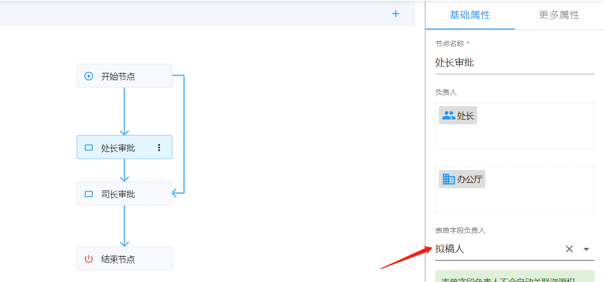
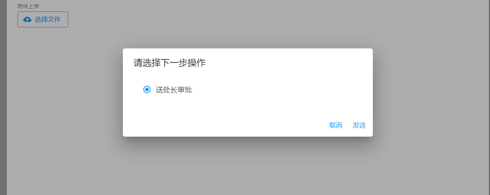
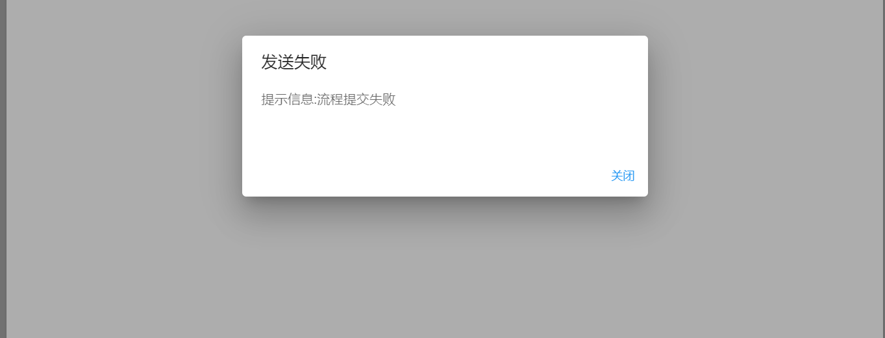

import BundleList from "../src/components/bundle-list";

## 1. 发布情况

发布日期：2022.1.19

<BundleList version="1.12.12" frontend="1.12.12" backend="1.12.11" />

## 2. 平滑升级

可以从任何版本平滑升级到 v1.12.12。

## 3. sinomatrix 依赖变更

因 sinomatrix 缺陷影响了智能表单之前版本（v1.12.0 版本之前的版本）提供的功能，sinomatrix 已经修复，所以需要同步升级 sinomatrix 到 [1.6.37](http://47.93.34.153:10080/sino-matrix/sino-matrix/blob/master/CHANGELOG.md) 。（注意：访问此地址时可能会出现 ERR_UNSAFE_PORT 的情况，请参看[这篇帖子](https://blog.csdn.net/kjcxmx/article/details/118122483)配置一下浏览器。）

## 4. 升级内容

- fix(workflow): 修复表单字段负责人为拟稿人时，流程发送失败的缺陷，如下图所示：

  设置字段负责人：

  

  发送时选择此节点：

  

  发送失败：

  
