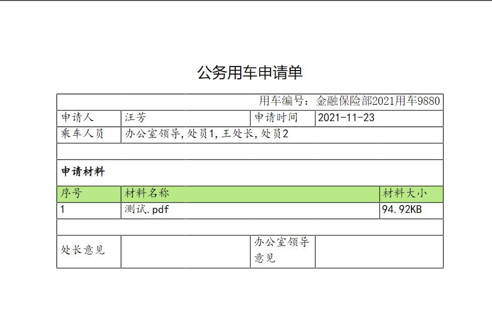

## 1. 发布情况

发布日期：2022.1.10

## 2. 平滑升级

可以从任何版本平滑升级到 v1.13.0。

由于 1.13.0 版本打印输出功能需要加载字体文件，所以建议改进 Nginx 缓存策略，如下所示：

```diff title="nginx.conf文件变更"
  # 缓存智能表单静态资源
-  location ~ /intellisense-form.*\.(gif|jpg|jpeg|png|bmp|swf|js|css|md|pdf)$ {
+  location ~ /intellisense-form.*\.(gif|jpg|jpeg|png|bmp|swf|js|css|md|pdf|ttf|ttc|eot|woff2|woff|svg)$ {
    expires 365d;
  }
```

变更之后的 `nginx.conf` 的静态资源缓存配置如下：

```nginx
  # 缓存智能表单静态资源
  location ~ /intellisense-form.*\.(gif|jpg|jpeg|png|bmp|swf|js|css|md|pdf|ttf|ttc|eot|woff2|woff|svg)$ {
    expires 365d;
  }
```

**_智能表单监听表单值变化（插件支持）的方式从 1.13.0 版本开始有了全新的方式，不再兼容以前的版本，项目中有涉及到此特性的部分需要做对应的调整。_**具体方式如下：

值关联：

```ts
import AppSetting from "@sinoform/app-setting";

AppSetting.listenFormChange(
  "612df55ac9327f1383eb4bbb", // 指定此监听对某个表单可用
  (prevValue, nextValue) => {
    // 如果产品单价或者数量值发生变化，则重新计算
    if (
      nextValue.price !== prevValue.price ||
      nextValue.count !== prevValue.count
    ) {
      nextValue.total = nextValue.price * nextValue.count;
    }
  }
);
```

异步值关联：

我们在实际应用中，有些值的计算需要从后端获取。 比如一个绩效考核表单，我们需要监听人员姓名(userName)的变化，然后从后端读取员工编号(workerId)的值， 此时我们可以使用 listenFormChangeAsync 来监听并处理异步值关联。具体代码如下：

```ts
import AppSetting from "@sinoform/app-setting";

AppSetting.listenFormChangeAsync(
  "612df55ac9327f1383eb4bbb",
  async (prevValue, nextValue) => {
    // 如果userName发生变化，则重新获取workerId的值
    if (nextValue.userName !== prevValue.userName) {
      nextValue.workerId = await getWorkIdByUserName(nextValue.userName);
    }
  }
);
```

## 3. sinomatrix 依赖变更

因 sinomatrix 缺陷影响了智能表单之前版本（v1.12.0 版本之前的版本）提供的功能，sinomatrix 已经修复，所以需要同步升级 sinomatrix 到 [1.6.37](http://47.93.34.153:10080/sino-matrix/sino-matrix/blob/master/CHANGELOG.md) 。（注意：访问此地址时可能会出现 ERR_UNSAFE_PORT 的情况，请参看[这篇帖子](https://blog.csdn.net/kjcxmx/article/details/118122483)配置一下浏览器。）

## 4. 主要特性

v1.13.0 版本主要针对打印输出功能进行完善和提升。

### 4.1 打印输出

- 在线定制打印模板：支持使用默认模板
  直接使用默认模板打印，按照页面显示布局直接输出内容。
  

- 在线定制打印模板：支持设置字体、字号、字重、下划线、删除线、斜体等文本样式
  可以使用工具条上的按钮设置文本样式。
  

  输出效果如下：

  

- 在线定制打印模板：支持设置单元格背景色
- 在线定制打印模板：支持合并单元格
- 在线定制打印模板：支持设置边框线、边框线样式和粗细支持调整
  自定义模板默认没有边框。支持设置表格边框线，支持实线、虚线不同样式，支持设置边框线颜色。
  
- 在线定制打印模板：支持设置单元格内部文本对齐方式
  智能表单在线自定义打印模板单元格内文本对齐方式默认为：水平方向左对齐，垂直方向居中对齐。可以使用工具条相关按钮改变文本对齐方式。
- 在线定制打印模板：支持自定义打印配置
  在设置打印模板时，还可以自定义打印配置，比如：页面尺寸、打印方向、页边距等；还可以自定义内容配置，比如：是否显示默认标题、行高是否自适应等。
  
- 完善打印分页方式（保证文字不被切分）
- 更完善的打印预览
  打印预览支持页面缩放。
- 支持显示页码打印
  打印预览时，可以设置显示页码，页码显示方式及显示位置也可自定义。
  

  显示效果：

  

- 支持带水印打印
  打印预览支持显示水印，设置水印支持`用户名`、`日期`、`部门`、`机构`的任意组合。
  
