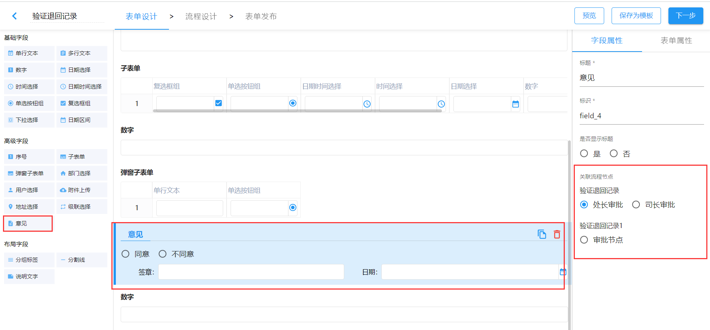
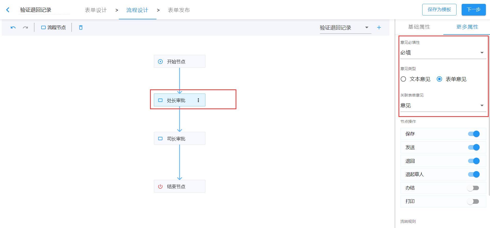
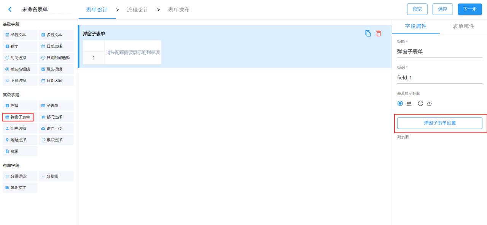
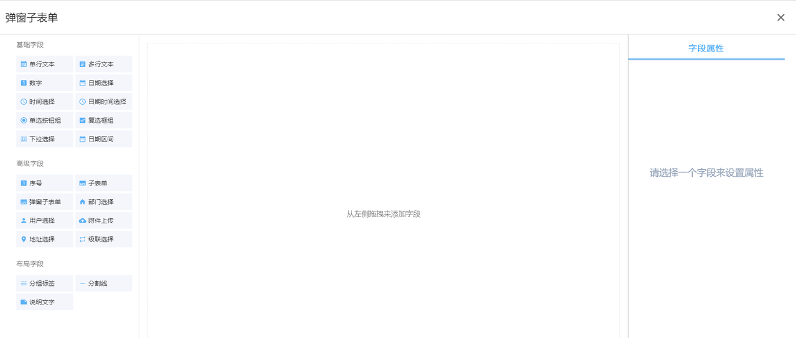
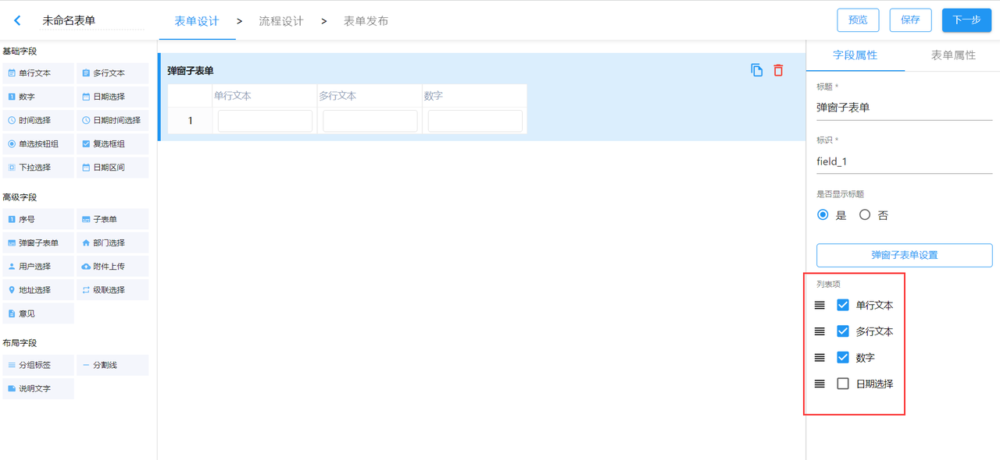
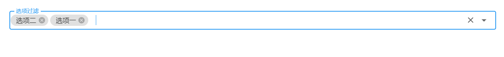

import BundleList from '../src/components/bundle-list';

## 1. 发布情况

发布日期：2022.3.18

<BundleList version="1.14.0" frontend="1.14.0" backend="1.14.0" font="1.13.0" />

## 2. 平滑升级

可以从任何版本平滑升级到 v1.14.0。

## 3. sinomatrix 依赖变更

因 sinomatrix 缺陷影响了智能表单之前版本（v1.12.0 版本之前的版本）提供的功能，sinomatrix 已经修复，所以需要同步升级 sinomatrix 到 [1.6.37](http://47.93.34.153:10080/sino-matrix/sino-matrix/blob/master/CHANGELOG.md) 。（注意：访问此地址时可能会出现 ERR_UNSAFE_PORT 的情况，请参看[这篇帖子](https://blog.csdn.net/kjcxmx/article/details/118122483)配置一下浏览器。）

## 4. 主要变更

- feat: 新增退回记录的功能
- feat: 支持表单上填写意见控件
- feat: 支持弹窗子表单控件
- feat: 下拉框支持过滤选项
- feat: 使用公式控制表单字段的可见性、可编辑性，关于公式的配置规则可参考[表单配置|公式规则](expression-rules)
- feat: 用户选择、部门选择拓展：支持定制选定值的展示方式
- feat: 单行文本、多行文本默认值支持插值表达式[插值表达式](interpolation-expression)
- feat: 说明文字支持插值表达式[插值表达式](interpolation-expression)
- feat: 支持将应用中的分组提升为独立的应用
- feat: 列表页支持定制查询条件
- feat: 列表页支持按钮定制
- feat: 支持文件存储定制 包括mongodb、nfs、s3(http/https)与http-api [使用说明](./config-file-store)
- feat: 添加 license 证书验证 [license 配置说明](./config-license)
- feat: 新增导出智能表单表结构的接口 `GET http://智能表单ip:端口/apis/intellisense-form/formData/export-table`
- feat: 支持开始节点直接到结束节点的流程
- chore: 调整弹窗子表单在移动端的渲染方式
- fix: 修复子表单标签设置不显示，但是实际仍显示的 bug
- fix: 修复设置的部门管理员能看到别人的草稿数据的问题
- fix: 修复子表单中表单项变化导致表单保存数据失败的问题
- fix: 修复同时办情况下办理失败的问题
- fix: 修复迁移仪表盘失败的问题
- fix: 修复删除表单列表中的分组后系统集成列表中还存在该资源的问题

### 支持表单上填写意见控件

表单设计中新增意见字段，拖拽新增表单意见，生成默认 3 个字段：意见、签章、日期。<strong>同意、不同意的单选按钮组可以切换为多行文本输入框</strong>。

可以在右侧属性面板设置此意见关联的流程节点，设置完成后，此意见只能在绑定的流程节点可编辑，其中签章和日期默认写入，全程只读。此意见绑定流程节点的配置也可在流程节点属性面板中修改，两边会保持同步。（<strong>注意：一个表单意见项只能绑定同一流程的一个节点</strong>）

如上图所示，如果【意见必填性】选择禁用，则在相关节点填写意见区域和表单意见都不会展示。如果意见为必填或选填，意见类型为表单意见，并且指定绑定的意见字段，则流程流经至此节点时，绑定的表单意见字段可编辑。否则直接展示填写意见的意见域。

表单意见中填写的意见跟普通文本意见框中填写的意见在意见列表中的展示方式相同。意见类型为表单意见时，如果同一个节点有多条意见，表单意见只展示最新的一条记录。

### 支持弹窗子表单控件

新增弹窗子表单字段，其子项需要从其属性面板中的设置子表单按钮操作。

配置完之后点击“X”回到主表单，此时会根据配置推算出展示的子表单项。此外我们还可以在右侧属性面板中调整展示项并对其排序。

预览时，点击新增数据打开弹窗填写数据，每条数据根据权限会有删除和编辑或者查看按钮。

## 5. 破坏性变更

1.14.0 版本针对某些特性，做了破坏性变更，使用时需要特别注意。主要包括以下几点：

1. 下拉选择支持选项过滤
   > 多选时开启选项过滤，下拉框中的值会以 tag 标签的方式展示
   > 
