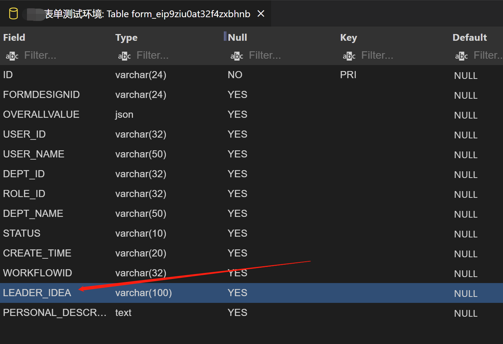
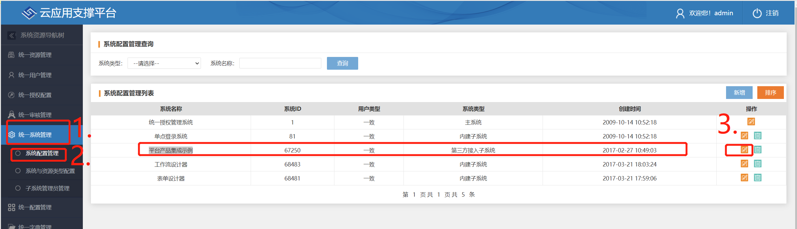
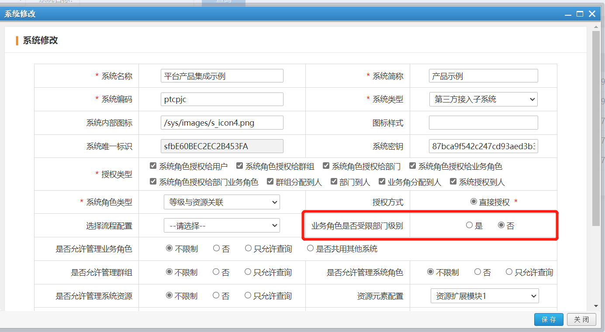

import Tabs from "@theme/Tabs";
import TabItem from "@theme/TabItem";

## 1. 发布情况

发布日期：2021.9.22

前端包：[sino-intellisense-form-v1.12.0.zip](http://sino-intellisense-form.oss-cn-beijing.aliyuncs.com/v1.12.0/sino-intellisense-form-v1.12.0.zip)

后端包：[sino-intellisense-form-v1.12.0.jar](http://sino-intellisense-form.oss-cn-beijing.aliyuncs.com/v1.12.0/sino-intellisense-form-v1.12.0.jar)

## 2. 平滑升级

此版本包含[破坏性变更](#5-破坏性变更)，且没有包含自动执行的升级脚本，所以不能平滑升级。见[手动升级注意事项](#6-手动升级注意事项)。

> 为什么 v1.12.0 版本没有提供平滑升级？
>
> 主要是因为时间上来不及处理。我们需要按照计划将 v1.12.0 版本发布出去，因为个别项目组正在等待此版本的升级。
>
> 我们预计在一周后的 `v1.12.2` 版本包含自动升级脚本，来实现此版本的平滑升级。

## 3. sinomatrix 依赖变更

因 sinomatrix 缺陷影响了智能表单之前版本（v1.12.0 版本之前的版本）提供的功能，sinomatrix 已经修复，所以需要同步升级 sinomatrix 到 [1.6.31](http://47.93.34.153:10080/sino-matrix/sino-matrix/blob/master/CHANGELOG.md) 。（注意：访问此地址时可能会出现 ERR_UNSAFE_PORT 的情况，请参看[这篇帖子](https://blog.csdn.net/kjcxmx/article/details/118122483)配置一下浏览器。）

## 4. 主要特性

v1.12.0 版本主要在插件和扩展开发、部署、文档和数据权限等方面得到全面提升，让智能表单产品更成熟稳健。

### 4.1. 插件和扩展

此版本实现以下插件的定制开发：

- 插件：可定制表单字段
- 插件：可定制按钮
- 插件：可监控并控制按钮点击行为
- 插件：可监听表单值变化
- 插件：可定制表单详情页页面元素的权限（可见性和可编辑性）
- 插件：可定制样式
- 插件：重构基于 Web Component 的插件机制，全面提升插件开发体验

此版本实现以下扩展的定制开发：

- 扩展：可监听流程发送事件
- 扩展：可监听流程结束事件

### 4.2. 全面升级的文档站点

全面升级智能表单文档站点，升级后的文档站点内容更有序、更实用、更殷实。新增的文档内容包括：

- 文档：全新的、更合理的文档导航
- 文档：全新的、更易于阅读和操作的[部署手册](./deployment.mdx)
- 文档：新增[智能表单下载文档](./download.mdx)
- 文档：新增[智能表单应用程序配置文档](./config-custom.mdx)
- 文档：新增[插件开发入门教程](./plugin-index.md)
- 文档：新增[扩展事件订阅入门文档](./sinoform-sdk-event-starter.md)

### 4.3. 全新的数据权限

此版本重新实现了数据查询权限，重新实现后的数据查询权限有以下特性：

- 数据查询性能提升 100+倍（从之前的 `like` 查询切换为索引查询）
- 单表容纳的数据量提升到 1000 万
- 集中管理表单的权限数据，为后期的优化大数据量（如分库分表）打下基础
- 特性：支持部门数据管理员（在设计表单时，可以为具体的部门指定数据管理员）
- 通过配置支持部门领导可查看部门下所有数据的特性（通过`sinoform.dept-leader-roles` 配置项指定部门领导业务角色）
- 特性：可以将表单中的人员选择框表单项配置为可以查看此表单数据。（如用车表单上选择了某司机，那么该司机有查询此表单的权限）

新增的部门领导业务角色配置项需要在 `application.yml` 文件中配置。例如下面的组织结构：

```
xxxx局
|___ A 司
    |___ 司长（业务角色）
    |___ 副司长（业务角色）
    |___ AA 处
        |___ 处长（业务角色）
        |___ 副处长（业务角色）
        |___ AAA 科
            |____ 科长（业务角色）
            |____ 副科长（业务角色）
```

配置上司长、副司长、处长、副处长、科长、副科长（请自行查找您系统中的业务角色 id）：

```yaml title="application.yml"
sinoform:
  dept-leader-roles:
    # 司长的业务角色id
    - 4028d00e6ec42073016ec468e36b0015
    # 副司长的业务角色id
    - 4028d00e6ec42073016ec468e36b0016
    # 处长的业务角色id
    - 4028d00e6ec42073016ec468e36b0017
    # 副处长的业务角色id
    - 4028d00e6ec42073016ec468e36b0018
    # 科长的业务角色id
    - 4028d00e6ec42073016ec468e36b0019
    # 副科长的业务角色id
    - 4028d00e6ec42073016ec468e36b0020
```

配置完成后，司长、副司长能够看司级部门以及下属所有子孙部门的数据(即 A 司、AA 处和 AAA 科）；处长、副处长能够看处级部门以及下属所有子孙部门的数据，但不能看司级部门的数据（即 AA 处和 AAA 科）；科长、副科长只能看到科级部门的数据（即 AAA 科）。

`sinoform.dept-leader-roles` 配置的一个约束是：配置的业务角色只能查看业务角色同级别的部门和下面的子孙部门数据。这个约束的一个典型反例是：司级部门的数据管理员在处级部门中。这种情况下，目前只能在表单设计页面上设置部门管理员来满足此需求。

### 4.4. 更精细化的页面导航权限控制

- 可以单独指定打开表单查询页面的人员、角色、部门范围（例如上面的司机场景）
- 指定的部门管理员自动有打开表单查询页面的导航权限

### 4.5. 规范数据库表名和列名

为了解决不同数据库对数据库表名和列名的大小写兼容性问题，现在智能表单自动创建的数据库表名和列名都是`大写字母 + 下划线`格式。如下所示：

- `FIELD_1`
- `PERSON_NAME`
- `IS_URL`

在表单设计页面上可以采用`首字母小写驼峰式`、`首字母大写驼峰式`和`字母 + 下划线`三种风格来命名表单项的标识。（表单项标识不仅仅用于数据库表创建，还会用于各种公式、打印模板、代码生成等场景中，所以提供三种常用的命名风格，项目组可以根据自身的习惯进行选择）

智能表单会自动将表单项标识转换为规范的字段名，如下所示，为设置的表单项标识为：


而数据库表中对应的字段名为：



### 4.6. 其他的缺陷修复和优化

前端：

- fix: 修复第二套主题流程表单详情页，当前状态和当前办理人之间间隙太小的缺陷
- fix: 修复第二套主题流程表单详情页`打印`按钮与其它按钮颜色不一致的缺陷
- fix: 修复演示系统，加载列表页面时，整个应用级别显示`Loading……`效果的缺陷
- fix: 修复数据字典页面布局不合理的问题
- improve: 优化插件管理页面布局
- fix: 修复选项关联切换时，引起整个表单刷新的缺陷
- improve: 优化数据列表的`Loading……`效果
- fix: 修复第二套主题流程图中表示不同状态的颜色错误的缺陷
- improve: 允许清除流程节点上表单字段负责人的设置
- improve: 优化第二套主题详情页流程状态区域的显示样式
- fix: 修复流程发送失败时再次发送总会先出现失败提示的问题
- fix: 修复流程撤办之后已办列表未自动刷新的 bug
- fix: 修复草稿箱列表不显示字段值的缺陷
- fix: 修复主题切换无用的缺陷
- fix: 修复字段标识不能连贯输入的 bug
- fix: 修复布局字段在水平排列渲染时左侧多出空白区域的缺陷
- fix(flow-designer-config): 修复流程配置面板中表单字段负责人无法清空的 bug
- fix: 修复查询列表在草稿状态和已撤办状态表单中不显示打印按钮的问题
- improve: 打印预览时，盖章图片添加尺寸样式
- improve: 自动校验表单标识的合法性
- fix: 修复下拉框内容区域的鼠标样式不正确的缺陷

后端：

- feat: 新增撤办和恢复撤办功能
- fix: 修复在流程启动节点上设置非同一级别上的部门范围和业务角色，无法启动流程的缺陷
- fix: 修复在流程过程节点上设置非同一个级别上的部门范围和业务角色，无法获取节点候选人的缺陷
- fix: 修复创建资源授权时未加入流程使用范围因子的缺陷
- fix: 修复已办列表中的状态与查询列表中的状态不一致的问题
- feat: 表单数据表基础字段删掉 deptIds、userIds、workflowstatus
- fix: 修复浏览按钮配置的 `enabled` 为空，打开待办详情页失败的缺陷
- fix: 修复启动时加载不到 `sso.ssoService` 配置报错的问题
- fix: 修复印章盖在子表单上时，印章不显示问题
- fix: 盖章下面没有时间显示
- fix: 章的位置不准确
- improve: poi 引入大量依赖 jar 包问题，排除了无用 jar 包
- feat: 新增无流程表单保存按钮的名称配置 `sinoform.i18n.noFlowSaveButton`

## 5. 破坏性变更

### 5.1 数据库表列名命名风格变化

因需要实现[规范数据库表名和列名](#45-规范数据库表名和列名)，所以此版本包含一个破坏性变更：表单项标识名称为`驼峰式`的命名风格，需要手动将相对应的数据库表列名调整为 `大写 + 下划线` 风格。

鉴于很少有项目组直接调整表单项标识，所以 v1.12.0 版本不提供自动升级脚本（来不及提供）。预计将在 `v1.12.2` 版本中提供。

如果您的项目采用的数据库对大小写不敏感，或者目前没有遇到因字段标识大小写问题导致表单发布失败的情况，那么可以通过下面的配置禁用此配置：

```yaml title="application.yml"
sinoform:
  # 禁用数据库表列名自动格式化功能
  disable-table-column-auto-format: true
```

## 6. 手动升级注意事项

本次版本升级有两个需要手动调整的注意事项：

1. [是否启用数据库表列名自动格式化功能](#51-数据库表列名命名风格变化)
2. 需要手动创建数据权限表，如下所示。（1.12.0 版本来不及提供自动化升级脚本，预计在 `1.12.1` 版本提供）

手动创建数据权限表的 SQL 脚本如下：

<Tabs
  defaultValue="mysql"
  values={[
    { label: "MySQL", value: "mysql" },
    { label: "Oracle、达梦、人大金仓", value: "oracle" },
  ]}
>
  <TabItem value="mysql">

```sql
-- 创建查询表单数据权限表
CREATE TABLE SINOFORM_DATA_PERM  (
  ID int(11) NOT NULL AUTO_INCREMENT,
  DATA_ID varchar(32),
  FORMDESIGN_ID varchar(32),
  SUBJECT_TYPE varchar(32),
  SUBJECT_ID varchar(32),
  PRIMARY KEY (ID),
  INDEX IDX_DATAID_SUBJECTID(DATA_ID, SUBJECT_ID)
);
```

  </TabItem>
  <TabItem value="oracle">

```sql
-- 创建查询表单数据权限表
CREATE TABLE SINOFORM_DATA_PERM (
  ID INT PRIMARY KEY,
  DATA_ID VARCHAR2(32) ,
  SUBJECT_TYPE VARCHAR2(32) ,
  FORMDESIGN_ID VARCHAR2(32) ,
  SUBJECT_ID VARCHAR2(32)
);
-- 添加索引
CREATE INDEX IDX_DATAID_SUBJECTID ON SINOFORM_DATA_PERM (SUBJECT_ID, DATA_ID);

--添加主键序列
CREATE SEQUENCE SEQ_SINOFORM_DATA_PERM
INCREMENT BY 1
START WITH 1
NOMAXVALUE
NOCYCLE;

--添加触发器，创建自增的id
create or replace trigger SINOFORM_DATA_PERM_TRG_RBI
before insert on SINOFORM_DATA_PERM
for each row
begin
select SEQ_SINOFORM_DATA_PERM.nextval into:new.ID from dual;
end;
```

  </TabItem>
</Tabs>

## 7. 特别设置

> 为了解决 sino-matrix 给部门下的业务角色授权的缺陷，需要项目组完成此设置。

需要在 sino-matrix 统一授权的 `统一系统管理 > 系统配置管理 > 平台产品集成示例` 中，将 `业务角色是否受限部门级别` 选项设置为 `否`。步骤如下：

首先，进入设置界面：



然后，设置 `业务角色是否受限部门级别`：



或者，您可以在 `sinoepuias` 数据库中执行以下 SQL 语句：

```sql
update sys_sub_rd_info set CREATE_FLOWROLE_TYPE = '0' where SUB_ID = '67250';
```
