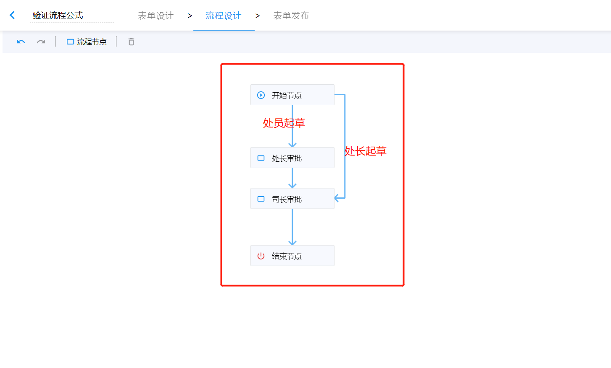

import BundleList from "@/components/bundle-list";

## 1. 发布情况

发布日期：2022.1.14

<BundleList version="1.12.11" frontend="1.12.11" backend="1.12.11" />

## 2. 平滑升级

可以从任何版本平滑升级到 v1.12.11。

## 3. sinomatrix 依赖变更

因 sinomatrix 缺陷影响了智能表单之前版本（v1.12.0 版本之前的版本）提供的功能，sinomatrix 已经修复，所以需要同步升级 sinomatrix 到 [1.6.37](http://47.93.34.153:10080/sino-matrix/sino-matrix/blob/master/CHANGELOG.md) 。（注意：访问此地址时可能会出现 ERR_UNSAFE_PORT 的情况，请参看[这篇帖子](https://blog.csdn.net/kjcxmx/article/details/118122483)配置一下浏览器。）

## 4. 主要特性

- fix：修复第二套主题流转记录显示不准确的缺陷
- feat：添加单表单或单应用首页标题控制参数(title)。具体使用方式可参考[使用单应用页面 | 定制应用标题](../custom-form-app#定制应用标题)
- improve：移动端草稿页、详情页标题随应用名称变化
- improve(移动端)：添加请求参数 `hideAppBar`，用于控制不显示草稿页、详情页上的工具栏。如：`http://127.0.0.1:8080/detail-page?hideAppBar`
- improve(移动端)：添加请求参数`title`，用于定制详情页和草稿页的页面标题。如：`http://127.0.0.1:8080/detail-page?title=应用标题`
- feat：流程控制公式支持填报人角色作为控制条件。
- improve(flow-control-expression): 新增 `is`、`is null`、`is not null`、`is empty` 和 `is not empty` 语法支持，改善 null 或者空字符串、空数组的判定。（见[流程控制公式新增语法](#流程控制公式新增语法)）
- fix(workflow): 修复工作流撤办、恢复流程、退回操作没有同步待办已办的缺陷
- fix(config): 修复导入应用后，应用菜单不可见的缺陷

### 流程控制公式支持【填报人角色】作为控制条件

使用场景：一个流程，可由`处员`或`处长`发起，`处员`发起需由处长审批，`处长`发起直接由`司长`审批，我们可以通过流程控制公式处理此需求。



首先我们在开始节点到处长审批节点的路由上添加流程控制公式：

```js
填报人角色 not in ["处长"]
```

然后在开始节点到司长审批节点的路由上添加以下流程公式：

```text
填报人角色 in ["处长"]
```

:::warning
如果此流程已经有正在流转的历史数据，为了避免由于表单数据中没有填报人角色数据导致流程无法正常流转，我们需要加一下预防措施，比如判空处理，具体方式如下：

```js
填报人角色 in ["处长"] or
填报人角色 is null
```

:::

### 流程控制公式新增语法

#### `is` - 严格相等性比较

一般情况下，我们使用 `==` 做相等性比较，如：

```
1 == 1 // true
'1' == 1 // true
```

但是如果做严格相等性比较，则使用 `is`，如：

```
1 is 1 // true
'1' is 1 // false
```

#### `is not` - 严格不相等比较

`not` 可以与任何操作符组合使用，同样可以与 `is` 操作符组合使用，如下所示：

```
'1' not is 1
```

但是上面的公式不够自然，所以同时支持以下更自然的写法：

```
'1' is not 1
```

#### `is null` - 判空比较

如果要判断值是否为 `null` 或者 `undefined`，推荐使用 `is null`：

| 公式                | 返回值 |
| ------------------- | ------ |
| `null is null`      | true   |
| `undefined is null` | true   |
| `'' is null`        | false  |
| `[] is null`        | false  |

同时支持 `is not null` 语法。

#### `is empty` - 判断是否为空字符串或者空数组

| 公式                 | 返回值 |
| -------------------- | ------ |
| `null is empty`      | true   |
| `undefined is empty` | true   |
| `'' is empty`        | true   |
| `' ' is empty`       | true   |
| `'张三' is empty`    | false  |
| `[] is empty`        | true   |
| `[1, 2, 3] is empty` | false  |
