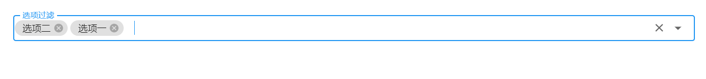

import BundleList from "@/components/bundle-list";

## 1. 发布情况

发布日期：2022.2.25

<BundleList
  version="1.14.0-alpha.1"
  frontend="1.14.0-alpha.1"
  backend="1.14.0-alpha.0"
  font="1.13.0"
/>

## 2. 平滑升级

可以从任何版本平滑升级到 v1.14.0-alpha.1。

## 3. sinomatrix 依赖变更

因 sinomatrix 缺陷影响了智能表单之前版本（v1.12.0 版本之前的版本）提供的功能，sinomatrix 已经修复，所以需要同步升级 sinomatrix 到 [1.6.37](http://47.93.34.153:10080/sino-matrix/sino-matrix/blob/master/CHANGELOG.md) 。（注意：访问此地址时可能会出现 ERR_UNSAFE_PORT 的情况，请参看[这篇帖子](https://blog.csdn.net/kjcxmx/article/details/118122483)配置一下浏览器。）

## 4. 主要变更

- feat: 下拉框支持过滤选项

  :::info
  破坏性变更提醒：多选时开启选项过滤，下拉框中的值会以 tag 标签的方式展示
  
  :::

- chore: 弹窗子表单无数据，显示列表表头
- fix: 修复弹窗子表单配置面板列表项名称与表单项的标题不一致的 bug
- fix: 修复无流程列表自定义列数据错误的 bug
- fix: 修复多层嵌套弹窗子表单预览错误的 bug
