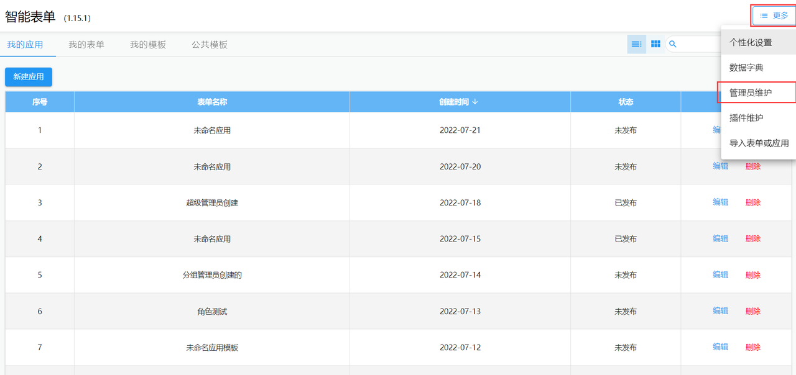
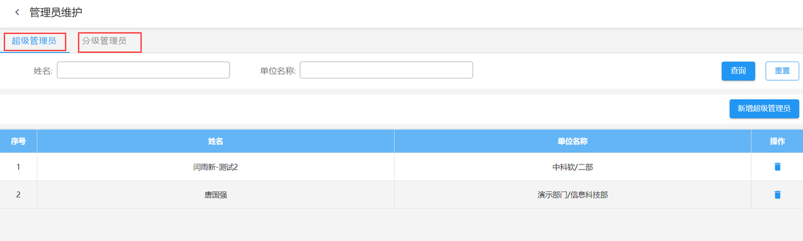
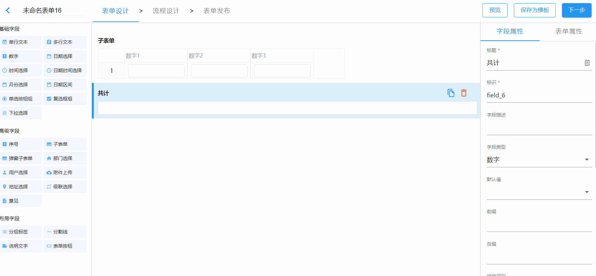
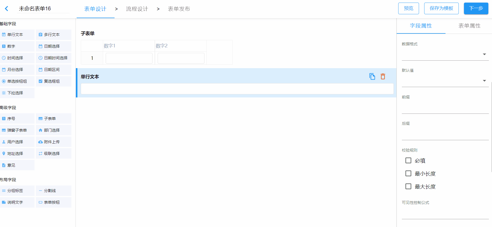
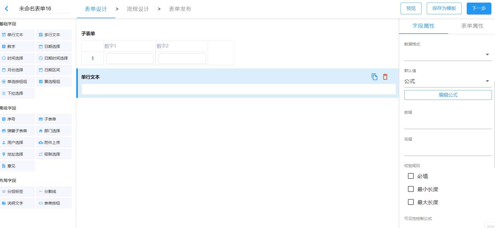
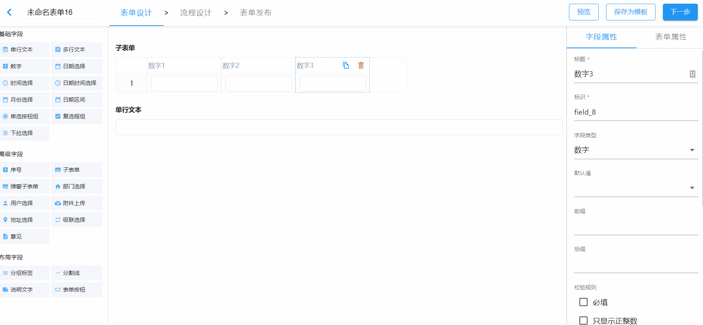

import BundleList from "@/components/bundle-list";

## 1. 发布情况

发布日期：2022.8.23

<BundleList version="1.16.0" frontend="1.16.0" backend="1.16.0" font="1.13.0" />

## 2. 平滑升级

可以从任何版本平滑升级到 v1.16.0。

## 3. sinomatrix 依赖变更

sinomatrix 针对当前版本的智能表单修复了一些缺陷，需要同步升级 sinomatrix 到 [1.6.49](http://47.93.34.153:10080/sino-matrix/sino-matrix/blob/master/CHANGELOG.md) 。（注意：访问此地址时可能会出现 ERR_UNSAFE_PORT 的情况，请参看[这篇帖子](https://blog.csdn.net/kjcxmx/article/details/118122483)配置一下浏览器。）

## 4. 主要变更

1.16.0 版本主要新增分级管理员功能和附件预览功能，使表单功能更完善，更稳健。

### 4.1 分级管理员

分级管理员即单位管理员，通过设置单位管理员的方式将表单限制在某个单位可用。

:::info 提示
管理员功能默认是关闭的，如果需要使用此功能，可在后端配置文件中添加配置项：

```yml
sinoform:
  admin:
    # 启用管理员功能
    enable-admin: false
    # 超级管理员是否有权限创建表单
    super-admin-can-create-form: true
    # 最大分级管理员个数（实际是能够设置分级管理员的单位个数限制）
    max-num-of-unit: 5
    # 指定初始化超级管理员
    default-super-admin:
      - 1
```

:::

管理员功能开启后，有以下特性：

1. 管理员功能一旦开启，普通用户将没有权限使用表单管理应用（即不能设计表单或应用）
2. 超级管理员可以给超级管理员和分级管理员做授权
3. 分级管理员的单位不能是顶级单位
4. 分级管理员设计的表单只能在其所管辖的范围内使用（即分级管理员在创建表单时，流程范围、流程节点负责人、数据权限中的人员设置等都只能选择其所管理单位范围内的数据）
5. 同一单位可设置多个分级管理员，且管理员之间可以看到对方创建的表单并进行维护
6. 超级管理员可以对所有人创建的表单进行维护

超级管理员授权入口及授权页面：





### 4.2 附件预览功能

附件预览功能默认未开启，若想启用附件预览功能，需要在部署智能表单后端的服务器上安装 LibreOffice 软件。具体操作步骤可参考[附件预览功能](../config-file-online-preview.md)。

### 4.3 更多版本特性

- feat: 添加`自定义校验`配置，表单会动态解析自定义校验中的规则，根据返回结果生成校验提示信息

- improve: 支持修改数据库表名
- improve: 删除不需要的`@sinoform/comp-scrollbar`模块
- improve: 二次开发表单校验回调函数中添加`currentUser`信息
- improve: 优化代码兼容性以解决导入数据不标准时页面空白的问题
- improve: useTokenInterceptor 中 token 不再使用 useState 记录
- improve: 修改默认值中`公式`的解析方法，与流程控制公式使用同一套解析方法
- improve: 添加个性化设置配置，主题设置和图标设置的配置入口放到到个性化设置中

- fix: 修复应用模板下无法新建表单的 bug
- fix: 修复 IE 浏览器新建表单发布失败的问题
- fix: 修复 IE 浏览器有默认查询条件时，出现空白页的问题
- fix: 修复自定义列切换子表单项展示时列表表头显示不正确的 bug
- fix: 修复导出 excel 时存在多个数据条数不一致子表单的表单项，条数较少的子表单空白行样式丢失的 bug

#### 公式

下面介绍一下默认值为公式时，如果公式中涉及到了子表单表单项，数学公式中的处理规则。

##### 主表单中的表单项依赖于子表单项

#### SUM（求和）

将子表单中所有可用的子表单项的值累计求和



##### AVAERAGE（平均值）

在上述求和方法的基础上，将累计和除以可用的子表单项的个数

##### MAX（最大值）、MIN（最小值）

将子表单中所有可用的子表单项展开，并从中获取最大值或最小值



##### PRODUCT（乘积）

子表单项的乘积需要一一对应，主表单中的字段不允许直接使用子表单中的乘积作为公式的运算结果，必须对 PRODUCT 结果进行再次求和运算。



##### 子表单中的表单项依赖于当前子表单的表单项

子表单项中依赖的当前子表单项使用同一行中子表单项的值。


