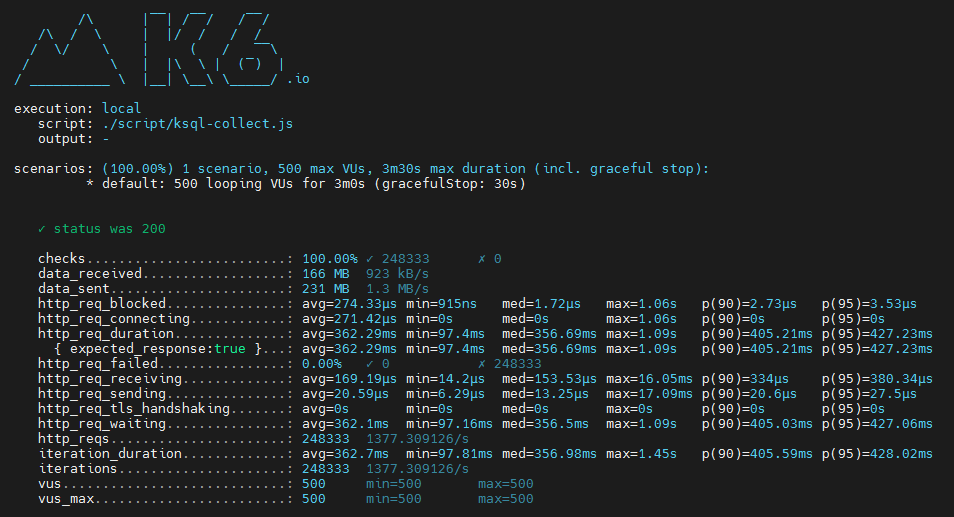

## 测试环境

- 测试服务器
  - 地址：192.168.90.128（单机）
  - cpu：32c
  - 内存：128G
- mysql数据库
  - 数据库：mysql
  - 版本：8.0.31-0ubuntu0.22.04.1
- kafka（单机），版本：2.13-3.2.3
- ksql（单机），版本：0.28.2
- 智能表单版本：1.17.0

## 测试数据准备

- 测试表单：LLG测试 - 测试仪表盘 （非流程表单）
- 表单数据库表：form_rtmga10ztcjs5fryqsfn（100万数据）
- kafka topic：topic_utqipl6iyisazoxm2wme（100万数据）
- ksql stream：stream_icdvx4e2n48emjbuco1g（100万数据）
- ksql table：table_836cgrz67yie63409kdd（100万数据）

## 测试内容

- 仪表盘统计

## 测试工具

- 测试工具：k6
- 测试项目：[智能表单 - k6测试项目](https://e.gitee.com/sinoform/repos/sinoform/k6-test/sources)（readme文档中有使用说明）

## 测试指标

- 并发数：500并发/秒（约等于500请求/秒）
- 成功率（稳定性）：99.99%（四个九）
- 响应时长：3秒

## 测试结果

以下测试结果为并发500连续运行3分钟的测试结果，均满足测试指标。

| 平均响应时间 | 最小响应时间 | 中位值   | 最大响应时间 | 90%的请求最大响应时间 | 95%的请求最大响应时间 | 请求处理速度 |
| ------------ | ------------ | -------- | ------------ | --------------------- | --------------------- | ------------ |
| 362.29ms     | 97.4ms       | 356.69ms | 1.09s        | 405.21ms              | 427.23ms              | 1377.31/s    |

## 测试截图

