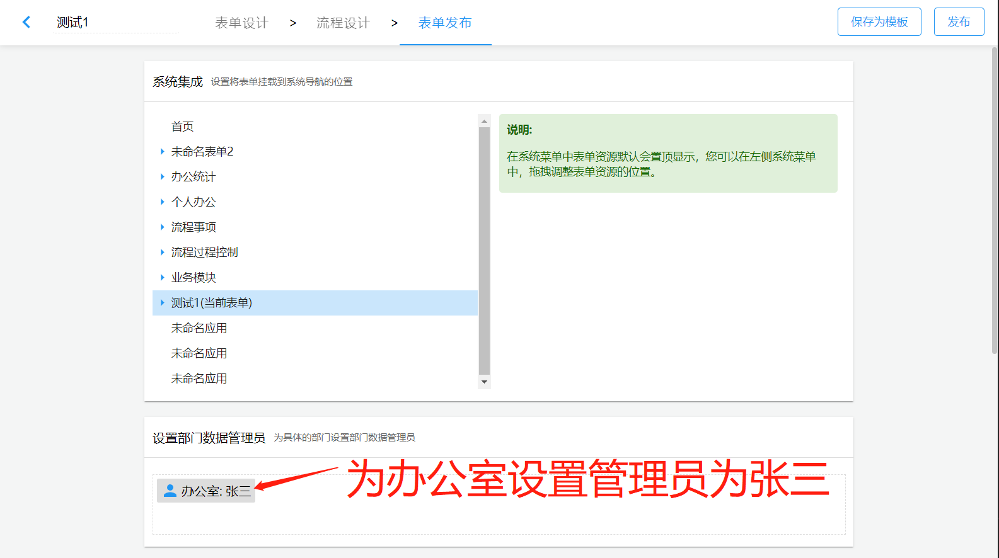

## 启用版本

v1.12.0 版本。数据权限功能的版本发布通知是[《1.12.0 发布公告-数据权限特性》](./changelog-v1.12.0#43-全新的数据权限)。

## 配置项 `sinoform.dept-leader-roles`

`sinoform.dept-leader-roles` 配置项用来配置部门领导的业务角色（如司长、副司长、处长、副处长、科长、副科长等），配置好之后，这些部门领导就可以看到自己的部门以及下属部门创建或者流程流经的表单数据。例如：

```yaml title="application.yaml"
sinoform:
  dept-leader-roles:
    # 司长的业务角色id
    - 4028d00e6ec42073016ec468e36b0015
    # 副司长的业务角色id
    - 4028d00e6ec42073016ec468e36b0016
    # 处长的业务角色id
    - 4028d00e6ec42073016ec468e36b0017
    # 副处长的业务角色id
    - 4028d00e6ec42073016ec468e36b0018
    # 科长的业务角色id
    - 4028d00e6ec42073016ec468e36b0019
    # 副科长的业务角色id
    - 4028d00e6ec42073016ec468e36b0020
```

上面的配置示例，配置了司长、处长和科长，那么在下面的组织机构中：

```
xxxx局
|___ A 司
    |___ 司长（业务角色）
    |___ 副司长（业务角色）
    |___ AA 处
        |___ 处长（业务角色）
        |___ 副处长（业务角色）
        |___ AAA 科
            |____ 科长（业务角色）
            |____ 副科长（业务角色）
```

`A` 司司长能够查看到 `A` 司、`AA` 处、`AAA` 科的表单数据，`AA` 处的处长能够查看 `AA` 处和 `AAA` 科的表单数据，而 `AAA` 科的科长能够查看到 `AAA` 科的表单数据。

这是一个全局设定，一旦设置，所有的表单都有此数据权限规则。如果需要控制个别表单不需要此权限，请联系我们，我们可以改进。

如果想精确控制单个表单的部门管理员，那么可以在`表单发布`设置页中配置部门管理员，如下所示：


