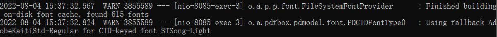

## 环境准备

智能表单生成 word 和 ppt 文件的预览文件时依赖 LibreOffice 软件，所以**`要求部署智能表单后端的服务器需要安装 LibreOffice 软件`**。

### Ubuntu 安装 LibreOffice

```shell
# 切换临时目录
cd /tmp
# 下载
$ wget  https://kkfileview.keking.cn/LibreOffice_7.1.4_Linux_x86-64_deb.tar.gz  -cO LibreOffice_7_deb.tar.gz
# 解压
$ tar -zxf /tmp/LibreOffice_7_deb.tar.gz
# 安装
$ cd /tmp/LibreOffice_7.1.4.2_Linux_x86-64_deb/DEBS
$ apt-get install -y libxinerama1 libcairo2 libcups2 libx11-xcb1
$ dpkg -i *.deb
```

### Redhat 安装 LibreOffice

```shell
# 切换临时目录
cd /tmp
# 下载
$ wget https://kkfileview.keking.cn/LibreOffice_7.1.4_Linux_x86-64_rpm.tar.gz -cO LibreOffice_7_rpm.tar.gz
# 解压
$ tar -zxf /tmp/LibreOffice_7_rpm.tar.gz
# 安装
$ cd /tmp/LibreOffice_7.1.4.2_Linux_x86-64_rpm/RPMS
$ yum install -y libXext.x86_64
$ yum groupinstall -y  "X Window System"
$ yum localinstall *.rpm
```

### 添加字体

此处提供同步本地 windows 字体的方法。

1. 将本地字体拷贝到智能表单后端服务器

   ```shell
   # 打开本地cmd命令行窗口，执行以下命令， 需要将以下 192.168.88.88 替换为智能表单后端所在服务器的ip
   $ scp -r C:\Windows\Fonts\* root@192.168.88.88:/usr/share/fonts
   ```

2. 添加字体

   ```shell
   # 使用root用户登录智能表单后端所在服务器， 执行以下命令
   $ mkfontscale
   $ mkfontdir
   $ fc-cache -fv
   ```

## 开启附件预览功能

修改智能表单后端的 application.yml 并重启，配置如下：

```yaml
sinoform:
  file-online-preview:
    # 是否开启附件预览功能， 默认false
    enable: true
    # libreOffice服务的端口，一个端口对应一个进程，默认2000
    port-numbers:
      - 2000
      - 2001
    # office 转换超时时间，单位秒，置默认300
    task-execution-timeout: 300
```

## 常见问题

### 预览展示效果有问题

- 问题描述： 预览的部分文字不显示，或字体发生变化。
- 问题原因： 服务器缺少对应字体，可通过智能表单后端日志，查看具体缺少哪些字体，如下图所示为缺少 STSong-Light 字体：
  
- 解决： 下载相关字体文件，通过以上添加字体的方法将字体添加到智能表单后端服务器，并重启智能表单后端。