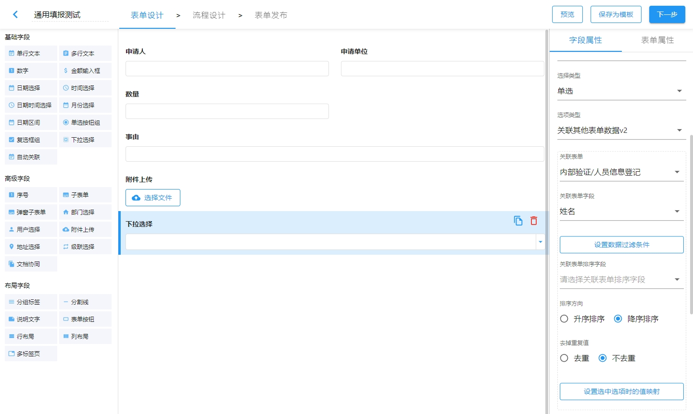
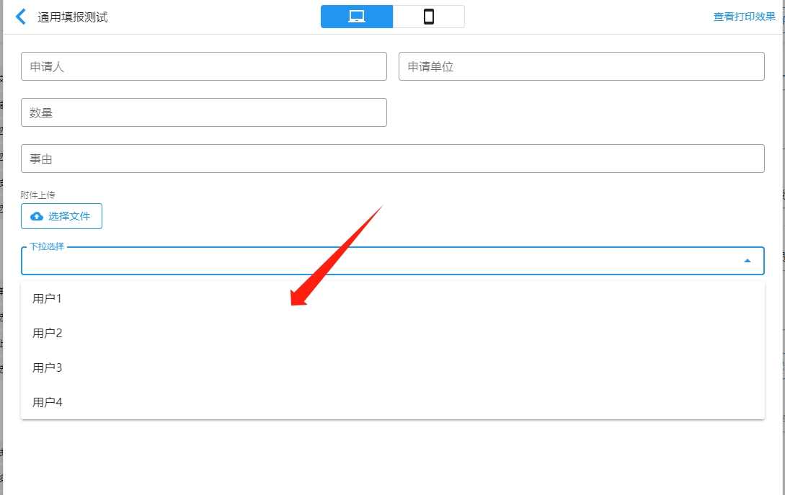
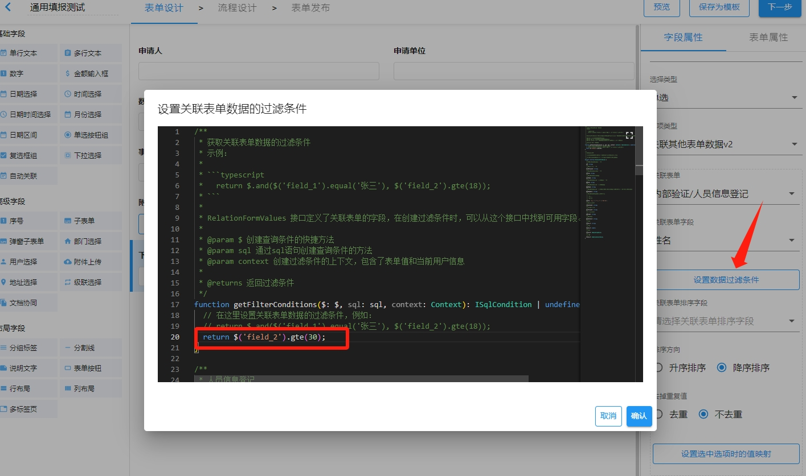
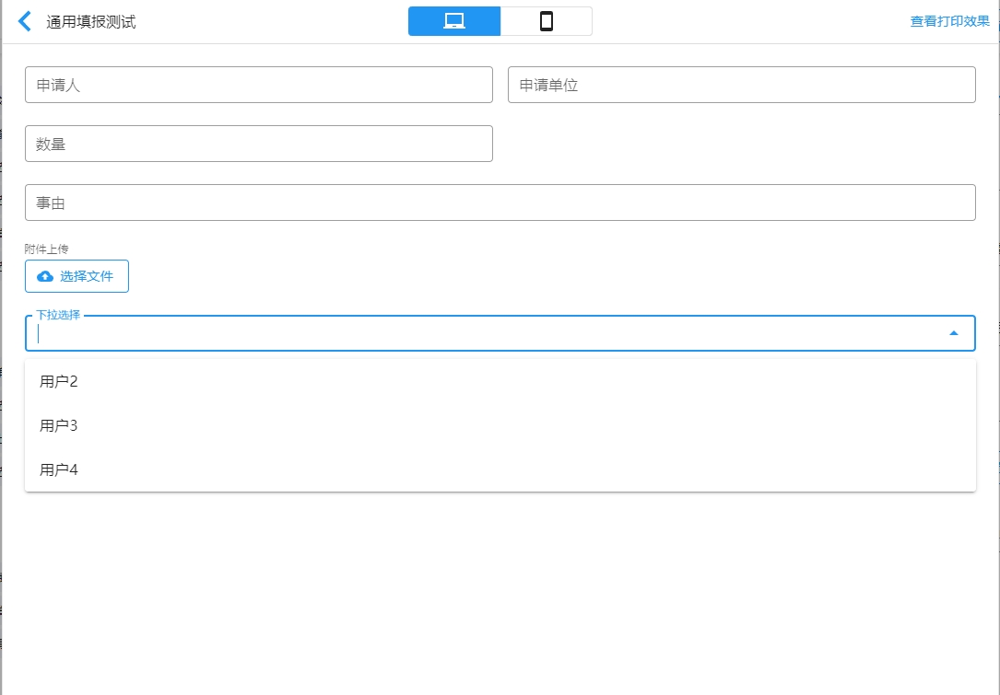
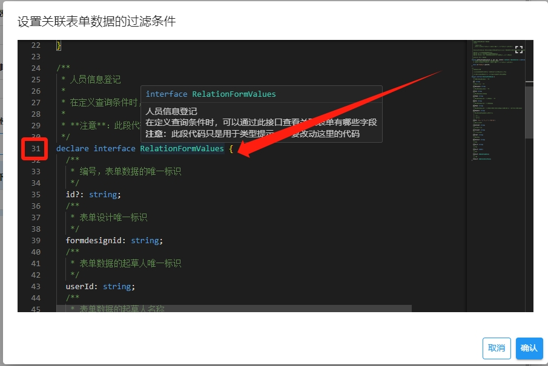
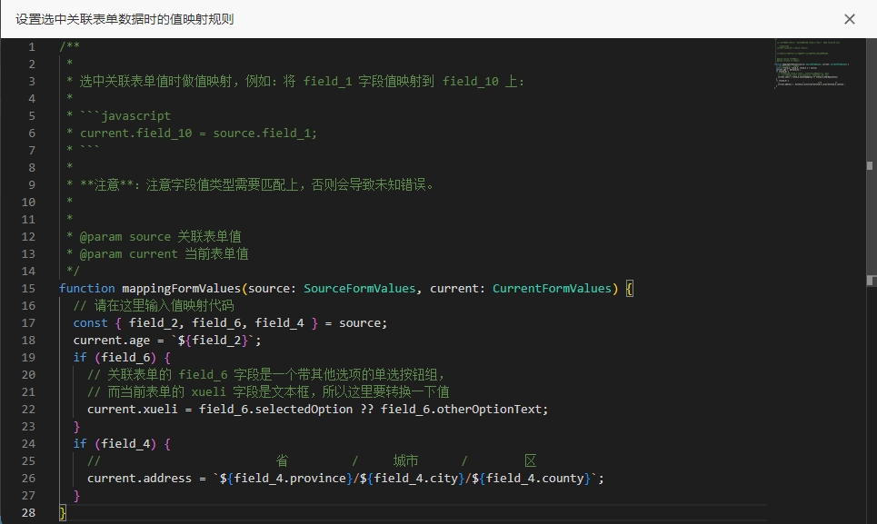
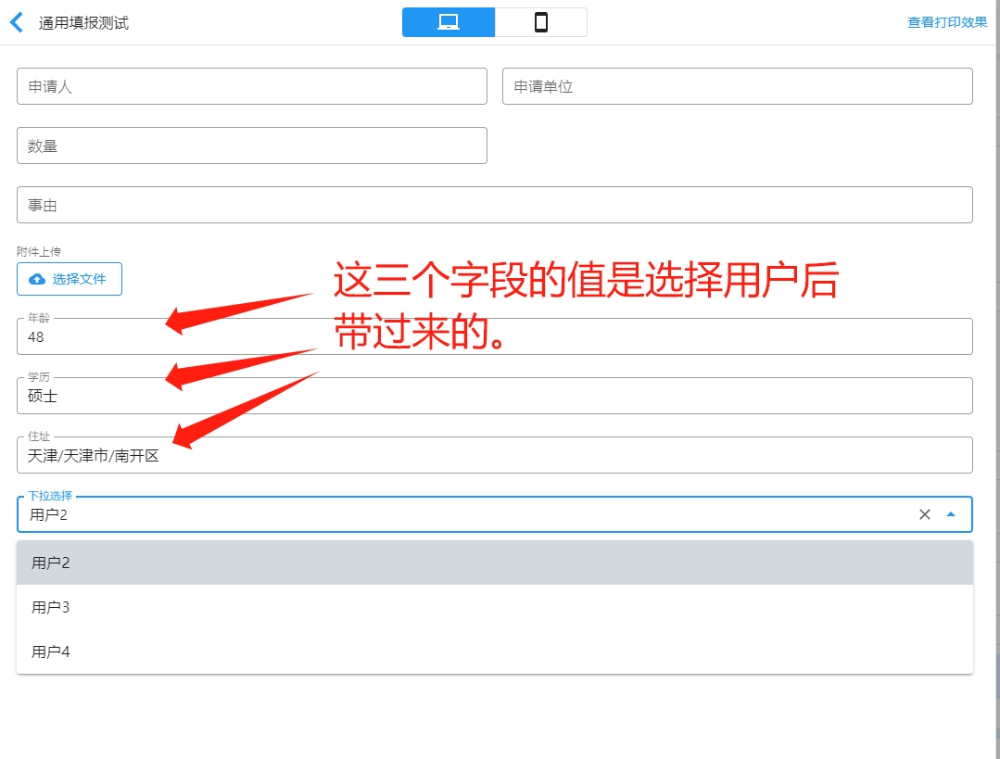
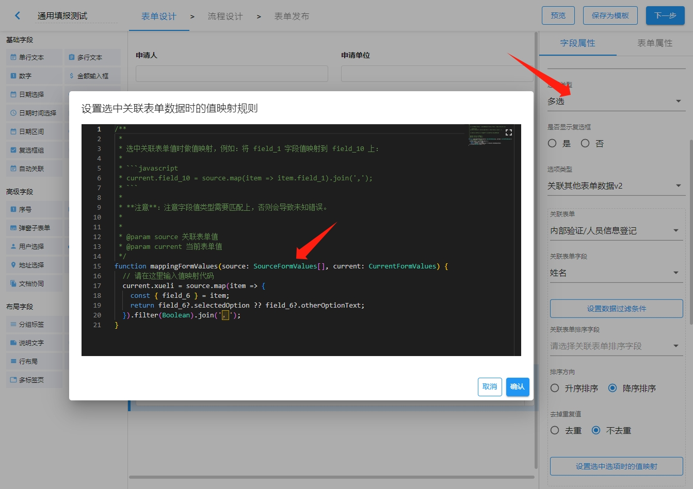
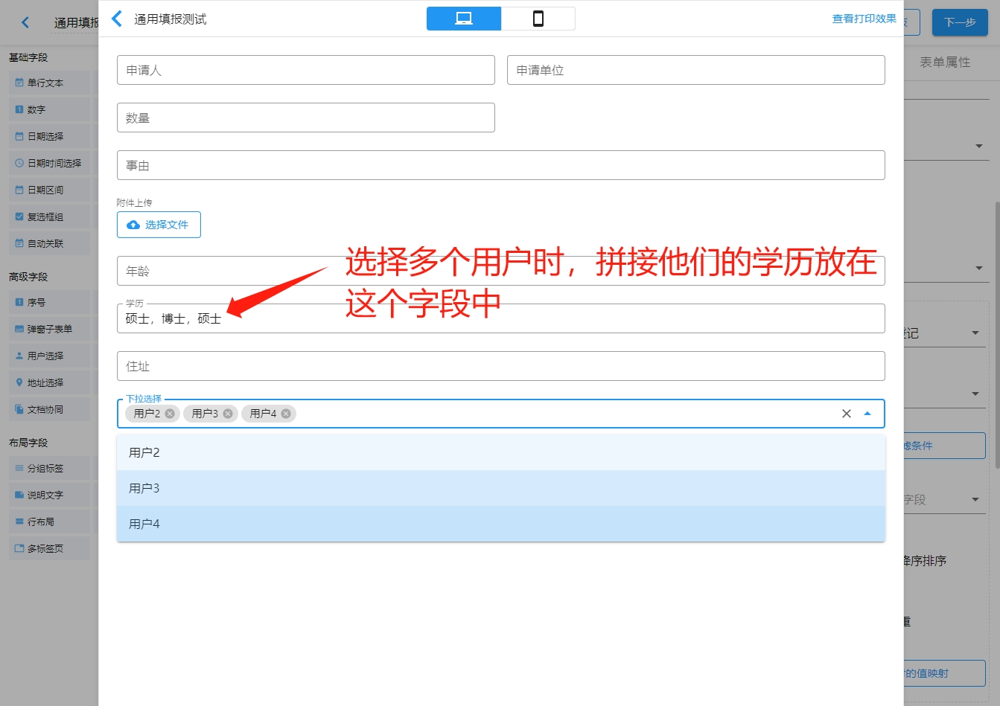

> 支持版本：1.18.10

下拉选择框、单选按钮组、多选按钮组表单项组件的“选项类型”新增“关联其他表单数据
v2”方式，此方式允许定义其他表单的数据作为选项清单，且可以通过 JavaScript 定义关
联表单（其他表单）数据的过滤条件和值映射规则（将选中的关联表单数据映射到当前表单
其他字段中）。

## 1. 基本使用

“选项类型”中选择**关联其他表单数据 v2**，并选择**关联的表单**和**关联的表单字
段**，如下图所示：



示例中选择了**内部验证/人员信息登记**表单和**姓名**字段。那么就会将**内部验证/人
员信息登记**表单中所有的数据查询出来，并将**姓名**字段值作为选项提供给**下拉选
择**组件，实际效果如下图所示：



> 注意：只能选择应用中的表单作为关联表单。

## 2. 设置过滤条件

默认情况下会查询出关联表单所有数据（选项清单限制为 100 条），我们可以**设置数据
过滤条件**，有选择性地返回关联表单数据。

例如：我们只要年龄（`field_2`字段）大于等于 30 岁的数据，做如下图的设置：



设置的条件为：

```typescript
$("field_2").gte(30);
```

那么实际的效果如下图所示：



### 2.1. 去哪里找到关联表单有哪些字段？

为了方便在编写查询条件时查找关联表单有哪些字段，将关联表单值类型接口放在代码编辑
器的底部，如果不清楚关联表单有哪些字段，可以从这个接口声明中查找一下，如下图所示
：



### 2.2. 设置数据过滤条件的语法

过滤条件设置语法的完整教程
：[@sinoform/helper-condition-api](https://www.npmjs.com/package/@sinoform/helper-condition-api#%E6%94%AF%E6%8C%81%E7%9A%84%E6%93%8D%E4%BD%9C%E7%AC%A6)

支持两种风格 API，设置过滤条件，即：

第一种风格：

```typescript
$("field_1").gte(30);
```

第二种风格：

```typescript
sql`field_1 >= 30`;
```

根据个人喜选择 API 风格。推荐采用第一种风格。本教程采用第一种风格做说明。

### 2.3. 支持的操作符

支持的操作符分成三类：

- 单个字段的操作符，
  如[gte](https://www.npmjs.com/package/@sinoform/helper-condition-api#gte)、[contain](https://www.npmjs.com/package/@sinoform/helper-condition-api#contain)、[equal](https://www.npmjs.com/package/@sinoform/helper-condition-api#equal)等
  。
- 组合查询条件的逻辑操作符，
  如[and](https://www.npmjs.com/package/@sinoform/helper-condition-api#and)、[or](https://www.npmjs.com/package/@sinoform/helper-condition-api#or)、[not](https://www.npmjs.com/package/@sinoform/helper-condition-api#not)。
- 扩展操作符，如查询仅当前登录用户有权限看到的数据
  [querySelfAll](https://www.npmjs.com/package/@sinoform/helper-condition-api#queryselfall)、
  查询仅当前登录用户所在部门有权限看到的数据
  [queryDeptAll](https://www.npmjs.com/package/@sinoform/helper-condition-api#querydeptall)。

支持的操作符如下表所示：

| 操作符                                                                                    | 说明                                                                  |
| ----------------------------------------------------------------------------------------- | --------------------------------------------------------------------- |
| [equal](https://www.npmjs.com/package/@sinoform/helper-condition-api#equal)               | 相等比较操作符                                                        |
| [notEqual](https://www.npmjs.com/package/@sinoform/helper-condition-api#notEqual)         | 不相等比较操作符                                                      |
| [contain](https://www.npmjs.com/package/@sinoform/helper-condition-api#contain)           | 文本包含操作符，相当于 `like '%文本%'`                                |
| [notContain](https://www.npmjs.com/package/@sinoform/helper-condition-api#notContain)     | 文本不包含操作符                                                      |
| [isNull](https://www.npmjs.com/package/@sinoform/helper-condition-api#isNull)             | 空判定操作符                                                          |
| [notNull](https://www.npmjs.com/package/@sinoform/helper-condition-api#notNull)           | 非空判定操作符                                                        |
| [lt](https://www.npmjs.com/package/@sinoform/helper-condition-api#lt)                     | 小于操作符                                                            |
| [gt](https://www.npmjs.com/package/@sinoform/helper-condition-api#gt)                     | 大于操作符                                                            |
| [lte](https://www.npmjs.com/package/@sinoform/helper-condition-api#lte)                   | 小于等于操作符                                                        |
| [gte](https://www.npmjs.com/package/@sinoform/helper-condition-api#gte)                   | 大于等于操作符                                                        |
| [in](https://www.npmjs.com/package/@sinoform/helper-condition-api#in)                     | 包含操作符                                                            |
| [is](https://www.npmjs.com/package/@sinoform/helper-condition-api#is)                     | `is null`场景中使用的操作符                                           |
| [isNot](https://www.npmjs.com/package/@sinoform/helper-condition-api#isNot)               | `is not null` 场景使用的操作符                                        |
| [like](https://www.npmjs.com/package/@sinoform/helper-condition-api#like)                 | 文本包含操作符                                                        |
| [notLike](https://www.npmjs.com/package/@sinoform/helper-condition-api#notLike)           | 文本不包含操作符                                                      |
| [range](https://www.npmjs.com/package/@sinoform/helper-condition-api#range)               | 区间操作符，相当于 `between x and y`                                  |
| [and](https://www.npmjs.com/package/@sinoform/helper-condition-api#and)                   | 并且逻辑操作符，使用 `and` 组合的多个查询条件是必须都要满足的         |
| [or](https://www.npmjs.com/package/@sinoform/helper-condition-api#or)                     | 或者逻辑操作符，使用 `or` 组合的多个查询条件只需要满足一个即可        |
| [not](https://www.npmjs.com/package/@sinoform/helper-condition-api#not)                   | 非逻辑操作符，使用 `not` 包裹的查询条件表示查询不满足此查询条件的数据 |
| [querySelfAll](https://www.npmjs.com/package/@sinoform/helper-condition-api#querySelfAll) | 仅查询出自己可见的所有数据                                            |
| [queryDeptAll](https://www.npmjs.com/package/@sinoform/helper-condition-api#queryDeptAll) | 查询出自己和部门可见的所有数据                                        |

### 2.4. 添加权限过滤条件

默认情况下会查询出关联表单所有数据。上个章节介绍了两个权限相关的操作符，即：

- [querySelfAll](https://www.npmjs.com/package/@sinoform/helper-condition-api#querySelfAll) -
  仅查询出当前登录用户可见的所有数据
- [queryDeptAll](https://www.npmjs.com/package/@sinoform/helper-condition-api#queryDeptAll) -
  查询出当前登录用户和所属部门可见的所有数据

[querySelfAll](https://www.npmjs.com/package/@sinoform/helper-condition-api#querySelfAll)
操作符会限定仅仅出现由当前登录用户创建的或者当前用户办理过的表单数据。

[queryDeptAll](https://www.npmjs.com/package/@sinoform/helper-condition-api#queryDeptAll)
在使用时应指定部门级别（从 0 开始计数，最顶级的部门级别为 0）。例如下面的部门结
构：

```text
xxx集团                           level = 0
|__ A部门                         level = 1
    |__ A1处室                    level = 2
       |__ 张三
|__ B部门                         level = 1
    |__ 王五
    |__ B2处室                    level = 2
      |__ 李四
```

例如下面的查询条件：

```typescript
$.queryDeptAll(1);
```

如果是 `李四` 登录进系统，那么他可以看到 `B部门` 下所有用户能够看到的数据；如果
是 `张三` 登录进系统，那么他可以看到 `A部门` 下所有用户能够看到的数据。

如果想仅看到自己所在的直属处室/部门的数据，那么可以给一个非常大的部门级别即可：

```typescript
$.queryDeptAll(100);
```

该操作符会先查找第 100 级的部门，发现它不存在（一般情况不会存在），那么它就会采
用当前用户直属处室/部门。

如果这些权限依然不满足，那么可以自行定义权限条件。`context` 中包含了当前用户信息
和当前表单信息，如下所示：

```typescript
function getFilterConditions(
  $: $,
  sql: sql,
  context: Context
): ISqlCondition | undefined | void {
  return $.and(
    $("field_1").equal(context.currentUser.deptId),
    $("field_2").equal(context.formValues.field_10)
  );
}
```

### 2.5. 将当前表单中其他字段的值作为查询条件

可以将当前表单中其他字段的值作为查询条件。当改变了这些字段的值时，会重新查询关联
表单数据。例如：

```typescript
function getFilterConditions(
  $: $,
  sql: sql,
  context: Context
): ISqlCondition | undefined | void {
  return $("field_2").equal(context.formValues.field_4);
}
```

示例代码设置了这样的查询条件：关联表单的`field_2`字段值应等于当前表单
的`field_4`字段值。

## 3. 设置排序规则

默认不会对关联表单数据做排序，可以设置**关联表单排序字段**和**排序方向**。

## 4. 选中关联表单数据时的值映射

如果在选中选项时，要将关联表单数据的字段值填充到当前表单其他字段中，那么需要**设
置选中选项时的值映射**，如下图所示：



其中 `current` 代表当前表单值，`source` 代表关联表单的值。

实际效果如下图所示：



### 4.1. 关联表单值类型

如果是单选按钮组或者单选下拉框，那么 `source` 的类型是表单值对象，如果是多选按钮
组或者多选下拉框，那么 `source` 的类型是表单值对象数组（因为表示一组数据）。如下
图所示：



效果如下图所示：



## 5. 选项去重

:::tip

注意：**选项去重**与**设置选中选项时的值映射**是互斥的特性，二者只能同时启用一个
。

:::

如果需要去掉重复的选项，可以启用 **去掉重复值**。
