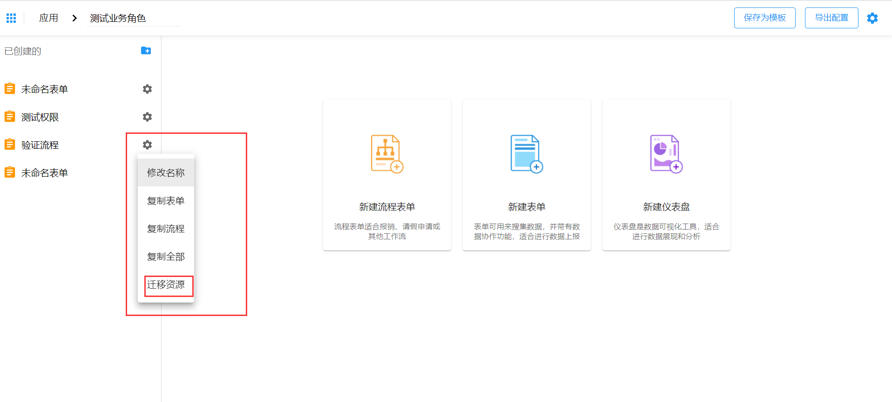

为了安全性考虑，智能表单默认不会提供应用下表单资源的迁移功能。如果您想要将应用下的某些资源迁移至另一个应用下，需要按照本文介绍的方式来启用应用下的资源迁移功能。

## 启用版本

`v1.13.0`

## 开启应用下资源迁移的配置

智能表单应用下资源迁移配置默认为`false`。如果想要启用此功能，只需要在项目的配置文件(`application.yml`)中添加如下配置：

```yaml
sinoform:
  # 启用应用表单的迁移功能
  enable-application-form-migration: true
```

之后，重新启用表单应用，重新点击应用下资源列表右侧设置按钮，就能看到迁移资源的按钮。


