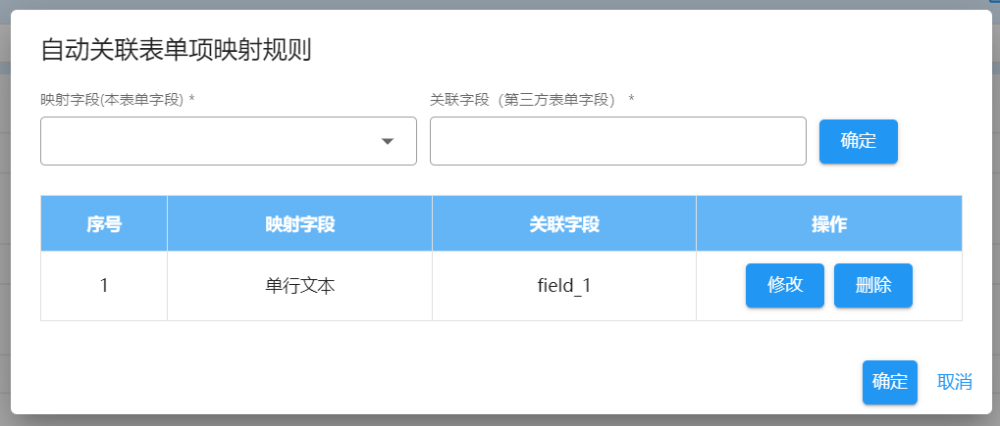
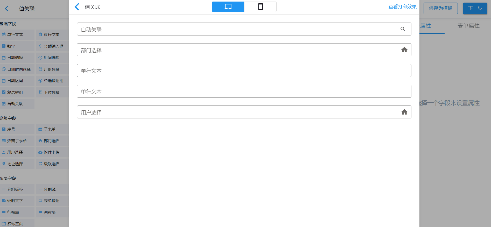

自动关联是`v1.17.1`之后新添加的表单项，通过关联查询用户输入的内容模糊查询其他的表单或第三方数据，在用户选择对应的数据之后，根据用户配置的数据映射关系，将选中数据中的值映射到对应的当前表单上。

## 核心配置说明

### 数据来源

自动关联的数据来源方式，分为以下两种：

- 第三方来源
- 内部表单

目前只支持了第三方来源

### 关联数据接口

指定数据来源为`第三方来源`时，用户必须指定第三方数据来源请求接口地址，否则无法请求第三方数据。

此接口为`GET`请求方式，请求时会传递以下几个参数：

- userId: 系统当前登录人
- q: 用户输入的查询条件
- formId: 表单设计 id

接口的返回值为符合查询条件的表单数据数组。

### 数据来源标题

使用插值表达式的方式来指定模糊请求到的数据如何展示在页面上供用户选择。如果不指定的话，默认从每条数据中查找`title`字段对应的值。

标题的插值表达式格式：`{createUser}创建的${title}表单`

### 自动关联规则

指定关联的数据与当前表单项的映射关系，可一次性指定多条映射关系。

- 映射字段：本表单字段。不支持子表单、弹窗子表单内部的子表单项
- 关联字段：第三方数据中值的对应字段标识，需要手动输入

:::info 提示
虽然表单内部对一些复杂结构的表单项进行了数据匹配的转换处理，但是仍然可能有场景没有考虑完全，所以，如果映射字段的值为复杂的对象，关联字段的值要尽量与改映射字段的值的数据结构保持一致，以便能够正确地进行赋值
:::

## 如何使用

用户手动输入查询条件，然后选中模糊查询结果中的数据，然后程序就可以根据映射配置自动为当前表单完成赋值。

