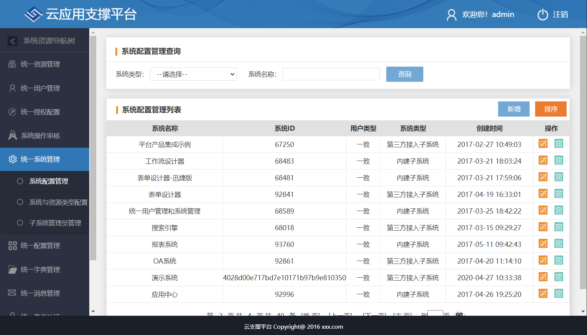
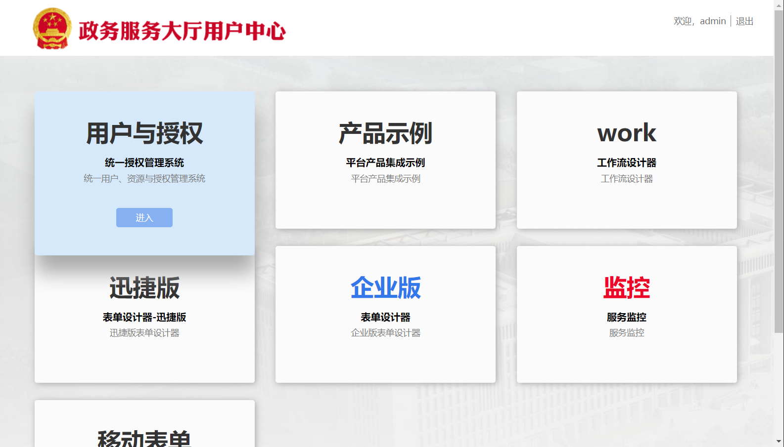
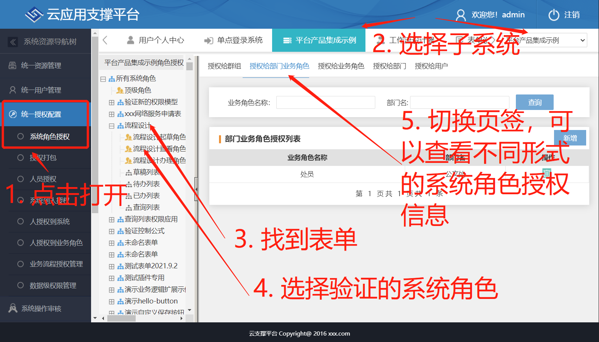
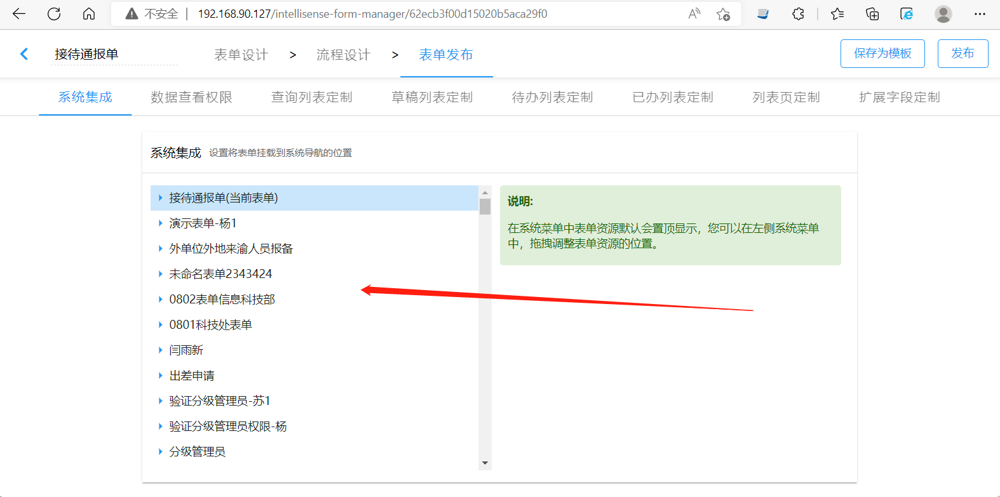

import JSONViewer from "@/components/json-viewer";

智能表单本身不维护页面资源和资源的访问权限，而是依托于 sino-matrix 平台或者其他平台来实现的资源发布。

:::info 提示

本文重点介绍与 sino-matrix 集成使用时的资源发布配置。

:::

## 1. 功能介绍

在发布表单的过程中，有一个非常关键的步骤，即资源发布，包括产生表单页面、系统角色和页面资源授权。

## 2. 与 sinomatrix 平台集成

### 2.1. 定义 uias 服务的配置

智能表单服务默认与 sino-matrix 平台中的 `sino-matrix-uias` 服务提供的接口进行交互，实现资源发布的。需要通过 `sinoform.uias-server-uri` 配置项指定 `sino-matrix-uias` 服务的地址，如下所示：

```yaml title="application-dev.yml"
sinoform:
  uias-server-uri: 127.0.0.1:18001
```

### 2.2. configs.systemId 配置项

此配置项用来配置表单资源挂载的根资源的 id，即 sino-matrix 平台系统管理中的子系统的 id。默认的配置如下：

```yaml title="application.yml"
configs:
  systemId: 67250
```

在新搭建的 sino-matrix 中，默认会包含一个 `平台产品集成示例` 子系统，如下图所示：



如果您希望将表单挂载到您的业务子系统之下，可以通过 `configs.systemId` 来配置，如下所示：

```yaml title="application.yml"
configs:
  systemId: 12345
```

### 2.3. 发布的资源可以在 sino-matrix 系统管理中查看

表单发布后的资源可以在 sino-matrix 的用户与授权中查看。

点击下面高亮的区块进入用户与授权：



查看资源的（系统角色的）授权：



上图中有三个固定的系统角色，即：

| 系统角色 | 可访问的表单页面               | 授权来源                                                               |
| -------- | ------------------------------ | ---------------------------------------------------------------------- |
| 起草角色 | 表单的所有页面                 | 表单流程中的起草节点上设置的负责人范围                                 |
| 办理角色 | 表单的待办、已办、查询列表页面 | 表单流程中所有节点上设置的负责人范围合集                               |
| 查看角色 | 表单查询页面                   | 表单流程中所有节点上设置的负责人范围和表单发布中设置的各种管理员的合集 |

:::info 提示

以上授权规则是智能表单内置实现的，不需要手动地在 sinomatrix 系统管理中设置。

:::

:::info 提示

如果您发现表单资源的权限不正确，可以从上面的页面中查看一下授权是否正确。

:::

## 3. 与第三方平台的资源服务集成

智能表单默认与 sinomatrix 统一授权服务集成，完成资源与授权管理。如果要接入第三方资源管理服务，请逐个实现以下接口。

### 3.1. 新增资源

#### 3.1.1. 第三方接口配置

新增应用、在应用中新增分组时，均需要调用新增资源的接口。第三方资源服务接口配置项：

```yaml
url:
  get-save-resource-url: http://192.168.90.110:19001/custom-save-resource
```

#### 3.1.2. 接口约定

新增资源的接口如下：

```http
POST http://<统一授权服务地址>/uias/resource/saveResource
```

新增的资源数据以 `application/json` 格式的请求体提交。请求体数据格式如下：

```json
{
  "author": "1",
  "name": "未命名应用",
  "subId": "67250",
  "order": "after",
  "superId": "0",
  "resourceId": "4028d00e7d6f8e31017e67ea681a064b"
}
```

对象中的属性说明如下表所示：

| 属性名     | 说明                      |
| ---------- | ------------------------- |
| author     | 创建资源的用户 id         |
| name       | 新增资源名称              |
| subId      | 业务系统 id               |
| order      | 新增资源所处的位置。      |
| superId    | 父级资源的 id。           |
| resourceId | 新增资源位置的锚点资源 id |

其中 `order` 有三个值，分别是：`after`、`before` 和 `child`，`child` 是默认值。`order` 为 `after` 时，表示新增资源的位置是在锚点资源（由 `resourceId` 指定）之后。`order` 为 `before` 时，表示新增资源的位置是在锚点资源之前。`order` 为 `child` 时，表示新增资源的位置是在父级资源（由 `superId` 指定）之下。

响应数据格式如下：

```json title="新增资源的成功响应" {3}
{
  "status": "1",
  "resourceId": "4028d00e7d6f8e31017e67ea681a064b",
  "msg": "接口响应成功"
}
```

其中 `resourceId` 属性为新增资源的 id。

```json title="新增资源的失败响应"
{
  "status": "0",
  "msg": "新增资源失败"
}
```

### 3.2. 获取业务系统的所有资源接口

智能表单需要通过此接口获取到资源树，在表单发布时，用户可以通过以下界面将表单对应的资源定位到合适的导航位置：



#### 3.2.1. 第三方接口配置

第三方资源服务接口配置项：

```yaml
url:
  get-send-resource-url: http://192.168.90.110:19001/custom-get-subsystem-resources
```

#### 3.2.2. 接口约定

接口如下：

```http
GET http://<统一授权服务地址>/resource/getAllById?subId=67250
```

其中请求参数 `subId` 为业务系统 id。

响应数据如下：

<JSONViewer
  title="获取业务系统的所有资源的成功响应"
  src={{
    status: "1",
    resourceInfo: [
      {
        resourceId: "4028d00e7d6f8e31017e6583d3d705b8",
        resourcePid: "0",
        resourceName: "公文",
      },
      {
        resourceId: "8028d00e7d6f8e31017e6583d3d705b1",
        resourcePid: "4028d00e7d6f8e31017e6583d3d705b8",
        resourceName: "发文",
      },
      {
        resourceId: "1028d00e7d6f8e31017e6583d3d705b1",
        resourcePid: "4028d00e7d6f8e31017e6583d3d705b8",
        resourceName: "收文",
      },
      {
        resourceId: "5028d50e7d6f8e31017e6583d3d705b5",
        resourcePid: "0",
        resourceName: "会议",
      },
    ],
  }}
/>

资源对象属性如下：

| 属性名称     | 说明      |
| ------------ | --------- |
| resourceId   | 资源 id   |
| resourcePid  | 父资源 id |
| resourceName | 资源名称  |

<JSONViewer
  title="获取业务系统的所有资源的成功响应"
  src={{
    status: "0",
    msg: "获取资源失败",
  }}
/>

### 3.3. 更新资源接口

此接口用来更新资源名称的。应用名称变更时，需要调用此接口，以更新对应的资源名称。

#### 3.3.1. 第三方接口配置

第三方资源服务接口配置项：

```yaml
url:
  update-resource-url: /custom-update-resource
```

#### 3.3.2. 接口约定

接口如下：

```http
POST http://<统一授权服务地址>/uias/resource/updateResource
```

更新的资源数据以 `application/json` 格式的请求体提交。请求体数据格式如下：

```json
{
  "resourceId": "4028d00e7d6f8e31017e67ea681a064b",
  "resourceName": "新的资源名称",
  "subId": "67250"
}
```

响应数据如下：

```json title="更新资源的成功响应"
{
  "resourceId": "4028d00e7d6f8e31017e67ea681a064b",
  "status": "1",
  "msg": "接口响应成功"
}
```

```json title="更新资源的失败响应"
{
  "status": "0",
  "msg": "接口响应失败"
}
```

## 4. 监听资源发布

如果已经与 sino-matrix 或者第三方的资源管理服务做完集成后，还需要往另一个系统（例如门户系统）中推送已经发布的资源，则需要用到监听资源发布的接口。典型场景：将发布的表单应用推送到第三方平台的门户上作为一个快捷链接显示。

### 4.1. 第三方接口配置

使用 `url.resource-publish-url` 配置项来定义业务系统的扩展接口，如下所示：

```yaml title="application-dev.yml"
url:
  resource-publish-url: http://192.168.90.110:19001/extend-resource-publish
```

:::warning 特别注意

需要特别注意，`url.resource-publish-url` 不能在 `sinoform` 的下面。

错误的写法：

```yaml
sinoform:
  uias-server-uri: 127.0.0.1:18001
  url:
    resource-publish-url: http://192.168.90.110:19001/extend-resource-publish
```

正确的写法：

```yaml
sinoform:
  uias-server-uri: 127.0.0.1:18001
url:
  resource-publish-url: http://192.168.90.110:19001/extend-resource-publish
```

:::

### 4.2. 资源发布扩展接口约定

此扩展接口需要符合如下接口约定：

```http
POST [扩展资源的链接，您可以自行设计链接路径，如http://192.168.90.110:19001/extend-resource-publish]
```

请求体是 `application/json` 格式的，示例数据如下：

```json
{
  "title": "国际合作",
  "id": "1",
  "resourceId": "统一授权资源id",
  "url": "/intellisense-form/app/1/home",
  "type": "app",
  "children": [{
      "title": "流程审批",
      "id": "2",
      "resourceId": "统一授权资源id",
      "url": "/intellisense-form/app/1/home/form/2",
      "type": "form",
      "children": [{
          "title": "草稿箱",
          "id": "3",
          "resourceId": "统一授权资源id",
          "type": "page",
          "url": "/intellisense-form/app/1/home/form/2/draft-list",
          "auth": {
              "deptRole": [{
                  "roleId": "11212121212",
                  "deptIds": ["deptid1", "deptid2"]
              }],
              "deptId": [
                  "4028d00e717bd7e10171b608abaf02da",
                  "4028d00e717bd7e10171f21b8fc1043d"
              ],
              "roleId": ["4028d00e6ec42073016ec46896840014"],
              "user": [
                  {
                    "deptId": "18043",
                    "userId": "4028d0136b7919e7016b791f50c10004"
                  },
              ]
          },
      }, {
          "title": "查询",
          "id": "4",
          "resourceId": "统一授权资源id",
          "type": "page",
          "url": "/intellisense-form/app/1/home/form/2/search-list"
      }]
  }, {
      "title": "人员资料库",
      "id": "7",
      "resourceId": "统一授权资源id",
      "type": "group",
      "url": "/intellisense-form/app/1/home/group/7",
      "children": [{...}]
  }, {
      "title": "出国（境）团组",
      "id": "5",
      "resourceId": "统一授权资源id",
      "type": "noflow",
      "url": "/intellisense-form/app/1/home/form/5/no-flow-list"
  }, {
      "title": "统计分析",
      "id": "6",
      "resourceId": "统一授权资源id",
      "type": "dashboard",
      "url": "/intellisense-form/app/1/home/dashboard/6"
  }]
}
```

字段说明：

- title - 资源名称
- id - 表单或者应用的 id（对于流程表单的草稿箱、查询列表等自动生成的资源，其 id 为 ${表单id}_${页面英文名称}）
- resourceId - 统一授权资源 id
- iconUrl - 应用图标链接
- type - 资源类型
  - app - 应用
  - form - 表单
  - dashboard - 仪表盘
  - noflow - 无流程表单
  - group - 分组
- url - 页面对应的链接
- auth - 页面对应的授权信息
  - deptRole - 部门下的业务角色，如授权办公室（包含子孙部门）下的处员可以起草表单数据
  - deptId - 部门，如授权给办公室（包含子孙部门）所有人员使用
  - roleId - 业务角色，如授权给所有处员使用
  - user - 人员，如授权给张三、李四
- children - 包含的子资源

注意：不是所有级别的资源都有 auth，一般是最底层的资源才有 auth。**上层资源的授权范围包含子孙资源的授权范围。**

如果处理成功，返回成功的响应码即可，响应体有无都可以。
