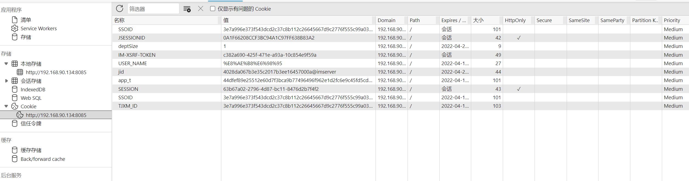
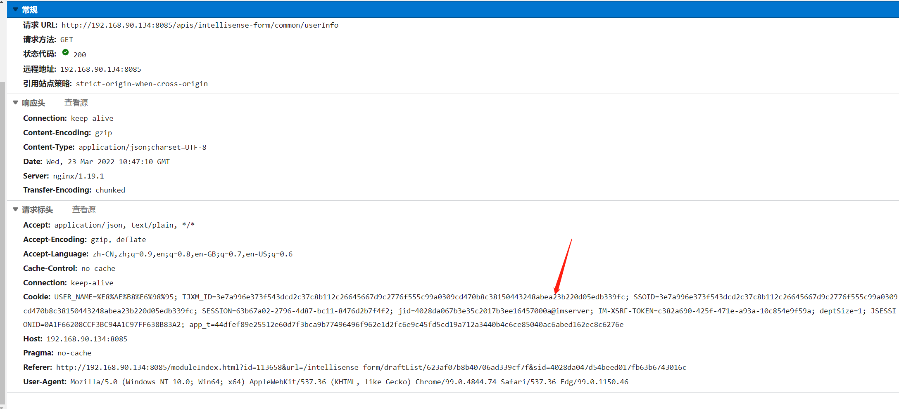

import Api from "@/api-doc";
import Tabs from "@theme/Tabs";
import TabItem from "@theme/TabItem";

本文介绍如何定制智能表单获取登录用户信息。要点如下：

- [1. 定制获取登录用户信息](#1-定制获取登录用户信息)
- [2. 优化获取登录用户信息的性能](#2-优化接口性能)

## 1. 定制获取登录用户信息

> 支持版本：v1.10.0

智能表单默认从 sino-matrix 中的 uias 服务中读取登录用户信息。如果您需要从第三方服务中读取登录用户信息，则需要在 `application.yml` 中定制以下接口：

```yaml config/application.yml
url:
  # 指定自定义的获取用户基本信息接口
  get-user-info-by-id-url: http://localhost:8888/apis/get-user-info-by-id
  # 指定自定义的获取指定用户所属的所有部门信息接口（如果是一人多部门，则返回所有的部门即可）
  get-all-dept-by-user-id: http://localhost:8888/apis/get-all-dept-by-user-id
  # 指定自定义的获取用户所具有的业务角色接口
  get-flow-roles-by-id: http://localhost:8888/apis/get-flow-roles-by-id
  # 指定自定义的获取指定部门的部门信息接口
  get-dept-info-by-dept-id: http://localhost:8888/apis/get-dept-info-by-dept-id
  # 指定自定义的获取指定部门所有上级部门信息接口
  get-all-super-dept-by-id: http://localhost:8888/apis/get-all-super-dept-by-id
  # 指定自定义的获取用户基本信息的接口（仅当集成 cas 单点登录时，需要配置并实现此接口）
  get-user-info-by-name-url: http://localhost:8888/apis/get-user-info-by-name
```

下面分章节介绍每一个接口。

- [1.1. 获取用户基本信息接口](#1-1-获取用户基本信息接口)
- [1.2. 获取用户所具有的业务角色接口](#1-2-获取用户所具有的业务角色接口)
- [1.3. 获取用户所属部门信息接口](#1-3-获取用户所属部门信息接口)
- [1.4. 获取指定部门的部门信息接口](#1-4-获取指定部门的部门信息接口)
- [1.5. 获取指定部门的所有上级部门接口](#1-5-获取指定部门的所有上级部门接口)
- [1.6. 根据用户名获取用户基本信息接口](#1-6-根据用户名获取用户基本信息接口)

<Api
  title="1.1. 获取用户基本信息接口"
  name="get-user-info-by-id-url"
  requestParams={[{ name: "uid", message: "用户 id" }]}
  successExample={{
    status: "1",
    msg: "获取用户信息成功",
    userInfo: {
      uid: "用户编号",
      userFullName: "用户姓名",
      phone: "电话号码",
    },
  }}
  errorExample={{
    status: "0",
    msg: "用户不存在",
  }}
/>

<Api
  title="1.2. 获取用户所具有的业务角色接口"
  name="get-flow-roles-by-id"
  requestParams={[{ name: "userId", message: "用户 id" }]}
  successExample={{
    status: "1",
    msg: "获取用户所具有的业务角色信息成功",
    rolesInfo: [
      {
        rolesId: "业务角色编号1",
        rolesName: "业务角色名称1",
      },
      {
        rolesId: "业务角色编号2",
        rolesName: "业务角色名称2",
      },
    ],
  }}
  errorExample={{
    status: "0",
    msg: "用户不存在",
  }}
/>

<Api
  title="1.3. 获取用户所属部门信息接口"
  name="get-all-dept-by-user-id"
  requestParams={[{ name: "userId", message: "用户 id" }]}
  successExample={{
    status: "1",
    msg: "获取用户所属部门信息成功",
    deptInfo: [
      {
        deptid: "部门编号1",
        deptname: "部门名称1",
      },
      {
        deptid: "部门编号2",
        deptname: "部门名称2",
      },
    ],
  }}
  errorExample={{
    status: "0",
    msg: "用户不存在",
  }}
>

:::warning 注意

请注意大小写。`deptid` 和 `deptname` 属性名都是小写的。

:::

:::tip 提示

对于一人多部门的情况，智能表单会认为此接口响应的第一个部门是默认部门。

:::

</Api>

<Api
  title="1.4. 获取指定部门的部门信息接口"
  name="get-dept-info-by-dept-id"
  requestParams={[{ name: "deptId", message: "部门 id" }]}
  successExample={{
    status: "1",
    msg: "获取部门信息成功",
    deptInfo: [
      {
        deptid: "部门编号1",
        deptname: "部门名称1",
      },
    ],
  }}
  errorExample={{
    status: "0",
    msg: "部门不存在",
  }}
>

:::warning 注意

请注意，`deptInfo` 是一个对象数组。

:::

</Api>

<Api
  title="1.5. 获取指定部门的所有上级部门接口"
  name="get-all-super-dept-by-id"
  requestParams={[{ name: "deptId", message: "部门 id" }]}
  successExample={{
    status: "1",
    msg: "获取上级部门信息成功",
    deptInfo: [
      {
        deptid: "一级部门编号",
        deptname: "xx集团",
        treeId: "001",
      },
      {
        deptid: "二级部门编号",
        deptname: "xx子公司",
        treeId: "001001",
      },
      {
        deptid: "三级部门编号",
        deptname: "xx处室",
        treeId: "001001003",
      },
    ],
  }}
  errorExample={{
    status: "0",
    msg: "部门不存在",
  }}
>

<Api
  title="1.6. 根据用户名获取用户基本信息接口"
  name="get-user-info-by-name-url"
  requestParams={[{ name: "uName", message: "用户名" }]}
  successExample={{
    status: "1",
    msg: "获取用户信息成功",
    userInfo: {
      uid: "用户编号",
      userFullName: "用户姓名",
      phone: "电话号码",
    },
  }}
  errorExample={{
    status: "0",
    msg: "用户不存在",
  }}
/>

:::tip 提示

智能表单使用此接口主要用于两个方面：

- 表单导航资源和数据的权限判定（例如部门领导能够查询到本部门以及下属部门的表单数据）
- 显示完整的部门信息（例如表单数据创建人所在部门信息）

:::

:::tip 关于 treeId

智能表单会根据 `treeId` 的位数识别部门级别，**位数**越少，级别越高。

可以不返回 `treeId`，则返回的部门数组**必须**是从上级到下级排序的。

:::

</Api>

## 2. 优化接口性能

> 支持版本：1.12.4

智能表单后端没有维护会话状态（`session`），所以在需要获取当前用户信息时，都是调用接口来获取的。为了良好的性能，智能表单实现了接口响应的缓存功能。每个接口的缓存时长都是可以定制的。接口的默认缓存时长和对应的缓存时长配置项如下表所示：

| 接口                     | 缓存时长 | 缓存时长配置项                 |
| ------------------------ | -------- | ------------------------------ |
| get-user-info-by-id-url  | 30 分钟  | sinoform.user-cache-time       |
| get-all-dept-by-user-id  | 30 分钟  | sinoform.user-cache-time       |
| get-flow-roles-by-id     | 5 分钟   | sinoform.user-roles-cache-time |
| get-dept-info-by-dept-id | 1 小时   | sinoform.dept-cache-time       |
| get-all-super-dept-by-id | 1 小时   | sinoform.dept-path-cache-time  |

:::tip 缓存时长单位

所有的缓存时长配置值的单位是 `毫秒`。

:::

默认的缓存时长配置如下：

```yaml application.yml
sinoform:
  # 用户信息缓存时长：30分钟（单位：毫秒）
  user-cache-time: 1800000
  # 用户对应的业务角色信息缓存时长：5分钟（单位：毫秒）
  user-roles-cache-time: 300000
  # 部门信息缓存时长：1小时（单位：毫秒）
  dept-cache-time: 3600000
  # 部门路径信息缓存时长：1小时（单位：毫秒）
  dept-path-cache-time: 3600000
```

## 3. 获取登录用户信息

智能表单服务提供获取登录用户信息的接口，如下所示：

```http
GET http://<智能表单访问地址>/apis/intellisense-form/userInfo
```

### 从请求中识别当前用户 id

通过以下两种方式识别当前用户的 id：

- 通过请求头 `sinoform-current-user-id`（一般由网关提供此请求头）
- 通过请求 cookie `SSOID`

方式一适合通过可编程网关（如 spring-cloud-gateway）实现多系统共享 session 的方案，在网关上将当前用户 id 放入请求头 `sinoform-current-user-id` 中。方式二适合使用 sinomatrix sso 实现多系统单点登录的情况。

### 接口响应

此接口返回的内容如下：

```json
{
  "userId": "4028d00e6f16845c016f79dda0c20231",
  "userName": "张三",
  "deptId": "4028d00e6ec96438016ec97b4b10000b",
  "deptName": "处室一",
  "roleIds": ["4028d00e7a6613f4017af154f7840454"],
  "roleNames": ["处员"],
  "deptInfo": [
    "4028d00e6ec96438016ec97b4b10000b",
    "4028d00e6ec96438016ec976fee20000",
    "4028d00e6ec42073016ec4629a490001"
  ],
  "deptInfoName": ["处室一", "分公司", "集团"],
  "allDeptIds": [
    "4028d00e6ec96438016ec97b4b10000b",
    "2128d00e6ed1df338016ec97b4b10000b"
  ]
}
```

数据项的含义如下表所示：

| 属性名       | 说明                                                                                                      | 来源                                                                                                                                     |
| ------------ | --------------------------------------------------------------------------------------------------------- | ---------------------------------------------------------------------------------------------------------------------------------------- |
| userId       | 用户 id                                                                                                   | 从请求中获取                                                                                                                             |
| userName     | 用户信息                                                                                                  | [get-user-info-by-id-url](#1-1-获取用户基本信息接口) 中的 `userName` 属性                                                                |
| deptId       | 所属部门 id                                                                                               | 如果有请求头 `sinoform-current-dept-id`，则为之；否则等于 [get-all-dept-by-user-id](#1-3-获取用户所属部门信息接口) 第一条数据的 `deptId` |
| deptName     | 所属部门名称                                                                                              | [get-dept-info-by-dept-id](#1-4-获取指定部门的部门信息接口) 中的 `deptname` 属性                                                         |
| roleIds      | 用户拥有的业务角色 id                                                                                     | [get-flow-roles-by-id](#1-2-获取用户所具有的业务角色接口) 中的 `rolesId`                                                                 |
| roleNames    | 用户拥有的业务角色名称                                                                                    | [get-flow-roles-by-id](#1-2-获取用户所具有的业务角色接口) 中的 `rolesName`                                                               |
| deptInfo     | 用户所属部门所有祖先部门 id（包含自身所属部门），即部门路径，从小到大排序，如 `处室一`、`分公司`、`集团`  | [get-all-super-dept-by-id](#1-5-获取指定部门的所有上级部门接口) 中的 `deptid`                                                            |
| deptInfoName | 用户所属部门所有祖先部门名称（包含自身所属部门），即部门路径，从小到大排序，如 `处室一`、`分公司`、`集团` | [get-all-super-dept-by-id](#1-5-获取指定部门的所有上级部门接口) 中的 `deptname`                                                          |
| allDeptIds   | 用户所有在职部门 id                                                                                       | [get-all-dept-by-user-id](#1-3-获取用户所属部门信息接口) 中的 `deptid`                                                                   |

## 4. 由业务系统控制当前会话用户

业务系统可以通过可编程网关（如 spring cloud gateway）来告知智能表单当前会话用户（即登录用户）是谁，以及属于哪个部门（解决一人多岗的问题）。

通过网关实现登录或者与第三方 SSO 集成后，获取到当前用户的 userId 和 deptId，然后通过 `sinoform-current-user-id` 和 `sinoform-current-dept-id` 请求头告知智能表单即可。

可以通过过滤器来实现，例如：

<Tabs>
  <TabItem value="zuul" label="spring cloud zuul">

```java
package com.sinosoft.sinoformgateway.filters;

import static org.springframework.cloud.netflix.zuul.filters.support.FilterConstants.PRE_DECORATION_FILTER_ORDER;
import static org.springframework.cloud.netflix.zuul.filters.support.FilterConstants.PRE_TYPE;

import com.netflix.zuul.ZuulFilter;
import com.netflix.zuul.context.RequestContext;
import java.util.Optional;
import javax.servlet.http.HttpServletRequest;
import javax.servlet.http.HttpSession;
import lombok.extern.slf4j.Slf4j;
import org.springframework.stereotype.Component;

/**
 * 将会话用户信息同步到智能表单的过滤器
 */
@Component
@Slf4j
public class AuthFilter extends ZuulFilter {
  private static final String USER_ID_HEAD_NAME = "sinoform-current-user-id";
  private static final String DEPT_ID_HEAD_NAME = "sinoform-current-dept-id";

  @Override
  public String filterType() {
    return PRE_TYPE;
  }

  @Override
  public int filterOrder() {
    return PRE_DECORATION_FILTER_ORDER - 1; //在 PreDecoration 阶段之前执行
  }

  @Override
  public boolean shouldFilter() {
    return true; // 每个请求都执行此过滤器（项目组可以根据实际情况，添加一些过滤逻辑）
  }

  @Override
  public Object run() {
    // 将登录用户的userId和deptId通过请求头的方式同步到智能表单
    RequestContext ctx = RequestContext.getCurrentContext();
    HttpSession httpSession = ctx.getRequest().getSession();

    getUserInfoFromSession(httpSession).ifPresent(userInfo -> {
      ctx.addZuulRequestHeader(USER_ID_HEAD_NAME, userInfo.getUserId());
      ctx.addZuulRequestHeader(DEPT_ID_HEAD_NAME, userInfo.getDeptId());
    });

    return null;
  }

  private Optional<UserInfo> getUserInfoFromSession(HttpSession session) {
    Object userInfo = session.getAttribute("user");

    if (userInfo != null) {
      return Optional.of((UserInfo)userInfo);
    }

    return Optional.empty();
  }
}
```

  </TabItem>
  <TabItem value="gateway" label="spring cloud gateway">

```java
package com.sinosoft.sinoformgatawaydemo.filters;

import com.sinosoft.sinoformgatawaydemo.model.UserInfo;
import java.util.Optional;
import lombok.extern.slf4j.Slf4j;
import org.springframework.cloud.gateway.filter.GatewayFilterChain;
import org.springframework.cloud.gateway.filter.GlobalFilter;
import org.springframework.core.Ordered;
import org.springframework.http.server.reactive.ServerHttpRequest;
import org.springframework.stereotype.Component;
import org.springframework.web.server.ServerWebExchange;
import org.springframework.web.server.WebSession;
import reactor.core.publisher.Mono;

/**
 * 同步会话用户信息的过滤器
 */
@Component
@Slf4j
public class AuthFilter implements GlobalFilter, Ordered {
  private static final String USER_ID_HEAD_NAME = "sinoform-current-user-id";
  private static final String DEPT_ID_HEAD_NAME = "sinoform-current-dept-id";

  @Override
  public Mono<Void> filter(ServerWebExchange exchange, GatewayFilterChain chain) {
    return exchange.getSession()
        .map(this::getUserInfoFromSession)
        .map(userInfoOptional ->
            userInfoOptional
                .map(userInfo -> addUserInfoHeaders(exchange, userInfo))
                .orElse(exchange)
        )
        .flatMap(chain::filter);
  }

  /**
   * 将用户信息添加到请求头中
   * @param exchange 交换对象
   * @param userInfo 用户信息
   * @return 返回包含用户信息请求头的新的交换对象
   */
  public ServerWebExchange addUserInfoHeaders(ServerWebExchange exchange, UserInfo userInfo) {
    ServerHttpRequest.Builder newRequestBuilder = exchange.getRequest().mutate();
    ServerWebExchange.Builder newExchangeBuilder = exchange.mutate();

    ServerHttpRequest newRequest = newRequestBuilder
        .header(USER_ID_HEAD_NAME, userInfo.getUserId())
        .header(DEPT_ID_HEAD_NAME, userInfo.getDeptId())
        .build();

    return newExchangeBuilder.request(newRequest).build();
  }

  /**
   * 从 session 中获取用户信息
   * @param webSession 会话对象
   * @return 返回获取到的用户信息。如果没有用户信息，则返回空的Optional对象。
   */
  public Optional<UserInfo> getUserInfoFromSession(WebSession webSession) {
    Object userInfo = webSession.getAttribute("user");
    if (userInfo != null) {
      return Optional.of((UserInfo)userInfo);
    }
    return Optional.empty();
  }

  @Override
  public int getOrder() {
    return 0;
  }
}
```

  </TabItem>
</Tabs>

之前推荐项目组直接在网关中拦截并实现 `/apis/intellisense-form/common/userInfo` 接口。如果采用过滤器方案，则不需要这么做，可以将网关中的此接口删除掉。

注意：本示例是从 session 中获取当前用户信息的。项目组可以根据自身的情况，可以从不同的地方获取，例如第三方 SSO。

## 5. 切换当前用户所属部门

如果一个用户属于多个部门，那么可以通过以下两种方式告知智能表单当前用户的所属部门，以支持一人多岗切换：

- 方式一：通过 `sinoform-current-dept-id` 请求头告知智能表单（适合网关模式）
- 方式二：通过 `sinoform-current-dept-id` cookie 告知智能表单（适合共同使用 sinomatrix sso 的情况，前提是：业务系统与智能表单是同域名）

[第 4 章节](#4-由业务系统控制当前会话用户)已经说明了方式一。本章节重点讲解方式二。

### 5.1. `sinoform-current-dept-id` cookie

> 最低版本要求：
>
> - 1.13.15
> - 1.14.1

在业务系统切换当前用户所属部门时，可以将部门信息写入到 `sinoform-current-dept-id` cookie 中，因为智能表单与业务系统是同域名的，所以智能表单也能接收到此 cookie。

:::warning 重要提示

此方式只适合智能表单和业务系统在同一个域名下的情况。

:::

### 5.2. 更换 `sinoform-current-dept-id` cookie 名称

当前用户所属部门 cookie 名称默认为 `sinoform-current-dept-id`，可以通过下面的配置项更改此默认名称：

```yaml title="application.yaml"
sinoform:
  dept-id-cookie-name: custom-current-dept-id
```

### 5.3. 查看 cookie 值

当你在集成时发现没有达到预期效果，那么需要查看一下 cookie 值是否正确。

:::success 提示

当集成遇到问题，需要平台组协助时，请截取下面两张图并发给平台组同事。

:::

可以打开 Chrome devtools，切换到应用页签，查看 cookie 值。如下图所示：



或者切换到网络页签，找到 /userInfo 接口，从请求头中查看 cookie 值。如下图所示：


