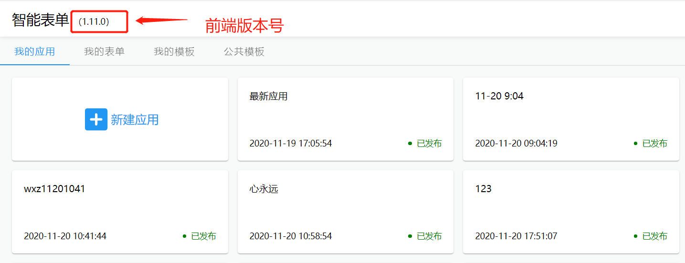
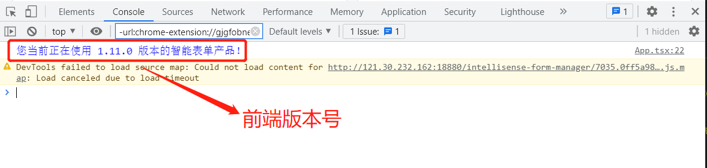

从智能表单 v1.11.0 版本开始，项目组可以查看部署的智能表单产品的版本号。智能表单产品由前后端两部分组成，前后端的版本在小版本可能会不一致。下面分别介绍如何查看各端版本号。

## 查看前端版本号

打开表单设计器首页，在页面的左上角显示了前端版本号：



或者打开浏览器的控制台，控制台会有当前版本号，如下所示：



## 查看后端版本号

在浏览器打开下面的链接，即可查看后端版本号：

```http
GET http://[智能表单服务的地址]/apis/intellisense-form/app-config
```

返回如下信息：

```json {2}
{
  "version": "1.11.0",
  "disableMobile": false,
  "disableDashboard": false,
  "disableApplication": false,
  "disableFlowForm": false,
  "disableResourceSync": false,
  "disableRole": false,
  "disableDept": false,
  "disableApplicationRole": false,
  "enableAuthInterceptor": false,
  "workflowDesignServerUri": "192.168.80.142:8080",
  "workflowServerUri": "192.168.80.142:18003",
  "uiasServerUri": "192.168.80.142:18001",
  "buildInfo": {
    "group": "com.sinosoft",
    "artifact": "intellisenseform-core",
    "name": "intellisenseform-core",
    "version": "1.11.0",
    "time": "2021-08-13T07:55:48.005Z"
  }
}
```

其中 `version` 就是后端的版本号。

在启动后端项目时，项目启动日志中也会出现产品版本号，如下所示（搜索“智能表单”可快速定位到日志中的位置）：

```log {43}
  .   ____          _            __ _ _
 /\\ / ___'_ __ _ _(_)_ __  __ _ \ \ \ \
( ( )\___ | '_ | '_| | '_ \/ _` | \ \ \ \
 \\/  ___)| |_)| | | | | || (_| |  ) ) ) )
  '  |____| .__|_| |_|_| |_\__, | / / / /
 =========|_|==============|___/=/_/_/_/
 :: Spring Boot ::        (v2.1.9.RELEASE)

2021-08-13 16:23:49.813  INFO 12456 --- [           main] com.sinosoft.bff.BffApplication          : Starting BffApplication on DESKTOP-JKNGAKO with PID 12456 (D:\workspaces\sino-intellisense-form-java\intellisenseform-bff\target\classes started by jacki in D:\workspaces\sino-intellisense-form-java)
2021-08-13 16:23:49.819  INFO 12456 --- [           main] com.sinosoft.bff.BffApplication          : The following profiles are active: dev
2021-08-13 16:23:51.839  INFO 12456 --- [           main] .s.d.r.c.RepositoryConfigurationDelegate : Multiple Spring Data modules found, entering strict repository configuration mode!
2021-08-13 16:23:51.840  INFO 12456 --- [           main] .s.d.r.c.RepositoryConfigurationDelegate : Bootstrapping Spring Data repositories in DEFAULT mode.
2021-08-13 16:23:52.021  INFO 12456 --- [           main] .s.d.r.c.RepositoryConfigurationDelegate : Finished Spring Data repository scanning in 169ms. Found 19 repository interfaces.
2021-08-13 16:23:52.503  INFO 12456 --- [           main] .s.d.r.c.RepositoryConfigurationDelegate : Multiple Spring Data modules found, entering strict repository configuration mode!
2021-08-13 16:23:52.503  INFO 12456 --- [           main] .s.d.r.c.RepositoryConfigurationDelegate : Bootstrapping Spring Data repositories in DEFAULT mode.
2021-08-13 16:23:52.566  INFO 12456 --- [           main] .s.d.r.c.RepositoryConfigurationDelegate : Finished Spring Data repository scanning in 63ms. Found 0 repository interfaces.
2021-08-13 16:23:53.065  INFO 12456 --- [           main] ptablePropertiesBeanFactoryPostProcessor : Post-processing PropertySource instances
2021-08-13 16:23:53.126  INFO 12456 --- [           main] c.u.j.EncryptablePropertySourceConverter : Converting PropertySource configurationProperties [org.springframework.boot.context.properties.source.ConfigurationPropertySourcesPropertySource] to AOP Proxy
2021-08-13 16:23:53.127  INFO 12456 --- [           main] c.u.j.EncryptablePropertySourceConverter : Converting PropertySource servletConfigInitParams [org.springframework.core.env.PropertySource$StubPropertySource] to EncryptablePropertySourceWrapper
2021-08-13 16:23:53.128  INFO 12456 --- [           main] c.u.j.EncryptablePropertySourceConverter : Converting PropertySource servletContextInitParams [org.springframework.core.env.PropertySource$StubPropertySource] to EncryptablePropertySourceWrapper
2021-08-13 16:23:53.128  INFO 12456 --- [           main] c.u.j.EncryptablePropertySourceConverter : Converting PropertySource systemProperties [org.springframework.core.env.PropertiesPropertySource] to EncryptableMapPropertySourceWrapper
2021-08-13 16:23:53.130  INFO 12456 --- [           main] c.u.j.EncryptablePropertySourceConverter : Converting PropertySource systemEnvironment [org.springframework.boot.env.SystemEnvironmentPropertySourceEnvironmentPostProcessor$OriginAwareSystemEnvironmentPropertySource] to EncryptableSystemEnvironmentPropertySourceWrapper
2021-08-13 16:23:53.130  INFO 12456 --- [           main] c.u.j.EncryptablePropertySourceConverter : Converting PropertySource random [org.springframework.boot.env.RandomValuePropertySource] to EncryptablePropertySourceWrapper
2021-08-13 16:23:53.130  INFO 12456 --- [           main] c.u.j.EncryptablePropertySourceConverter : Converting PropertySource applicationConfig: [classpath:/application-dev.yml] [org.springframework.boot.env.OriginTrackedMapPropertySource] to EncryptableMapPropertySourceWrapper
2021-08-13 16:23:53.130  INFO 12456 --- [           main] c.u.j.EncryptablePropertySourceConverter : Converting PropertySource applicationConfig: [classpath:/application.yml] [org.springframework.boot.env.OriginTrackedMapPropertySource] to EncryptableMapPropertySourceWrapper
2021-08-13 16:23:53.261  INFO 12456 --- [           main] c.u.j.filter.DefaultLazyPropertyFilter   : Property Filter custom Bean not found with name 'encryptablePropertyFilter'. Initializing Default Property Filter
2021-08-13 16:23:53.455  INFO 12456 --- [           main] trationDelegate$BeanPostProcessorChecker : Bean 'org.springframework.transaction.annotation.ProxyTransactionManagementConfiguration' of type [org.springframework.transaction.annotation.ProxyTransactionManagementConfiguration$$EnhancerBySpringCGLIB$$92640269] is not eligible for getting processed by all BeanPostProcessors (for example: not eligible for auto-proxying)
2021-08-13 16:23:53.788  INFO 12456 --- [           main] c.u.j.r.DefaultLazyPropertyResolver      : Property Resolver custom Bean not found with name 'encryptablePropertyResolver'. Initializing Default Property Resolver
2021-08-13 16:23:53.791  INFO 12456 --- [           main] c.u.j.d.DefaultLazyPropertyDetector      : Property Detector custom Bean not found with name 'encryptablePropertyDetector'. Initializing Default Property Detector
2021-08-13 16:23:54.247  INFO 12456 --- [           main] o.s.b.w.embedded.tomcat.TomcatWebServer  : Tomcat initialized with port(s): 8080 (http)
2021-08-13 16:23:54.294  INFO 12456 --- [           main] o.apache.catalina.core.StandardService   : Starting service [Tomcat]
2021-08-13 16:23:54.294  INFO 12456 --- [           main] org.apache.catalina.core.StandardEngine  : Starting Servlet engine: [Apache Tomcat/9.0.26]
2021-08-13 16:23:54.596  INFO 12456 --- [           main] o.a.c.c.C.[Tomcat].[localhost].[/]       : Initializing Spring embedded WebApplicationContext
2021-08-13 16:23:54.596  INFO 12456 --- [           main] o.s.web.context.ContextLoader            : Root WebApplicationContext: initialization completed in 4683 ms
2021-08-13 16:23:56.588  INFO 12456 --- [           main] org.mongodb.driver.cluster               : Cluster created with settings {hosts=[192.168.80.142:27017], mode=SINGLE, requiredClusterType=UNKNOWN, serverSelectionTimeout='30000 ms', maxWaitQueueSize=500}
2021-08-13 16:23:56.886  WARN 12456 --- [           main] o.s.data.convert.CustomConversions       : Registering converter from class java.time.LocalDateTime to class java.time.Instant as reading converter although it doesn't convert from a store-supported type! You might wanna check you annotation setup at the converter implementation.
2021-08-13 16:23:56.886  WARN 12456 --- [           main] o.s.data.convert.CustomConversions       : Registering converter from class java.time.Instant to class java.time.LocalDateTime as reading converter although it doesn't convert from a store-supported type! You might wanna check you annotation setup at the converter implementation.
2021-08-13 16:23:56.895  WARN 12456 --- [           main] o.s.data.convert.CustomConversions       : Registering converter from class java.time.LocalDateTime to class java.time.Instant as reading converter although it doesn't convert from a store-supported type! You might wanna check you annotation setup at the converter implementation.
2021-08-13 16:23:56.895  WARN 12456 --- [           main] o.s.data.convert.CustomConversions       : Registering converter from class java.time.Instant to class java.time.LocalDateTime as reading converter although it doesn't convert from a store-supported type! You might wanna check you annotation setup at the converter implementation.


智能表单 1.11.0


2021-08-13 16:23:57.950  INFO 12456 --- [           main] m.c.i.MongoPersistentEntityIndexResolver : Found cycle for field '_id' in type 'FormMenu' for path 'resources -> resources'
2021-08-13 16:23:57.951  INFO 12456 --- [           main] m.c.i.MongoPersistentEntityIndexResolver : Found cycle for field 'resources' in type 'FormMenu' for path 'resources -> resources'
2021-08-13 16:23:58.051  INFO 12456 --- [           main] m.c.i.MongoPersistentEntityIndexResolver : Found cycle for field '_id' in type 'ApplicationResourceModel' for path 'children -> children'
```
