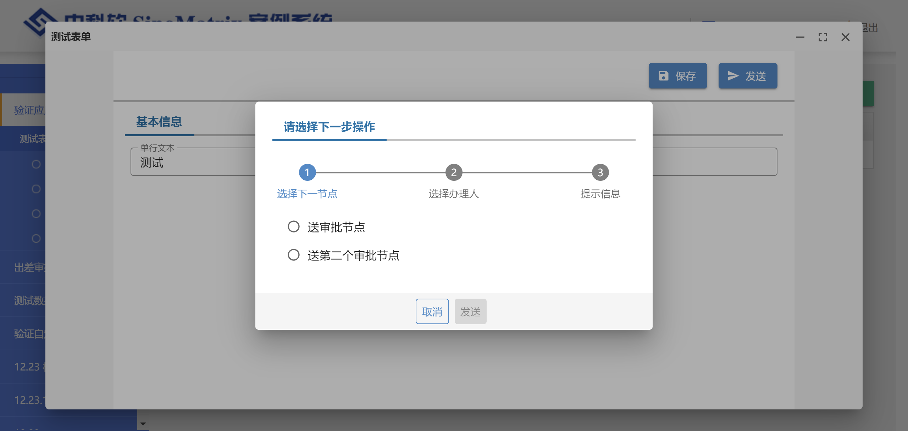
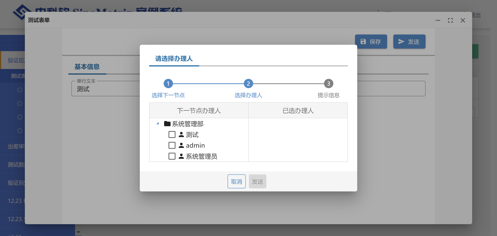
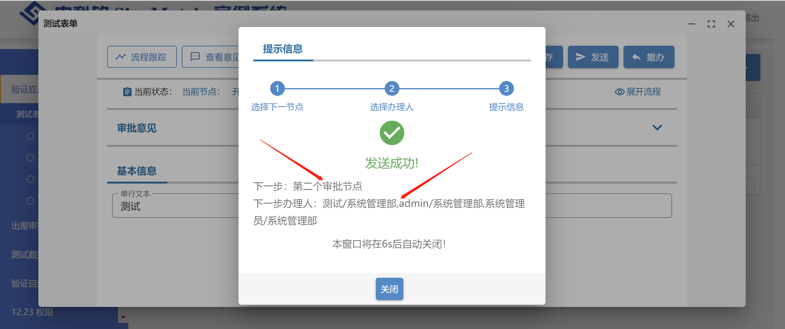

import Tabs from "@theme/Tabs";
import TabItem from "@theme/TabItem";
import JSONViewer from "@/components/json-viewer";

智能表单默认与 sinomatrix 平台的工作流引擎交互，完成流程配置和流转的功能。我们可以通过本页介绍的配置项定义与工作流引擎交互的行为。

## sinoform.workflow-server-uri 配置项

`sinoform.workflow-server-uri` 配置项用来定义工作流引擎服务地址（`sino-matrix-workflow`），如下所示：

```yaml title="application-dev.yml"
sinoform:
  workflow-server-uri: 127.0.0.1:18003
```

## sinoform.workflow-design-server-uri 配置项

`sinoform.workflow-design-server-uri` 配置项用来定义 sinomatrix 中工作流设计器服务地址（`sino-matrix-workflow-design`），如下所示：

```yaml title="application-dev.yml"
sinoform:
  workflow-design-server-uri: 127.0.0.1:8080
```

## url.sync-workflow-items-url 配置项

`url.sync-workflow-items-url` 配置项用来定义业务实现的接受流程待办和已办数据的扩展接口链接，如下所示：

```yaml title="application-dev.yml"
url:
  sync-workflow-items-url: http://192.168.90.110:19001/custom-sync-workflow-items
```

:::info 何时使用此配置项

当您遇到以下情况时，需要使用配置项：

- 用户从业务系统中看到的待办、已办不是从工作流引擎中读取的
- 门户不是中科软的产品，需要将待办数据及时同步到第三方门户中去

:::

### 扩展接口约定

此扩展接口需要遵循以下接口约定：

```http
POST [接收待办、已办数据的扩展链接，您可以自行设计链接路径，如http://192.168.90.110:19001/custom-sync-workflow-items]
```

请求体是 `application/json` 格式的，示例数据如下：

```json
{
  "read": ["删除已办的SQL语句", "新增已办的SQL语句"],
  "write": ["删除待办的SQL语句", "新增待办的SQL语句"],
  "formId": "表单id",
  "appId": "应用id",
  "formDesignId": "表单设计id"
}
```

其中 `read` 和 `write` 字段的值是来自工作流引擎在提交流程时返回的同步待办和已办的 SQL 语句（由零个或者一个删除 SQL 语句和多个新增 SQL 语句组成），`read` 字段值是用来同步已办数据的 SQL，`write` 字段值是用来同步待办数据的 SQL。

SQL 示例如下：

<Tabs defaultValue="deleteRead"
  values={[
    { label: "删除已办", value: "deleteRead" },
    { label: "新增已办", value: "insertRead" },
    { label: "删除待办", value: "deleteWrite"},
    { label: "新增待办", value: "insertWrite"}
  ]}>
<TabItem value="deleteRead">

```sql title="删除已办的SQL语句"
delete from
  FLOW_READ
where
  FILETYPEID = '3396254c845548bdbbd1cd55973ac6f5'
  and DEPTID = '18043'
  and USERID = '1'
  and RECORDID = '619b8f49ec2ee8ac2f5b32ef';
```

</TabItem>
<TabItem value="insertRead">

```sql title="新增已办的SQL语句"
insert into
  FLOW_READ (
    HANDDONEURL,
    SYS_ID,
    CREATETIME,
    FILETYPEID,
    SUPERWORKFLOW,
    ACCFLAG,
    DEPTNAME,
    USERID,
    ID,
    READFLAG,
    WORKFLOWID,
    SUPERFILETYPE,
    GIVEACCUSER,
    DOCID,
    W_BACKUP,
    STATTAG,
    DRAFTUSER,
    WORKFLOWNAME,
    SORTID,
    FILETYPENAME,
    DRAFTDEPT,
    ACCINFO,
    USERNAME,
    ATTR,
    ATTR2,
    READTIME,
    ATTR1,
    BACKUP1,
    FORMURL,
    TITLE,
    UNIQUEID,
    DEPTID,
    RECORDID,
    PARA,
    LOGID,
    ORGANISEID,
    ACCDEPTID
  )
values
  (
    '',
    '67250',
    '2021-12-10 08:33:53',
    '3396254c845548bdbbd1cd55973ac6f5',
    '',
    '',
    '系统管理部',
    '1',
    'ca9a13f16b26439b9fab8fc0bcc380c4',
    '1',
    '3396254c845548bdbbd1cd55973ac6f5',
    '',
    '',
    '619b8f49ec2ee8ac2f5b32ef',
    '',
    '1',
    '1',
    '测试办结时间和起草部门名',
    '4f96523e1dc04339b8ed432effc76b3e',
    '测试办结时间和起草部门名',
    '18043',
    '',
    'admin',
    'intellisenseForm',
    '',
    '2021-12-10 08:33:53',
    '',
    'c49bbb22c698423eb7874e479aad9ee7',
    '619b32c3c9327f42e98a1882',
    '456456456456456456456',
    '4f96523e1dc04339b8ed432effc76b3e',
    '18043',
    '619b8f49ec2ee8ac2f5b32ef',
    '',
    '46aef7122a6d4dddb5c34a35173ad82d',
    '18043',
    ''
  );
```

</TabItem>
<TabItem value="deleteWrite">

```sql title="删除待办的SQL语句"
delete from
  FLOW_WRITE
where
  WORKFLOWINFOID = 'c49bbb22c698423eb7874e479aad9ee7';
```

</TabItem>
<TabItem value="insertWrite">

```sql title="新增待办的SQL语句"
insert into
  FLOW_WRITE(
    SYS_ID,
    PREUSERNAME,
    PREWFLEVELID,
    CREATETIME,
    FILETYPEID,
    WAITDOURL,
    WFLEVEID,
    PREUSERID,
    WFLEVENAME,
    SIGNTIME,
    LIMITTIME,
    SUPERWORKFLOW,
    DRAFTUSERNAME,
    PREORGANISEID,
    ACCFLAG,
    DEPTNAME,
    PREDEPTID,
    WORKFLOWINFOID,
    USERID,
    ID,
    WORKFLOWID,
    SUPERFILETYPE,
    GIVEACCUSER,
    PREWFLEVENAME,
    DOCID,
    W_BACKUP,
    STATTAG,
    OPSTATE,
    DRAFTUSER,
    WORKFLOWNAME,
    SORTID,
    FILETYPENAME,
    DRAFTDEPT,
    DRAFTWFLEVEID,
    ACCINFO,
    USERNAME,
    ATTR,
    ATTR2,
    BACKUP2,
    ATTR1,
    BACKUP1,
    FORMURL,
    TITLE,
    DEPTID,
    RECORDID,
    SIGNTAG,
    PREDEPTNAME,
    PARA,
    LOGID,
    ORGANISEID,
    ACCDEPTID,
    RECEIVETIME,
    DRAFTDEPTNAME
  )
values
(
    '67250',
    'admin',
    '63d85a21-d42f-4640-bc55-63e2aaf96378',
    '2021-12-10 08:33:53',
    '3396254c845548bdbbd1cd55973ac6f5',
    '/intellisense-form/619b32c3c9327f42e98a1882/todo',
    'a272b4b1-470f-468e-a229-7d8675a08ec7',
    '1',
    '审批节点',
    '',
    '',
    '',
    'admin',
    '18043',
    '0',
    '公文处/金融保险部/演示部门',
    '18043',
    'c49bbb22c698423eb7874e479aad9ee7',
    '4028d00e6f16845c016f79dda0c20231',
    '4f8d967525d744a08db02a3c00ab3234',
    '3396254c845548bdbbd1cd55973ac6f5',
    '',
    '',
    '开始节点',
    '619b8f49ec2ee8ac2f5b32ef',
    '',
    '1',
    '0',
    '1',
    '测试办结时间和起草部门名',
    '4f96523e1dc04339b8ed432effc76b3e',
    '测试办结时间和起草部门名',
    '18043',
    '63d85a21-d42f-4640-bc55-63e2aaf96378',
    '',
    '汪芳',
    'intellisenseForm',
    '',
    '',
    '',
    '',
    '619b32c3c9327f42e98a1882',
    '456456456456456456456',
    '4028d00e6ec96438016ec97b4b10000b',
    '619b8f49ec2ee8ac2f5b32ef',
    '0',
    '系统管理部',
    '',
    'b7a9b0fa987649b5aac3ca600069a5b4',
    '4028d00e6ec42073016ec4629a490001',
    '',
    '2021-12-10 08:33:53',
    '系统管理部'
  );
```

</TabItem>
</Tabs>

您可以通过解析 SQL 语句，知晓待办和已办发生的变化，从而同步到您的业务系统中去。

新增已办 SQL 中的关键字段说明：

| 字段名        | 示意值                           | 含义                    |
| ------------- | -------------------------------- | ----------------------- |
| ID            | ca9a13f16b26439b9fab8fc0bcc380c4 | 已办主键 ID             |
| TITLE         | 456456456456456456456            | 标题                    |
| FILETYPEID    | 3396254c845548bdbbd1cd55973ac6f5 | 流程 ID                 |
| FILETYPENAME  | 测试办结时间和起草部门名         | 流程名称                |
| WORKFLOWID    | 3396254c845548bdbbd1cd55973ac6f5 | 流程唯一 ID             |
| WORKFLOWNAME  | 测试办结时间和起草部门名         | 流程名称+版本名称       |
| RECORDID      | 619b8f49ec2ee8ac2f5b32ef         | 流转 ID                 |
| CREATETIME    | 2021-12-10 08:33:53              | 启动时间                |
| USERID        | 1                                | 办理人用户 ID           |
| DEPTID        | 18043                            | 办理人所在的部门 ID     |
| ORGANISEID    | 18043                            | 办理人所在的组织体系 ID |
| READTIME      | 2021-12-10 08:33:53              | 办理时间                |
| READFLAG      | 1                                | 办理标志                |
| UNIQUEID      | 4f96523e1dc04339b8ed432effc76b3e | 全局流转唯一 ID         |
| PARA          |                                  | 业务属性值的集合        |
| DRAFTDEPT     | 18043                            | 拟稿人所在的部门 ID     |
| DRAFTUSER     | 1                                | 拟稿人的用户 ID         |
| STATTAG       | 1                                | 状态标识                |
| HANDDONEURL   |                                  | 已办 URL                |
| DOCID         | 619b8f49ec2ee8ac2f5b32ef         | 业务记录主键值          |
| FORMURL       | 619b32c3c9327f42e98a1882         | 表单 ID                 |
| SORTID        | 4f96523e1dc04339b8ed432effc76b3e | 流程分类 ID             |
| SUPERFILETYPE |                                  | 父流程 ID               |
| SYS_ID        | 67250                            | 系统                    |
| ACCINFO       |                                  | 待办授权信息            |
| GIVEACCUSER   |                                  | 授权人用 户 ID          |
| ACCDEPTID     |                                  | 被授权人所在部门 ID     |
| ACCFLAG       |                                  | 是否授权                |
| USERNAME      | admin                            | 办理人用户名称          |
| DEPTNAME      | 系统管理部                       | 办理人部门名称          |
| ATTR          | intellisenseForm                 | 业务属性                |
| LOGID         | 46aef7122a6d4dddb5c34a35173ad82d | 日志 ID                 |

新增待办 SQL 中的关键字段说明：

| 字段名             | 示意值                                           | 含义                                                              |
| ------------------ | ------------------------------------------------ | ----------------------------------------------------------------- |
| ID                 | 4f8d967525d744a08db02a3c00ab3234                 | 主键 ID 值                                                        |
| WORKFLOWINFOID     | c49bbb22c698423eb7874e479aad9ee7                 | 关联的流转实例 ID                                                 |
| TITLE              | 456456456456456456456                            | 标题                                                              |
| RECORDID           | 619b8f49ec2ee8ac2f5b32ef                         | 流转 ID                                                           |
| FILETYPEID         | 3396254c845548bdbbd1cd55973ac6f5                 | 流程 ID                                                           |
| FILETYPENAME       | 测试办结时间和起草部门名                         | 流程名称                                                          |
| WORKFLOWID         | 3396254c845548bdbbd1cd55973ac6f5                 | 流程唯一 ID                                                       |
| WORKFLOWNAME       | 测试办结时间和起草部门名                         | 流程名称+版本名称                                                 |
| USERID             | 4028d00e6f16845c016f79dda0c20231                 | 参与者用户 ID                                                     |
| DEPTID             | 4028d00e6ec96438016ec97b4b10000b                 | 参与者所在的部门 ID                                               |
| ORGANISEID         | 4028d00e6ec42073016ec4629a490001                 | 参与者所在的组织体系 ID                                           |
| RECEIVETIME        | 2021-12-10 08:33:53                              | 接收时间                                                          |
| SIGNTIME           |                                                  | 签收时间                                                          |
| SIGNTAG            | 0                                                | 签收标志 1-签收 0-未签收                                          |
| LIMITTIME          |                                                  | 待办逾期时间                                                      |
| PREUSERID          | 1                                                | 前继参与者用户 ID                                                 |
| PREDEPTID          | 18043                                            | 前继参与者所在部门 ID                                             |
| PREORGANISEID      | 18043                                            | 前继参与者所在组织体系 ID                                         |
| CREATETIME         | 2021-12-10 08:33:53                              | 启动时间                                                          |
| PARA               |                                                  | 业务数据 格式：变量名=值, 变量名=值                               |
| DRAFTUSER          | 1                                                | 拟稿人用户 ID                                                     |
| DRAFTDEPT          | 18043                                            | 拟稿人所在部门 ID                                                 |
| ACCDEPTID          |                                                  | 被授权人所在部门 ID                                               |
| ACCINFO            |                                                  | 授权描述信息                                                      |
| GIVEACCUSER        |                                                  | 授权人用户 ID                                                     |
| WFLEVEID           | a272b4b1-470f-468e-a229-7d8675a08ec7             | 当前待办节点 ID                                                   |
| STATTAG            | 1                                                | 状态标识 1-在办 0-撤办                                            |
| PREWFLEVELID       | 63d85a21-d42f-4640-bc55-63e2aaf96378             | 前继办理节点 ID                                                   |
| SUPERFILETYPE      |                                                  | 父流程 ID                                                         |
| ACCFLAG            | 0                                                | 是否代办授权标志 1-授权 0-未授权                                  |
| ATTR               | intellisenseForm                                 | 业务属性 存放缓急、密级等业务属性。出待办列表可以按此业务属性排序 |
| ATTR1              |                                                  | 业务属性 1                                                        |
| ATTR2              |                                                  | 业务属性 2                                                        |
| FORMURL            | 619b32c3c9327f42e98a1882                         | 表单 ID                                                           |
| LOGID              | b7a9b0fa987649b5aac3ca600069a5b4                 | 关联的日志 ID                                                     |
| WAITDOURL          | /intellisense-form/619b32c3c9327f42e98a1882/todo | 待办 URL                                                          |
| DOCID              | 619b8f49ec2ee8ac2f5b32ef                         | 业务记录主键 ID 值                                                |
| SUPERWORKFLOW      |                                                  | 父流程唯一 ID                                                     |
| SORTID             | 4f96523e1dc04339b8ed432effc76b3e                 | 全局流转的唯一 ID                                                 |
| WORKFLOWINFOID_INT |                                                  | 主键的整型值（只有为数字串，此字段才会有值）                      |
| OPSTATE            | 0                                                | 路由状态                                                          |
| USERNAME           | 汪芳                                             | 当前待办人的用户名                                                |
| DEPTNAME           | 公文处/金融保险部/演示部门                       | 当前待办人所在部门名称                                            |
| SYS_ID             | 67250                                            | 应用系统 id                                                       |
| PREUSERNAME        | admin                                            | 前继办理用户名                                                    |
| WFLEVENAME         | 审批节点                                         | 当前待办节点名                                                    |
| DRAFTUSERNAME      | admin                                            | 起草人                                                            |
| DRAFTDEPTNAME      | 系统管理部                                       | 起草人所在部门名称                                                |
| PREWFLEVENAME      | 开始节点                                         | 前继办理节点名                                                    |
| PREDEPTNAME        | 系统管理部                                       | 前继办理人所在部门名称                                            |
| DRAFTWFLEVEID      | 63d85a21-d42f-4640-bc55-63e2aaf96378             | 起草节点 ID                                                       |

:::info 推荐

推荐您使用 [jsqlparser](https://github.com/JSQLParser/JSqlParser) 库解析 SQL。

:::

#### 特例：撤办和恢复流程

> v1.12.11

撤办和恢复流程时，发出同步待办已办 SQL 语句是 `UPDATE` 语句，如下所示：

撤办的示例数据：

```json
{
  "read": [
    "update FLOW_READ set STATTAG='0' where RECORDID='61dfe597ec2eb92c3cdd23da'"
  ],
  "write": [
    "update FLOW_WRITE set STATTAG='0' where RECORDID='61dfe597ec2eb92c3cdd23da'"
  ],
  "formId": "表单id",
  "appId": "应用id",
  "formDesignId": "表单设计id"
}
```

恢复流程的示例数据：

```json
{
  "read": [
    "update FLOW_READ set STATTAG='1' where RECORDID='61dfe597ec2eb92c3cdd23da'"
  ],
  "write": [
    "update FLOW_WRITE set STATTAG='1' where RECORDID='61dfe597ec2eb92c3cdd23da'"
  ],
  "formId": "表单id",
  "appId": "应用id",
  "formDesignId": "表单设计id"
}
```

## 智能表单流程流转相关接口定制

智能表单默认与 sinomatrix 工作流引擎集成，而且所有使用到的流程流转相关接口均与 sinomatrix 工作流引擎保持一致。如果要接入第三方工作流引擎，请按照下面的方案，逐个适配并替换相关接口。

### 发送流程

接口：

```http
POST http://<工作流引擎地址>/workflow/outcontrol/doWorkFlowBean
```

可以通过 `url.to-flow-url` 配置项更换为其他流程引擎的接口：

```yaml title="application.yml"
url:
  # 发送流程的接口
  to-flow-url: /custom-send-workflow
```

此接口要求完成以下工作：

- 在流程初始提交时，能够启动流程
- 如果流程提交时，下一步有多个路由，则返回选择路由的响应
- 如果选择路由后，路由对应的节点上有多个办理人，则返回选择候选人的响应
- 需要通过响应告知提交成功与否，以及失败的原因
- 在流转中的流程实例，可以通过流程待办事项 id 来发送流程

接下来讲解 sinomatrix 工作流关于流程提交接口请求和响应的设计。

#### 提交流程阶段

sinomatrix 工作流引擎将流程提交分解成以下四阶段：

- 选择流程启动节点
- 选择下一个路由（即连接流程节点间的线）
- 选择下一个节点的流程接收者
- 流程流程到指定节点的接收者

工作流引擎要求在请求中通过 `flag` 字段告知期望进入哪个阶段，然后工作流引擎会根据流程设计判断进入的阶段。

注意：期望进入的阶段跟流程发送真正进入的阶段会有区别。例如，我们启动流程时，通过 `flag = selectoption` 告知工作流期望进入 `选择流程启动节点` 阶段，但是工作流引擎根据流程设计判断只有一个流程启动节点，则会跳过 `选择流程启动节点` 阶段，而是进入 `选择下一个路由` 阶段的判定，如果它根据流程设计判断只有一个路由，则会跳过此阶段，进入 `选择下一个节点的流程接收者` 阶段的判定，但是如果有多个路由，则会直接返回响应，告知客户端需要选择路由。以此类推，直至最后阶段。

所有阶段的交互接口都是统一的 `/outcontrol/doWorkFlowBean`，只是各阶段的请求和响应数据稍有不同。下面一一讲解。

#### 启动流程

对于 sinomatrix 工作流引擎来说，启动流程就是要告知引擎进入 `选择流程启动节点` 阶段。启动流程请求体（`application/json`）如下：

```json
{
  "flag": "selectoption",
  "title": "待办标题",
  "userid": "提交人id",
  "deptid": "提交人部门id",
  "filetypeid": "流程id",
  "workflowid": "流程id",
  "recordid": "业务数据id",
  "attr": "intellisenseForm",
  "forcestart": 1,
  "sysid": "67250"
}
```

属性说明：

| 属性       | 说明                                                                                                                                                                                                                                                                                                                                    |
| ---------- | --------------------------------------------------------------------------------------------------------------------------------------------------------------------------------------------------------------------------------------------------------------------------------------------------------------------------------------- |
| flag       | **启动流程时，`flag` 必须是 `selectoption`。**表示期望进入 `选择流程启动节点` 阶段。详情请见[flag](#flag)章节。                                                                                                                                                                                                                         |
| title      | 待办事项的标题                                                                                                                                                                                                                                                                                                                          |
| userid     | 提交流程人员的 id                                                                                                                                                                                                                                                                                                                       |
| deptid     | 提交流程人员的部门 id                                                                                                                                                                                                                                                                                                                   |
| filetypeid | 工作流 id                                                                                                                                                                                                                                                                                                                               |
| workflowid | 工作流 id。之所以出现两个工作流 id 字段，是因为工作流引擎支持一种流程可以有多个流程设计，例如发文流程可以包含局级、司级、处级、子公司等不同的流程设计，此时 `workflowid` 代表的是公文流程，而 `filetypeid` 代表的是各个不同流程设计的 id。智能表单自行管理同一个表单多个流程，所以在智能表单中，`workflowid` 和 `filetypeid` 是一致的。 |
| recordid   | 业务数据 id。在智能表单中，就是表单数据的 id。                                                                                                                                                                                                                                                                                          |
| attr       | 传入固定的值 `intellisenseForm`。表示来自智能表单的流程提交。                                                                                                                                                                                                                                                                           |
| forcestart | 为 `1` 时表示流程引擎应跳过流程启动节点的候选人范围验证，就算当前用户不属于流程启动节点的候选人，也可以启动流程。智能表单不需要流程引擎管理流程启动节点候选人范围，且会出现启动流程的权限与启动节点候选人范围规则不一致的情况，所以将 `forcestart` 设置为 `1`。                                                                         |
| sysid      | 表单所属子系统的 id。只对 sinomatrix 平台有用。其他工作流引擎可以忽略。通过 [configs.systemId 配置项](#configssystemid-配置项)可以定制。                                                                                                                                                                                                |

提交此请求后，工作流引擎会根据真实进入的下一阶段返回不同的响应。请参见下面不同阶段的描述。

#### flag

请求中的 flag 表示的期望如下表所示：

| 请求中的 flag 值 | 期望说明                                                                                                                                                             |
| ---------------- | -------------------------------------------------------------------------------------------------------------------------------------------------------------------- |
| selectoption     | **启动流程时，`flag` 必须是 `selectoption`。**表示期望进入选择流程启动节点阶段。由于智能表单的流程设计只能有一个流程启动节点，所以不会出现弹窗显示选择流程启动节点。 |
| selectoperate    | 表示期望进入选择路由阶段。                                                                                                                                           |
| selectdept       | 表示期望进入接收者选择阶段。                                                                                                                                         |
| flowinstance     | 表示期望进入流程流程到指定节点的接收者阶段。                                                                                                                         |

响应中的 flag 表示的当前已经完成哪些阶段，下一阶段是什么，或者最终提交成功与否：

| 响应中的 flag 值 | 状态说明                                                                                                                      |
| ---------------- | ----------------------------------------------------------------------------------------------------------------------------- |
| selectoperate    | 表示需要用户选择流程启动节点，选择后客户端以 `flag = selectoperate` 提交，提交后将进入选择路由阶段。                          |
| selectdept       | 表示需要用户选择路由，选择后客户端以 `flag = selectdept` 提交，提交后将进入选择选择接收者阶段。                               |
| flowinstance     | 表示需要用户选择接收者，选择后客户端以 `flag = flowinstance` 提交，提交后将进入最终提交的阶段，即流程流程到指定节点的接收者。 |
| 1                | 表示流程发送成功。                                                                                                            |
| 0                | 表示流程发送失败。                                                                                                            |

有两个特征需要注意：

- 流程引擎应判断是否有必要出现中间阶段，例如只有一个流程启动节点、一个流程路由或者一个候选人时，则分别跳过 `选择流程启动节点`、`选择下一个路由`、`选择下一个节点的流程接收者` 阶段。
- 响应中返回的 `flag` 代表的是用户做完相关选择（启动节点选择、流程路由选择、候选人选择等）后将进入的下一个阶段的名称，所以客户端在实现流程提交相关弹窗点击确定按钮再次提交流程时，直接从之前发送流程的响应中拿到 `flag` 作为请求的 `flag` 即可。

#### 阶段一：选择流程启动节点

:::tip 第三方流程引擎对接提示

智能表单中的流程只有一个启动节点，所以第三方流程引擎可以跳过此阶段的对接。

:::

:::tip sinomatrix 工作流引擎集成者提示

大部分情况下是不应该让用户选择启动节点的。如果流程有多个启动节点，应该根据业务规则，自动为用户选择好启动节点。

:::

从 [flag](#flag) 章节的描述得知，如果流程提交接口返回的响应的 `flag` 是 `selectoperate`，则表示需要显示选择流程启动节点的弹窗，让用户选择。这样的响应数据结构如下所示：

```json {2,14-27} title="响应对象"
{
  "flag": "selectoperate",
  "userid": "发送者id",
  "deptid": "发送者部门id",
  "docid": "业务数据id，对应流程提交中的 recordid",
  "recordid": "业务数据id",
  "endFlag": "0",
  "filetypeid": "流程id",
  "workflowid": "流程id",
  "forcestart": "1",
  "sysid": "67250",
  "title": "待办标题",
  "size": 3,
  "node": [
    {
      "wfleveId": "node1",
      "wfleveName": "启动节点1"
    },
    {
      "wfleveId": "node2",
      "wfleveName": "启动节点2"
    },
    {
      "wfleveId": "node3",
      "wfleveName": "启动节点3"
    }
  ]
}
```

首先介绍响应中最重要的三个属性，即：

| 属性名 | 说明                                                                                     |
| ------ | ---------------------------------------------------------------------------------------- |
| flag   | 值为 `selectoperate`，表示需要选择启动节点。详见 [flag](#flag) 章节。                    |
| node   | 表示需要用户选择的启动节点清单。其中 `wfleveId` 表示节点 id，`wfleveName` 表示节点名称。 |
| size   | 表示启动节点个数。                                                                       |

客户端需要根据 `node` 展示出可以选择的启动节点界面，用户做出选择后，应将选择的节点数据放在请求中再次提交流程。例如用户选择了 `启动节点1`，则再次发送流程的请求数据如下：

```json {2,14-19} title="请求对象"
{
  "flag": "selectoperate",
  "userid": "发送者id",
  "deptid": "发送者部门id",
  "docid": "业务数据id，对应流程提交中的 recordid",
  "recordid": "业务数据id",
  "endFlag": "0",
  "filetypeid": "流程id",
  "workflowid": "流程id",
  "forcestart": "1",
  "sysid": "67250",
  "title": "待办标题",
  "size": 3,
  "node": [
    {
      "wfleveId": "node1",
      "wfleveName": "启动节点1"
    }
  ]
}
```

:::tip 第一阶段再次发送流程的请求构建技巧（针对 sinomatrix 工作流引擎集成）

仔细对比示例的响应和请求，你就会发现构建请求对象的技巧：

- 将响应对象复制一份作为请求对象
- 改变请求对象的 `node` 属性的值，只放入被用户选择的流程启动节点对象

后续阶段的再次发送流程的请求对象构建基本上可以套用此技巧，有特别的地方会单独做强调说明。

:::

#### 阶段二：选择下一个路由

如果流程提交接口返回的响应的 `flag` 是 `selectdept`，则表示需要显示选择流程路由的弹窗，让用户选择。如下图所示：



:::note 提示

图片中的选择下一节点即为 `选择下一个路由` 阶段。对于终端用户来说，描述为 `选择下一个节点`更容易被理解。

:::

响应数据结构如下所示：

```json title="响应对象" {2,15,17-18,31-32}
{
  "flag": "selectdept",
  "userid": "发送者id",
  "deptid": "发送者部门id",
  "docid": "业务数据id，对应流程提交中的 recordid",
  "recordid": "业务数据id",
  "endFlag": "0",
  "filetypeid": "流程id",
  "workflowid": "流程id",
  "forcestart": "1",
  "sysid": "67250",
  "title": "待办标题",
  "wfleveid": "启动节点id",
  "size": 2,
  "node": [
    {
      "id": "385f1674-075c-4937-856f-96bab46a7c6c",
      "name": "送审批节点",
      "fileTypeId": "c885b4ad264d428387e8188727f8d22b",
      "wfleveId": "1cb67de0-317f-4ac5-b359-c811e9d94a4e",
      "nextWfleveId": "c2d2ea8f-a12b-452d-b658-914b0e475c0c",
      "nextWfleveType": "3",
      "disabled": false,
      "ismucheck": "7",
      "opCond": "",
      "memo": "",
      "isSelect": "true",
      "isMuch": "false"
    },
    {
      "id": "0688632c-ff6a-4a7f-81b7-c69a7b97477f",
      "name": "送第二个审批节点",
      "wfleveId": "1cb67de0-317f-4ac5-b359-c811e9d94a4e",
      "fileTypeId": "c885b4ad264d428387e8188727f8d22b",
      "nextWfleveId": "9b2bca6a-2387-44ea-bc77-c8a56602f3e8",
      "nextWfleveType": "3",
      "disabled": false,
      "opCond": "",
      "memo": "",
      "isSelect": "true",
      "isMuch": "false"
    }
  ]
}
```

其中最终重要的三个属性说明如下：

| 属性名 | 说明                                                                                                     |
| ------ | -------------------------------------------------------------------------------------------------------- |
| flag   | 值为 `selectdept`，表示需要用户选择路由。详见 [flag](#flag) 章节。                                       |
| node   | 表示需要用户选择的路由清单。其中 `id` 表示路由 id，`name` 表示路由名称。第三方流程引擎可以忽略其他属性。 |
| size   | 表示路由个数。                                                                                           |

对于 sinomatrix 流程引擎集成者来说，还需要关注 `node` 中的以下属性：

| 属性名   | 说明                                                                                                                      |
| -------- | ------------------------------------------------------------------------------------------------------------------------- |
| isSelect | 为 `"true"` 表示用户可以选择此路由。为 `false` 表示用户不可以选择此路由，但是还需要在页面上展现此路由选项，只是不可选择。 |
| disabled | 如果为 `true`，则表示不应在页面上出现此路由选项。                                                                         |
| isMuch   | 为 `"true"` 表示用户可以同时选择多个路由。默认为 `"false"`。此属性很少使用。                                              |

客户端需要根据 `node` 展示出可以选择的路由清单界面，用户做出选择后，应将选择的路由数据放在请求中再次提交流程。例如用户选择了 `送第二个审批节点` 路由，则再次发送流程的请求数据如下：

```json title="请求对象" {2,15,17-18}
{
  "flag": "selectdept",
  "userid": "发送者id",
  "deptid": "发送者部门id",
  "docid": "业务数据id，对应流程提交中的 recordid",
  "recordid": "业务数据id",
  "endFlag": "0",
  "filetypeid": "流程id",
  "workflowid": "流程id",
  "forcestart": "1",
  "sysid": "67250",
  "title": "待办标题",
  "wfleveid": "启动节点id",
  "size": 2,
  "node": [
    {
      "id": "0688632c-ff6a-4a7f-81b7-c69a7b97477f",
      "name": "送第二个审批节点",
      "wfleveId": "1cb67de0-317f-4ac5-b359-c811e9d94a4e",
      "fileTypeId": "c885b4ad264d428387e8188727f8d22b",
      "nextWfleveId": "9b2bca6a-2387-44ea-bc77-c8a56602f3e8",
      "nextWfleveType": "3",
      "disabled": false,
      "opCond": "",
      "memo": "",
      "isSelect": "true",
      "isMuch": "false"
    }
  ]
}
```

#### 阶段三：选择下一个节点的流程接收者

当发送流程的响应返回的 `flag` 为 `flowinstance`，则表示进入阶段三，需要用户选择流程接收者。如下图所示：



响应数据结构如下所示：（超长数据结构预警）

<JSONViewer
  title="响应对象"
  shouldCollapse={(field) =>
    field.namespace.length === 2 && field.namespace[1] === "node"
  }
  src={{
    flag: "flowinstance",
    userid: "发送者id",
    deptid: "发送者部门id",
    docid: "业务数据id，对应流程提交中的 recordid",
    recordid: "业务数据id",
    endFlag: "0",
    filetypeid: "流程id",
    workflowid: "流程id",
    forcestart: "1",
    sysid: "67250",
    title: "待办标题",
    wfleveid: "启动节点id",
    size: 2,
    node: [
      {
        id: "0688632c-ff6a-4a7f-81b7-c69a7b97477f",
        nextWfleveType: "",
        flag: "",
        method: "",
        memo: "",
        opState: "",
        wfleveId: "1cb67de0-317f-4ac5-b359-c811e9d94a4e",
        fileTypeId: "c885b4ad264d428387e8188727f8d22b",
        type: "1",
        nextWfleveId: "9b2bca6a-2387-44ea-bc77-c8a56602f3e8",
        nextWfleveName: "第二个审批节点",
        opCond: "",
        name: "送第二个审批节点",
        limit: [],
        remind: [
          {
            name: "桌面",
            type: "1",
            selected: "true",
          },
          {
            name: "短信",
            type: "2",
            selected: "false",
          },
          {
            name: "邮件",
            type: "3",
            selected: "false",
          },
        ],
        examinetag: [
          {
            name: "共同办",
            tip: "选择的办理人只要有一个用户办理即可",
            type: "4",
            selected: "true",
          },
          {
            name: "同时办",
            tip: "选择的办理人不分先后顺序并行办理",
            type: "5",
            selected: "false",
          },
          {
            name: "顺序办",
            tip: "按选择的办理人顺序依次办理",
            type: "6",
            selected: "false",
          },
        ],
        nodes: [
          {
            id: "0688632c-ff6a-4a7f-81b7-c69a7b97477f",
            deptName: "系统管理部",
            flag: "",
            deptType: "internal",
            fileTypeId: "c885b4ad264d428387e8188727f8d22b",
            type: "dept",
            isFindSuper: "",
            treeid: "",
            nextWfleveId: "9b2bca6a-2387-44ea-bc77-c8a56602f3e8",
            name: "系统管理部",
            only: "false",
            checked: "false",
            id: "18043",
            selected: "false",
            nodes: [
              {
                deptName: "系统管理部",
                name: "测试",
                deptId: "18043",
                only: "false",
                checked: "true",
                id: "4028d00e75c06f1601763ab6c63f0049",
                type: "user",
                selected: "true",
                status: "",
              },
              {
                deptName: "系统管理部",
                name: "admin",
                deptId: "18043",
                only: "false",
                checked: "true",
                id: "1",
                type: "user",
                selected: "true",
                status: "",
              },
              {
                deptName: "系统管理部",
                name: "系统管理员",
                deptId: "18043",
                only: "false",
                checked: "true",
                id: "4028d18867badc580167baeb150e0012",
                type: "user",
                selected: "true",
                status: "",
              },
            ],
          },
        ],
      },
    ],
  }}
/>

由于完整的数据结构有点冗长，所以这里先重点介绍第三方工作流引擎必须具备的属性，如下所示：

<JSONViewer
  title="第三方流程引擎必备的响应数据"
  src={{
    flag: "flowinstance",
    userid: "发送者id",
    deptid: "发送者部门id",
    docid: "业务数据id，对应流程提交中的 recordid",
    recordid: "业务数据id",
    endFlag: "0",
    filetypeid: "流程id",
    workflowid: "流程id",
    forcestart: "1",
    sysid: "67250",
    title: "待办标题",
    wfleveid: "启动节点id",
    size: 2,
    node: [
      {
        id: "0688632c-ff6a-4a7f-81b7-c69a7b97477f",
        name: "送第二个审批节点",
        nodes: [
          {
            id: "18043",
            name: "系统管理部",
            type: "dept",
            nodes: [
              {
                id: "4028d00e75c06f1601763ab6c63f0049",
                name: "测试",
                type: "user",
              },
              {
                id: "1",
                name: "admin",
                type: "user",
              },
              {
                id: "4028d18867badc580167baeb150e0012",
                name: "系统管理员",
                type: "user",
              },
            ],
          },
        ],
      },
    ],
  }}
/>

响应对象中的 `node` 属性是表示上一个阶段选择的路由的候选人，一般表示为一棵树，树的顶级节点是路由对象，通过 `nodes` 属性表达叶子节点，通过 `type` 属性表示是部门节点（`dept`）还是用户节点（`user`）。在智能表单中只能选择人员，而不能选择部门。可同时选择多个接收者。应将选择的人员以及上级部门节点数据放在请求中再次提交流程。例如选中 `admin` ，则再次发送流程的请求数据如下：

<JSONViewer
  title="第三方流程引擎必备的请求数据"
  src={{
    flag: "flowinstance",
    userid: "发送者id",
    deptid: "发送者部门id",
    docid: "业务数据id，对应流程提交中的 recordid",
    recordid: "业务数据id",
    endFlag: "0",
    filetypeid: "流程id",
    workflowid: "流程id",
    forcestart: "1",
    sysid: "67250",
    title: "待办标题",
    wfleveid: "启动节点id",
    size: 2,
    node: [
      {
        id: "0688632c-ff6a-4a7f-81b7-c69a7b97477f",
        name: "送第二个审批节点",
        examinetag: "5",
        nodes: [
          {
            id: "18043",
            name: "系统管理部",
            type: "dept",
            nodes: [
              {
                id: "1",
                name: "admin",
                type: "user",
              },
            ],
          },
        ],
      },
    ],
  }}
/>

其中有一个非常重要的属性 `node[0].examinetag`。它是用来指定如果接收者是多个，多个接收者如何协作。智能表单目前只只支持两种，如下表所示：

| examinetag 值 | 作用                                           |
| ------------- | ---------------------------------------------- |
| 4             | 共同办，即选择的办理人只要有一个用户办理即可。 |
| 5（默认的）   | 同时办，即选择的办理人不分先后顺序并行办理。   |

如果没有指定 `node[0].examinetag`，则默认为 `5`。

#### 阶段四：流程流程到指定节点的接收者

当发送流程的响应返回的 `flag` 为 `1` 或者 `0`，则表示进入阶段四，完成流程提交的整个过程了。其中：

- `flag=1` 表示流程发送成功
- `flag=0` 表示流程发送失败

如下所示：

```json title="流程发送成功的响应对象" {2,8,11,12,15,17}
{
  "flag": "1",
  "title": "测试",
  "userid": "1",
  "deptid": "18043",
  "workflowid": "c885b4ad264d428387e8188727f8d22b",
  "filetypeid": "c885b4ad264d428387e8188727f8d22b",
  "workflowInfoId": "00b05dabc2f04ba280f101357ab66f49",
  "docid": "61e27e05ec2e2fa12cbb170a",
  "recordid": "61e27e05ec2e2fa12cbb170a",
  "write": ["同步待办的SQL语句"],
  "read": ["同步已办的SQL语句"],
  "node": [
    {
      "receiveName": "测试/系统管理部,admin/系统管理部,系统管理员/系统管理部",
      "curWfName": "开始节点",
      "nextWfName": "第二个审批节点"
    }
  ]
}
```

```json title="流程发送失败的响应对象"
{
  "flag": "0",
  "exception": "流程发送失败的原因"
}
```

成功的响应中，高亮的重要属性说明如下：

| 成功响应中的高亮属性                          | 说明                                                                                                                                                       |
| --------------------------------------------- | ---------------------------------------------------------------------------------------------------------------------------------------------------------- |
| `workflowInfoId`                              | 流程实例 id                                                                                                                                                |
| `write` 和 `read`                             | 同步待办和已办的 SQL 语句。[url.sync-workflow-items-url 配置项](#urlsync-workflow-items-url-配置项) 章节有详细介绍。                                       |
| `node[0].receiveName` 和 `node[0].nextWfName` | 这两个属性分别代表的是流程流转到的节点名称和接收者姓名。其中多个接收者使用英文逗号分隔。如下图所示：  |

#### 接收者流转

当流程接收者接收到流程待办后，打开办理页面，可以发送流程，将表单送到下一个节点接收者办理。发送过程与上述描述是一致的，只是发送流程的第一个请求中应该带上**待办事项 id（workitemid）**，如下所示：

```json title="接收者发送流程的第一个请求"
{
  "flag": "selectoption",
  "workitemid": "123123123",
  "title": "待办标题",
  "userid": "提交人id",
  "deptid": "提交人部门id",
  "filetypeid": "流程id",
  "workflowid": "流程id",
  "recordid": "业务数据id",
  "attr": "intellisenseForm",
  "forcestart": 1,
  "sysid": "67250"
}
```

接收到的响应中应该立即有 **流程实例 id（workflowInfoId）**。

#### 会签

TODO：以后单独介绍。

### 收回

当流程发送出去，接收者未签收待办（对于智能表单来说，接收者打开待办页面，即自动签收），发送者可以从已办页面中收回发出去的流程。

收回有三个相关接口，即：

- 判断是否可以收回流程的接口
- 签收流程的接口
- 收回流程接口

#### 判断是否可以收回流程的接口

判断是否可以收回流程的接口：

```http
POST http://<工作流引擎地址>/workflow/proceecontrol/canCancel?workitemid=<已办事项id>
```

其中 `workitemid` 为已办事项 id。

如果可以收回流程，则返回 `true`。

第三方工作流引擎接口配置项：

```yaml
urls:
  can-cancel-url: /custom-can-cancel
```

#### 签收流程的接口

签收流程的接口：

```http
POST http://<工作流引擎地址>/workflow/proceecontrol/setSignFlag?workitemid=<待办事项id>
```

如果签收流程成功，则返回 `true`。

第三方工作流引擎接口配置项：

```yaml
urls:
  set-sign-flag-url: /custom-set-sign-flag
```

#### 收回流程接口

收回流程的接口：

```http
POST http://<工作流引擎地址>/workflow/proceecontrol/cancelFlowJson?workitemid=<已办事项id>
```

其中 `workitemid` 为已办事项 id。

响应内容如下：

```json title="成功的响应"
{
  "flag": "1",
  "read": ["同步已办的SQL语句"],
  "write": ["同步待办的SQL语句"]
}
```

```json title="失败的响应"
{
  "flag": "0",
  "message": "收回流程失败"
}
```

第三方工作流引擎接口配置项：

```yaml
urls:
  cancel-flow-url: /custom-cancel-flow
```

### 跳点

智能表单中的退回、退回给起草人两个功能是通过流程跳点接口来实现的。包含两个相关接口：

- 判断是否可以跳到指定节点的接口
- 执行流程跳点的接口

#### 判断是否可以跳到指定节点的接口

判断是否可以跳到指定节点的接口：

```http
POST http://<工作流引擎地址>/workflow/proceecontrol/isCanJumpWfleve?workitemid=<已办事项id>
```

其中 `workitemid` 为待办事项 id。

如果跳点成功，则返回 `true`。

第三方工作流引擎接口配置项：

```yaml
urls:
  can-jump-wfleve-url: /custom-can-jump-wfleve
```

#### 执行流程跳点的接口

执行流程跳点的接口：

```http
POST http://<工作流引擎地址>/workflow/proceecontrol/jumpToWfleveJson?para=<JSON字符串>
```

其中 `para` 请求参数是包含以下属性的 JSON 对象字符串：

| 属性名     | 作用                                                    |
| ---------- | ------------------------------------------------------- |
| workitemid | 待办事项 id                                             |
| wfleveid   | 跳转的节点 id                                           |
| paticipant | 跳转节点的接收者。格式是：`userid*deptid,userid*deptid` |

响应内容如下：

```json title="成功的响应"
{
  "flag": "1",
  "read": ["同步已办的SQL语句"],
  "write": ["同步待办的SQL语句"]
}
```

```json title="失败的响应"
{
  "flag": "0",
  "message": "执行流程跳点失败"
}
```

第三方工作流引擎接口配置项：

```yaml
urls:
  jump-wfleve-url: /custom-jump-wfleve
```

#### 获取流程实例当前状态的接口

获取流程实例当前状态的接口：

```http
GET http://<工作流引擎地址>/workflow/processdata/getCurState?workitemid=<待办事项id>
```

响应数据结构如下所示：

<JSONViewer
  title="流程实例当前状态响应对象"
  src={{
    title: "测试",
    docid: "61e27e05ec2e2fa12cbb170a",
    recordid: "61e27e05ec2e2fa12cbb170a",
    filetypeid: "c885b4ad264d428387e8188727f8d22b",
    workflowid: "c885b4ad264d428387e8188727f8d22b",
    workflowinfoid: "00b05dabc2f04ba280f101357ab66f49",
    firstuserid: "|$|18043*1|$|",
    firstusertime: "2022-01-17 13:33:08",
    firstwflevelid: "1cb67de0-317f-4ac5-b359-c811e9d94a4e",
    premaildeptid: "18043",
    premailtime: "2022-01-17 13:44:48",
    premailuserid: "1",
    prewflevelid: "1cb67de0-317f-4ac5-b359-c811e9d94a4e",
    wflevelid: "9b2bca6a-2387-44ea-bc77-c8a56602f3e8",
  }}
/>

重要的属性说明：

| 属性名         | 说明                                                                                          |
| -------------- | --------------------------------------------------------------------------------------------- |
| firstuserid    | 启动流程的人员 id。多个人员使用 \|$\| 分隔，每个人员包含部门 id 和用户 id，中间使用`\*`隔开。 |
| firstusertime  | 流程启动时间                                                                                  |
| firstwflevelid | 启动节点 id                                                                                   |
| premaildeptid  | 上一个流程节点上的流程发送者的部门 id                                                         |
| premailuserid  | 上一个流程节点上的流程发送者的用户 id                                                         |
| prewflevelid   | 上一个流程节点的 id                                                                           |
| wflevelid      | 当前流程节点的 id                                                                             |

退回功能需要从此接口获取到上一个节点的节点 id 和发送者；退回到起草人功能需要从此接口获取到流程启动节点和流程启动者。

第三方工作流引擎接口配置项：

```yaml
urls:
  cur-state-url: /custom-current-state
```

### 撤办

流程起草人可以撤回正在流转的流程。接口如下：

```http
POST http://<工作流引擎地址>/workflow/proceecontrol/suspendFlow?workitemid=<待办事项id>
```

响应内容如下：

```json title="成功的响应"
{
  "flag": "1",
  "read": ["同步已办的SQL语句"],
  "write": ["同步待办的SQL语句"]
}
```

```json title="失败的响应"
{
  "flag": "0",
  "message": "撤办失败"
}
```

第三方工作流引擎接口配置项：

```yaml
urls:
  suspend-flow-url: /custom-suspend-flow
```

### 恢复流程

流程撤办后，流程起草人可以恢复流程。恢复流程的接口如下：

```http
POST http://<工作流引擎地址>/workflow/proceecontrol/resumeFlow?workitemid=<待办事项id>
```

响应内容如下：

```json title="成功的响应"
{
  "flag": "1",
  "read": ["同步已办的SQL语句"],
  "write": ["同步待办的SQL语句"]
}
```

```json title="失败的响应"
{
  "flag": "0",
  "message": "恢复流程失败"
}
```

第三方工作流引擎接口配置项：

```yaml
urls:
  resume-flow-url: /custom-resume-flow
```

### 办结流程

办结流程的接口如下：

```http
POST http://<工作流引擎地址>/workflow/proceecontrol/cleanUp?para=<JSON字符串>
```

其中 `param` 请求参数是 JSON 对象字符串，有如下属性：

| 属性名     | 说明                                         |
| ---------- | -------------------------------------------- |
| workitemid | 待办事项 id                                  |
| flag       | 智能表单将此设置为 `"0"`，表示正常结束流程。 |

响应内容如下：

```json title="成功的响应"
{
  "flag": "1",
  "read": ["同步已办的SQL语句"],
  "write": ["同步待办的SQL语句"]
}
```

```json title="失败的响应"
{
  "flag": "0",
  "message": "办结流程失败"
}
```

第三方工作流引擎接口配置项：

```yaml
urls:
  clean-up-url: /custom-clean-up
```

### 获取待办、已办列表

智能表单从工作流引擎中获取当前登录用户的待办、已办列表数据。有两个相关接口：

- 获取待办、已办个数接口
- 获取待办列表接口
- 获取已办列表接口

#### 获取待办、已办个数接口

接口如下：

```http
GET http://<工作流引擎地址>/workflow/processdata/getWRCount?para=<JSON字符串>
```

请求参数 `para` 是 JSON 对象字符串，有如下属性：

| 属性名     | 说明                                                               |
| ---------- | ------------------------------------------------------------------ |
| sysId      | 业务系统 id                                                        |
| fileTypeId | 流程文件类型 id                                                    |
| workflowId | 流程唯一 id                                                        |
| userId     | 用户 id                                                            |
| beginTime  | 开始时间，查询接收到待办的时间段开始时间，格式 2019-02-27 08:00:00 |
| endTime    | 结束时间，查询接收到待办的时间段结束时间，格式 2019-02-27 08:00:00 |
| title      | 标题，模糊查询。                                                   |
| condition  | 其他条件，SQL 语句中的 where 子句，例如：`字段 = 1 and 字段 = 2`。 |
| type       | 待办已办标识。`1` 表示待办列表，`2` 表示已办列表。                 |

响应为 `text/plain`，内容为个数。如下所示：

```json title="获取待办、已办个数接口的响应"
20
```

第三方工作流引擎接口配置项：

```yaml
urls:
  write-or-read-count-url: /custom-write-or-read-count
```

`condition` 至少支持以下字段的查询：

| 字段名     | 说明                     |
| ---------- | ------------------------ |
| formurl    | 存储表单设计 id 的字段。 |
| workflowid | 表示工作流 id 的字段。   |

智能表单会生成以下 `condition`：

```sql
and (formurl = '表单设计id' or workflowid in ('工作流1', '工作流2', '工作流3'))
```

之所以 `formurl` 和 `workflowid` 同时存在，是为了做一些兼容性处理。第三方工作流引擎只需要支持一个字段即可满足条件。

#### 获取待办列表接口

获取待办列表的接口与获取待办、已办个数接口是类似的，只是路径不一样，如下所示：

```http
GET http://<工作流引擎地址>/workflow/processdata/getWaitDo?para=<JSON字符串>
```

请求参数 `para` 是 JSON 对象字符串，有如下属性：

| 属性名         | 说明                                                                   |
| -------------- | ---------------------------------------------------------------------- |
| sysId          | 业务系统 id                                                            |
| fileTypeId     | 流程文件类型 id                                                        |
| workflowId     | 流程唯一 id                                                            |
| workflowinfoid | 流程实例 id                                                            |
| userId         | 用户 id                                                                |
| condition      | 查询条件，SQL 语句中的 where 子句，例如：`and 字段 = 1 and 字段 = 2`。 |
| orderBy        | 排序字段，不传该参数，默认按接收时间倒序排                             |
| start          | 起始页                                                                 |
| rowNum         | 一页显示的行数                                                         |

响应数据结构如下所示：

<JSONViewer
  title="获取待办列表接口响应"
  src={[
    {
      id: "待办主键ID，即待办工作项ID",
      accdeptid: "被授权用户所在的部门ID",
      accflag: "是否授权生成的待办 1-是 0-否",
      accinfo:
        "待办授权信息 A用户/部门 在 XXXX-XX-XX XX:XX:XX 授权 B用户/部门 共同办理/单独办理（转办/代办）",
      attr: "业务属性1",
      attr1: "业务属性2",
      attr2: "业务属性3",
      backup1: "当前办理环节配置的业务角色ID",
      backup2: "业务状态（比如中转、签发），每个审批环节自定义的业务状态",
      createtime: "拟稿时间 XXXX-XX-XX XX:XX:XX ",
      deptid: "办理人所在的部门ID",
      docid: "文的Id",
      draftDeptName: "拟稿人所在的部门名称",
      draftUserName: "拟稿人用户名称",
      draftWfleveId: "拟稿节点ID",
      draftdept: "拟稿部门ID",
      draftuser: "拟稿人用户ID",
      filetypeid: "流程文件类型Id",
      filetypename: "流程文件类型名称",
      formurl: "表单ID",
      giveaccuser: "授权人用户ID",
      idint: "备用",
      limittime: "办理时限 XXXX-XX-XX XX:XX:XX",
      logid: "日志Id",
      method: "备用",
      notifyType: "待办超时通知类型，多个以逗号分隔",
      organiseid: "组织机构Id",
      para: "业务参数，格式 参数名=参数值,参数名=参数值",
      preDeptName: "前继办理人所在部门名称",
      preUserName: "前继办理人用户名称",
      preWfleveName: "前继办理节点名称",
      predeptid: "前继办理人所在部门ID",
      preorganiseid: "前继办理人所在组织机构ID",
      preuserid: "前继办理人用户ID",
      prewflevelid: "前继办理节点Id ",
      receivetime: "接收时间",
      recordid: "一般为文的Id/文流转时全局唯一Id",
      signtag: "是否签收 1-是 0-否",
      signtime: "签收时间",
      sortid: "文流转时全局唯一Id",
      stattag: "有效状态 1-有效 0-无效，查询个人有效需要办理的待办时必须为1",
      superfiletype: "父流程的文件类型ID",
      superworkflow: "父流程的唯一ID",
      sysId: "系统ID",
      title: "标题",
      userid: "办理人用户ID",
      waitdourl: "待办URL",
      wfleveName: "办理的节点名称",
      wfleveid: "办理的节点ID",
      workflowid: "流程的唯一ID",
      workflowinfoid: "实例ID",
      workflowname: "流程名称",
    },
  ]}
/>

对于第三方工作流引擎来说，必须有以下字段：

- id
- title
- userid
- workflowinfoid
- formurl
- workflowid

第三方工作流引擎接口配置项：

```yaml
urls:
  todo-url: /custom-todo-list
```

#### 获取已办列表接口

获取已办列表的接口与获取待办列表接口是类似的，只是路径不一样，如下所示：

```http
GET http://<工作流引擎地址>/workflow/processdata/getHadDone?para=<JSON字符串>
```

第三方工作流引擎接口配置项：

```yaml
urls:
  done-url: /custom-done-list
```

### 通过待办事项 id 获取待办数据

接口如下：

```http
GET http://<工作流引擎地址>/processdata/getWriteVoById?workitemid=<待办事项id>
```

响应为 `application/json` 格式的 待办事项 对象。

第三方工作流引擎接口配置项：

```yaml
urls:
  get-write-vo-by-id-url: /custom=get-write-vo-by-id
```

### 通过已办事项 id 获取已办数据

接口如下：

```http
GET http://<工作流引擎地址>/processdata/getReadVoById?workitemid=<已办事项id>
```

响应为 `application/json` 格式的 已办事项 对象。

第三方工作流引擎接口配置项：

```yaml
urls:
  get-read-vo-by-id-url: /custom-get-read-vo-by-id
```

### 发布流程设计

TODO: 稍后整理。
