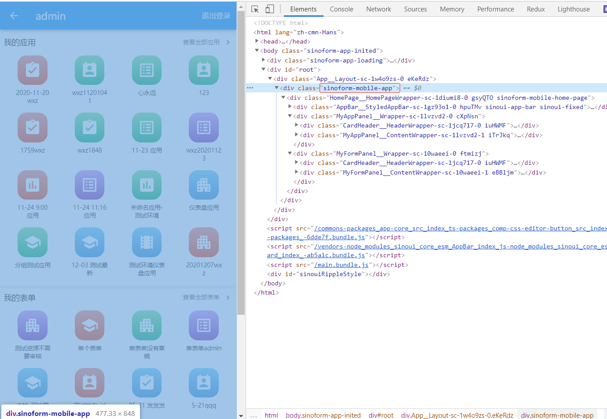

## 应用级别

### sinoform-app-inited

body标签的className

### sinoform-mobile-app

移动端所有页面，包括登录、首页、草稿、待办、已办、起草和详情页面父元素的className

## 登录页面

### sinoform-mobile-login-page

## 首页

### sinoform-mobile-home-page

## 待办页面

### sinoform-mobile-todo-list

待办页面待办列表区域的className

## 草稿页面

### sinoform-mobile-draft-list

草稿页面草稿列表区域的className

## 已办列表

### sinoform-mobile-done-list

已办页面已办列表区域的className

##  起草页面

### sinoform-mobile-create-page

起草页面容器组件的className

## 详情页面

### sinoform-mobile-detail-page

起草页面容器组件的className

