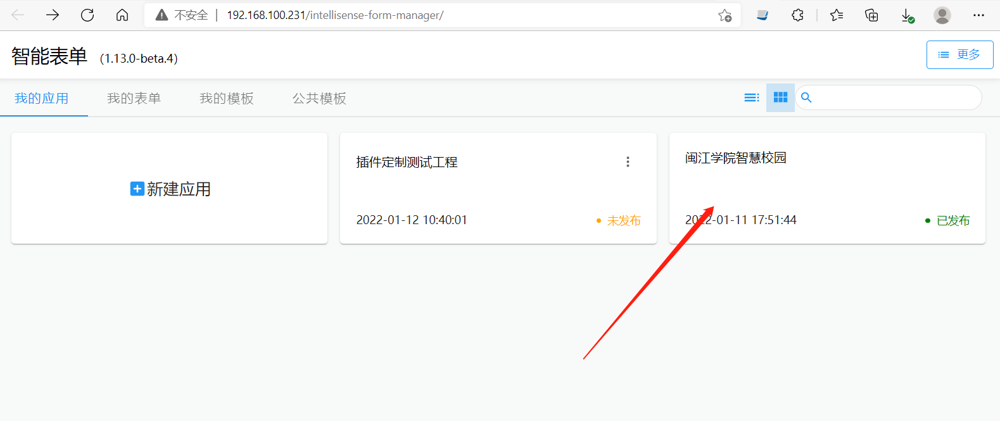
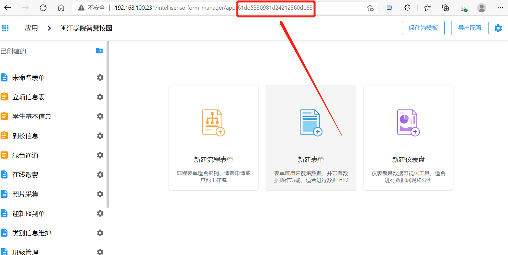
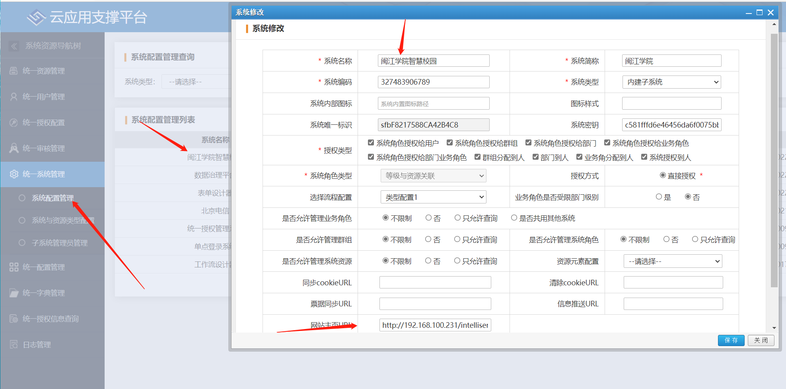
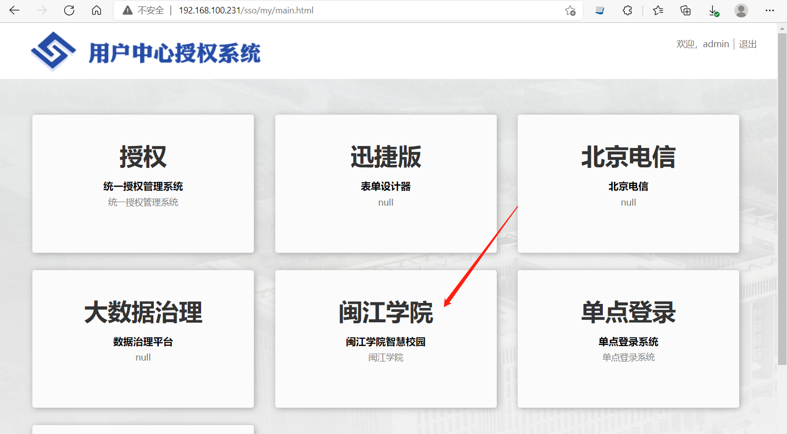
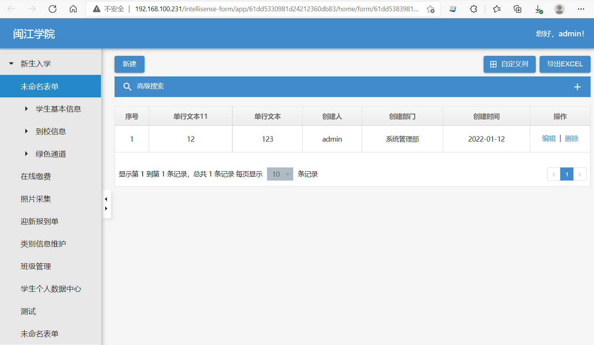
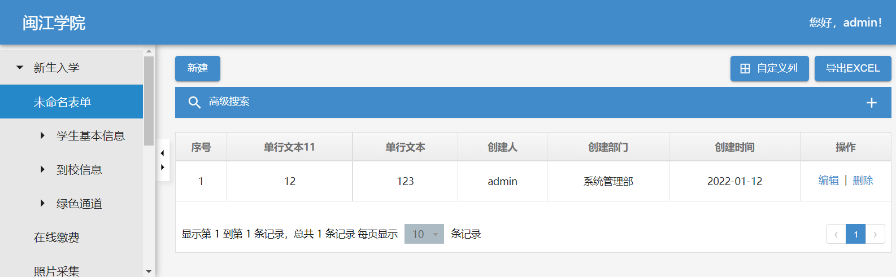
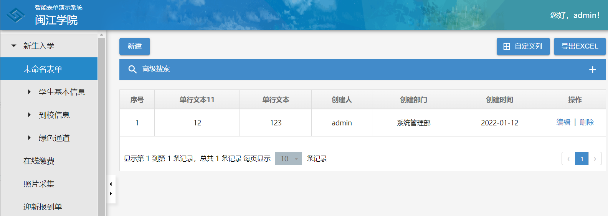
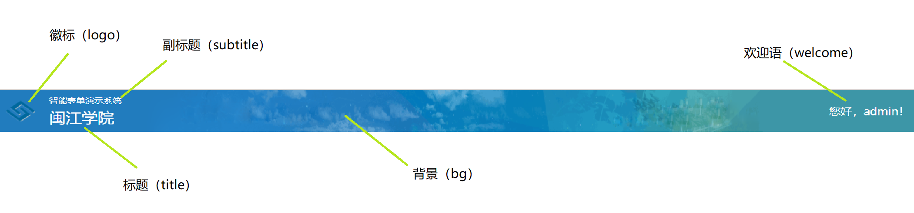

import Url from "../src/custom-app-bar/Url";
import FormAppUrlGenerator from "../src/custom-app-bar/FormAppUrlGenerator";

可以单独将表单应用作为一个独立的子系统使用。

## 表单应用首页链接

智能表单提供了表单应用首页，用来实现将表单应用作为单独系统使用的模式。您可以将表单应用首页的链接加入到任何其他门户中，例如添加到 sinomatrix sso 首页区块中（后面有单独说明）。

表单应用首页链接的形式如下：

```http
http://<网关ip:port>/intellisense-form/app/:appId/home
```

其中有两个变数：

- `<网关ip:port>` - 是指能够访问智能表单系统的地址。
- `:appId` - 表单应用的 id。

### 获取应用 id

表单应用 id 可以通过这样方式找到：从表单设计器中打开应用，在应用页面的链接上就有应用的 id，如下所示：

首页打开表单设计器首页，点击应用：



然后从新页面的链接中获取到应用 id：



:::tip 提示

上图对应的应用首页链接是： http://192.168.100.231/intellisense-form/app/61dd5330981d24212360db83/home 。可以通过[应用链接构造器](#应用链接构造器)快速产生链接。

:::

### 在 sso 首页添加应用区块

我们可以在统一授权中创建子系统，该子系统的链接就是上文提到的应用链接。设置过程参考[添加表单设计器的快捷导航](nav-in-sino-matrix.mdx#添加表单设计器的快捷导航)。例如下面的设置效果：

添加子系统：



在 sso 首页上的导航：



点击打开后的效果：



## 定制应用头部区域

我们可以通过在链接上添加一些请求参数，来定制应用的 logo 和头部背景，如下所示：

没有添加定制请求参数的原始样式：



添加定制请求参数之后的样式：



上图的效果是通过以下四个定制参数来实现的：

| 请求参数名称  | 作用                                 | 示例                                                                                                      |
| ------------- | ------------------------------------ | --------------------------------------------------------------------------------------------------------- |
| subtitle      | 添加副标题，例如平台名称、系统名称等 | 智能表单演示系统                                                                                          |
| logo          | 包含徽标的图片链接                   | https://sino-intellisense-form.oss-cn-beijing.aliyuncs.com/docs/logo.png                                  |
| appBarBgUrl   | 顶部应用栏的背景图链接               | https://sino-intellisense-form.oss-cn-beijing.aliyuncs.com/docs/bg.png                                    |
| appBarBgColor | 顶部应用栏的背景颜色                 | #428bca <div style={{ width:40, height: 20, backgroundColor: '#428bca', display: 'inline-block' }}></div> |

完整的链接如下：

<Url
  base="http://192.168.100.231/intellisense-form/app/61dd5330981d24212360db83/home"
  params={{
    subtitle: "智能表单演示系统",
    logo: "https://sino-intellisense-form.oss-cn-beijing.aliyuncs.com/docs/logo.png",
    appBarBgColor: "#428bca",
    appBarBgUrl:
      "https://sino-intellisense-form.oss-cn-beijing.aliyuncs.com/docs/bg.png",
  }}
/>

:::tip 提示

链接中的请求参数需要使用 `encodeURIComponent` 进行编码。可以使用[应用链接构造器](#应用链接构造器)来快速生成应用首页的链接。

:::

### 头部区域组成部分

应用头部由以下部分组成：

- 应用标题（`title`） - 即应用名称
- 副标题（`subtitle`）
- 徽标（`logo`）
- 背景（`bg`）
- 欢迎语（`welcome`）

如下图所示：



其中，可以通过参数定制的是 `副标题`、`徽标` 和 `背景`。有以下请求参数用来定制这些区域：

| 请求参数名称  | 作用                                                  | 示例                                                                                                      |
| ------------- | ----------------------------------------------------- | --------------------------------------------------------------------------------------------------------- |
| subtitle      | 副标题，例如平台名称、系统名称等                      | 智能表单演示系统                                                                                          |
| logo          | 包含徽标的图片链接                                    | https://sino-intellisense-form.oss-cn-beijing.aliyuncs.com/docs/logo.png                                  |
| appBarBgUrl   | 顶部应用栏的背景图链接                                | https://sino-intellisense-form.oss-cn-beijing.aliyuncs.com/docs/bg.png                                    |
| appBarBgColor | 顶部应用栏的背景颜色                                  | #428bca <div style={{ width:40, height: 20, backgroundColor: '#428bca', display: 'inline-block' }}></div> |
| titleImg      | 同时包含徽标和副标题的图片链接                        |                                                                                                           |
| titleYPos     | 标题垂直位置，在 titleImg 存在时起作用。单位为 `px`。 | 默认值：16                                                                                                |
| titleXPos     | 标题水平位置，在 titleImg 存在时起作用。单位为 `px`。 | 默认值：64                                                                                                |

### 定制徽标

> 通过 `logo` 请求参数指定徽标链接的方式定制徽标区域。

默认情况下，徽标图片显示大小为 `40 x 40`。您可以通过[样式定制](custom-css-pc.md)更改徽标显示尺寸：

```css
.sinoform-app-bar-logo {
  width: 56px !important;
  height: 56px !important;
}
```

### 定制副标题

> 通过 `subtitle` 请求参数定制副标题。

有时需要显示业务平台或者大系统的名称，这个时候可以使用副标题的方式来完成。

默认情况下副标题的字体样式为 `12px 微软雅黑`。您可以通过[样式定制](custom-css-pc.md)更改副标题的字体和尺寸：

```css
.sinoform-app-bar-subtitle {
  font-family: 宋体 !important;
  font-size: 14px !important;
}
```

如果需要使用的字体比较独特，不是操作系统自带的，那么建议使用 [titleImg 参数](#通过-titleimg-参数定制徽标和副标题)来定制非常个性化的副标题。

### 同时定制徽标和副标题

在以下情况下，推荐使用 `titleImg` 参数同时定徽标和副标题：

- 副标题需要采用比较独特的字体来展示
- 智能表单提供的徽标和副标题布局满足不了需求

可以请美工制作一个带有徽标和副标题的图片，然后通过 `titleImg` 参数来指定。

另外，可以通过 `titleYPos` 和 `titleXPos` 两个参数对标题的位置进行微调，以满足定制化的布局需求。

### 定制背景

> 通过 `appBarBgColor` 请求参数指定顶部工具栏的背景颜色；通过 `appBarBgUrl` 请求参数指定顶部工具栏的背景图片。

默认情况下，背景图片以 `100%` 宽度和 `64px` 的高度展现，即可能在不同尺寸的屏幕下会出现拉升变形的情况。您可以通过[样式定制](custom-css-pc.md)来改变默认规则，例如：

```css
.sinoform-app-bar-bg-img {
  width: 1024px !important;
  height: 64px !important;
  left: calc(50vw - 512px) !important;
}
```

## 应用链接构造器

<FormAppUrlGenerator />
