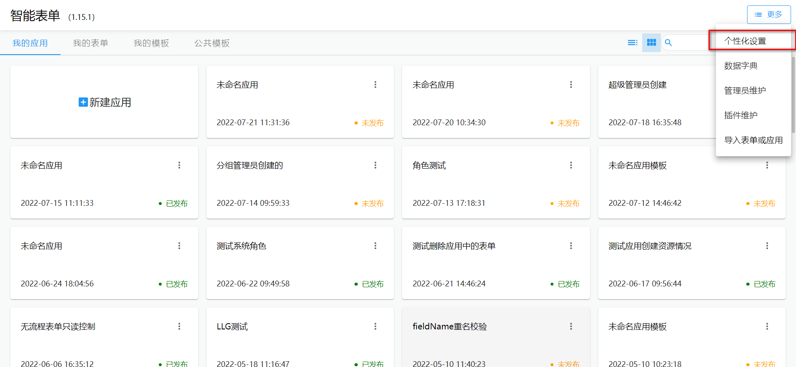
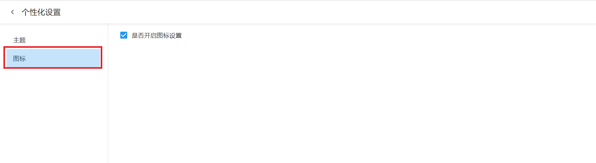
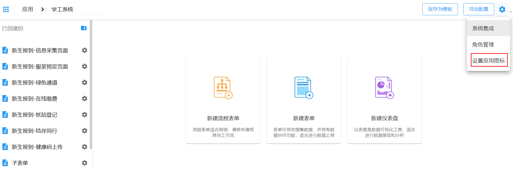
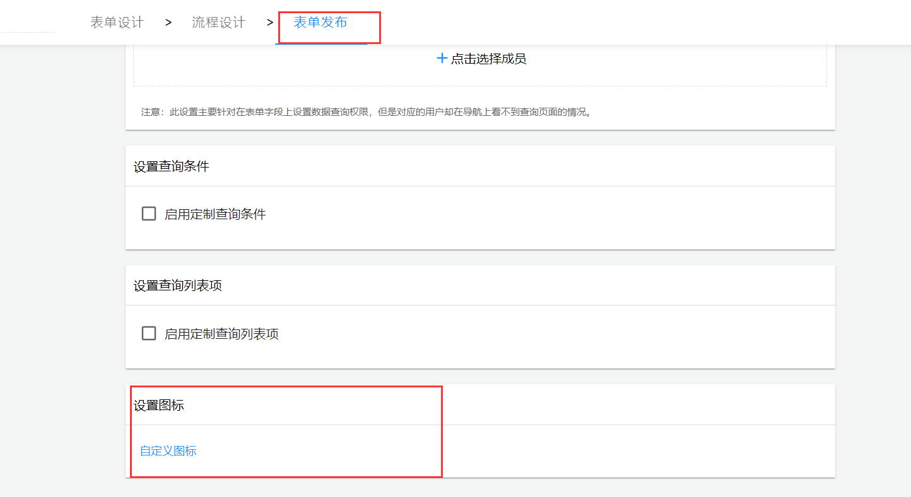
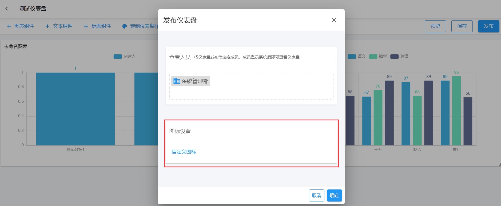
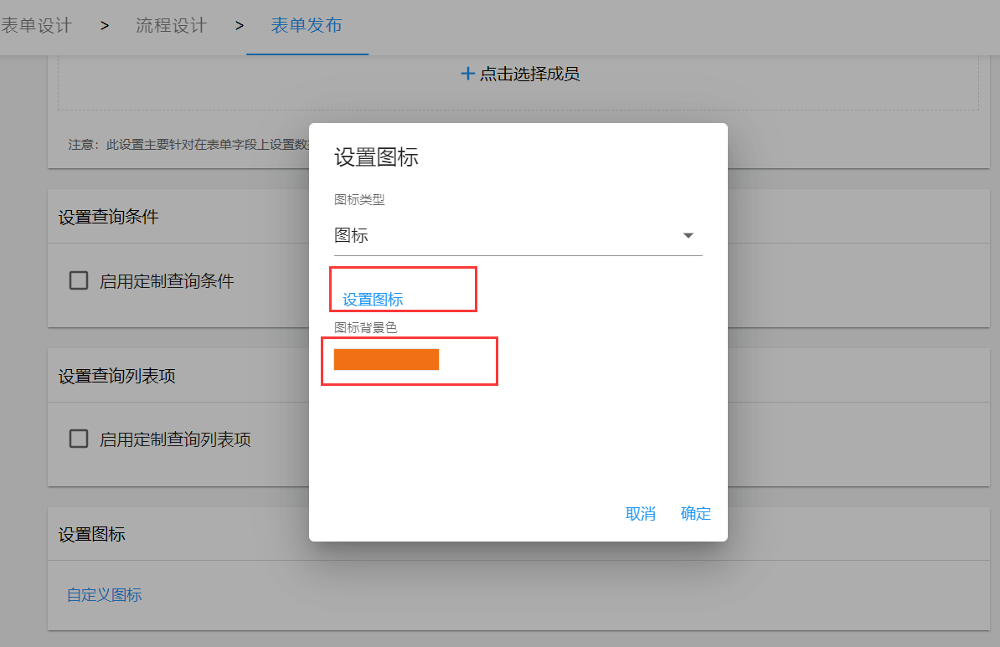

## 前提

1.16.0 版本之后图标定制属于个性化定制部分，用户可以根据自身需要判断是否需要显示图标定制的配置面板。

1. 个性化配置入口
   

2. 定制图标设置是否开启
   

## 入口

由于使用场景的不同，图标定制会牵涉应用图标定制、表单图标定制、仪表盘图标定制。以上三种图标定制的入口分别在：

- 应用图标定制 —— 应用首页的设置应用图标按钮
  
- 表单图标定制 —— 表单发布页面
  
- 仪表盘图标定制 —— 仪表盘发布页面
  

## 图标设置

图标设置支持以下两种模式：

- 内置图标。内置图标选用[react-icons](http://react-icons.github.io/react-icons)中几种比较常见的图标，可直接选择使用。
- 图片上传。将做好的图片直接上传。

### 内置图标

内置图标支持设置图标背景色。


### 图标配置数据

```json
{
  "type": "icon", // 配置类型
  "imageName": "微信图片_20210901195758.jpg", // 图片名称
  "imageId": "622eac14c42b4288e8d7cb51", // 图片id
  "imageUrl": "/apis/intellisense-form/files/622eac14c42b4288e8d7cb51", // 图片url
  "iconType": "ai", // 图标类型
  "iconName": "AiFillAliwangwang", // 图标名称
  "iconContent": "<svg stroke=\"currentColor\" fill=\"currentColor\" stroke-width=\"0\" viewBox=\"0 0 1024 1024\" height=\"1em\" width=\"1em\" xmlns=\"http://www.w3.org/2000/svg\"><path d=\"M868.2 377.4c-18.9-45.1-46.3-85.6-81.2-120.6a377.26 377.26 0 0 0-120.5-81.2A375.65 375.65 0 0 0 519 145.8c-41.9 0-82.9 6.7-121.9 20C306 123.3 200.8 120 170.6 120c-2.2 0-7.4 0-9.4.2-11.9.4-22.8 6.5-29.2 16.4-6.5 9.9-7.7 22.4-3.4 33.5l64.3 161.6a378.59 378.59 0 0 0-52.8 193.2c0 51.4 10 101 29.8 147.6 18.9 45 46.2 85.6 81.2 120.5 34.7 34.8 75.4 62.1 120.5 81.2C418.3 894 467.9 904 519 904c51.3 0 100.9-10 147.7-29.8 44.9-18.9 85.5-46.3 120.4-81.2 34.7-34.8 62.1-75.4 81.2-120.6a376.5 376.5 0 0 0 29.8-147.6c-.2-51.2-10.1-100.8-29.9-147.4zm-325.2 79c0 20.4-16.6 37.1-37.1 37.1-20.4 0-37.1-16.7-37.1-37.1v-55.1c0-20.4 16.6-37.1 37.1-37.1 20.4 0 37.1 16.6 37.1 37.1v55.1zm175.2 0c0 20.4-16.6 37.1-37.1 37.1S644 476.8 644 456.4v-55.1c0-20.4 16.7-37.1 37.1-37.1 20.4 0 37.1 16.6 37.1 37.1v55.1z\"></path></svg>", // 图标内容
  "iconBgColor": "#d713f1" // 图标背景色
}
```

上述配置中，包含以下数据配置：

- type —— 配置类型。`icon`表示图标；`image`表示图片。
- imageName —— 图片名称。
- imageId —— 图片 id。
- imageUrl —— 图片 url。集成时使用 url 渲染图片。
- iconType —— 图标类型。表示选中图标来自哪个分组。
- iconName —— 图标名称。
- iconContent —— 图标内容。集成时可直接使用此内容渲染图标。
- iconBgColor —— 图标背景色。

## 图标集成

如果是选择的内置图标，只需要将`iconContent`中的 svg 元素渲染出来即可。如果是图片类型，则直接使用`<访问智能表单的IP地址:端口号>://imageUrl`拼接图片地址即可正确渲染。

应用、仪表盘、表单图标集成方式一致，主要是数据来源不一样，下面我们具体分析不同类型应用的图标配置数据来源。

### 应用图标

应用图标数据需要从应用数据详情中的`appConfig.iconConfig`去取。

```json {10-17}
{
  "id": "6225e215c4b8ce48eb3f9b27",
  "title": "测试专用应用",
  "resourceId": "4028daff7f4f0e6d017f63fb2553007e",
  "createUserId": "1",
  "createUserName": "admin",
  "createDeptId": "18043",
  "createDeptName": "系统管理部",
  "createTime": "2022-03-07 10:44:37",
  "appConfig": {
    "iconConfig": {
      "type": "icon",
      "iconType": "ai",
      "iconName": "AiFillAmazonCircle",
      "iconContent": "<svg stroke=\"currentColor\" fill=\"currentColor\" stroke-width=\"0\" viewBox=\"0 0 1024 1024\" height=\"1em\" width=\"1em\" xmlns=\"http://www.w3.org/2000/svg\"><path d=\"M485 467.5c-11.6 4.9-20.9 12.2-27.8 22-6.9 9.8-10.4 21.6-10.4 35.5 0 17.8 7.5 31.5 22.4 41.2 14.1 9.1 28.9 11.4 44.4 6.8 17.9-5.2 30-17.9 36.4-38.1 3-9.3 4.5-19.7 4.5-31.3v-50.2c-12.6.4-24.4 1.6-35.5 3.7-11.1 2.1-22.4 5.6-34 10.4zM512 64C264.6 64 64 264.6 64 512s200.6 448 448 448 448-200.6 448-448S759.4 64 512 64zm35.8 262.7c-7.2-10.9-20.1-16.4-38.7-16.4-1.3 0-3 .1-5.3.3-2.2.2-6.6 1.5-12.9 3.7a79.4 79.4 0 0 0-17.9 9.1c-5.5 3.8-11.5 10-18 18.4-6.4 8.5-11.5 18.4-15.3 29.8l-94-8.4c0-12.4 2.4-24.7 7-36.9 4.7-12.2 11.8-23.9 21.4-35 9.6-11.2 21.1-21 34.5-29.4 13.4-8.5 29.6-15.2 48.4-20.3 18.9-5.1 39.1-7.6 60.9-7.6 21.3 0 40.6 2.6 57.8 7.7 17.2 5.2 31.1 11.5 41.4 19.1a117 117 0 0 1 25.9 25.7c6.9 9.6 11.7 18.5 14.4 26.7 2.7 8.2 4 15.7 4 22.8v182.5c0 6.4 1.4 13 4.3 19.8 2.9 6.8 6.3 12.8 10.2 18 3.9 5.2 7.9 9.9 12 14.3 4.1 4.3 7.6 7.7 10.6 9.9l4.1 3.4-72.5 69.4c-8.5-7.7-16.9-15.4-25.2-23.4-8.3-8-14.5-14-18.5-18.1l-6.1-6.2c-2.4-2.3-5-5.7-8-10.2-8.1 12.2-18.5 22.8-31.1 31.8-12.7 9-26.3 15.6-40.7 19.7-14.5 4.1-29.4 6.5-44.7 7.1-15.3.6-30-1.5-43.9-6.5-13.9-5-26.5-11.7-37.6-20.3-11.1-8.6-19.9-20.2-26.5-35-6.6-14.8-9.9-31.5-9.9-50.4 0-17.4 3-33.3 8.9-47.7 6-14.5 13.6-26.5 23-36.1 9.4-9.6 20.7-18.2 34-25.7s26.4-13.4 39.2-17.7c12.8-4.2 26.6-7.8 41.5-10.7 14.9-2.9 27.6-4.8 38.2-5.7 10.6-.9 21.2-1.6 31.8-2v-39.4c0-13.5-2.3-23.5-6.7-30.1zm180.5 379.6c-2.8 3.3-7.5 7.8-14.1 13.5s-16.8 12.7-30.5 21.1c-13.7 8.4-28.8 16-45 22.9-16.3 6.9-36.3 12.9-60.1 18-23.7 5.1-48.2 7.6-73.3 7.6-25.4 0-50.7-3.2-76.1-9.6-25.4-6.4-47.6-14.3-66.8-23.7-19.1-9.4-37.6-20.2-55.1-32.2-17.6-12.1-31.7-22.9-42.4-32.5-10.6-9.6-19.6-18.7-26.8-27.1-1.7-1.9-2.8-3.6-3.2-5.1-.4-1.5-.3-2.8.3-3.7.6-.9 1.5-1.6 2.6-2.2a7.42 7.42 0 0 1 7.4.8c40.9 24.2 72.9 41.3 95.9 51.4 82.9 36.4 168 45.7 255.3 27.9 40.5-8.3 82.1-22.2 124.9-41.8 3.2-1.2 6-1.5 8.3-.9 2.3.6 3.5 2.4 3.5 5.4 0 2.8-1.6 6.3-4.8 10.2zm59.9-29c-1.8 11.1-4.9 21.6-9.1 31.8-7.2 17.1-16.3 30-27.1 38.4-3.6 2.9-6.4 3.8-8.3 2.8-1.9-1-1.9-3.5 0-7.4 4.5-9.3 9.2-21.8 14.2-37.7 5-15.8 5.7-26 2.1-30.5-1.1-1.5-2.7-2.6-5-3.6-2.2-.9-5.1-1.5-8.6-1.9s-6.7-.6-9.4-.8c-2.8-.2-6.5-.2-11.2 0-4.7.2-8 .4-10.1.6a874.4 874.4 0 0 1-17.1 1.5c-1.3.2-2.7.4-4.1.5-1.5.1-2.7.2-3.5.3l-2.7.3c-1 .1-1.7.2-2.2.2h-3.2l-1-.2-.6-.5-.5-.9c-1.3-3.3 3.7-7.4 15-12.4s22.3-8.1 32.9-9.3c9.8-1.5 21.3-1.5 34.5-.3s21.3 3.7 24.3 7.4c2.3 3.5 2.5 10.7.7 21.7z\"></path></svg>",
      "iconBgColor": "#13f118"
    }
  }
}
```

### 表单图标

表单图标数据来源于表单详情数据中的`formConfig.form.iconConfig`中去取。

```json {23-32}
{
  "id": "62270225c4b8cefaf83610d0",
  "title": "验证退回意见",
  "publishStatus": true,
  "formConfig": {
    "items": [
      {
        "id": "field_1",
        "fieldName": "field_1",
        "title": "单行文本",
        "type": "input",
        "width": "24"
      }
    ],
    "form": {
      "variant": "outlined",
      "dense": "1",
      "layout": "vertical",
      "labelLayout": "floating",
      "labelWidth": 160,
      "printType": "default",
      "idSeed": 9,
      "iconConfig": {
        "type": "icon",
        "imageName": "微信图片_20210901195758.jpg",
        "imageId": "622eac14c42b4288e8d7cb51",
        "imageUrl": "/apis/intellisense-form/files/622eac14c42b4288e8d7cb51",
        "iconType": "ai",
        "iconName": "AiFillAliwangwang",
        "iconContent": "<svg stroke=\"currentColor\" fill=\"currentColor\" stroke-width=\"0\" viewBox=\"0 0 1024 1024\" height=\"1em\" width=\"1em\" xmlns=\"http://www.w3.org/2000/svg\"><path d=\"M868.2 377.4c-18.9-45.1-46.3-85.6-81.2-120.6a377.26 377.26 0 0 0-120.5-81.2A375.65 375.65 0 0 0 519 145.8c-41.9 0-82.9 6.7-121.9 20C306 123.3 200.8 120 170.6 120c-2.2 0-7.4 0-9.4.2-11.9.4-22.8 6.5-29.2 16.4-6.5 9.9-7.7 22.4-3.4 33.5l64.3 161.6a378.59 378.59 0 0 0-52.8 193.2c0 51.4 10 101 29.8 147.6 18.9 45 46.2 85.6 81.2 120.5 34.7 34.8 75.4 62.1 120.5 81.2C418.3 894 467.9 904 519 904c51.3 0 100.9-10 147.7-29.8 44.9-18.9 85.5-46.3 120.4-81.2 34.7-34.8 62.1-75.4 81.2-120.6a376.5 376.5 0 0 0 29.8-147.6c-.2-51.2-10.1-100.8-29.9-147.4zm-325.2 79c0 20.4-16.6 37.1-37.1 37.1-20.4 0-37.1-16.7-37.1-37.1v-55.1c0-20.4 16.6-37.1 37.1-37.1 20.4 0 37.1 16.6 37.1 37.1v55.1zm175.2 0c0 20.4-16.6 37.1-37.1 37.1S644 476.8 644 456.4v-55.1c0-20.4 16.7-37.1 37.1-37.1 20.4 0 37.1 16.6 37.1 37.1v55.1z\"></path></svg>",
        "iconBgColor": "#d713f1"
      }
    }
  },
  "flowConfigs": [
    {
      "flowName": "验证退回意见",
      "flowConfigId": "5085e21d-e153-4885-851a-2cd58109935d",
      "id": "32e201762fa34d25aebd923949f9374d",
      "todoUrl": "/intellisense-form/62270225c4b8cefaf83610d0/todo",
      "nodes": [
        {
          "id": "ecddb23b-cbdb-4156-ad2b-df1adbdfe3a7",
          "x": 488,
          "y": 60,
          "name": "开始节点",
          "type": "startevent"
        },
        {
          "id": "59d323d4-f4d0-4d99-9555-a899971078ca",
          "x": 488,
          "y": 180,
          "name": "审批节点",
          "type": "usertask"
        },
        {
          "id": "30bf6bd2-3503-42f3-a7bc-129d697febf5",
          "x": 488,
          "y": 310,
          "name": "结束节点",
          "type": "endevent",
          "fieldsCandidate": []
        },
        {
          "name": "审核节点",
          "id": "6ace9127-24f9-4868-a693-ad74fd3f0ee7",
          "x": 805,
          "y": 180,
          "type": "usertask",
          "idea": "required",
          "ideaType": "formIdea",
          "ideaField": "field_6",
          "fieldsCandidate": []
        }
      ],
      "lines": [
        {
          "title": "送审批节点",
          "id": "15813a52-cdb5-4d4f-8484-a66e00c26aaf",
          "sourceRef": "ecddb23b-cbdb-4156-ad2b-df1adbdfe3a7",
          "sourceEdge": "bottom",
          "targetRef": "59d323d4-f4d0-4d99-9555-a899971078ca",
          "targetEdge": "top",
          "path": [
            [568, 100],
            [568, 180]
          ],
          "controlCondition": []
        },
        {
          "title": "结束流程",
          "id": "50dcf1c1-5a43-4f21-9a01-4c918d143f71",
          "sourceRef": "6ace9127-24f9-4868-a693-ad74fd3f0ee7",
          "sourceEdge": "bottom",
          "targetRef": "30bf6bd2-3503-42f3-a7bc-129d697febf5",
          "targetEdge": "top",
          "path": [
            [885, 220],
            [885, 265],
            [568, 265],
            [568, 310]
          ],
          "controlCondition": []
        },
        {
          "id": "cf974422-c797-47c9-af05-d33cd0bfeccd",
          "title": "送审核节点",
          "sourceRef": "59d323d4-f4d0-4d99-9555-a899971078ca",
          "sourceEdge": "right",
          "targetRef": "6ace9127-24f9-4868-a693-ad74fd3f0ee7",
          "targetEdge": "left",
          "path": [
            [648, 200],
            [805, 200]
          ],
          "isCrossDepartment": "0",
          "controlCondition": []
        }
      ]
    }
  ],
  "navigationPosition": {
    "code": "58070ff4de354c6c86b2ab1790abd7d3",
    "reference": "4028daff7f4f0e6d017f63fc9b3e007f",
    "position": "after",
    "resourceId": "4028daff7f4f0e6d017f6860662600bd",
    "ext": "flow",
    "superId": "4028daff7f4f0e6d017f63fb2553007e"
  },
  "createUserId": "1",
  "createUserName": "admin",
  "createDeptId": "18043",
  "createDeptName": "系统管理部",
  "createTime": "2022-03-08 07:13:41",
  "updateTime": "2022-03-14 10:45:08",
  "sysId": "67250",
  "tableName": "form_m93mp3qvby4ogrjbomek",
  "applicationId": "6225e215c4b8ce48eb3f9b27",
  "formType": 1
}
```

### 仪表盘图表

仪表盘图标配置数据来源于仪表盘详情数据中的`dashboardConfig.iconConfig`。

```json {42-49}
{
  "id": "62295825c4b8ce6fa906a883",
  "title": "测试仪表盘",
  "components": [],
  "layouts": [],
  "isPublic": true,
  "appId": "6225e215c4b8ce48eb3f9b27",
  "sysId": "67250",
  "createUserId": "4028d00e6f16845c016f79dda0c20231",
  "createUserName": "汪芳",
  "createDeptId": "4028d00e6ec96438016ec97b4b10000b",
  "createDeptName": "公文处",
  "createTime": "2022-03-14 11:19:45",
  "navigationPosition": {
    "code": "412dd36c6c79443c8bbdf1102fdd5d3d",
    "reference": "4028daff7f4f0e6d017f6df305b1022c",
    "position": "after",
    "resourceId": "4028daff7f4f0e6d017f718052ab02fe",
    "ext": "dashboard",
    "superId": "4028daff7f4f0e6d017f63fb2553007e"
  },
  "viewers": [
    {
      "id": "18043",
      "name": "系统管理部",
      "type": "dept"
    }
  ],
  "styles": {
    "theme": {
      "name": "light",
      "highlightColor": "blue",
      "background": {
        "type": "color",
        "color": "#f4f6f9"
      }
    },
    "echartsTheme": {
      "palette": "theme"
    }
  },
  "dashboardConfig": {
    "iconConfig": {
      "type": "image",
      "imageName": "5ea6489fd61e720001b08a8a.jpg",
      "imageId": "622eb44fc42b4288e8d7cb63",
      "imageUrl": "/apis/intellisense-form/files/622eb44fc42b4288e8d7cb63"
    }
  }
}
```
