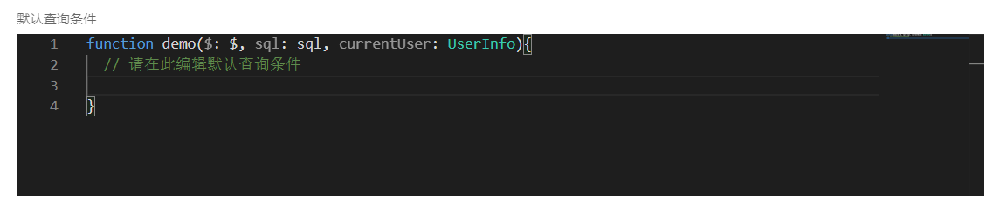
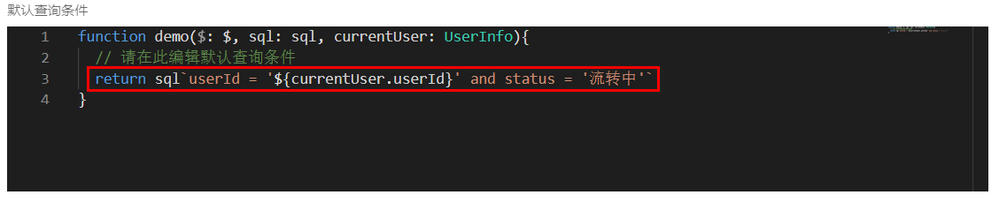

智能表单内置支持草稿列表、待办列表、已办列表和查询列表。如果除此之外还有别的列表需求，那我们可以通过列表定制的特性来实现。

## 配置项

- 列表页名称。用于在资源列表中显示
- 列表类型。用于定制列表按钮时的列表`type`
- 默认查询条件。定制列表的默认查询条件，定制方式可参考[默认查询条件定制](#默认查询条件定制)
- 部门数据管理员。
- 数据查看管理员。
- 数据查看人员。
- 列表查询条件。指定列表页的查询条件
- 列表展示项。指定列表的展示字段

> 其中部门数据管理员、数据查看管理员、数据查看人员与`数据查看权限`界面的规则相同，用于指定哪些用户可以使用定制列表和列表查询数据的范围。

## 默认查询条件定制

用于指定列表查询接口的默认参数。如果默认查询条件和定制的列表查询项用到了同一个字段，规则如下：

- 如果列表界面查询表单中字段的值不为空，以查询表单中的值为准
- 如果为空，以默认查询条件中的值为准

查询条件编辑器目前支持采用`sql`和`$ API`两种方式来声明查询条件。

假如用户想要表达的 SQL 查询条件为

```sql
field_1 = '1' and (field_2 in ('1', '2', '3') or field_3.field_1 like '%123%')
```

sql 的表达方式

```javascript
sql`
  field_1 = '1' and (field_2 in ('1', '2', '3') or field_3.field_1 like '%123%')
`;
```

$ API 的表达方式

```javascript
$.and(
  $('field_1').eq('1'),
  $.or($('field_2').in('1', '2', '3'), $('field_3.field_1').like('%123%'))
);
```

:::warning 特别提醒

使用 `sql` 方式指定查询条件，要注意符合 sql 语法的规则，否则会导致默认查询条件无法解析、无法生效

:::

### 配置说明

默认查询条件编辑器会默认显示一个方法，并且这个默认显示的方法体是无法编辑的：



我们只能在方法体内编写查询条件内容，return 我们的查询条件



### 支持的查询操作符

#### equal

相等性比较

##### sql 设置示例

```javascript
sql`field_1 = '10'`;
```

##### $ API 设置示例

```javascript
$('field_1').equal('10');
```

#### equal

不等性比较

##### sql 设置示例

```javascript
sql`field_1 <> '10'`;
```

##### $ API 设置示例

```javascript
$('field_1').notEqual('10');
```

#### contain

字符串包含关系

:::info
注意与 like 的区别。
$('field_1').contain('张');
相当于：
$('field_1').like('%张%');
:::

##### sql 设置示例

不支持

##### $ API 设置示例

```javascript
$('field_1').contain('张');
```

#### notContain

字符串不包含关系

##### sql 设置示例

不支持

##### $ API 设置示例

```javascript
$('field_1').notContain('张');
```

#### isNull

判断是否为空

##### sql 设置示例

无

##### $ API 设置示例

```javascript
$('field_1').isNull();
```

#### notNull

判断是否不为空

##### sql 设置示例

无

##### $ API 设置示例

```javascript
$('field_1').notNull();
```

#### lt

小于

##### sql 设置示例

```javascript
sql`field_1 < 10`;
```

##### $ API 设置示例

```javascript
$('field_1').lt(10);
```

#### gt

大于

##### sql 设置示例

```javascript
sql`field_ 1 > 10`;
```

##### $ API 设置示例

```javascript
$('field_1').gt(10);
```

#### lte

小于等于

##### SQL 设置示例

```javascript
sql`field_1 <= 10`;
```

##### $ API 设置示例

```javascript
$('field_1').lte(10);
```

#### gte

大于等于

##### SQL 设置示例

```javascript
sql`field_1 >= 10`;
```

##### $ API 设置示例

```javascript
$('field_1').gte(10);
```

#### in

数组包含关系

##### SQL 设置示例

```javascript
sql`field_1 in ('类型1', '类型2', '类型3')`;
```

##### $ API 设置示例

```javascript
$('field_1').in('类型1', '类型2', '类型3');
```

#### is

目前只支持一种场景： field_1 is null

##### SQL 设置示例

```javascript
sql`field_1 is null`;
```

##### $ API 设置示例

```javascript
$('field_1').is(null);

// 或者
$('field_1').is();
```

#### isNot

目前只支持一种场景： field_1 is not null

##### SQL 设置示例

```javascript
sql`field_1 is not null`;
```

##### $ API 设置示例

```javascript
$('field_1').isNot(null);

// 或者
$('field_1').isNot();
```

#### like

字符串包含关系

##### sql 设置示例

```javascript
sql`field_1 like '张%'`;
```

##### $ API 设置示例

```javascript
$('field_1').like('张%');
```

#### notLike

字符串不包含关系

##### sql 设置示例

```javascript
sql`field_1 not like '张%'`;
```

##### $ API 设置示例

```javascript
$('field_1').notLike('张%');
```

#### range

between ... and ...

##### sql 设置示例

```javascript
sql`field_1 between 1 and 3`;
```

##### $ API 设置示例

```javascript
$('field_1').range(1, 3);
```

#### and

逻辑与的关系

##### sql 设置示例

```javascript
sql`field_1 > 10 and field_1 < 100 and user_name = '张三'`;
```

##### $ API 设置示例

```javascript
$.and($('field_1').gt(10), $('field_1').lt(100), $('user_name').equal('张三'));
```

#### or

逻辑或的关系

##### sql 设置示例

```javascript
sql`field_1 > 10 or field_1 < 100 or user_name = '张三'`;
```

##### $ API 设置示例

```javascript
$.or($('field_1').gt(10), $('field_1').lt(100), $('user_name').equal('张三'));
```

#### not

逻辑非的关系

##### sql 设置示例

```javascript
sql`!(field_1 = 10)`;
```

##### $ API 设置示例

```javascript
// not方法只能接收一个condition参数
$.not($('field_1').equal(10));

// 或者
$('field_1').not.equal(10);
```
