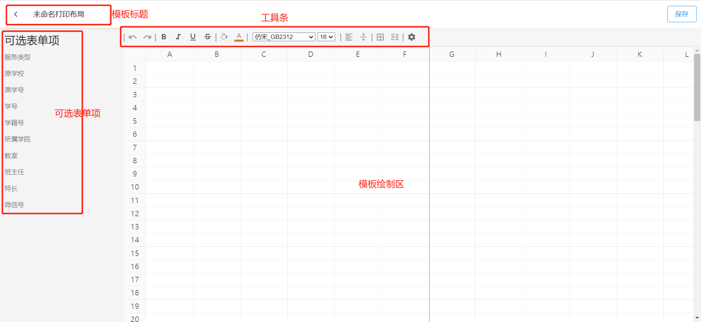
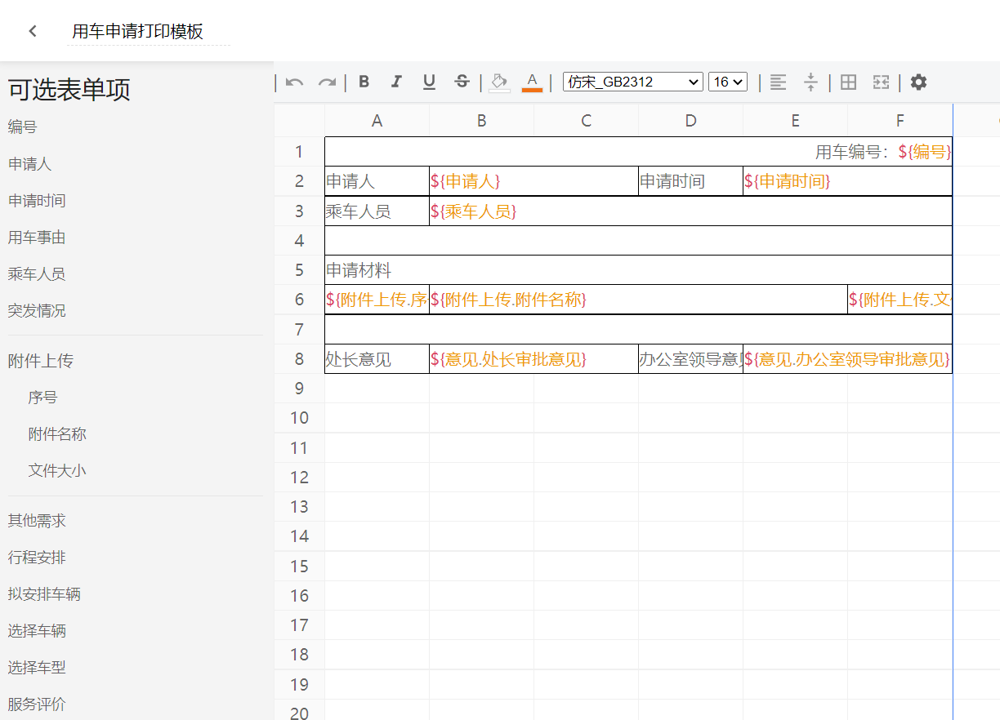
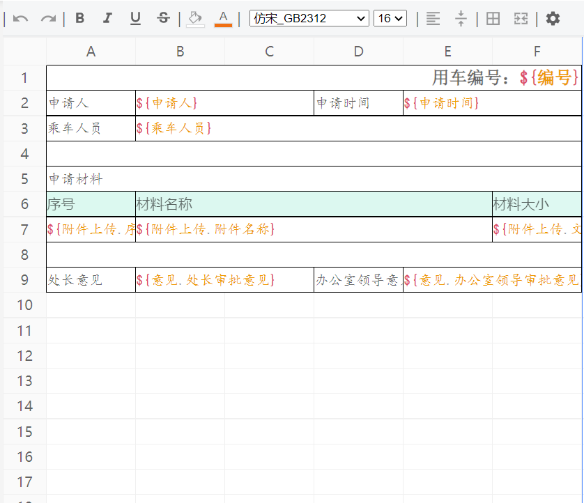

智能表单打印输出支持两种方式：

- 默认模板打印
- 在线自定义模板打印

此章节我们主要学习如何在线定制模板。

模板定制页面主要包括四部分：模板标题、可选表单项、工具条、模板绘制区。

## 基础配置

首先我们可以根据实际需求在对应位置输入需要打印的表单项标签名称，然后通过拖拽的方式从可选表单项列表中拖拽对应的表单项到对应位置生成插值表达式（插值表达式支持手动输入）。

我们可以通过工具栏上的相关按钮，给文本设置相关样式，比如文本加粗、倾斜、删除线、字体、字号等等；也可以给单元格设置样式，比如空单元格背景色、布局方式等等。

:::info
值的注意的是，我们有不同的方式定义文本样式：

- 框住多个单元格，整体设置文本样式
- 单元格处于编辑状态时，选中部分文字，给选中的文字单独设置样式

:::

## 表格操作

表格操作主要包括单元格合并、添加行、删除行、添加列、删除列、复制、粘贴、拖拽改变行高列宽等等。具体操作如下：

- 选中多个单元格，点击工具栏上的合并单元格按钮进行单元格合并（需要注意的是如果选中区域中有合并的单元格，则进行拆分处理）
- 单元格处于非编辑状态时，右键出现操作弹窗，包括添加行、删除行、添加列、删除列、复制、粘贴
- 鼠标在列表头的单元格右侧边缘，会出现改变尺寸的光标，此时拖拽右侧边框可改变列宽
- 鼠标放在行表头单元格的底部边缘，会出现改变尺寸的光标，此时拖拽下边框可改变行高
