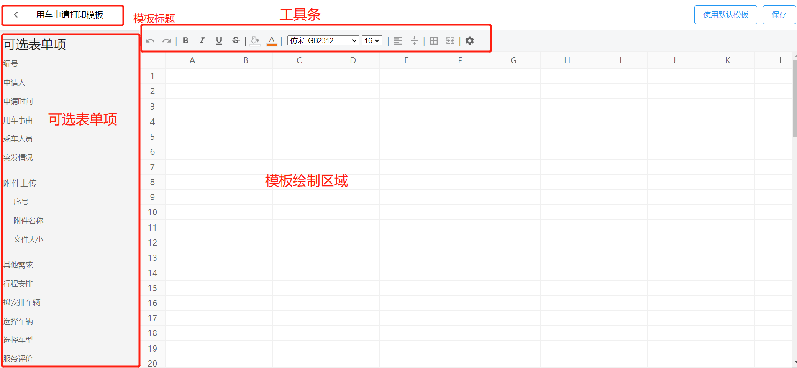
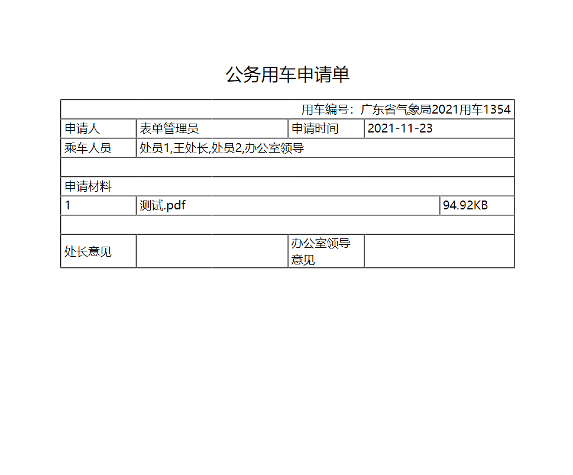
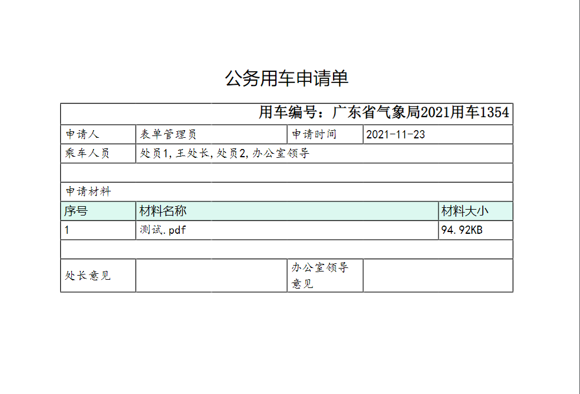
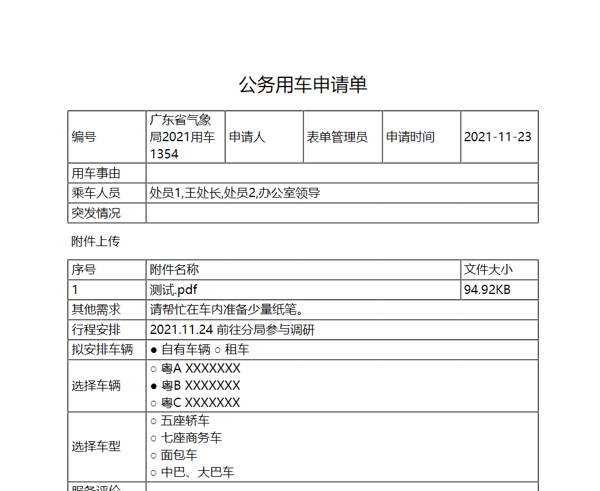

智能表单打印输出支持两种方式：

- 默认模板打印
- 在线自定义模板打印

此章节我们主要学习如何在线定制模板。

模板定制页面主要包括四部分：模板标题、可选表单项、工具条、模板绘制区。



## 基础配置

首先我们可以根据实际需求在对应位置输入需要打印的表单项标签名称，然后通过拖拽的方式从可选表单项列表中拖拽对应的表单项到对应位置生成插值表达式（插值表达式支持手动输入）。


实际输出效果如下：



我们可以通过工具栏上的相关按钮，给文本设置相关样式，比如文本加粗、倾斜、删除线、字体、字号等等；也可以给单元格设置样式，比如空单元格背景色、布局方式等等。


自定义之后的输出效果：



:::info
值的注意的是，我们有不同的方式定义文本样式：

- 框住多个单元格，整体设置文本样式
- 单元格处于编辑状态时，选中部分文字，给选中的文字单独设置样式

:::

## 单元格操作

单元格操作主要包括单元格合并、添加行、删除行、添加列、删除列、复制、粘贴、拖拽改变行高列宽等等。具体操作如下：

- 选中多个单元格，点击工具栏上的合并单元格按钮进行单元格合并（需要注意的是如果选中区域中有合并的单元格，则进行拆分处理）
- 单元格处于非编辑状态时，右键出现操作弹窗，包括添加行、删除行、添加列、删除列、复制、粘贴
- 鼠标在列表头的单元格右侧边缘，会出现改变尺寸的光标，此时拖拽右侧边框可改变列宽
- 鼠标放在行表头单元格的底部边缘，会出现改变尺寸的光标，此时拖拽下边框可改变行高

:::warning
在进行单元格相关操作时，要关注垂直方向蓝色标尺线，贯穿及超出此标尺线的内容都不会被打印。
:::

## 使用默认模板

模板设计页面右上角有一个【使用默认模板】按钮，点击此按钮会快速按照页面布局生成默认模板，我们可以在默认模板基础上根据需求做一些调整，快速完成模板定制。


使用默认模板的输出效果：



## 公式编写

对于有特殊定制化需求的打印输出，我们可以支持在单元格中编写公式，通过解析公式输出指定内容。

场景：对于单选按钮组、复选按钮组等，如果设置了选项关联的选项，如果选中了则需要把其关联选项也输出。这种场景下我们就只能使用`in`来解决问题。

表单预览视图：


默认打印效果：


自定义带公式模板：


最终输出效果：


在公式编写时我们不仅支持`in`还支持其他通用逻辑运算，更多详细信息可参考** 公式说明 **章节。

### 公式说明

公式语法在遵循 JavaScript 表达式语法子集的基础上扩展了关系运算符 `in` 和 `like`。

#### 比较关系运算符

支持以下关系运算符：

- `like` - 字符串匹配（字符串包含）
- `in` - 数组包含
- `>`
- `>=`
- `<`
- `<=`
- `==`
- `!=`

#### in 数组包含

```js
value in [1, 2, 3];
```

value 可以是数字、字符串、数组、也可以是对象：

- `value = 1`时，公式返回 `true`
- `value = 4`时，公式返回 `false`
- `value = [1, 7, 8]`时，公式返回 `true`
- `value = [8, 9]`时，公式返回 `false`
- `value = "1"`时，公式返回 `false`
- `value = {selected: 1}`时，公式返回`true`
- `value="1,2,3"`时，公式返回`true`

#### `like` 字符串匹配

```java
userName like "张%"
```

规则如下：

```java
"张三" like "张%"     ====> TRUE
"李张三" like "张%"   ====> FALSE
"李张三" like "%张%"  ====> TRUE
"张三" like "张_"     ====> TRUE
"张三2" like "张_"    ====> FALSE
"张三2" like "张%"    ====> TRUE
```

- `_` 表示匹配一个任意字符
- `%` 表示匹配零个、一个或者多个任意字符

#### 逻辑关系运算符

支持以下关系运算符：

- `&&`、`AND`
- `||`、`OR`
- `!`、`NOT`

例如：

```java
姓名 like "张%" && 年龄 >= 18 && 年龄 != 30
```

#### 使用小括号`(`、`)`定义表达式的优先级

```java
姓名 like "张%" && (年龄 <18 || 年龄 > 60)
```

此控制公式语义为：年龄小于 18 岁 或者大于 60 岁，并且姓张。

除此之外，我们可以使用 ! 和关键字 not 表示逻辑非运算。以下两个控制公式表达语义相同：

```java
填报人 not in ["张三","李四"]

!(填报人 in ["张三","李四"])
```

#### 字面量

支持三种字面量。

`字符串`：

```java
"字符串值"
```

> 注意：必须使用双引号`"`表达字符串字面量。**字符串不支持单引号**。

`数字`：

```java
10
20.1
-10.5
.5
+0.15
```

`数组`：

```java
[1, "2", [3, "4"]]
```

## 打印设置

打印设置包含两部分内容：

- 纸张设置 —— 可以设置打印纸张大小、打印方向、页面边距等
- 内容设置 —— 可以设置是否有默认标题、打印表格行高是否根据内容自适应
