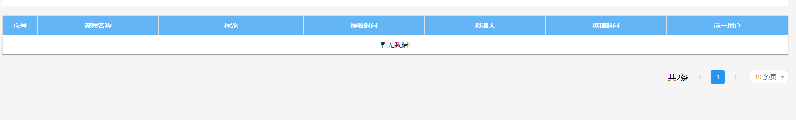
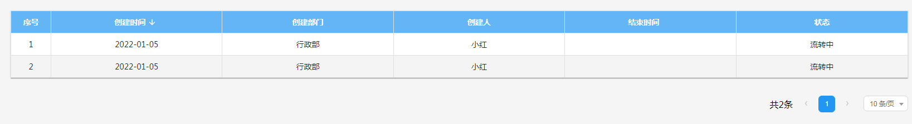
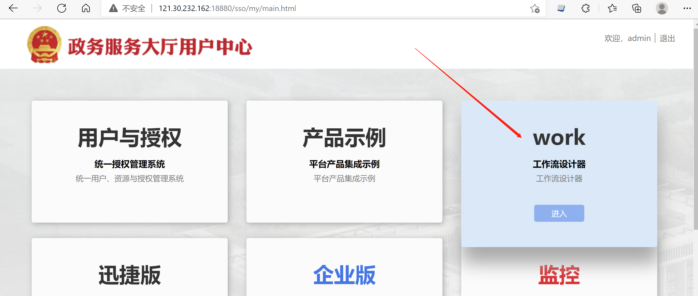
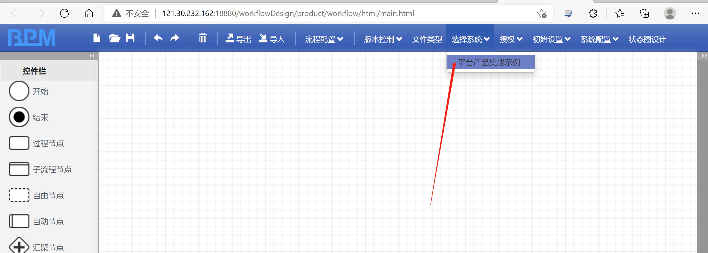
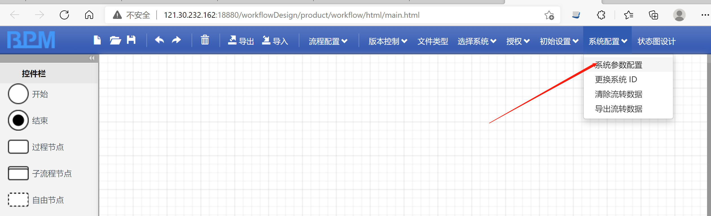
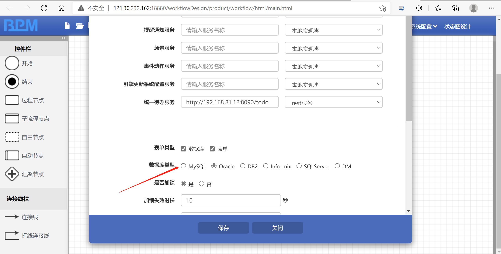
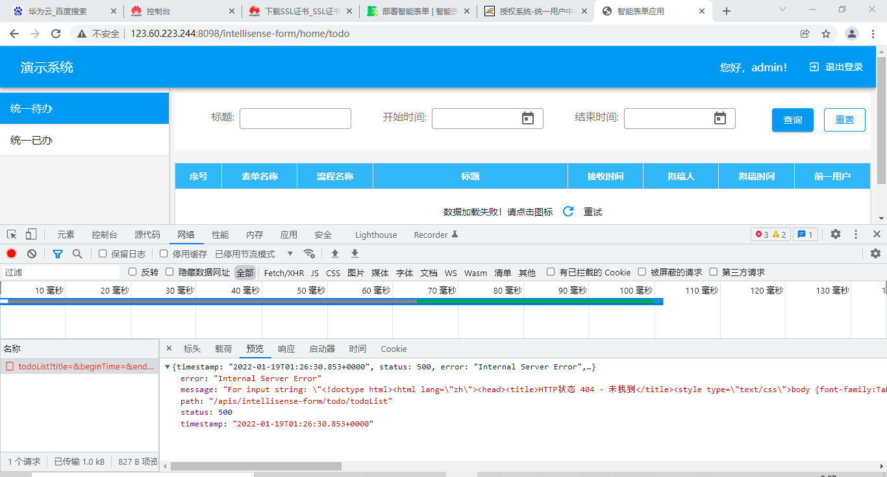
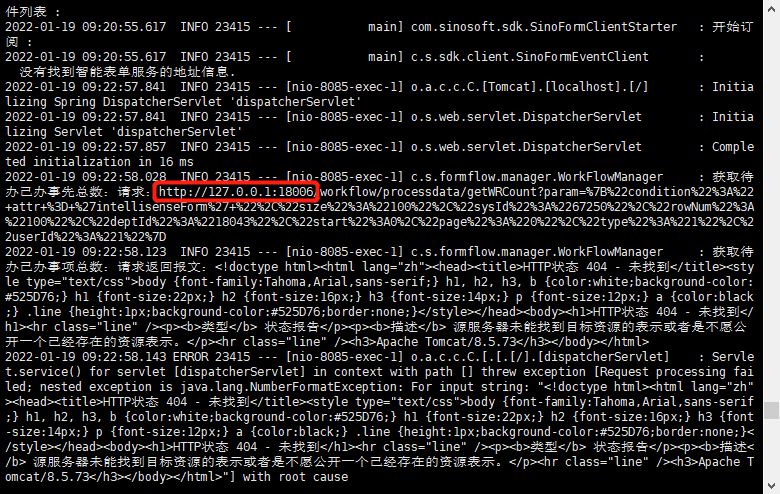

## 1. 发送流程成功的提示中显示乱码

发送流程成功后的提示中包含中文乱码的情况，一般时因为部署工作流服务时，没有配置好 tomcat 的原因导致的。

解决方式：设置 workflow 项目的 tomcat 字符集 为 `utf-8`。需要修改 tomcat 下 `conf/server.xml` 文件。如下所示：

```xml title="conf/server.xml" {7}
<Connector
  port="8080"
  protocol="HTTP/1.1"
  connectionTimeout="20000"
  redirectPort="8443"
  useBodyEncodingForURI="true"
  URIEncoding="UTF-8"
/>
```

## 2. 点击“发送”出现超时问题

当点击“发送”按钮，出现超时的情况，一般是因为工作流配置中可能有调不通的远程事件配置。

解决方式：需要在工作流设计器平台---》系统配置，找到待办授权服务，清空服务名称，把后面的下拉选项，选择为本地实现类。然后重新启动工作流设计器服务。

## 3. 配置的是 oracle 数据库类型，但是发布表单时，却采用 MySQL 语法的 SQL 语句生成数据库表

这种情况往往是忘记配置 `database.type`，或者配置有误。

解决方式：请正确配置 `database.type`。

正确的配置：

```yaml title="config/application.yml" {2}
database:
  type: oracle
```

错误的配置：

```text title="config/application.yml" {2}
database:
  type:oracle
```

请检查 `type: oracle` 之间是否有空格。如果没有空格，则不符合 `yaml` 语法。

## 4. 配置的扩展接口没有起作用

大部分情况下是配置格式不正确导致的。如下错误的 `application.yml` 配置：

```yaml title="application-dev.yaml" {5}
sinoform:
  workflow-design-server-uri: 192.168.80.142:8080
  workflow-server-uri: 192.168.80.142:18003
  uias-server-uri: 192.168.80.142:18001
  url:
    resource-publish-url: http://192.168.90.110:19001/extend-resource-publish
```

上面的配置是在 `sinoform` 中添加了 `url.resource-publish-url` 配置，即相当于：

```yaml
sinoform.url.resource-publish-url: http://192.168.90.110:19001/extend-resource-publish
```

但是智能表单关于扩展链接的配置都是以 `url` 开头的，而非 `sinoform.url` 开头的，即：

```yaml
url.resource-publish-url: http://192.168.90.110:19001/extend-resource-publish
```

所以，正确的配置如下：

```yaml title="application-dev.yaml" {6}
sinoform:
  workflow-design-server-uri: 192.168.80.142:8080
  workflow-server-uri: 192.168.80.142:18003
  uias-server-uri: 192.168.80.142:18001

url:
  resource-publish-url: http://192.168.90.110:19001/extend-resource-publish
```

:::warning 注意

请注意 `url` 的缩进。`url` 与 `sinoform` 是对齐的。

:::

## 5. 突然无法访问表单设计器

表单设计器一直是可用的，但是突然某一天无法使用了，出现类似下面的页面：


首先验证一下后台服务是否正常运行：

```http
http://[智能表单ip]:[智能表单后台服务端口号]/actuator/health
```

如果能够正常访问，则查看一下后台日志，看报什么错误。根据日志错误做相关的处理。下面的章节介绍常见的日志错误如何处理。

### 5.1. 获取当前用户业务角色信息失败

从日志中搜索出以下关键信息，说明获取当前用户业务角色信息失败：

```bash
获取用户的角色【请求】，url：http://127.0.0.1:18001/uias/resource/getFlowRolesById , 参数uid:1,subId:67250
获取用户的角色【响应】:<!doctype html><html lang="en"><head><title>HTTP Status 500 Internal Server Error</title><style type="text/css">
h1 {font-family:Tahoma,Arial,sans-serif;color:white;background-color:#525D76;font-size:22px;} h2 {font-family:Tahoma,Arial,sans-serif;
color:white;background-color:#525D76;font-size:16px;} h3 {font-family:Tahoma,Arial,sans-serif;color:white;background-color:#525D76;font-size:14px;}
body {font-family:Tahoma,Arial,sans-serif;color:black;background-color:white;} b {font-family:Tahoma,Arial,sans-serif;color:white;background-color:#525D76;}
p {font-family:Tahoma,Arial,sans-serif;background:white;color:black;font-size:12px;} a {color:black;} a.name {color:black;}
.line {height:1px;background-color:#525D76;border:none;}</style></head><body><h1>HTTP Status 500 Internal Server Error</h1><hr class="line" /><p>
<b>Type</b> Exception Report</p><p><b>Message</b> java.lang.NullPointerException</p><p><b>Description</b>
The server encountered an unexpected condition that prevented it from fulfilling the request.</p><p>
<b>Exception</b></p><pre>org.jboss.resteasy.spi.UnhandledException: java.lang.NullPointerException
```

以及下面这样的关键信息：

```bash {2}
</pre><p><b>Root Cause</b></p><pre>java.lang.NullPointerException
	com.sinosoft.authorization.module.system.itsubs.service.SysSubRdInfoServiceImpl.getShareRoleSubBySubId(SysSubRdInfoServiceImpl.java:272)
```

这样的日志一般是因为我们将 `平台产品集成示例` 子系统清除导致的。我们可以创建一个新的子系统，然后在智能表单中重新配置一下子系统即可，配置请见：[configs.systemId 配置项](config-resource-publish.md#configssystemid-配置项)。

## 6. 待办列表查询不到数据
### 问题描述
待办列表中无数据：



但是查询列表中已经有数据：



### 问题原因

由于项目组使用的是mysql数据库，但工作流设计器中系统参数默认配置的数据库是oracle。

### 解决办法

将数据库修改为mysql即可解决上述问题，修改步骤如下：







## 7. 待办/已办 列表页数据加载失败
### 问题描述
待办列表页报错：



### 问题原因
工作流服务地址配置错误，报错日志如下：



### 解决办法

- 检查工作流服务是否正常运行
- 检查只能表单后端application.xml配置项sinoform.workflow-server-uri是否配置错误