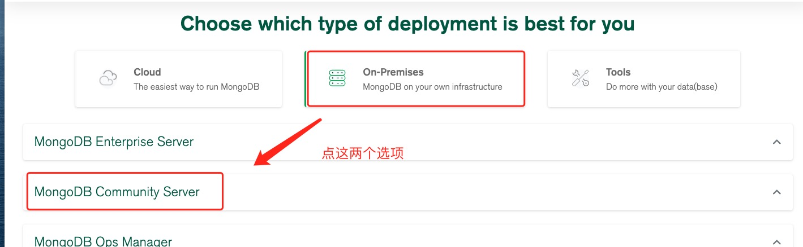

# 安装mongodb

## 下载

下载链接：[mongodb官网下载链接](https://www.mongodb.com/try/download/community)




此处我选择的通过下载链接进行下载，复制链接后在服务器执行下载命令：

~~~
wget https://fastdl.mongodb.org/linux/mongodb-linux-x86_64-ubuntu2004-5.0.3.tgz
~~~


## 安装

- 解压下载的安装包

  ~~~
  tar zxvf mongodb-linux-x86_64-ubuntu2004-5.0.3.tgz
  ~~~

  

- 移动到指定目录

  ~~~
  mv mongodb-linux-x86_64-ubuntu2004-5.0.3 /usr/local/mongodb5.0.3
  ~~~

  

- 默认情况下 MongoDB 启动后会初始化以下两个目录：
  
  - 数据存储目录：/var/lib/mongodb
  - 日志文件目录：/var/log/mongodb
  
  创建这两个目录
	
  ```
  mkdir -p /var/lib/mongodb
  mkdir -p /var/log/mongodb
  ```


## 配置

创建 /etc/mongod.conf 配置文件，文件内容如下：

~~~
#日志配置
systemLog:
   destination: file
   path: /var/log/mongodb/mongod.log
   logAppend: true

#后台运行
processManagement:
   fork: true

#监听所有ip(0.0.0.0),端口27017
net:
   bindIpAll: true
   port: 27017

#配置不需要密码即可访问数据库
security:
   authorization: disabled

#数据存储位置，journal 日志用来数据恢复
storage:
   dbPath: /var/lib/mongodb
   journal:
      enabled: true
~~~


## 启动

- 启动mongodb

  ~~~
  cd /usr/local/mongodb5.0.3/bin
  
  ./mongod -f /etc/mongod.conf
