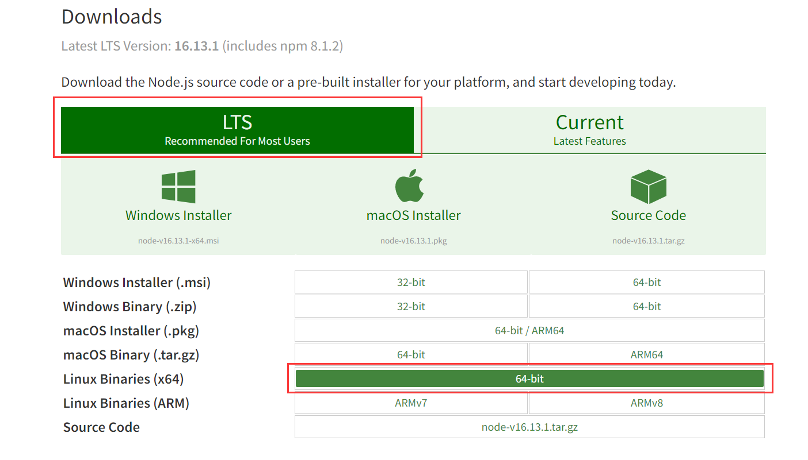
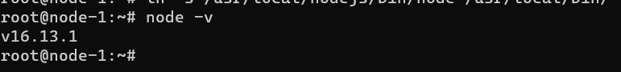

## 下载

下载链接：[nodejs 官网下载链接](https://nodejs.org/en/download/)。如下图所示方法进行下载：

第一步：



可以直接下载，也可以右键选择【复制链接地址】下载。

这里我们采用链接下载方式，拷贝链接到服务器执行：

```bash
wget https://nodejs.org/dist/v16.13.1/node-v16.13.1-linux-x64.tar.xz
```

## 安装

### 解压下载的安装包

```bash
tar -xvf node-v16.13.1-linux-x64.tar.xz
```

### 移动到指定目录

```bash
mv node-v16.13.1-linux-x64 /usr/local/nodejs
```

确认一下`/usr/local/nodejs`下 bin 目录是否有 node 和 npm 文件，如果有则继续后面操作，否则重新下载执行上边步骤

### 建立软连接，使 nodejs 变成全局

执行下面的命令使 nodejs 全局可用：

```bash
ln -s /usr/local/nodejs/bin/npm /usr/local/bin/

ln -s /usr/local/nodejs/bin/node /usr/local/bin/
```

配置完成之后，直接执行`node -v`验证是否全局可用，如果出现下图信息，则表示`nodejs`全局可用。


