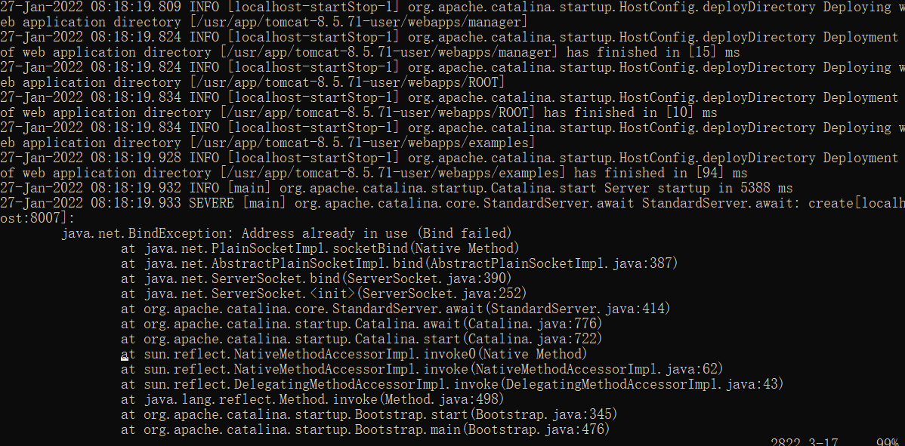
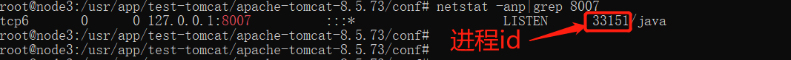
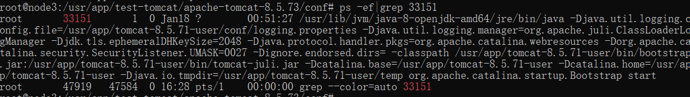

## tomcat 安装指南

[tomcat 安装指南](http://sinomatrix.gitee.io/sino-matrix-website/docs/deploy/prod/middleware/)

## 多 tomcat 配置

一台服务器部署多个 tomcat 需要注意端口不要冲突，否则tomcat可能会启动失败，默认 tomcat 配置如下（tomcat8）：

```xml title='conf/server.xml'
<?xml version="1.0" encoding="UTF-8"?>

<Server port="8005" shutdown="SHUTDOWN">
  <Listener className="org.apache.catalina.startup.VersionLoggerListener" />
  <Listener className="org.apache.catalina.core.AprLifecycleListener" SSLEngine="on" />
  <Listener className="org.apache.catalina.core.JreMemoryLeakPreventionListener" />
  <Listener className="org.apache.catalina.mbeans.GlobalResourcesLifecycleListener" />
  <Listener className="org.apache.catalina.core.ThreadLocalLeakPreventionListener" />

  <GlobalNamingResources>
    <Resource name="UserDatabase" auth="Container"
              type="org.apache.catalina.UserDatabase"
              description="User database that can be updated and saved"
              factory="org.apache.catalina.users.MemoryUserDatabaseFactory"
              pathname="conf/tomcat-users.xml" />
  </GlobalNamingResources>

  <Service name="Catalina">

    <Connector port="8080" protocol="HTTP/1.1"
               connectionTimeout="20000"
               redirectPort="8443" />
    <Engine name="Catalina" defaultHost="localhost">

      <Realm className="org.apache.catalina.realm.LockOutRealm">
        <Realm className="org.apache.catalina.realm.UserDatabaseRealm"
               resourceName="UserDatabase"/>
      </Realm>

      <Host name="localhost"  appBase="webapps"
            unpackWARs="true" autoDeploy="true">
        <Valve className="org.apache.catalina.valves.AccessLogValve" directory="logs"
               prefix="localhost_access_log" suffix=".txt"
               pattern="%h %l %u %t &quot;%r&quot; %s %b" />
      </Host>
    </Engine>
  </Service>
</Server>
```

其中 8005 为关闭通信端口， 8080 为应用端口， 8443 为SSL端口， SSL端口默认情况下是不监听的，所以我们只需要将多个 tomcat 中的`关闭通信端口`和`应用端口`修改为互相不冲突的端口即可。

## 端口冲突错误排查



tomcat 启动失败后，查看 logs/catalina.out 日志最后的报错信息（如上图），从以上报错中很容易可以找到冲突的端口为 8007 ，我们需要将报错的 tomcat 的 server.xml 中的 8007 端口修改为未被占用的端口号。

若想查看是哪个进程占用了 8007 端口可以使用以下命令，先查出占用端口的进程 id：
```shell
$ netstat -anp|grep 8007
```


再根据 pid 查出占用端口的进程信息：
```shell
$ ps -ef|grep 33151
```

