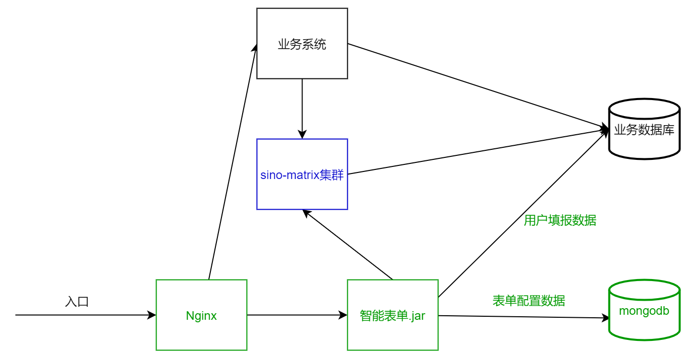

import BundleLink from "../src/oss/BundleLink";
import DownloadBundleShell from "../src/oss/DownloadBundleShell";
import Tabs from "@theme/Tabs";
import TabItem from "@theme/TabItem";
import ConfigTools from "../src/config-tools";
import StartBackendShell from "../src/oss/StartBackendShell";

目前的智能表单版本推荐与 sinomatrix 组合在一起使用，本文将会介绍智能表单的[部署架构图](#部署架构图)，让您了解智能表单的组成部分。然后一一讲解如何部署每个组成部分。

## 部署架构图

智能表单的部署架构图如下：



下面逐个解释每个区块的用途。

### 业务系统

`业务系统` 是项目组已有的业务平台，如正在运营的 OA 项目。智能表单发布的表单是需要有一个宿主平台来展现表单页面的。根据集成方式不同，集成方案也不同。可以联系智能表单小组成员，商讨集成方案。（集成方案不影响部署方式）

> 注意：智能表单也可以不依赖 `业务系统` 独立使用。但是这部分文档还没有整理出来，敬请期待。

### 业务数据库

`业务数据库` 是项目组业务系统使用的关系型数据库。`智能表单`需要连接此数据库，将用户填写的表单数据存储在业务数据库中。

### sino-matrix 集群

智能表单产品依赖 sino-matrix 集群。最低版本要求是 1.6.31。如果业务系统已经基于 sino-matrix 构建的，那么只需要将 sino-matrix 平台升级到 1.6.31 即可。如果没有，则需要安装 sino-matrix 平台。参考以下文档：

- [sino-matrix 部署手册](http://sinomatrix.gitee.io/sino-matrix-website/docs/deploy/prod/home)
- [sino-matrix 版本变更记录](http://47.93.34.153:10080/sino-matrix/sino-matrix/blob/master/CHANGELOG.md) 注意：访问此地址时可能会出现 ERR_UNSAFE_PORT 的情况，请参看[这篇帖子](https://blog.csdn.net/kjcxmx/article/details/118122483)配置一下浏览器。

sino-matrix 安装包可以从版本变更记录中找到下载链接。

智能表单依赖的 sino-matrix 平台的服务有：

- [统一授权](http://sinomatrix.gitee.io/sino-matrix-website/docs/deploy/prod/uias-mnet)
- [统一授权接口服务](http://sinomatrix.gitee.io/sino-matrix-website/docs/deploy/prod/uias)
- [单点登录](http://sinomatrix.gitee.io/sino-matrix-website/docs/deploy/prod/sso)
- [工作流设计器](http://sinomatrix.gitee.io/sino-matrix-website/docs/deploy/prod/workflow-design)
- [工作流引擎](http://sinomatrix.gitee.io/sino-matrix-website/docs/deploy/prod/workflow)
- [工作流平台适配服务](http://sinomatrix.gitee.io/sino-matrix-website/docs/deploy/prod/workflow-uias)

### Nginx

Nginx 主要承担两个职责：

- 职责一：作为智能表单前端代码的静态 Web 服务器
- 职责二：作为路由转发的反向代理服务器

之所以有职责二，是因为业务系统和智能表单如果是同一个域（即访问的地址和端口号一致），那么在业务系统中集成智能表单页面将会比较简单，不用考虑浏览器跨域的要求。

### 智能表单.jar

智能表单后端采用 Java 8 开发，所以需要 Java 8+ 环境才能运行。

### MongoDB

智能表单采用 MongoDB 存储表单配置数据、权限配置数据、意见数据、附件数据等。

智能表单最低使用 MongoDB 3.0。

### 总结

智能表单中的每一个区块都可以在同一台服务器部署或者分散到多台服务器部署。请您根据自身情况选择合适的部署模型即可。

智能表单也可以独立于 sino-matrix 平台单独运行，但是需要您实现很多扩展接口，来对接以下功能：

- 单点登录
- 导航资源管理与授权
- 流程流转
- 应用的业务角色管理
- 查看部门人员组织机构信息

后续会专门开辟一个系列的文章，讲解如何实现这些扩展接口，实现与非 sino-matrix 平台进行集成。

接下来将会一一讲解智能表单每个组成部分的安装和部署。

## 第一步：环境准备

请事先安装好以下软件：

- Java 8+
- Nginx
- Mongodb 3.0+

## 第二步：下载智能表单部署资源

我们需要下载智能表单资源，并解压缩到服务器的任意目录中（如果是 Linux 服务器，需要注意文件访问权限）。例如，将文件放入 `/apps/sino-intellisense-form` 目录中。经过下载和解压缩，最终会形成下面的文件目录：

```
/apps/sino-intellisense-form
|___ frontend                  --------------------------> 智能表单前端资源，包含的子目录和文件都是从前端压缩包中解压出来的
  |___ intellisense-form
  |___ intellisense-form-manger
  |___ intellisense-form-mobile
|___ backend                   ---------------------------> 智能表单后端资源
  |___ config                  ---------------------------> 后端配置，在部署智能表单后端的章节中会介绍
    |___ application.yml
    |___ application-dev.yml
    |___ application-test.yml
    |___ application-prod.yml
  |___ sino-intellisense-form-v1.11.2.jar -----------------> 需要下载
```

### 步骤一：创建目录

需要手动创建以下目录

```bash
# 创建前端文件夹
$ mkdir -p /apps/sino-intellisense-form/frontend
# 创建后端文件夹
$ mkdir -p /apps/sino-intellisense-form/backend/config
```

### 步骤二：下载智能表单前端发布包

下载并解压缩<BundleLink type="frontend">智能表单前端发布包</BundleLink>，如下所示：

<DownloadBundleShell type="frontend" />

### 步骤三：下载智能表单后端发布包

下载并解压缩<BundleLink type="backend">智能表单后端发布包</BundleLink>，如下所示：

<DownloadBundleShell type="backend" />

## 第三步：部署智能表单前端

在前一章节，我们已经下载了前端发布包，现在我们需要配置 nginx，让 nginx 做两件事情，即：

- 控制前端资源的访问
- 路由分发

这两件事情通过以下 nginx 的配置即可完成：

<Tabs defaultValue="1"
  values={[
    { label: "必要的配置", value: "1" },
    { label: "参考的完整配置", value: "2" },
  ]}>
  <TabItem value="1">

```nginx title="nginx.conf"
http {
  # 配置业务系统服务（以实际业务为准）
  upstream main_web_app {
    server 127.0.0.1:8080;
  }

  # 配置智能表单后端服务（服务端口号以部署后端时的配置为基准）
  upstream sinoform_web_app {
    server 127.0.0.1:8085;
  }

  server {
    listen 80;

    # 指定智能表单静态资源的根路径
    root /apps/sino-intellisense-form/frontend;

    # 默认请求转交给主应用处理
    location / {
      proxy_set_header Host $host;
      proxy_set_header X-Forwarded-For $proxy_add_x_forwarded_for;
      proxy_set_header X-Forwarded-Host $http_host;
      proxy_set_header X-Forwarded-Port $server_port;
      proxy_set_header X-Forwarded-Proto $scheme;
      proxy_set_header X-Real-IP $remote_addr;
      proxy_pass http://main_web_app;
    }

    # 智能表单后端请求转交给智能表单后端服务处理
    location /apis/intellisense-form/ {
      proxy_set_header Host $host;
      proxy_set_header X-Forwarded-For $proxy_add_x_forwarded_for;
      proxy_set_header X-Forwarded-Host $http_host;
      proxy_set_header X-Forwarded-Port $server_port;
      proxy_set_header X-Forwarded-Proto $scheme;
      proxy_set_header X-Real-IP $remote_addr;
      proxy_pass http://sinoform_web_app;
    }

    # 配置主题入口文件不做缓存
    location ~ .\*/remote-entry.js$ {
      add_header Cache-Control no-store;
    }

    # 智能表单PC端应用（支持 history 模式，即单页面应用）
    location /intellisense-form/ {
      index index.html index.htm;
      try_files $uri $uri/ /intellisense-form/index.html;
      add_header Cache-Control no-store;
    }

    # 智能表单移动端应用（支持 history 模式，即单页面应用）
    location /intellisense-form-mobile/ {
      index index.html index.htm;
      try_files $uri $uri/ /intellisense-form-mobile/index.html;
      add_header Cache-Control no-store;
    }

    # 智能表单管理应用（支持 history 模式，即单页面应用）
    location /intellisense-form-manager/ {
      index index.html index.htm;
      try_files $uri $uri/ /intellisense-form-manager/index.html;
      add_header Cache-Control no-store;
    }

    # 缓存智能表单静态资源
    location ~ /intellisense-form.*\.(gif|jpg|jpeg|png|bmp|swf|js|css|md|pdf)$ {
      expires 365d;
    }
  }
}
```

  </TabItem>
  <TabItem value="2">

```nginx title="nginx.conf" {45-47,55,69-77,80-82,85-89,92-96,99-103,106-108}
# nginx 启动时使用的用户
user nobody;
# 工作进程数，在生产环境中建议配置为 4
worker_processes 4;

events {
  # 单个工作进程可以允许同时建立外部连接的数量
  worker_connections 10000;
}

http {
  include       mime.types;
  default_type  application/octet-stream;

  log_format  main  '$remote_addr - $remote_user [$time_local] "$request" '
                    '$status $body_bytes_sent "$http_referer" '
                    '"$http_user_agent" "$http_x_forwarded_for"';

  # 优化静态资源的访问性能
  sendfile        on;

  # 启用 gzip 压缩，注意需要在安装 nginx 时启用 gzip 模块
  gzip  on;
  gzip_buffers 16 8k;
  gzip_comp_level 6;
  gzip_http_version 1.1;
  gzip_min_length 256;
  gzip_proxied any;
  gzip_vary on;
  gzip_types
      text/xml application/xml application/atom+xml application/rss+xml application/xhtml+xml image/svg+xml
      text/javascript application/javascript application/x-javascript
      text/x-json application/json application/x-web-app-manifest+json
      text/css text/plain text/x-component
      font/opentype application/x-font-ttf application/vnd.ms-fontobject
      image/x-icon;
  gzip_disable "MSIE [1-6]\.";

  # 配置业务系统服务（以实际业务为准）
  upstream main_web_app {
    server 127.0.0.1:8080;
  }

  # 配置智能表单后端服务（服务端口号以部署后端时的配置为基准）
  upstream sinoform_web_app {
    server 127.0.0.1:8085;
  }

  server {
    # 启用 80 端口
    listen 80;
    server_name localhost;

    # 指定智能表单静态资源的根路径
    root /apps/sino-intellisense-form/frontend;

    # 默认请求转交给主应用处理
    location / {
      proxy_set_header Host $host;
      proxy_set_header X-Forwarded-For $proxy_add_x_forwarded_for;
      proxy_set_header X-Forwarded-Host $http_host;
      proxy_set_header X-Forwarded-Port $server_port;
      proxy_set_header X-Forwarded-Proto $scheme;
      proxy_set_header X-Real-IP $remote_addr;
      proxy_pass http://main_web_app;
    }

    # 智能表单后端请求转交给智能表单后端服务处理
    location /apis/intellisense-form/ {
      proxy_set_header Host $host;
      proxy_set_header X-Forwarded-For $proxy_add_x_forwarded_for;
      proxy_set_header X-Forwarded-Host $http_host;
      proxy_set_header X-Forwarded-Port $server_port;
      proxy_set_header X-Forwarded-Proto $scheme;
      proxy_set_header X-Real-IP $remote_addr;
      proxy_pass http://sinoform_web_app;
    }

    # 配置主题入口文件不做缓存
    location ~ .\*/remote-entry.js$ {
      add_header Cache-Control no-store;
    }

    # 智能表单PC端应用（支持 history 模式，即单页面应用）
    location /intellisense-form/ {
      index index.html index.htm;
      try_files $uri $uri/ /intellisense-form/index.html;
      add_header Cache-Control no-store;
    }

    # 智能表单移动端应用（支持 history 模式，即单页面应用）
    location /intellisense-form-mobile/ {
      index index.html index.htm;
      try_files $uri $uri/ /intellisense-form-mobile/index.html;
      add_header Cache-Control no-store;
    }

    # 智能表单管理应用（支持 history 模式，即单页面应用）
    location /intellisense-form-manager/ {
      index index.html index.htm;
      try_files $uri $uri/ /intellisense-form-manager/index.html;
      add_header Cache-Control no-store;
    }

    # 缓存智能表单静态资源
    location ~ /intellisense-form.*\.(gif|jpg|jpeg|png|bmp|swf|js|css|md|pdf)$ {
      expires 365d;
    }
  }
}
```

  </TabItem>
</Tabs>

上面提供了两份 nginx 配置。如果您是 nginx 高手，非常熟悉 nginx 配置，那么看“必要的配置”即可；如果您没有接触过 nginx，那么可以直接使用“参考的完整配置”，并启动 nginx。

调整完配置后，别忘了告诉 nginx 重新加载配置：

```bash
nginx -s reload
```

## 第四步：部署智能表单后端

在部署智能表单后端前，先需要编写配置文件，然后通过 `java` 命令行启动后端项目。

### 步骤一：配置智能表单后端

通过下面的工具，生成智能表单后端配置：

<ConfigTools />

将生成的 `config.zip` 文件解压到 `/apps/sino-intellisense-form/backend/config` 目录中：

```bash
unzip config.zip -d /apps/sino-intellisense-form/backend/config
```

> 如果想更细致地配置智能表单，请移步 [项目组自定义配置](./config-custom.mdx)，查看详细的配置说明。

### 步骤二：启动智能表单

进入 `/apps/sino-intellisense-form/backend`，运行智能表单 jar 包即可：

<StartBackendShell />

启动大约需要 15 秒，15 秒后请访问 [http://localhost:8080/actuator/info](http://localhost:8080/actuator/info) 地址，如果出现类似下面的信息，说明启动成功：

```json
{
  "build": {
    "artifact": "intellisenseform-bff",
    "name": "intellisenseform-bff",
    "time": "2021-08-27T09:54:03.631Z",
    "version": "1.11.2",
    "group": "com.sinosoft"
  }
}
```

:::warning

在麒麟操作系统中，通过 `nohup` 在后台启动智能表单时，可能找不到 `config` 目录下的配置文件。如果出现这样的问题，请通过类似下面的命令行启动：

```bash
nohup java -Dspring.config.location=/apps/sino-intellisense-form/backend/config/application.yml \
           -Dspring.config.location=/apps/sino-intellisense-form/backend/config/application-test.yml \
           -Dspring.profiles.active=test \
           -jar sino-intellisense-form-v1.11.2.jar > intellisenseform.log &
```

如果您有更好的方式解决此问题，请您不吝赐教。

:::

## 第五步：在您的业务系统中嵌入智能表单页面

敬请期待，稍后介绍。

## 大功告成

恭喜您已成功部署智能表单，大功告成。请您使用智能表单吧。
