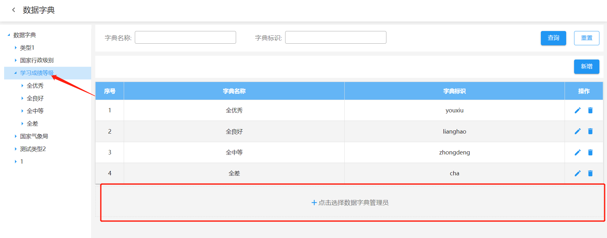
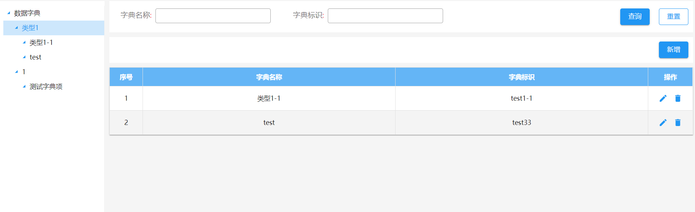

## 需求

在数据字典中添加分类管理员，在一级数据字典下可以选择管理员，分类管理员可以对该项之下的数据进行新增、修改和删除操作。

## 设计

### 原数据字典界面

原数据字典界面视为超级管理员的配置界面。超级管理员在一级数据字典的维护列表界面，添加选择数据字典管理员的按钮。点击按钮后，弹窗展示人员选择树，超级管理员在此维护当前数据字典的分类管理员。

:::info
此按钮只存在于超级管理员的一级数据字典维护界面。
:::

### 分类管理员界面

1. 新增分类管理员界面，新增的分类管理员界面与原有的数据字典界面保持一致。
   用户登录系统后进入分类管理员界面，系统会显示当前登录人作为分类管理员所能维护的数据。分类管理员只能修改一级数据字典以下的数据。

2. 新增的界面需要项目组手动在统一授权中发布资源。新界面的 url：`/intellisense-form/form-app/dictionary/fh`

:::warning 注意
分类管理员只能由超级管理员设置，分类管理员无法由另外一个分类管理员设置。
:::
