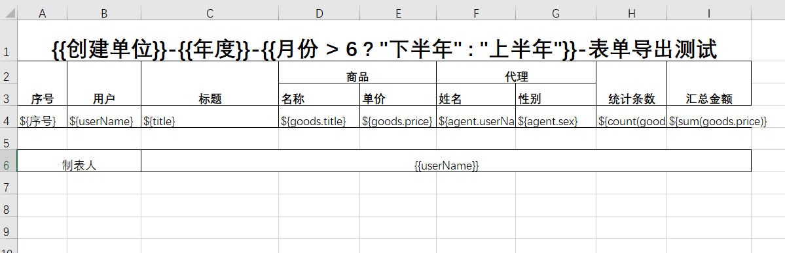
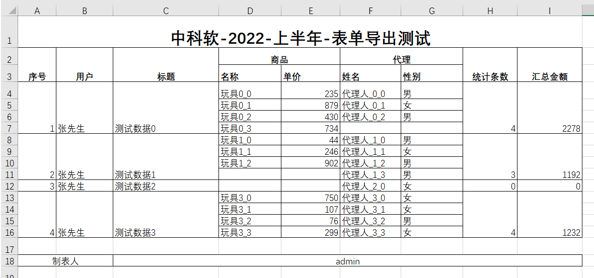

这篇文章将介绍如何以插件的方式开发项目组自己的导出 Excel 按钮。示例采用 React 开发。

需求：导出列标中勾选的数据

## 实现

### 1. 开启列标勾选的功能

```typescript title="src/plugins/export-excel-button/index.ts"
import appSetting from '@sinoform/app-setting';

appSetting.listPageConfig.addSelectable({
  type: 'ALL_PAGE',
  formId: '*',
});
```

### 2. 开发导出按钮组件

```typescript title="src/plugins/export-excel-button/ExportButton.ts"
import React from 'react';

export default function ExportButton() {
  return <button>导出Excel</button>;
}
```

我们通过`@sinoform/helper-export-excel`提供的`exportExcel`辅助方法来实现导出 Excel 功能。此方法接收如下参数：

- template: 模板文件 Buffer 数据
- data: 导出的 Excel 数据
- title: 导出的 Excel 标题
- formItems: 导出的表单字段配置
- extraData: 额外数据，用于 excel 模板的插值表达式解析

此案例我们以本地上传的文件来获取文件的 Buffer 数据，也可以通过后端接口读取远程数据。

```typescript title="src/plugins/export-excel-button/ExportButton.ts"
import React from 'react';

export default function ExportButton({ dataSource, formDesignSetting }: any) {
  // 获取表单项配置
  const {
    formConfig: { items: formItems },
  } = formDesignSetting;

  const handleChange = async (e: any) => {
    const file = e.target.files?.[0];
    if (!file) return;

    const { default: exportExcel } = await import(
      '@sinoform/helper-export-excel'
    );

    const fr = new FileReader();

    fr.readAsBinaryString(file);

    fr.onload = (e) => {
      // 从dataSource中获取选中列表项的值
      const { items, selectIds } = dataSource;
      const data = items.filter(({ id }) =>
        selectIds.some((item) => item === id)
      );
      // 调用辅助方法，生成Excel
      exportExcel(e.target.result, data, '测试.xlsx', formItems);
    };
  };
  return <input type="file" onChange={handleChange} />;
}
```

3. 将导出按钮注册到 appSetting 中

```typescript title="src/plugins/export-excel-button/index.ts"
import appSetting from '@sinoform/app-setting';

appSetting.listPageConfig.addSelectable({
  type: 'ALL_PAGE',
  formId: '*',
});

appSetting.listPageConfig.addButton({
  type: 'ALL_PAGE',
  formId: '*',
  render: React.lazy(() => import('./ExportButton')),
  pos: 'left',
});
```

4. 在插件入口文件中引入配置，使其生效

```typescript title="src/index.ts"
import './plugins/export-excel-button';
```

## 模板的要求

### 模板语法

#### ${表达式}

- ${表单项}: 表示要打印的表单值
- count: 用于统计当前表单值中子表单的数据条数，格式：${count(field_1.field_2)}
- sum: 用户汇总当前表单值中子表单的数据累计值，格式：${sum(field_1.field_2)}

#### 插值表达式

使用`{{字段值}}`这种插值表达式的方式来读取`extraData`中的配置，来达到动态生成导出 excel 数据的目的。

:::info
导出辅助方法目前只读取 Excel 模板第一个 sheet 页的内容，并根据内容生成对应的列表数据。
:::



打印的效果


