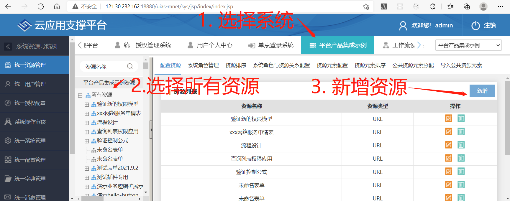
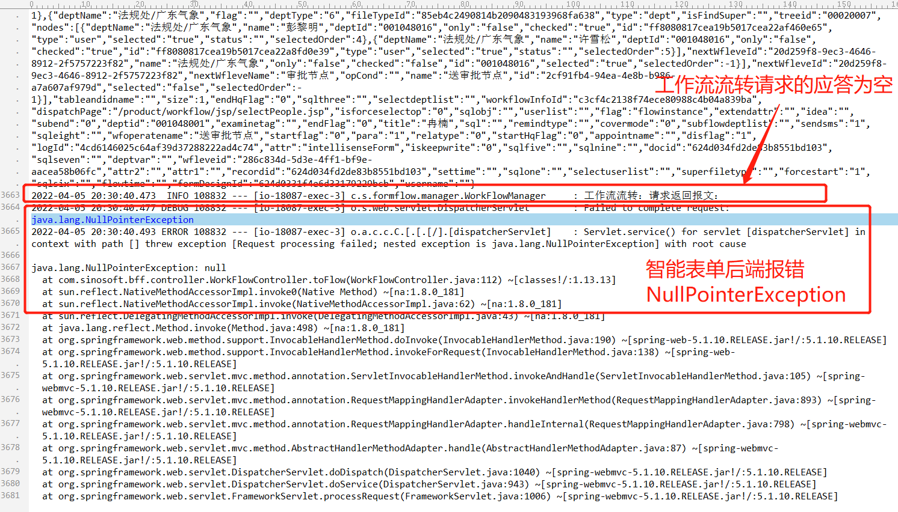
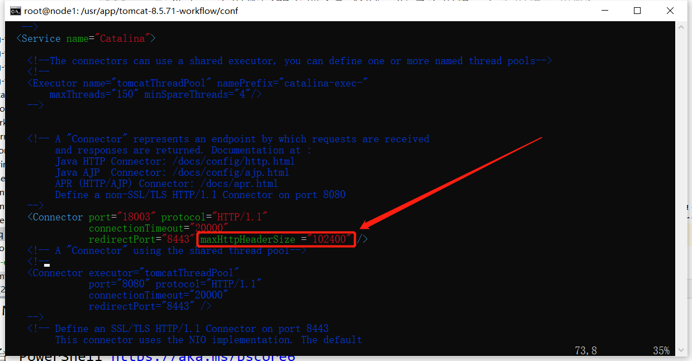

## 1. 表单发布失败

### 1.0. 通用解决方案

如果您遇到表单发布失败的情况，可以先查看一下 FAQ 中记录的现象和解决方案。如果没有类似的，可以联系智能表单工作组成员（在微信群“智能表单技术交流”中沟通或者直接与个人联系均可）解决问题。在联系智能表单工作组成员时，请先按照下面的步骤收集一下日志：

- 收集智能表单后台的日志
- 收集 sino-matrix-uias 的日志

### 1.1. 表单发布失败，后端报资源同步异常。

#### 出现此问题的版本

从 1.11.0 版本开始有此问题。

#### 出现场景

智能表单在与新搭建的 sino-matrix 平台使用时，如果 sinomatrix 的系统管理中没有添加任何资源，必出现此问题。

#### 问题现象

点击表单发布失败，查看智能表单的后台日志，出现类似下面的异常日志：

```bash
2021-09-22 22:59:06.011  INFO 76403 --- [io-18087-exec-3] c.s.resource.manager.ResourceManager     : 保存资源，
返回值:<html><head><title>Apache Tomcat/7.0.73 - Error report</title><style><!--H1 {font-family:Tahoma,Arial,sans-serif;color:white;background-color:#525D76;font-size:22px;} H2 {font-family:Tahoma,Arial,sans-serif;color:white;background-color:#525D76;font-size:16px;} H3 {font-family:Tahoma,Arial,sans-serif;color:white;background-color:#525D76;font-size:14px;} BODY {font-family:Tahoma,Arial,sans-serif;color:black;background-color:white;} B {font-family:Tahoma,Arial,sans-serif;color:white;background-color:#525D76;} P {font-family:Tahoma,Arial,sans-serif;background:white;color:black;font-size:12px;}A {color : black;}A.name {color : black;}HR {color : #525D76;}--></style> </head><body><h1>HTTP Status 500 - java.lang.RuntimeException: org.springframework.transaction.UnexpectedRollbackException: Transaction rolled back because it has been marked as rollback-only</h1><HR size="1" noshade="noshade"><p><b>type</b> Exception report</p><p><b>message</b> <u>java.lang.RuntimeException: org.springframework.transaction.UnexpectedRollbackException: Transaction rolled back because it has been marked as rollback-only</u></p><p><b>description</b> <u>The server encountered an internal error that prevented it from fulfilling this request.</u></p><p><b>exception</b> <pre>org.jboss.resteasy.spi.UnhandledException: java.lang.RuntimeException: org.springframework.transaction.UnexpectedRollbackException: Transaction rolled back because it has been marked as rollback-only
org.springframework.transaction.UnexpectedRollbackException: Transaction rolled back because it has been marked as rollback-only
        at org.springframework.transaction.support.AbstractPlatformTransactionManager.commit(AbstractPlatformTransactionManager.java:724)
        at org.springframework.transaction.interceptor.TransactionAspectSupport.commitTransactionAfterReturning(TransactionAspectSupport.java:485)
        at org.springframework.transaction.interceptor.TransactionAspectSupport.invokeWithinTransaction(TransactionAspectSupport.java:291)
        at org.springframework.transaction.interceptor.TransactionInterceptor.invoke(TransactionInterceptor.java:96)
        at org.springframework.aop.framework.ReflectiveMethodInvocation.proceed(ReflectiveMethodInvocation.java:179)
        at org.springframework.aop.framework.JdkDynamicAopProxy.invoke(JdkDynamicAopProxy.java:208)
        at com.sun.proxy.$Proxy55.saveResource(Unknown Source)
```

上面的日志表示调用创建资源接口错误。再查看一下 uias 服务的异常日志，如果出现类似下面的日志，那么可以断定是此问题：

```bash {2}
2021-09-22 23:01:00 [ ERROR ] - method:com.sinosoft.authorization.module.system.resource.dao.SysResourceDAOImpl.save(SysResourceDAOImpl.java:65)  save failed
org.springframework.dao.DataIntegrityViolationException: not-null property references a null or transient value: com.sinosoft.authorization.module.system.resource.po.SysResource.sysRtypeSub; nested exception is org.hibernate.PropertyValueException: not-null property references a null or transient value: com.sinosoft.authorization.module.system.resource.po.SysResource.sysRtypeSub
        at org.springframework.orm.hibernate4.SessionFactoryUtils.convertHibernateAccessException(SessionFactoryUtils.java:184)
        at org.springframework.orm.hibernate4.HibernateTemplate.doExecute(HibernateTemplate.java:344)
        ... 300 more
```

最重要的是第二行日志，表示 `sysRtypeSub` 字段为空。这个字段是表示资源类型，是从相关联的资源（如父资源、临近资源）中获取到的。所以，当没有找到相关资源时，此字段就会为空。

#### 解决方案

:::info

在后期版本中会修复此问题。在问题修复之前，请按照文档进行操作。

:::

需要在系统管理中为自己的应用（即与智能表单集成的应用）创建一个顶级资源，如下图所示：



### 1.2. 表单发布失败，sino-matrix-uias 服务报字段长度不够的异常

#### 出现此问题的版本

从 1.11.0 版本开始有此问题。

#### 出现场景

从低版本的 sino-matrix 升级到 1.6.30+ 版本的 sino-matrix-uias 之后，如果没有执行升级 SQL，则会出现此问题。

#### 问题现象

点击表单发布失败，查看智能表单后台日志，出现类似下面的异常日志：

```bash
2021-09-22 22:59:06.011  INFO 76403 --- [io-18087-exec-3] c.s.resource.manager.ResourceManager     : 保存资源，
返回值:<html><head><title>Apache Tomcat/7.0.73 - Error report</title><style><!--H1 {font-family:Tahoma,Arial,sans-serif;color:white;background-color:#525D76;font-size:22px;} H2 {font-family:Tahoma,Arial,sans-serif;color:white;background-color:#525D76;font-size:16px;} H3 {font-family:Tahoma,Arial,sans-serif;color:white;background-color:#525D76;font-size:14px;} BODY {font-family:Tahoma,Arial,sans-serif;color:black;background-color:white;} B {font-family:Tahoma,Arial,sans-serif;color:white;background-color:#525D76;} P {font-family:Tahoma,Arial,sans-serif;background:white;color:black;font-size:12px;}A {color : black;}A.name {color : black;}HR {color : #525D76;}--></style> </head><body><h1>HTTP Status 500 - java.lang.RuntimeException: org.springframework.transaction.UnexpectedRollbackException: Transaction rolled back because it has been marked as rollback-only</h1><HR size="1" noshade="noshade"><p><b>type</b> Exception report</p><p><b>message</b> <u>java.lang.RuntimeException: org.springframework.transaction.UnexpectedRollbackException: Transaction rolled back because it has been marked as rollback-only</u></p><p><b>description</b> <u>The server encountered an internal error that prevented it from fulfilling this request.</u></p><p><b>exception</b> <pre>org.jboss.resteasy.spi.UnhandledException: java.lang.RuntimeException: org.springframework.transaction.UnexpectedRollbackException: Transaction rolled back because it has been marked as rollback-only
org.springframework.transaction.UnexpectedRollbackException: Transaction rolled back because it has been marked as rollback-only
        at org.springframework.transaction.support.AbstractPlatformTransactionManager.commit(AbstractPlatformTransactionManager.java:724)
        at org.springframework.transaction.interceptor.TransactionAspectSupport.commitTransactionAfterReturning(TransactionAspectSupport.java:485)
        at org.springframework.transaction.interceptor.TransactionAspectSupport.invokeWithinTransaction(TransactionAspectSupport.java:291)
        at org.springframework.transaction.interceptor.TransactionInterceptor.invoke(TransactionInterceptor.java:96)
        at org.springframework.aop.framework.ReflectiveMethodInvocation.proceed(ReflectiveMethodInvocation.java:179)
        at org.springframework.aop.framework.JdkDynamicAopProxy.invoke(JdkDynamicAopProxy.java:208)
        at com.sun.proxy.$Proxy55.saveResource(Unknown Source)
```

上面的日志表示调用创建资源接口错误。再查看一下 sino-matrix-uias 服务的异常日志，如果出现类似下面的日志，那么可以断定是此问题：

```bash {2,6}
2021-10-19 14:37:54 [ WARN ] - method:org.hibernate.engine.jdbc.spi.SqlExceptionHelper.logExceptions(SqlExceptionHelper.java:145)  SQL Error: 1406, SQLState: 22001
2021-10-19 14:37:54 [ ERROR ] - method:org.hibernate.engine.jdbc.spi.SqlExceptionHelper.logExceptions(SqlExceptionHelper.java:147)  Data truncation: Data too long for column 'WORKID' at row 1
2021-10-19 14:37:54 [ ERROR ] - method:org.hibernate.engine.jdbc.batch.internal.BatchingBatch.performExecution(BatchingBatch.java:119)  HHH000315: Exception executing batch [could not perform addBatch]
2021-10-19 14:37:54 [ ERROR ] - method:com.sinosoft.authorization.util.tools.FromProcessUtil.saveModFromByProcess(FromProcessUtil.java:91)  org.springframework.dao.DataIntegrityViolationException: could not perform addBatch; SQL [insert into SYS_ROLE_SYST (SUB_ID, RESOURCE_ID, RLSY_NO, RLSY_NM, ORDER_NO, SUPER_RLSY_ID, MEMO, AUTHER, STATUS, TIME, SYS_DEF, ROLE_TYPE, TREE_ID, MODIFIY_TIME, MODIFIER, FLAG, DATA_SCOPE, WORKID, RLSY_ID) values (?, ?, ?, ?, ?, ?, ?, ?, ?, ?, ?, ?, ?, ?, ?, ?, ?, ?, ?)]; nested exception is org.hibernate.exception.DataException: could not perform addBatch
2021-10-19 14:37:54 [ ERROR ] - method:com.sinosoft.sinoep.api.auditlog.service.impl.SysAuditLogServiceImpl.logProcessSave(SysAuditLogServiceImpl.java:162)  接口执行异常
org.springframework.dao.DataIntegrityViolationException: could not perform addBatch; SQL [insert into SYS_ROLE_SYST (SUB_ID, RESOURCE_ID, RLSY_NO, RLSY_NM, ORDER_NO, SUPER_RLSY_ID, MEMO, AUTHER, STATUS, TIME, SYS_DEF, ROLE_TYPE, TREE_ID, MODIFIY_TIME, MODIFIER, FLAG, DATA_SCOPE, WORKID, RLSY_ID) values (?, ?, ?, ?, ?, ?, ?, ?, ?, ?, ?, ?, ?, ?, ?, ?, ?, ?, ?)]; nested exception is org.hibernate.exception.DataException: could not perform addBatch
        at org.springframework.orm.hibernate4.SessionFactoryUtils.convertHibernateAccessException(SessionFactoryUtils.java:167)
        at org.springframework.orm.hibernate4.HibernateTemplate.doExecute(HibernateTemplate.java:344)
        at org.springframework.orm.hibernate4.HibernateTemplate.executeWithNativeSession(HibernateTemplate.java:309)
        at org.springframework.orm.hibernate4.HibernateTemplate.find(HibernateTemplate.java:865)
        at com.sinosoft.authorization.module.system.resource.dao.SysResourceDAOImpl.getSysResourceByWorkId(SysResourceDAOImpl.java:1084)
        at com.sinosoft.authorization.module.system.resource.service.SysResourceServiceImpl.getSysResourceByWorkId(SysResourceServiceImpl.java:941)
        at com.sinosoft.authorization.module.system.resource.service.SysResourceServiceImpl$$FastClassBySpringCGLIB$$8e07c941.invoke(<generated>)
        at org.springframework.cglib.proxy.MethodProxy.invoke(MethodProxy.java:204)
        at org.springframework.aop.framework.CglibAopProxy$CglibMethodInvocation.invokeJoinpoint(CglibAopProxy.java:720)
        at org.springframework.aop.framework.ReflectiveMethodInvocation.proceed(ReflectiveMethodInvocation.java:157)
        at org.springframework.transaction.interceptor.TransactionInterceptor$1.proceedWithInvocation(TransactionInterceptor.java:99)
        at org.springframework.transaction.interceptor.TransactionAspectSupport.invokeWithinTransaction(TransactionAspectSupport.java:281)
        at org.springframework.transaction.interceptor.TransactionInterceptor.invoke(TransactionInterceptor.java:96)
        at org.springframework.aop.framework.ReflectiveMethodInvocation.proceed(ReflectiveMethodInvocation.java:179)
        at org.springframework.aop.interceptor.ExposeInvocationInterceptor.invoke(ExposeInvocationInterceptor.java:92)
        at org.springframework.aop.framework.ReflectiveMethodInvocation.proceed(ReflectiveMethodInvocation.java:179)
        at org.springframework.aop.framework.CglibAopProxy$DynamicAdvisedInterceptor.intercept(CglibAopProxy.java:655)
        at com.sinosoft.authorization.module.system.resource.service.SysResourceServiceImpl$$EnhancerBySpringCGLIB$$8f0a27c0.getSysResourceByWorkId(<generated>)
        at sun.reflect.NativeMethodAccessorImpl.invoke0(Native Method)
        at sun.reflect.NativeMethodAccessorImpl.invoke(NativeMethodAccessorImpl.java:62)
        at sun.reflect.DelegatingMethodAccessorImpl.invoke(DelegatingMethodAccessorImpl.java:43)
        at java.lang.reflect.Method.invoke(Method.java:498)
        at org.springframework.aop.support.AopUtils.invokeJoinpointUsingReflection(AopUtils.java:302)
        at org.springframework.aop.framework.ReflectiveMethodInvocation.invokeJoinpoint(ReflectiveMethodInvocation.java:190)
        at org.springframework.aop.framework.ReflectiveMethodInvocation.proceed(ReflectiveMethodInvocation.java:157)
        at org.springframework.transaction.interceptor.TransactionInterceptor$1.proceedWithInvocation(TransactionInterceptor.java:99)
        at org.springframework.transaction.interceptor.TransactionAspectSupport.invokeWithinTransaction(TransactionAspectSupport.java:281)
        at org.springframework.transaction.interceptor.TransactionInterceptor.invoke(TransactionInterceptor.java:96)
        at org.springframework.aop.framework.ReflectiveMethodInvocation.proceed(ReflectiveMethodInvocation.java:179)
        at org.springframework.aop.framework.JdkDynamicAopProxy.invoke(JdkDynamicAopProxy.java:208)
        at com.sun.proxy.$Proxy86.getSysResourceByWorkId(Unknown Source)
        at com.sinosoft.authorization.util.tools.FromProcessUtil.saveResRlsyCtrl(FromProcessUtil.java:1210)
        at com.sinosoft.authorization.util.tools.FromProcessUtil.saveRlsyResAuthCtrl(FromProcessUtil.java:1190)
        at com.sinosoft.authorization.util.tools.FromProcessUtil.saveRlsyResAuth(FromProcessUtil.java:1144)
        at com.sinosoft.authorization.util.tools.FromProcessUtil.saveFromByProcess(FromProcessUtil.java:1058)
        at com.sinosoft.authorization.util.tools.FromProcessUtil.saveModFromByProcess(FromProcessUtil.java:84)
        at com.sinosoft.sinoep.api.auditlog.dao.impl.SysAuditLogDaoImpl.logProcessSave(SysAuditLogDaoImpl.java:144)
        at com.sinosoft.sinoep.api.auditlog.service.impl.SysAuditLogServiceImpl.logProcessSave(SysAuditLogServiceImpl.java:148)
        at com.sinosoft.sinoep.api.auditlog.service.impl.SysAuditLogServiceImpl$$FastClassBySpringCGLIB$$835830af.invoke(<generated>)
        at org.springframework.cglib.proxy.MethodProxy.invoke(MethodProxy.java:204)
        at org.springframework.aop.framework.CglibAopProxy$CglibMethodInvocation.invokeJoinpoint(CglibAopProxy.java:720)
        at org.springframework.aop.framework.ReflectiveMethodInvocation.proceed(ReflectiveMethodInvocation.java:157)
        at org.springframework.transaction.interceptor.TransactionInterceptor$1.proceedWithInvocation(TransactionInterceptor.java:99)
        at org.springframework.transaction.interceptor.TransactionAspectSupport.invokeWithinTransaction(TransactionAspectSupport.java:281)
        at org.springframework.transaction.interceptor.TransactionInterceptor.invoke(TransactionInterceptor.java:96)
        at org.springframework.aop.framework.ReflectiveMethodInvocation.proceed(ReflectiveMethodInvocation.java:179)
        at org.springframework.transaction.interceptor.TransactionInterceptor$1.proceedWithInvocation(TransactionInterceptor.java:99)
        at org.springframework.transaction.interceptor.TransactionAspectSupport.invokeWithinTransaction(TransactionAspectSupport.java:281)
        at org.springframework.transaction.interceptor.TransactionInterceptor.invoke(TransactionInterceptor.java:96)
        at org.springframework.aop.framework.ReflectiveMethodInvocation.proceed(ReflectiveMethodInvocation.java:179)
        at org.springframework.aop.interceptor.ExposeInvocationInterceptor.invoke(ExposeInvocationInterceptor.java:92)
        at org.springframework.aop.framework.ReflectiveMethodInvocation.proceed(ReflectiveMethodInvocation.java:179)
        at org.springframework.aop.framework.CglibAopProxy$DynamicAdvisedInterceptor.intercept(CglibAopProxy.java:655)
        at com.sinosoft.sinoep.api.auditlog.service.impl.SysAuditLogServiceImpl$$EnhancerBySpringCGLIB$$2e394fab.logProcessSave(<generated>)
        at sun.reflect.GeneratedMethodAccessor855.invoke(Unknown Source)
        at sun.reflect.DelegatingMethodAccessorImpl.invoke(DelegatingMethodAccessorImpl.java:43)
        at java.lang.reflect.Method.invoke(Method.java:498)
        at org.springframework.aop.support.AopUtils.invokeJoinpointUsingReflection(AopUtils.java:302)
        at org.springframework.aop.framework.ReflectiveMethodInvocation.invokeJoinpoint(ReflectiveMethodInvocation.java:190)
        at org.springframework.aop.framework.ReflectiveMethodInvocation.proceed(ReflectiveMethodInvocation.java:157)
        at org.springframework.transaction.interceptor.TransactionInterceptor$1.proceedWithInvocation(TransactionInterceptor.java:99)
        at org.springframework.transaction.interceptor.TransactionAspectSupport.invokeWithinTransaction(TransactionAspectSupport.java:281)
        at org.springframework.transaction.interceptor.TransactionInterceptor.invoke(TransactionInterceptor.java:96)
        at org.springframework.aop.framework.ReflectiveMethodInvocation.proceed(ReflectiveMethodInvocation.java:179)
        at org.springframework.aop.framework.JdkDynamicAopProxy.invoke(JdkDynamicAopProxy.java:208)
        at com.sun.proxy.$Proxy80.logProcessSave(Unknown Source)
        at com.alibaba.dubbo.common.bytecode.Wrapper13.invokeMethod(Wrapper13.java)
        at com.alibaba.dubbo.rpc.proxy.javassist.JavassistProxyFactory$1.doInvoke(JavassistProxyFactory.java:46)
        at com.alibaba.dubbo.rpc.proxy.AbstractProxyInvoker.invoke(AbstractProxyInvoker.java:72)
        at com.alibaba.dubbo.rpc.protocol.InvokerWrapper.invoke(InvokerWrapper.java:53)
        at com.alibaba.dubbo.rpc.filter.ExceptionFilter.invoke(ExceptionFilter.java:64)
        at com.alibaba.dubbo.rpc.protocol.ProtocolFilterWrapper$1.invoke(ProtocolFilterWrapper.java:91)
        at com.alibaba.dubbo.monitor.support.MonitorFilter.invoke(MonitorFilter.java:75)
        at com.alibaba.dubbo.rpc.protocol.ProtocolFilterWrapper$1.invoke(ProtocolFilterWrapper.java:91)
        at com.alibaba.dubbo.rpc.filter.TimeoutFilter.invoke(TimeoutFilter.java:42)
        at com.alibaba.dubbo.rpc.protocol.ProtocolFilterWrapper$1.invoke(ProtocolFilterWrapper.java:91)
        at com.alibaba.dubbo.rpc.protocol.dubbo.filter.TraceFilter.invoke(TraceFilter.java:78)
        at com.alibaba.dubbo.rpc.protocol.ProtocolFilterWrapper$1.invoke(ProtocolFilterWrapper.java:91)
        at com.alibaba.dubbo.rpc.filter.ContextFilter.invoke(ContextFilter.java:70)
        at com.alibaba.dubbo.rpc.protocol.ProtocolFilterWrapper$1.invoke(ProtocolFilterWrapper.java:91)
        at com.alibaba.dubbo.rpc.filter.GenericFilter.invoke(GenericFilter.java:132)
        at com.alibaba.dubbo.rpc.protocol.ProtocolFilterWrapper$1.invoke(ProtocolFilterWrapper.java:91)
        at com.alibaba.dubbo.rpc.filter.ClassLoaderFilter.invoke(ClassLoaderFilter.java:38)
        at com.alibaba.dubbo.rpc.protocol.ProtocolFilterWrapper$1.invoke(ProtocolFilterWrapper.java:91)
        at com.alibaba.dubbo.rpc.filter.EchoFilter.invoke(EchoFilter.java:38)
        at com.alibaba.dubbo.rpc.protocol.ProtocolFilterWrapper$1.invoke(ProtocolFilterWrapper.java:91)
        at com.alibaba.dubbo.rpc.proxy.InvokerInvocationHandler.invoke(InvokerInvocationHandler.java:52)
        at com.alibaba.dubbo.common.bytecode.proxy12.logProcessSave(proxy12.java)
        at sun.reflect.GeneratedMethodAccessor855.invoke(Unknown Source)
        at sun.reflect.DelegatingMethodAccessorImpl.invoke(DelegatingMethodAccessorImpl.java:43)
        at java.lang.reflect.Method.invoke(Method.java:498)
        at org.jboss.resteasy.core.MethodInjectorImpl.invoke(MethodInjectorImpl.java:137)
        at org.jboss.resteasy.core.ResourceMethodInvoker.invokeOnTarget(ResourceMethodInvoker.java:288)
        at org.jboss.resteasy.core.ResourceMethodInvoker.invoke(ResourceMethodInvoker.java:242)
        at org.jboss.resteasy.core.ResourceMethodInvoker.invoke(ResourceMethodInvoker.java:229)
        at org.jboss.resteasy.core.SynchronousDispatcher.invoke(SynchronousDispatcher.java:356)
        at org.jboss.resteasy.core.SynchronousDispatcher.invoke(SynchronousDispatcher.java:179)
        at org.jboss.resteasy.plugins.server.servlet.ServletContainerDispatcher.service(ServletContainerDispatcher.java:220)
        at org.jboss.resteasy.plugins.server.servlet.HttpServletDispatcher.service(HttpServletDispatcher.java:56)
        at org.jboss.resteasy.plugins.server.servlet.HttpServletDispatcher.service(HttpServletDispatcher.java:51)
        at javax.servlet.http.HttpServlet.service(HttpServlet.java:728)
        at com.alibaba.dubbo.rpc.protocol.rest.DubboHttpServer$RestHandler.handle(DubboHttpServer.java:86)
        at com.alibaba.dubbo.remoting.http.servlet.DispatcherServlet.service(DispatcherServlet.java:64)
        at javax.servlet.http.HttpServlet.service(HttpServlet.java:728)
        at org.apache.catalina.core.ApplicationFilterChain.internalDoFilter(ApplicationFilterChain.java:303)
        at org.apache.catalina.core.ApplicationFilterChain.doFilter(ApplicationFilterChain.java:208)
        at org.apache.tomcat.websocket.server.WsFilter.doFilter(WsFilter.java:52)
        at org.apache.catalina.core.ApplicationFilterChain.internalDoFilter(ApplicationFilterChain.java:241)
        at org.apache.catalina.core.ApplicationFilterChain.doFilter(ApplicationFilterChain.java:208)
        at com.alibaba.druid.support.http.WebStatFilter.doFilter(WebStatFilter.java:123)
        at org.apache.catalina.core.ApplicationFilterChain.internalDoFilter(ApplicationFilterChain.java:241)
        at org.apache.catalina.core.ApplicationFilterChain.doFilter(ApplicationFilterChain.java:208)
        at org.springframework.web.filter.CharacterEncodingFilter.doFilterInternal(CharacterEncodingFilter.java:121)
        at org.springframework.web.filter.OncePerRequestFilter.doFilter(OncePerRequestFilter.java:107)
        at org.apache.catalina.core.ApplicationFilterChain.internalDoFilter(ApplicationFilterChain.java:241)
        at org.apache.catalina.core.ApplicationFilterChain.doFilter(ApplicationFilterChain.java:208)
        at com.sinosoft.filter.CrossOriginControl.doFilter(CrossOriginControl.java:38)
        at org.apache.catalina.core.ApplicationFilterChain.internalDoFilter(ApplicationFilterChain.java:241)
        at org.apache.catalina.core.ApplicationFilterChain.doFilter(ApplicationFilterChain.java:208)
        at org.springframework.orm.hibernate4.support.OpenSessionInViewFilter.doFilterInternal(OpenSessionInViewFilter.java:151)
        at org.springframework.web.filter.OncePerRequestFilter.doFilter(OncePerRequestFilter.java:107)
        at org.apache.catalina.core.ApplicationFilterChain.internalDoFilter(ApplicationFilterChain.java:241)
        at org.apache.catalina.core.ApplicationFilterChain.doFilter(ApplicationFilterChain.java:208)
        at org.apache.catalina.core.StandardWrapperValve.invoke(StandardWrapperValve.java:219)
        at org.apache.catalina.core.StandardContextValve.invoke(StandardContextValve.java:110)
        at org.apache.catalina.authenticator.AuthenticatorBase.invoke(AuthenticatorBase.java:492)
        at org.apache.catalina.core.StandardHostValve.invoke(StandardHostValve.java:165)
        at org.apache.catalina.valves.ErrorReportValve.invoke(ErrorReportValve.java:104)
        at org.apache.catalina.valves.AccessLogValve.invoke(AccessLogValve.java:1025)
        at org.apache.catalina.core.StandardEngineValve.invoke(StandardEngineValve.java:116)
        at org.apache.catalina.connector.CoyoteAdapter.service(CoyoteAdapter.java:452)
        at org.apache.coyote.http11.AbstractHttp11Processor.process(AbstractHttp11Processor.java:1201)
        at org.apache.coyote.AbstractProtocol$AbstractConnectionHandler.process(AbstractProtocol.java:654)
        at org.apache.tomcat.util.net.JIoEndpoint$SocketProcessor.run(JIoEndpoint.java:317)
        at java.util.concurrent.ThreadPoolExecutor.runWorker(ThreadPoolExecutor.java:1149)
        at java.util.concurrent.ThreadPoolExecutor$Worker.run(ThreadPoolExecutor.java:624)
        at org.apache.tomcat.util.threads.TaskThread$WrappingRunnable.run(TaskThread.java:61)
        at java.lang.Thread.run(Thread.java:748)
Caused by: org.hibernate.exception.DataException: could not perform addBatch
        at org.hibernate.exception.internal.SQLStateConversionDelegate.convert(SQLStateConversionDelegate.java:135)
        at org.hibernate.exception.internal.StandardSQLExceptionConverter.convert(StandardSQLExceptionConverter.java:49)
        at org.hibernate.engine.jdbc.spi.SqlExceptionHelper.convert(SqlExceptionHelper.java:125)
        at org.hibernate.engine.jdbc.batch.internal.BatchingBatch.performExecution(BatchingBatch.java:114)
        at org.hibernate.engine.jdbc.batch.internal.BatchingBatch.doExecuteBatch(BatchingBatch.java:101)
        at org.hibernate.engine.jdbc.batch.internal.AbstractBatchImpl.execute(AbstractBatchImpl.java:149)
        at org.hibernate.engine.jdbc.internal.JdbcCoordinatorImpl.executeBatch(JdbcCoordinatorImpl.java:198)
        at org.hibernate.engine.spi.ActionQueue.executeActions(ActionQueue.java:372)
        at org.hibernate.engine.spi.ActionQueue.executeActions(ActionQueue.java:286)
        at org.hibernate.event.internal.AbstractFlushingEventListener.performExecutions(AbstractFlushingEventListener.java:339)
        at org.hibernate.event.internal.DefaultAutoFlushEventListener.onAutoFlush(DefaultAutoFlushEventListener.java:62)
        at org.hibernate.internal.SessionImpl.autoFlushIfRequired(SessionImpl.java:1205)
        at org.hibernate.internal.SessionImpl.list(SessionImpl.java:1262)
        at org.hibernate.internal.QueryImpl.list(QueryImpl.java:101)
        at org.springframework.orm.hibernate4.HibernateTemplate$29.doInHibernate(HibernateTemplate.java:875)
        at org.springframework.orm.hibernate4.HibernateTemplate$29.doInHibernate(HibernateTemplate.java:865)
        at org.springframework.orm.hibernate4.HibernateTemplate.doExecute(HibernateTemplate.java:341)
        ... 136 more
Caused by: java.sql.BatchUpdateException: Data truncation: Data too long for column 'WORKID' at row 1
        at sun.reflect.NativeConstructorAccessorImpl.newInstance0(Native Method)
        at sun.reflect.NativeConstructorAccessorImpl.newInstance(NativeConstructorAccessorImpl.java:62)
        at sun.reflect.DelegatingConstructorAccessorImpl.newInstance(DelegatingConstructorAccessorImpl.java:45)
        at java.lang.reflect.Constructor.newInstance(Constructor.java:423)
        at com.mysql.cj.util.Util.handleNewInstance(Util.java:210)
        at com.mysql.cj.util.Util.getInstance(Util.java:185)
        at com.mysql.cj.util.Util.getInstance(Util.java:192)
        at com.mysql.cj.jdbc.exceptions.SQLError.createBatchUpdateException(SQLError.java:218)
        at com.mysql.cj.jdbc.ClientPreparedStatement.executeBatchSerially(ClientPreparedStatement.java:864)
        at com.mysql.cj.jdbc.ClientPreparedStatement.executeBatchInternal(ClientPreparedStatement.java:453)
        at com.mysql.cj.jdbc.StatementImpl.executeBatch(StatementImpl.java:839)
        at com.alibaba.druid.pool.DruidPooledPreparedStatement.executeBatch(DruidPooledPreparedStatement.java:566)
        at org.hibernate.engine.jdbc.batch.internal.BatchingBatch.performExecution(BatchingBatch.java:110)
        ... 149 more
Caused by: com.mysql.cj.jdbc.exceptions.MysqlDataTruncation: Data truncation: Data too long for column 'WORKID' at row 1
        at com.mysql.cj.jdbc.exceptions.SQLExceptionsMapping.translateException(SQLExceptionsMapping.java:104)
        at com.mysql.cj.jdbc.ClientPreparedStatement.executeInternal(ClientPreparedStatement.java:960)
        at com.mysql.cj.jdbc.ClientPreparedStatement.executeUpdateInternal(ClientPreparedStatement.java:1116)
        at com.mysql.cj.jdbc.ClientPreparedStatement.executeBatchSerially(ClientPreparedStatement.java:843)
        ... 153 more
```

从上面的日志中可以分析得到失败的原因是 `SYS_ROLE_SYST` 表的 `WORKID` 字段长度不够。

#### 解决方案

> 在 [sino-matrix 变更记录](http://47.93.34.153:10080/sino-matrix/sino-matrix/blob/master/CHANGELOG.md#v1630-20210826)中已经补充了此解决方案的 SQL 语句。

打开 `uias` 数据库，执行以下语句，扩大 `SYS_ROLE_SYST.WORKID` 字段的长度：

```sql
-- 扩大 SYS_ROLE_SYST.WORKID 字段的长度为 100
-- oracle
-- mysql
alter table SYS_ROLE_SYST
    modify WORKID varchar(100) null;
```

### 1.3. 下一办理人较多情况，工作流流转失败

#### 问题描述

当下一流程指定的办理人较多时，发送流程提示`流程提交失败`。

#### 报错信息

智能表单后端日志中的报错信息如下：



#### 解决方案

找到工作流服务 workflow 的 tomcat，修改 tomcat 的 server.xml 配置文件，在工作流端口对应的 Connector 标签添加属性配置 `maxHttpHeaderSize="102400"`，例如：



修改完配置后，重启工作流服务的 tomcat。
