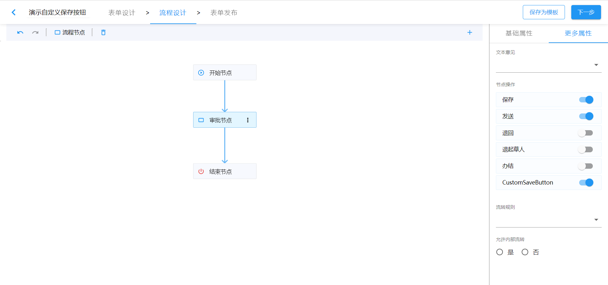
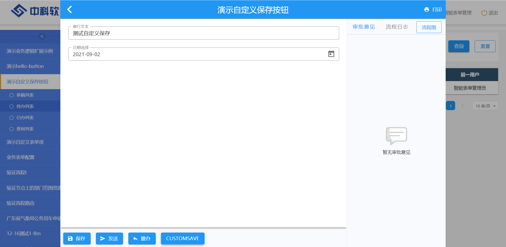

上一个章节我们学会了开发简单的按钮，这个章节以一个自定义的表单保存按钮为例，讲解如何开发一个较为完整的流程按钮。您通过此章节，您将学会流程按钮如何与表单数据进行交互，这也是流程按钮的精髓所在。

:::info 示例源码

本章节得示例代码可以在[sinoform-plugins-web-component-examples/src/plugins/flow-button-custom-save](https://gitee.com/sinoui/sinoform-plugins-web-component-examples/blob/master/src/plugins/flow-button-custom-save/)中找到。

:::

## 开发基本的按钮组件

我们按照上个章节介绍的方法，快速实现一个基本的按钮组件：

组件：

```ts title="src/plugins/flow-button-custom-save/CustomSaveButton.ts"
import $ from "jQuery";
import "./CustomSaveButton.css";

/**
 * 定义CustomSaveButton组件
 */
export default class CustomSaveButton extends HTMLElement {
  connectedCallback() {
    // 组件首次加载时，渲染button按钮
    this.render();
  }

  onClick() {
    console.log("保存按钮被点击了");
  }

  render() {
    // 生成DOM节点模板字符串
    this.innerHTML = `<button class="custom-save-button">新的保存</button>`;

    // 监听保存按钮的点击事件
    $(".custom-save-button", this).on("click", this.onClick.bind(this));
  }
}
```

组件样式：

```css title="src/plugins/flow-button-custom-save/CustomSaveButton.css"
.custom-save-button {
  color: #fff;
  background-color: #2196f3;
  font-size: 0.875rem;
  border: none;
  height: 36px;
  margin: 8px;
}
```

包装为 React 组件：

```typescript title="src/plugins/flow-button-custom-save/index.tsx"
import { webComponentWrapper } from "@sinoform/plugin-sinoform-helpers";
import CustomSaveButton from "./CustomSaveButton";

// 给按钮元素取名，需要全局唯一，不能有重复的
const helloButtonElementName = "flow-button-custom-save";

// 注册自定义的CustomSaveButton
customElements.define(helloButtonElementName, CustomSaveButton);

// 包装成React组件并默认导出
export default webComponentWrapper(helloButtonElementName);
```

接下来注册到表单中去：

```typescript title="src/index.ts"
import AppSetting from "@sinoform/app-setting";

AppSetting.flowConfig.addButton({
  id: "custom-save-button",
  name: "新的保存",
  render: React.lazy(() => import("./plugins/flow-button-custom-save")),
});
```

最后可以在演示系统中查看效果。点击新的保存按钮，会在控制台输出 `保存按钮被点击了`。接下来我们需要改动 `onClick` 方法，点击按钮时保存表单数据。要想保存数据，首先需要通过属性的方式获取到表单状态，我们马上进入下个章节，学习一下如何获取到表单状态。

## 通过属性获取到表单状态

表单会给流程按钮组件传递以下属性：

- `formState` - 表单状态
- `detailPage` - 详情页数据
- `appInfo` - 应用级别的信息，包括当前用户信息

使用 get/set 的方式，在组件内部维护一个对应的私有变量来同步以上属性值。如下所示：

```ts title="src/plugins/flow-button-custom-save/CustomSaveButton.ts"
import type { FormState } from "@sinoui/rx-form-state";

export default class CustomSaveButton extends HTMLElement {
  // 表单状态
  private _formState: FormState | undefined;

  /**
   * 设置表单状态
   */
  set formState(formState: FormState) {
    this._formState = formState;

    console.log("接受来自表单的 formState 属性", formState);
  }
}
```

有了属性，我们就可以在 `onClick` 方法中调用表单状态对象的提交方法。请看下一个章节。

## 点击按钮保存表单

这个小结我们完善 `onClick` 方法，来实现点击保存按钮时，提交表单：

```typescript title="src/plugins/flow-button-custom-save/CustomSaveButton.ts"
import type { FormState } from "@sinoui/rx-form-state";

export default class CustomSaveButton extends HTMLElement {
  async onClick() {
    if (!this._formState) {
      return;
    }

    // 执行表单校验
    const isValid = await this._formState.validate();

    if (!isValid) {
      console.log("表单校验不通过，不能保存表单");
      return;
    }

    try {
      // 提交表单
      await this._formState.submit();
      console.log("保存表单成功");
    } catch (e) {
      console.log("保存表单失败");
    }
  }
}
```

这样，我们新的保存按钮就开发完了，完整的 `CustomSaveButton.ts` 文件代码如下：

```typescript title="src/plugins/flow-button-custom-save/CustomSaveButton.ts"
import type { FormState } from "@sinoui/rx-form-state";
import $ from "jQuery";
import "./CustomSaveButton.css";

/**
 * 定义CustomSaveButton组件
 */
export default class CustomSaveButton extends HTMLElement {
  // 表单状态
  private _formState: FormState | undefined;

  connectedCallback() {
    // 组件首次加载时，渲染button按钮
    this.render();
  }

  /**
   * 设置表单状态
   */
  set formState(formState: FormState) {
    this._formState = formState;

    console.log("接受来自表单的 formState 属性", formState);
  }

  async onClick() {
    // 执行表单校验
    const isValid = await this._formState.validate();

    if (!isValid) {
      console.log("表单校验不通过，不能保存表单");
      return;
    }

    try {
      // 提交表单
      await this._formState.submit();
      console.log("保存表单成功");
    } catch (e) {
      console.log("保存表单失败");
    }
  }

  render() {
    // 生成DOM节点模板字符串
    this.innerHTML = `<button class="custom-save-button">新的保存</button>`;

    // 监听保存按钮的点击事件
    $(".custom-save-button", this).on("click", this.onClick.bind(this));
  }
}
```

## 在智能表单产品中调试插件

本小节以智能表单外网演示环境来说明如何在智能表单产品中调试插件。

打开[登录页](http://121.30.232.162:18880/sso/)，使用账号 `智能表单管理员`（密码是：`1qaz2wsx!`） 登录系统，然后选择表单设计器，进入智能表单管理页面。

打开表单`演示自定义保存按钮`，在流程设计界面，选择审批节点，然后右侧更多属性中就可以看到新增的 CustomSaveButton 按钮



进入产品示例系统，在`演示自定义保存按钮`的代办列表审批节点的表单详情页中可以看到我们新增的按钮



这个时候我们就可以修改表单项的值，测试按钮的保存功能了。
