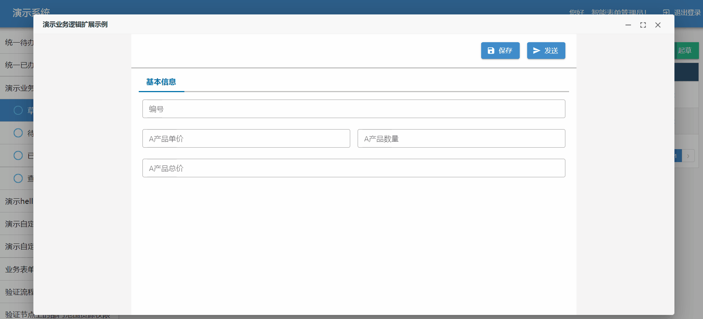

:::info 示例源码

本章节的示例代码可以在 [sinoform-plugins-web-component-examples/src/plugins/detail-page-extends](https://gitee.com/sinoui/sinoform-plugins-web-component-examples/tree/master/src/plugins/detail-page-extends) 中找到。

:::

添加`控制按钮点击行为`的扩展，一般分成两步：

1. 创建扩展文件
2. 注册扩展文件

## 创建扩展文件

首先我们创建一个简单的扩展示例，在点击`保存`按钮时，先在控制台输出一下表单内容，然后再执行保存方法。

```ts title="src/plugins/detail-page-extends/helloExtends.ts"
import AppSetting from "@sinoform/app-setting";

AppSetting.hooks.detailPage.tap(
  "controlButtonClickExtends",
  (detailPageContext) => {
    const { hooks, formData, formState } = detailPageContext;
    const { formDesign: { id } = {} } = formData;

    if (id === "612df55ac9327f1383eb4bbb") {
      // 监听按钮点击事件，添加前置处理,返回false表示不再执行与后端交互的实际保存动作
      hooks.beforeButtonClick.tapPromise(
        "controlButtonClickExtends",
        async (buttonId) => {
          if (buttonId === "save") {
            // 输出表单值
            console.log(formState.values);
          }
        }
      );
    }
  }
);
```

## 注册扩展文件

拓展方法开发完成之后只需要在`src/index.ts`中引入该文件，即可完成该拓展方法的注册。

```typescript title="src/index.ts"
import "./plugins/detail-page-extends/helloExtends";
```

## 示例：保存时校验编号字段

在一个有编号字段的表单中，点击`保存`按钮时，首先校验编号字段的值是否与已有数据重复，如果是，则设置校验失败的提示，并且不再执行保存操作；如果不重复，则直接保存。

```ts title="src/plugins/detail-page-extends/controlButtonClickExtends.ts"
import AppSetting from "@sinoform/app-setting";

AppSetting.hooks.detailPage.tap(
  "controlButtonClickExtends",
  (detailPageContext) => {
    const { hooks, formData, formState } = detailPageContext;
    const { formDesign: { id } = {} } = formData;

    if (id === "612df55ac9327f1383eb4bbb") {
      // 监听按钮点击事件，添加前置处理,返回false表示不再执行与后端交互的实际保存动作
      hooks.beforeButtonClick.tapPromise(
        "controlButtonClickExtends",
        async (buttonId) => {
          if (buttonId === "save") {
            // 判断编号是否等于已有编号
            if (formState.values["bianhao"] === "002") {
              // 设置校验错误
              formState.setFieldError("bianhao", "编号不能重复");
              formState.setFieldTouched("bianhao", true);

              // 返回false,表示不执行保存操作
              return false;
            }
          }
          return undefined;
        }
      );
    }
  }
);
```

:::info 按钮点击行为的劫持

监听 `beforeButtonClick` 钩子的函数返回 `false`，则会阻止运行未执行的监听函数，且会阻止运行按钮内部的事件处理函数，这种现象称之为`按钮点击行为的劫持`。

特别要注意的是，如果不想要`按钮点击行为的劫持`，则返回 `undefined` 或者什么都不返回（没有 `return` 语句）。如果返回其他值，如 `true`、`1`、`null` 等，就会出现一个非常奇怪的现象：阻止了其他未执行的监听函数，但是没有阻止智能表单内部的监听函数。

:::

### 流程按钮标识（id）对照表

智能表单内置流程按钮标识（id）与名称对照表。

| 按钮名称 | 按钮标识(id)  |
| -------- | ------------- |
| 保存     | save          |
| 发送     | submit        |
| 退回     | back          |
| 退起草人 | sendBackDraft |
| 办结     | end           |
| 收回     | takeback      |
| 撤办     | cancelBack    |
| 恢复流程 | regainFlow    |

## 在智能表单产品中调试插件

本小节以智能表单外网演示环境来说明如何在智能表单产品中调试插件。

打开[登录页](http://121.30.232.162:18880/sso/)，使用账号 `智能表单管理员`（密码是：`1qaz2wsx!`） 登录系统，然后选择产品示例，进入智能表单管理页面。

打开表单`演示业务逻辑扩展示例`，起草页面，编号输入 002，点击保存按钮，会看到错误提示，并且不往后端发送请求。


