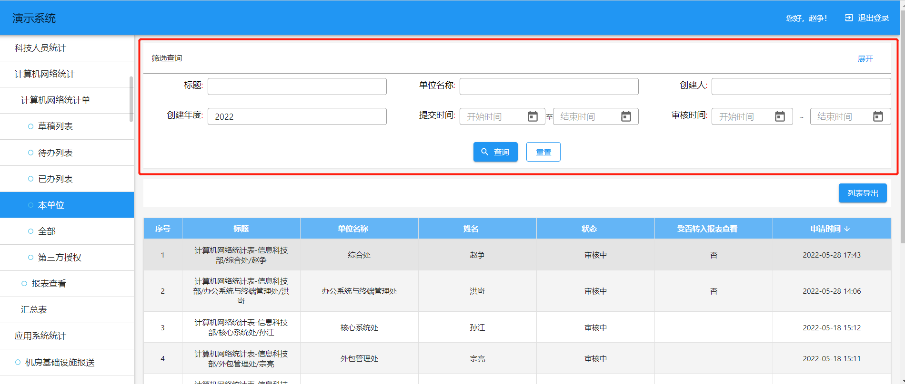

> 支持版本：v1.15.0

智能表单从 v1.15.0 版本开始，支持定制列表查询区域的布局。当前，如果是定制化的查询条件，表单默认的查询区域布局为收缩状态，可点击展开查询区域。

如果目前的支持方式不能满足我们的需求，比如如果查询条件不超过两行，我们可以默认展开显示；如果查询条件超过两行，则默认展示前两行，后面的查询条件隐藏，通过点击展开按钮，可展示所有查询条件。此时我们就需要通过自己添加布局组件的方式对查询区域布局进行定制。

## 添加布局组件

查询区域布局组件主要包括三个组件：

- SearchListPageSearchPanel 流程表单列表页查询区域布局组件
- NoFlowListPageSearchPanel 无流程表单列表查询区域布局组件。可以与`SearchListPageSearchPanel`使用同一个布局组件
- CustomSearchFormLayout 查询区域查询表单布局组件

```tsx title="src/plugins/custom-list-search-layout/SearchPanel.tsx"
import { Button } from "@sinoui/core";
import type { CustomQuery } from "@sinoform/types";
import Body2 from "@sinoui/core/Body2";
import React, { useEffect, useState } from "react";
import styled from "styled-components";

const SearchPanelHeader = styled.div`
  display: flex;
  padding: 10px 16px;
  justify-content: space-between;
  align-items: center;
  color: white;
  cursor: pointer;
  user-select: none;
  border-bottom: 1px solid rgba(0, 0, 0, 0.38);
  margin-bottom: 8px;
`;

const SearchPanelLayout = styled.div`
  width: 100%;
  margin-bottom: 20px;
  box-shadow: 0 1px 1px rgba(0, 0, 0, 0.05);
  align-self: flex-start;
  background-color: white;
`;

/**
 * 查询区域展开收缩状态上下文
 */
const ExpandContext = React.createContext<boolean | null>(null);

/**
 * 获取查询项占用的行数
 */
function getFormItemRowCount(formItems: CustomQuery[]) {
  const width = formItems.reduce(
    (acc, item) => acc + parseInt(item.width ?? "8", 10),
    0
  );
  return Math.ceil(width / 24);
}

export default function SearchPanel({
  children,
  searchItems = [],
}: {
  children: React.ReactChildren;
  searchItems: CustomQuery[];
}) {
  // 默认非展开状态
  const [expand, setExpand] = useState(false);
  const total = getFormItemRowCount(searchItems);

  const handleClick = () => {
    setExpand(!expand);
  };

  // 如果查询条件总数超过两行，则展示收缩按钮
  return (
    <SearchPanelLayout>
      <ExpandContext.Provider value={expand}>
        <SearchPanelHeader>
          <Body2>筛选查询</Body2>
          {total > 2 && (
            <Button onClick={handleClick}>{expand ? "收缩" : "展开"}</Button>
          )}
        </SearchPanelHeader>
        {children}
      </ExpandContext.Provider>
    </SearchPanelLayout>
  );
}
```

```tsx title="src/plugins/custom-list-search-layout/CustomSearchFormLayout.tsx"
import React from "react";
import useExpandedContext from "./useExpandedContext";

interface ColumnProps {
  /**
   * 在小于 600px 宽度屏幕下的宽度尺寸占比,如果只指定 xs，则是所有尺寸下的占比
   */
  xs?: number;
  /**
   * 在[600px, 960px)屏幕下的宽度尺寸占比
   */
  sm?: number;
  /**
   * 在[960px, 1280px)屏幕下的宽度尺寸占比比
   */
  md?: number;
  /**
   * 在[1280px, 1920px)屏幕下的宽度尺寸占比
   */
  lg?: number;
  /**
   * 在 >=1920px 屏幕下的宽度尺寸占比
   */
  xl?: number;
  /**
   * 是否启用 flex 布局
   */
  flexContainer?: boolean;
  /**
   * 主轴上的对齐方式
   */
  justifyContent?:
    | "flex-start"
    | "flex-end"
    | "center"
    | "space-around"
    | "space-between";
  /**
   * 交叉轴上的对齐方式
   */
  alignItems?: "flex-start" | "flex-end" | "center";
  /**
   * 自定义样式名称
   */
  className?: string;
}

interface Props {
  children: React.ReactElement<ColumnProps>[];
}

/**
 * 获取前两行查询项
 *
 * @param formItems 查询项
 */
const getTopRowsFormItems = (formItems: React.ReactElement<ColumnProps>[]) => {
  let currentRow = 0;
  let remainSpace = 24;

  return formItems.filter((formItem) => {
    const space = formItem.props.xs ?? 8;

    if (remainSpace >= space) {
      remainSpace -= space;
    } else {
      currentRow++;
      remainSpace = 24 - space;
    }

    return remainSpace >= 0 && currentRow <= 1;
  });
};

const CustomSearchFormLayout: React.FC<Props> = ({ children }) => {
  const expanded = useExpandedContext();

  // 如果是展开状态，则显示所有查询项；如果不是展开状态，则显示前两行的查询条件
  const visibleFormItems = expanded ? children : getTopRowsFormItems(children);

  return <>{visibleFormItems}</>;
};

export default CustomSearchFormLayout;
```

## 注册布局组件

将上述组件注册到`AppSetting.theme`中。

```ts title="src/plugins/custom-list-search-layout/index.ts"
import appSetting from "@sinoform/app-setting";
import CustomSearchFormLayout from "./CustomSearchFormLayout";
import SearchPanel from "./SearchPanel";

appSetting.theme = {
  SearchListPageSearchPanel: SearchPanel,
  NoFlowListPageSearchPanel: SearchPanel,
  CustomSearchFormLayout: CustomSearchFormLayout,
};
```

## 注册到智能表单

在插件项目的入口文件处引入注册布局组件的文件即可将组件注册到智能表单中。

```ts title="src/index.ts"
import "./plugins/custom-list-search-layout";
```

登入智能表单查看效果如下：

默认状态：


展开状态：

