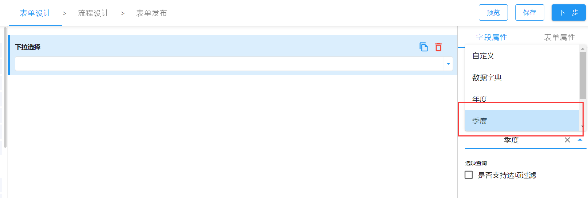
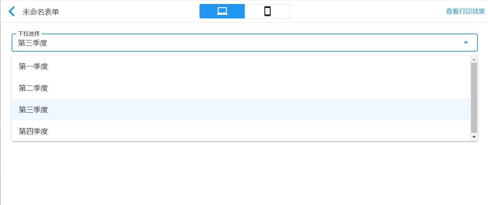

> 支持版本：v1.15.0

智能表单支持以插件的形式自定义下拉选择的选项，主要有两种方式：

- 自定义选项类型及其选项获取方式
- 通过`addFormItemOptionConfig`自定义选项配置

## 自定义选项类型及其选项获取方式

智能表单下拉选择表单控件的选项类型默认为：自定义、数据字典、数据联动、来源于其他表单。如果我们有这么一个需求：通过下拉选择控件选择季度，那么我们就能通过`appSetting.formConfig.addSelectOption`方法来自定义此规则（由于此配置为全局生效，我们直接在插件项目入口文件中注册此规则）。

```ts title="src/index.ts"
import appSetting from "@sinoform/app-setting";
import dayjs from "dayjs";

const QUARTER = ["第一季度", "第二季度", "第三季度", "第四季度"];

appSetting.formConfig.addSelectOption("季度", () => {
  const month = dayjs().month();

  const quarter = Math.ceil((month + 1) / 3);

  return QUARTER.map((item, idx) => ({
    id: `${idx + 1}`,
    title: item,
    checked: quarter - 1 === idx,
  }));
});
```

注册完成之后，我们从表单设计页面的下拉选择属性面板的`选项类型`可发现多了个`季度`可选项。



选项类型选择`季度`后的预览效果：



## 通过`addFormItemOptionConfig`自定义选项配置

如果我们只是想要定制选项，不需要定制选项类型，此时我们均可以直接使用`addFormItemOptionConfig`方法自定义选项。

假设一个场景：表单中有个下拉选择，我们需要根据拟稿人部门的不同来返回不同的可选项。

```ts
// 定制类型字段的选项
import type { Option } from "@sinoform/types";
import appSetting from "@sinoform/app-setting";

const 任命类型的对应关系: Record<string, Option[]> = {
  xx部: [
    {
      id: "1",
      title: "专业技术职责",
    },
    {
      id: "2",
      title: "职责调整",
    },
    {
      id: "3",
      title: "小组成员",
    },
    {
      id: "4",
      title: "任职",
    },
    {
      id: "5",
      title: "人员分配",
    },
    {
      id: "6",
      title: "培训",
    },
    {
      id: "7",
      title: "轮岗职位",
    },
    {
      id: "8",
      title: "经理职位",
    },
    {
      id: "9",
      title: "规定办法",
    },
    {
      id: "10",
      title: "党建工作",
    },
  ],
  xxs部: [
    {
      id: "101",
      title: "职务评审",
    },
    {
      id: "102",
      title: "人员调动",
    },
    {
      id: "103",
      title: "人事任命",
    },
    {
      id: "104",
      title: "考核结果",
    },
    {
      id: "105",
      title: "部际调任",
    },
  ],
};

/**
 * 根据起草人部门返回不同的任命类型
 */
appSetting.detailPageConfig.addFormItemOptionConfig(
  "form-id",
  "field_2",
  (currentUser, _, detailPageConfig) => {
    // 起草人部门名称（二级部门）
    const deptName =
      detailPageConfig.formData.formValues.deptNameAll?.split("/")[0] ??
      currentUser.deptInfoName[currentUser.deptInfoName.length - 2] ??
      currentUser.deptName;

    return 任命类型的对应关系[deptName] ?? [];
  }
);
```

`addFormItemOptionConfig`方法一共接收 4 个参数：

- formId 表单设计的 id，必选参数
- fieldName 下拉选项对应的字段标识，必选参数
- callback 生成选项列表的回调函数，必选参数
- relyFields 关联的字段，可选参数
