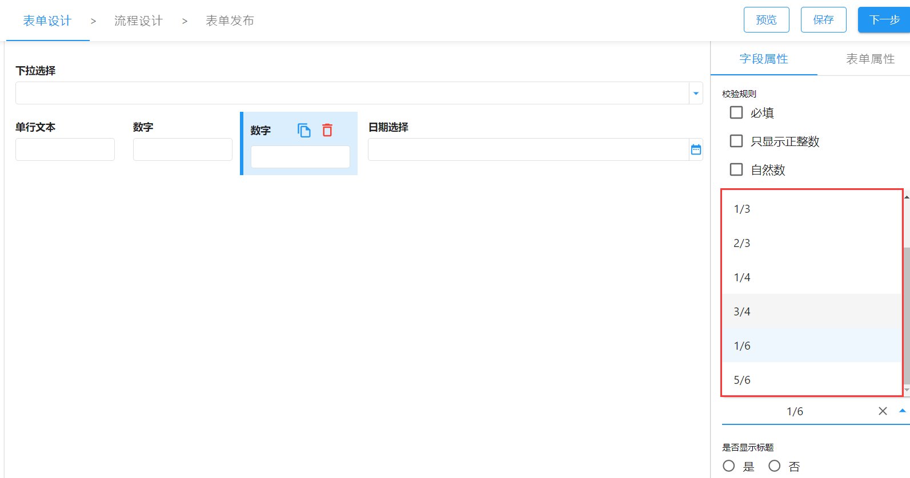

> 支持版本：v1.15.0

表单内置支持的布局方式大致为：整行、一行两列、一行三列、一行四列。如果我们有更紧凑的布局需求，可以通过插件定制表单项的布局配置可选项。

:::warning 注意

表单页面布局为 24 栅格布局，所以我们在定制布局配置时，需要遵循 24 栅格布局的规则。
:::

```ts title="src/index.ts"
import appSetting from "@sinoform/app-setting";

appSetting.formConfig.addLayoutOptions([
  { name: "整行", value: "24" },
  { name: "1/2", value: "12" },
  { name: "1/3", value: "8" },
  { name: "2/3", value: "16" },
  { name: "1/4", value: "6" },
  { name: "3/4", value: "18" },
  { name: "1/6", value: "4" },
  { name: "5/6", value: "20" },
]);
```


