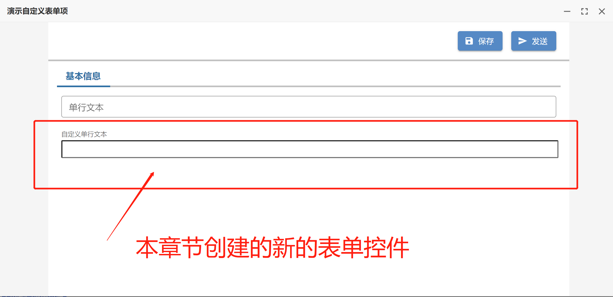
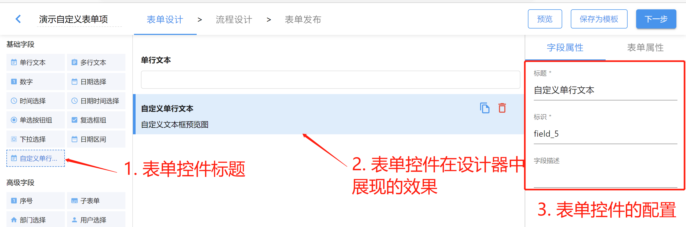
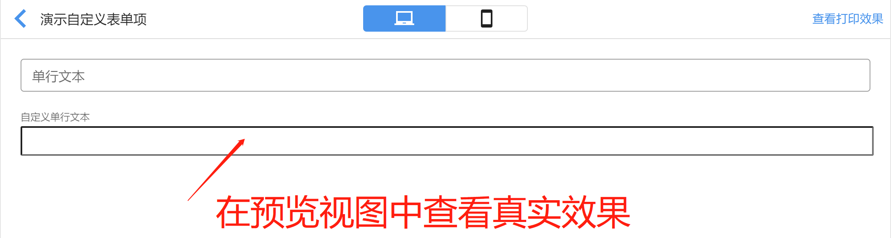
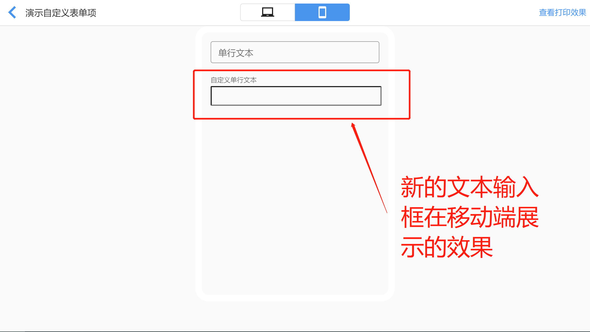
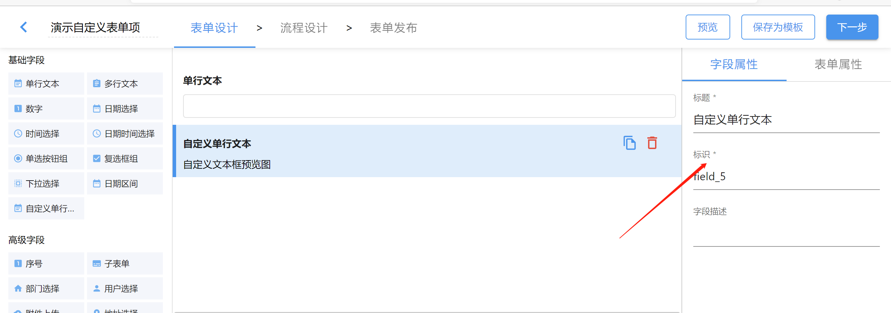
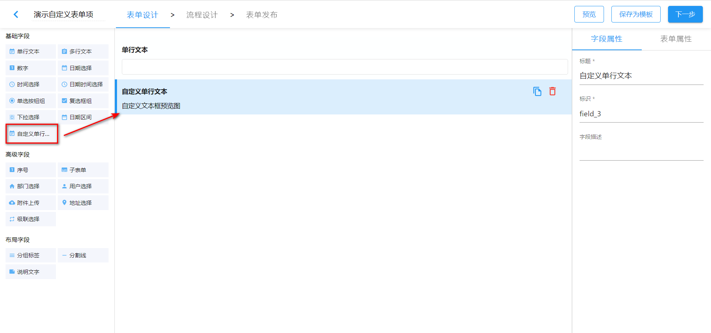
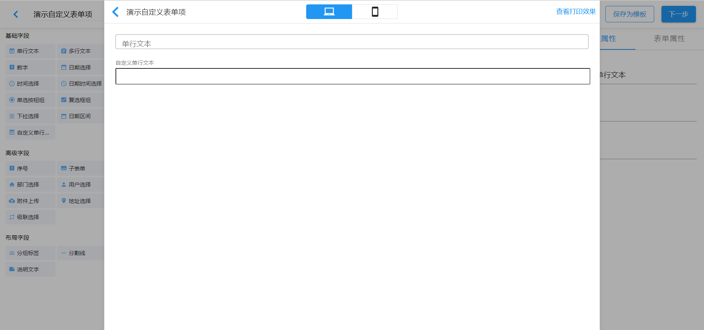
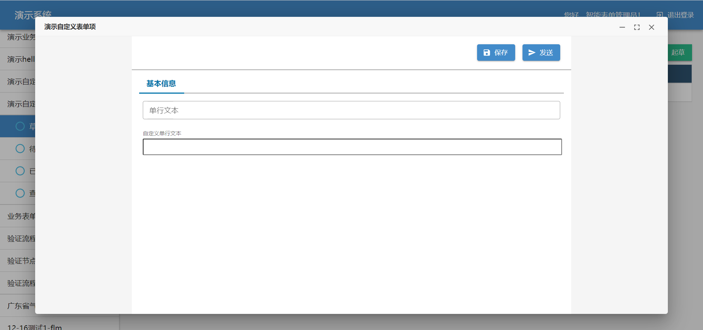

上个章节我们学会了如何开发一个流程按钮，本章节将学习如何开发表单控件（又称为表单字段）。一个表单控件至少由三个组件组成：

- **render** —— 表单控件在表单中展现的组件
- **preview** —— 表单控件在表单设计器中展现的组件
- **configPanel** —— 表单控件在表单设计器的属性面板中展现的组件

将通过创建一个新的文本输入框，来介绍如何实现上面介绍的三个组件，以在智能表单中开发一个自定义的表单控件。

:::info 示例源码

本章节得示例代码可以在 [sinoform-plugins-web-component-examples/src/plugins/form-field-custom-text-input](https://gitee.com/sinoui/sinoform-plugins-web-component-examples/tree/master/src/plugins/form-field-custom-text-input) 中找到。

:::

## 介绍新的文本输入框

本章节开发的文本输入框，在表单中展示的效果如下图所示：



上图中在表单中出现的文本输入框，是通过 `render` 组件渲染出来的。

在表单设计器中展现的效果如下图所示：



上图中三个部分是通过扩展配置定义出来的：

1. 注册表单控件时指定的 `title` 决定的
2. 通过 `preview` 组件渲染出来的
3. 通过 `configPanel` 组件渲染出来的

在开发表单控件过程中，也可以通过设计器的预览功能查看文本输入框在表单中的展现效果，如下图所示：



也可以在预览中查看在移动端的展示效果，如下图所示：



接下来，我们照例从 `Hello, World!` 开始，由浅入深地介绍如何入门表单控件的开发。

## Hello, TextInput!

本节以最快的速度，开发好自定义文本输入框的三个必要组件，并注册到智能表单中使用。让我们开始吧。

首先创建三个组件，如下图所示：

```
📦src
 ┣ 📂plugins
 ┃ ┗ 📂form-field-custom-text-input
 ┃ ┃ ┣ 📂render
 ┃ ┃ ┃ ┣ 📜CustomTextInputRenderer.ts
 ┃ ┃ ┃ ┣ 📜CustomTextInputRenderer.css
 ┃ ┃ ┃ ┗ 📜index.ts
 ┃ ┃ ┣ 📂preview
 ┃ ┃ ┃ ┣ 📜index.ts
 ┃ ┃ ┃ ┗ 📜CustomTextInputPreview.ts
 ┃ ┃ ┣ 📂config-panel
 ┃ ┃ ┃ ┣ 📜CustomTextInputConfigPanel.ts
 ┃ ┃ ┃ ┗ 📜index.ts
 ┗ 📜index.ts
```

创建完成后，我们按照之前章节的经验，依次初始实现 [render](#初始实现-render)、[preview](#初始实现-preview) 和 [config-panel](#初始实现-config-panel)。

### 初始实现 `render`

```typescript title="src/plugins/form-field-custom-text-input/render/CustomTextInputRenderer.ts"
import { SinoFormElement } from "@sinoform/plugin-sinoform-helpers";
import "./CustomTextInputRenderer.css";

/**
 * 自定义文本框在表单中展示的组件
 */
export default class CustomTextInputRenderer extends SinoFormElement {
  override render() {
    this.innerHTML = `<input class="custom-text-input" />`;
  }
}
```

```css title="src/plugins/form-field-custom-text-input/render/CustomTextInputRenderer.css"
.custom-text-input {
  display: block;
  line-height: inherit;
  font: inherit;
  color: inherit;
  -webkit-letter-spacing: inherit;
  -moz-letter-spacing: inherit;
  -ms-letter-spacing: inherit;
  letter-spacing: inherit;
  box-sizing: content-box;
  background: none;
  margin: 0px;
  -webkit-tap-highlight-color: transparent;
  min-width: 0px;
  width: 100%;
  flex: 1 1 auto;
  padding: 3.5px 0 4.5px;
  height: 1.5em;
  min-height: 1.5em;
}
```

```typescript title="src/plugins/form-field-custom-text-input/render/index.ts"
import { wrapperWebComponent } from "@sinoform/plugin-sinoform-helpers";
import CustomTextInputRenderer from "./CustomTextInputRenderer";

// 包装成React组件并默认导出
export default wrapperWebComponent(
  "form-field-custom-input-renderer",
  CustomTextInputRenderer
);
```

### 初始实现 `preview`

```typescript title="src/plugins/form-field-custom-text-input/preview/CustomTextInputPreview.ts"
import { SinoFormElement } from "@sinoform/plugin-sinoform-helpers";

/**
 * 自定义文本框在表单设计器中预览组件
 */
export default class CustomTextInputPreview extends SinoFormElement {
  override render() {
    this.innerHTML = "<div>自定义文本框预览图</div>";
  }
}
```

```typescript title="src/plugins/form-field-custom-text-input/preview/index.ts"
import { wrapperWebComponent } from "@sinoform/plugin-sinoform-helpers";
import CustomTextInputPreview from "./CustomTextInputPreview";

// 将web components组件封装成react组件
export default wrapperWebComponent(
  "field-custom-text-input-preview",
  CustomTextInputPreview
);
```

### 初始实现 `config-panel`

```typescript title="src/plugins/form-field-custom-text-input/config-panel/CustomTextInputConfigPanel.ts"
import { SinoFormElement } from "@sinoform/plugin-sinoform-helpers";

/**
 * 自定义文本框在表单设计器中的字段属性面板组件
 */
export default class CustomTextInputConfigPanel extends SinoFormElement {
  override render() {
    this.innerHTML = "<div>自定义文本输入框的字段属性面板</div>";
  }
}
```

```typescript title="src/plugins/form-field-custom-text-input/config-panel/index.ts"
import { wrapperWebComponent } from "@sinoform/plugin-sinoform-helpers";
import CustomTextInputConfigPanel from "./CustomTextInputConfigPanel";

// 将web components组件封装成react组件
export default wrapperWebComponent(
  "field-custom-text-input-config-panel",
  CustomTextInputConfigPanel
);
```

### 注册表单控件

打开 `src/index.ts` 文件，添加注册代码，如下所示：

```typescript
import AppSetting from "@sinoform/app-setting";
import { FormFieldGroup } from "@sinoform/types";
import EventNote from "@sinoui/icons/EventNote";

// 注册 custom-text-input 表单控件
AppSetting.formConfig.addField({
  // 表单控件类型（相当于表单控件的唯一身份标识，不能重复）
  type: "custom-text-input",
  // 表单控件在设计器控件面板中的名称
  title: "自定义单行文本",
  // 表单控件在设计器控件面板中的分组
  group: FormFieldGroup.normal,
  // 指定表单控件在设计器的控件面板中的显示图标
  icon: EventNote,
  render: React.lazy(() => import("./plugins/form-field-input/render")),
  preview: React.lazy(() => import("./plugins/form-field-input/preview")),
  configPanel: React.lazy(
    () => import("./plugins/form-field-input/config-panel")
  ),
});
```

注册之后，即可启动插件项目，在智能表单设计器中使用此插件，查看表单控件的初始效果。

目前我们只是开发出了表单控件的初始效果，但是还有重要的两件事情需要处理，即：

- 表单控件与表单联动，包括值的双向绑定、表单控件只读控制、标签与输入框的联动等
- 给表单控件添加合适的属性配置项，这样在使用设计器设计表单时，可以定制表单控件的行为

接下来，我们一一讲解这些内容。

## 表单控件与表单联动

表单控件需要与表单之间进行联动，才能在智能表单中完成它的基本功能。本节将会介绍以下四个方面的内容：

- [绑定 `name` 属性](#绑定-name-属性)
- [值的双向绑定](#值的双向绑定)
- [表单控件只读控制](#表单控件只读控制)
- [标签与表单控件联动](#标签与表单控件联动)

注：本节所有的内容均是在增强 `CustomTextInputRenderer` 组件的代码。

### 绑定 `name` 属性

在渲染表单控件的 HTML 时，可以从属性对象中获取到 `name`，并指定给 `input` 元素，如下所示：

```typescript title="src/plugins/form-field-custom-text-input/render/CustomTextInputRenderer.ts" {5}
class CustomTextInputRenderer extends SinoFormElement {
  override render() {
    const { name } = this.props;

    this.innerHTML = `<input class="custom-text-input" name="${name}" />`;
  }
}
```

这里的 `name` 是来自表单设计器字段属性配置面板的**标识**，如下图所示：



备注：后面会讲到如何定义配置面板。

### 名词解释：表单项

在讲值的双向绑定之前，先解释一个名词：**表单项**。在智能表单中，将表单控件拖拽到表单中，就形成了一个**表单项**。**表单项**最重要的两个属性是：

- 表单控件类型，即表单项对应的表单控件（`type`）
- 表单项标识，在字段属性面板中定义，也称为表单项名称（`name`）

一个表单项有了以上两个基本属性，就可以用正确的表单控件在表单中展现正确的表单字段值。

### 值的双向绑定

值的双向绑定是指将表单项的值与表单状态之间进行绑定：

- 第一个方向：表单状态中的值发生了变化，需要同步到表单项，让表单项对应的表单控件显示最新的表单状态中的值。例如在打开详情页时，加载到详情页数据，表单状态中就有从后端获取到的所有表单项的值。这时就需要表单控件展示正确的来自后端的表单项值。
- 第二个方向：用户在表单控件中输入了文本，或者做出了选项选择（例如下拉选择框）后，需要将新的值同步给表单状态。

表单状态中存储了所有表单项的值。表单状态是一个对象，类似下面的示例对象：

```json
{
  "field_1": "这是一个标题",
  "field_2": "选项一",
  "field_5": "这是一个文本"
}
```

上面的示例对象包含了 `field_1`、 `field_2` 和 `field_5` 表单项的值。我们可以通过表单项名称从表单状态中获取到表单项的值。

解释这么多，是为了让大家了解智能表单处理表单值的基本过程。我们改进 `CustomTextInputRenderer` 的代码，实现值的双向绑定：

```typescript title="src/plugins/form-field-custom-text-input/render/CustomTextInputRenderer.ts" {7,13}
import $ from "jQuery";

class CustomTextInputRenderer extends SinoFormElement {
  override render() {
    const { name, value = "" } = this.props;

    this.innerHTML = `<input class="custom-text-input" value="${value}" />`;

    const $input = $("input", this);

    // 值的双向绑定
    // 1. 监听 this.props 中的 value 属性值变更，同步到 $input 中
    // 2. 监听 $input 中的 change 事件，将用户输入的值通过 this.props.onChange 告知智能表单
    this.bindFormControl($input);
  }
}
```

### 表单控件只读控制

智能表单会给表单控件的`render`组件传递 `readOnly` 属性，告知表单控件当前是只读的还是可编辑的。我们优化 `CustomTextInputRenderer` 的代码，以实现只读控制：

```typescript title="src/plugins/form-field-custom-text-input/render/CustomTextInputRenderer.ts"
import $ from "jQuery";

class CustomTextInputRenderer extends SinoFormElement {
  override render() {
    const { readOnly } = this.props;

    this.innerHTML = `<input class="custom-text-input" ${
      readOnly ? `readonly="readonly"` : ""
    } />`;

    const $input = $("input", this);

    // 监听 readOnly 属性值的变化，同步设置 input 元素的 readonly
    this.props.watch("readOnly", (readOnly) => {
      if (readOnly) {
        $input.attr("readonly", "readonly");
      } else {
        $input.removeAttr("readonly");
      }
    });
  }
}
```

### 标签与表单控件联动

为了更好的用户体验，我们需要将表单项中的标签与表单控件进行联动，如下所示：

```html
<div>
  <label for="userName">用户名</label>
  <input id="userName" />
</div>
```

上面的示例代码中，`label` 元素的 `for` 属性和 `input` 元素的 `id` 属性是相同的，它们之间就绑定了，形成联动效果，例如：当点击 `label` 标签，绑定的 `input` 会自动获取到焦点。

智能表单会渲染出每个表单项的标签和 `for` 属性值，并给表单控件组件传递 `id` 属性值，所以我们只需要在实现表单控件的 `render` 组件时，从 `this.props` 中获取到 `id`，并指定给 `input` 元素即可。如下面的代码所示：

```typescript title="src/plugins/form-field-custom-text-input/render/CustomTextInputRenderer.ts" {5}
class CustomTextInputRenderer extends SinoFormElement {
  override render() {
    const { id } = this.props;

    this.innerHTML = `<input class="custom-text-input" id="${id}" />`;
  }
}
```

### 整合在一起

现在，我们将上面的代码整合在一起，形成一个完整的 `CustomTextInputRenderer` 实现，如下所示：

```typescript title="src/plugins/form-field-custom-text-input/render/CustomTextInputRenderer.ts"
import $ from "jquery";
import { SinoFormElement } from "@sinoform/plugin-sinoform-helpers";
import "./CustomTextInputRenderer.css";

/**
 * 自定义文本框在表单中展示的组件
 */
export default class CustomTextInputRenderer extends SinoFormElement {
  override render() {
    const { value = "", readOnly, id, name } = this.props;
    this.innerHTML = `<input class="custom-text-input" name="${name}" id="${id}" value="${value}" ${
      readOnly ? `readonly="readonly"` : ""
    } />`;
    const $input = $("input", this);

    // 值的双向绑定
    // 1. 监听 this.props 中的 value 属性值变更，同步到 $input 中
    // 2. 监听 $input 中的 change 事件，将用户输入的值通过 this.props.onChange 告知智能表单
    this.bindFormControl($input);

    // 监听 readOnly 属性值变更
    this.props.watch("readOnly", (readOnly) => {
      if (readOnly) {
        $input.attr("readonly", "readonly");
      } else {
        $input.removeAttr("readonly");
      }
    });
  }
}
```

至此，我们开发出了功能完整的表单控件，快在智能表单中查看一下效果吧。

## 完善表单控件的配置面板

接下来我们需要在配置面板中添加一些表单控件得配置项。可以使用 jQuery 开发配置面板组件，但是目前智能表单没有发布用来构建配置面板的 Web Component 组件，如果要求您通过 jQuery 和 CSS 开发出一套与智能表单保持风格一致的配置面板，工作量有点大。所以我们目前推荐您直接使用智能表单封装好的 React 组件来快速实现表单控件的配置面板。

我们调整 `config-panel/index.ts` 和 `config-panel/CustomTextInputConfigPanel.ts` 两个文件的内容：

```typescript title="src/plugins/form-field-custom-text-input/config-panel/index.ts"
import CustomTextInputConfigPanel from "./CustomTextInputConfigPanel";

export default CustomTextInputConfigPanel;
```

```typescript title="src/plugins/form-field-custom-text-input/config-panel/CustomTextInputConfigPanel.tsx"
import React from "react";
import TextInput from "@sinoui/core/TextInput";
import { FormItem } from "@sinoui/rx-core-form";
import type { FormFieldConfigPanelProps } from "@sinoform/types";

/**
 * 定义 custom-text-input 配置面板的组件
 */
export default function CustomTextInputConfigPanel({
  inSubform,
}: FormFieldConfigPanelProps) {
  return (
    <>
      <FormItem label="标题" name="title" required>
        <TextInput />
      </FormItem>
      <FormItem label="标识" name="fieldName" required>
        <TextInput />
      </FormItem>
      {!inSubform && (
        <FormItem label="字段描述" name="helperText">
          <TextInput multiline />
        </FormItem>
      )}
    </>
  );
}
```

> 注意：我们需要将 `CustomTextInputConfigPanel.ts` 文件的后缀改成 `.tsx`。

:::info 敬请期待

在不久的将来（数周内），我们会在 API 文档中说明配置面板中有哪些可用的 React 组件。您以后可以参考 API 文档中的组件清单，快速定制出您需要的表单控件配置面板。

:::

:::info 小知识点

如果您可以通过 `render` 组件的 `config` 属性获取到表单项在设计器中的配置，如下所示：

```typescript
class CustomTextInputRenderer extends SinoFormElement {
  override render() {
    const { config } = this.props;

    console.log("表单项的配置", config);
  }
}
```

:::

至此，我们开发出了一个完整的表单控件。接下来您可以在智能表单产品中调试该表单控件。

## 在智能表单产品中调试插件

打开[登录页](http://121.30.232.162:18880/sso/)，使用账号 `智能表单管理员`（密码是：`1qaz2wsx!`） 登录系统，然后选择表单设计器，进入智能表单管理页面。

打开表单`演示自定义表单项`，在表单设计界面可以在左侧的基础字段中看到新增的自定义表单项，拖动它到中间区域就可以完整自定义表单项的添加。



打开预览界面就可以实时测试自定义表单项的功能。



进入产品示例系统，在`演示自定义表单项`的表单详情页中也可以测试自定义表单项。


