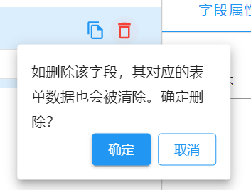

智能表单目前支持的可全局替换的基础 UI 组件主要是以下两种模式的弹窗组件：

- Confirm —— 确认弹窗。主要用在一些不可逆操作前的提示。
- message —— 提示弹窗。主要用于操作提示，比如`加载中……`，`操作成功`等。

上述两种场景的弹窗在智能表单中以不同形式展现，如果有统一风格需求的，则需要以插件的形式开发这两个组件，然后注册到智能表单中使用。

## 组件开发

关于弹窗组件的开发，我们不做特殊要求，只要能够接收以下描述中的组件属性，符合其使用方式即可。

### Confirm

`Confirm`组件主要用于一些不可逆操作前的确认提示，比如`删除`、`办结`等。

基本使用

```ts
<Confirm
  message="如删除该字段，其对应的表单数据也会被清除。确定删除？"
  onOk={...}
>
  <Button>删除</Button>
</Confirm>
```

具体效果如下：



#### 可用属性

| 属性名   | 属性类型                                            | 默认值         | 描述                       |
| -------- | --------------------------------------------------- | -------------- | -------------------------- |
| message  | `string`                                            |                | 提示内容                   |
| children | `React.ReactElement`                                |                | 子元素                     |
| width    | `number`                                            | 子元素实际宽度 | 弹窗宽度                   |
| height   | `number`                                            | 120            | 弹窗高度                   |
| onClick  | `(event: React.MouseEvent<HTMLDivElement>) => void` |                | 点击事件的回调函数         |
| onOk     | `(...args: any[]) => void`                          |                | 确定按钮被点击时的回调函数 |

### message

`message`主要用于操作提示，比如`加载中……`，`操作成功`等。

基本使用

```ts
function Demo() {
  const handleClick = () => {
    message.info("这是一条提示消息");
  };

  return <Button onClick={handleClick}>显示消息</Button>;
}
```

#### message 特性

##### message 支持不同类型的提示

组件提供了一些静态方法，使用方式和参数可参考如下：

- `message.info(content,config)` 信息提示
- `message.success(content,config)` 成功提示

- `message.error(content,config)` 错误提示

- `message.warning(content,config)` 警告提示

- `message.loading(content,config)` 加载中提示

参数解析：

| 参数名称 | 参数类型                               | 说明                                                                                                                                     |
| -------- | -------------------------------------- | ---------------------------------------------------------------------------------------------------------------------------------------- |
| content  | `React.ReactNode`                      | 消息内容                                                                                                                                 |
| config   | `number\|{key:string,duration:number}` | 消息配置。如果是`number`类型表示消息显示时长，以`ms`为单位；当值为`0`时，表示消息不会自动消失。也可以是消息配置，包括`key`值和显示时长。 |

##### 自定义 loading 关闭

`loading`一般用于资源加载中提示，加载完成才会消失。此时我们只需要在使用`message.loading()`时，指定第二个参数为 0 即可保证`loading`提示不会自动关闭。

但在加载完成后一定要调用`hide()`让其关闭。具体示例如下：

```tsx
function save() {
  return new Promise((resolve, reject) => {
    setTimeout(() => {
      resolve("保存成功");
    }, 1000);
  });
}

function Demo() {
  const handleClick = () => {
    const hide = message.loading("数据正在提交，请稍后...", 0);
    save()
      .then(() => {
        hide();
        message.success("保存成功");
      })
      .catch((error) => {
        hide();
        message.error("保存失败");
      });
  };
  return <Button onClick={handleClick}>保存</Button>;
}
```

##### 设置消息显示时长

`message`相关提示 API 支持通过第二个参数自定义显示时长，默认为 3000 毫秒。

```tsx
message.loading("数据加载中，1s后消失...", 1000);
```

##### 设置消息显示最大条数

消息显示最大条数默认为 10 条，可以使用`message.config()`自定义最大条数。

```tsx
message.config({ max: 20 });
```

##### 主题切换

使用`message.setTheme(theme)`的方式切换主题。

## 注册组件

组件开发完成后，可直接在 index.ts 文件中进行注册。

```ts title="src/index.ts"
import AppSetting from "@sinoform/app-setting";
import message from "./plugins/message";
import Confirm from "./plugins/Confirm";

AppSetting.globalUI = {
  message,
  Confirm,
};
```

## 组件验证

对于基础 UI 组件的验证，推荐直接在插件项目的 storybook 中直接验证。
