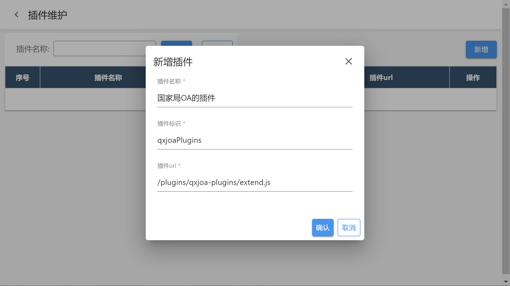

在上个章节，我们准备好了开发环境，这一篇文章介绍如何开发第一个插件：一个在详情页上显示的按钮，点击此按钮会在弹窗中输出 `Hello, World!` 文本。

> 本文的示例代码是按照 Web Component 来编写的。如果采用 React 或者 Vue 开发插件，请从 [sinoform-plugin-example](https://gitee.com/sinoui/sinoform-plugin-example) 找相关的示例源码学习。

通过本章节的学习，您将会掌握：

- 创建一个简单的按钮插件
- 注册插件
- 启动插件项目
- 在智能表单产品中调试插件
- 给按钮插件添加样式
- 打包部署插件项目

## 开发 HelloButton 插件

`HelloButton` 是一个流程按钮插件，在 `src/plugins` 目录下创建 `flow-button-hello` 文件夹，然后新建 `index.ts` 和 `HelloButton.ts` 文件，文件结构如下所示：

```
src/plugins/flow-button-hello
  |__ index.ts
  |__ HelloButton.ts
```

:::info 插件命名规则：流程按钮

在项目中添加流程按钮插件，需要在 `src/plugins` 目录下创建 `flow-button-[插件名称]` 文件夹，如上面的 `flow-button-hello`。

:::

然后打开 `HelloButton.ts` 文件，添加组件实现的代码：

```typescript title="src/plugins/flow-button-hello/HelloButton.ts" {32}
import $ from "jquery";

/**
 * 输出 Hello World 的示例按钮
 */
export default class HelloButton extends HTMLElement {
  /**
   * 当 HelloButton 首次插入到 DOM 时，渲染出按钮
   */
  // 💚 从这开始看
  connectedCallback() {
    this.render();
  }

  /**
   * 按钮点击事件的回调函数
   */
  onButtonClick() {
    alert("Hello, World!");
  }

  /**
   * 渲染 HelloButton 组件
   */
  render() {
    // 插入 HTML 内容
    this.innerHTML = `
      <button>Hello World!</button>
    `;

    // 给查找到的按钮元素添加点击事件
    $("button", this).on("click", this.onButtonClick.bind(this));
  }
}
```

上面的代码创建了一个继承自 `HelloElement` 类的 `HelloButton` 类， `connectedCallback` 函数相当于组件的初始化方法，它调用 `render` 方法，在它的内部生成 HTML，以展现一个按钮。并通过高亮部分的代码给其内部的按钮添加点击事件监听：

```typescript
$("button", this).on("click", this.onButtonClick.bind(this));
```

这一行代码有两个注意点，即：

- `$("button", this)` 中的 `this` 不能丢，否则可能找到的按钮元素可能是不正确的。
- `this.onButtonClick.bind(this)` 中的 `.bind(this)` 不能丢，否则在 `onButtonClick` 方法中不能正确地使用 `this`。

然后我们需要在 `index.ts` 文件中添加代码将 `HelloButton` 注册为自定义元素和 React 组件，如下所示：

```typescript title="src/plugins/flow-button-hello/index.ts"
import { webComponentWrapper } from "@sinoform/plugin-sinoform-helpers";
import HelloButton from "./HelloButton";

// 给按钮元素取名，需要全局唯一，不能有重复的
const helloButtonElementName = "hello-button";

// 注册 hello-button 自定义元素
customElements.define(helloButtonElementName, HelloButton);

// 将 hello-button 自定义元素包装为 React 组件
const HelloButtonComponent = webComponentWrapper(helloButtonElementName);

// 默认导出 HelloButtonComponent
export default HelloButtonComponent;
```

## 注册 HelloButton 插件

开发完 HelloButton 插件后，我们需要在 `src/index.ts` 文件中将 `HelloButton` 注册为插件，告知智能表单有此插件，如下所示：

```typescript title="src/index.ts" {9}
import React from "react";
import AppSetting from "@sinoform/app-setting";

// 注册 hello-button 插件（流程按钮）
AppSetting.flowConfig.addButton({
  id: "hello-button",
  name: "Hello World",
  // 引入 HelloButton 插件本体
  render: React.lazy(() => import("./plugins/flow-button-hello")),
});
```

其中 `id` 一般与自定义元素名称保持一致即可。`name` 是按钮在配置页面上的显示标题。`render` 属性是重点，采用异步导入的方式引入按钮组件，在需要展现此按钮时，会调用引入的组件代码，完成渲染。

## 启动插件项目

准备好上面的代码，我们需要启动插件项目。在 vscode 中打开命令行控制台（快捷键：ctrl + `），执行以下命令，即可启动插件项目：

```bash
yarn start
```

启动本地的插件项目之后，就可以与智能表单产品集成在一起联调了。

## 在智能表单产品中调试插件

本小节以智能表单外网演示环境来说明如何在智能表单产品中调试插件。

打开[登录页](http://121.30.232.162:18880/sso/)，使用账号 `智能表单管理员`（密码是：`1qaz2wsx!`） 登录系统，然后选择表单设计器，进入智能表单管理页面。打开浏览器的控制台，执行以下 JavaScript 代码，将本地的插件项目集成到智能表单产品中，以查看插件效果：

```javascript {6}
localStorage.setItem(
  "sinoform-preview-plugins",
  JSON.stringify([
    {
      url: "http://localhost:8090/extend.js",
      name: "qxjoaPlugins",
    },
  ])
);
```

一定要注意，`name` 名称需要与插件项目名称保持一致（需要将连字符形式的插件项目名称转化为首字母小写的驼峰式名称），否则会报错。

在浏览器控制台执行完上面的代码后，刷新智能表单页面，打开任意一个表单，切换到流程设计页面，选择一个审批节点，就能看到右侧节点配置面板中就会多出一个 `Hello World` 按钮选项，如下图所示：


然后回退到导航主页，进入产品示例，打开 `演示 hello-button` 中的待办列表页面，打开其中一个待办数据，从详情页中可以看到如下图所示的效果：


这说明咱们添加 Hello 按钮插件成功了！点击一下 Hello 按钮，它会弹出 `Hello, World!` 文本。

我们可以在浏览器开发者工具中通过断点来调试插件代码。按下 `F12`，打开浏览器控制台，在源码面板中找到 `HelloButton.ts` 文件（通过快捷键 Ctrl + P，可以快速查找源码文件），并在此文件中设置代码断点，如下图所示：


## 给按钮插件添加样式

原生的按钮元素太素了，我们可以给它添加点样式来美化它。

首先我们在 `src/plugins/flow-button-hello` 中创建一个 `HelloButton.css` 文件，定义如下的按钮样式：

```css title="src/plugins/flow-button-hello/HelloButton.css"
.hello-button {
  display: inline-flex;
  -webkit-box-align: center;
  align-items: center;
  -webkit-box-pack: center;
  justify-content: center;
  position: relative;
  -webkit-tap-highlight-color: transparent;
  outline: 0px;
  border: 0px;
  vertical-align: middle;
  appearance: none;
  color: inherit;
  text-decoration: none;
  cursor: pointer;
  user-select: none;
  box-shadow: rgb(0 0 0 / 20%) 0px 2px 4px -1px, rgb(0 0 0 / 14%) 0px 4px 5px 0px,
    rgb(0 0 0 / 12%) 0px 1px 10px 0px;
  margin: 8px;
  font-weight: 500;
  font-size: 0.875rem;
  line-height: 1.75;
  letter-spacing: 0.02857em;
  text-transform: uppercase;
  min-width: 64px;
  height: 36px;
  box-sizing: border-box;
  padding: 0px 16px;
  color: rgb(255, 255, 255);
  background-color: rgb(33, 150, 243);
  border-radius: 4px;
  transition: box-shadow 150ms cubic-bezier(0.4, 0, 0.2, 1) 0ms;
}
```

> 摘自 @sinoui/core/Button 组件中的样式。您可以使用您喜欢的样式代码来美化按钮。

然后调整 `HelloButton.ts` 代码，如下所示：

```diff
+ import './HelloButton.css';


class HelloButton extends HTMLElement {
  render() {
    // 插入 HTML 内容
    this.innerHTML = `
-      <button>Hello World!</button>
+      <button class="hello-button">Hello World!</button>
    `;

  }
}
```

完整的 `HelloButton.ts` 代码如下所示：

```typescript title="src/plugins/flow-button-hello/HelloButton.css" {2,29}
import $ from "jquery";
import "./HelloButton.css";

/**
 * 输出 Hello World 的示例按钮
 */
export default class HelloButton extends HTMLElement {
  /**
   * 当 HelloButton 首次插入到 DOM 时，渲染出按钮
   */
  // 💚 从这开始看
  connectedCallback() {
    this.render();
  }

  /**
   * 按钮点击事件的回调函数
   */
  onButtonClick() {
    alert("Hello, World!");
  }

  /**
   * 渲染 HelloButton 组件
   */
  render() {
    // 插入 HTML 内容
    this.innerHTML = `
      <button class="hello-button">Hello World!</button>
    `;

    // 给查找到的按钮元素添加点击事件
    $("button", this).on("click", this.onButtonClick.bind(this));
  }
}
```

刷下一下智能表单待办详情页，观察按钮的样式，如下图所示：


## 打包部署插件项目

如果您坚持到这里，那么我们离成功只差最后一步了，将插件发布到生产环境给最终用户使用。

首先执行以下命令打包插件项目：

```bash
yarn build
```

然后将 `build` 目录下的打包文件上传到 Nginx 的 `qxjoa-plugins` 目录下（如： `/apps/sino-intellisense-form/qxjoa-plugins`）。在 Nginx 配置文件中添加以下配置：

```nginx title="nginx.conf"
# 智能表单插件配置
location /qxjoa-plugins/ {
  index index.html index.htm;
  try_files $uri $uri/ /qxjoa-plugins/index.html;
  add_header Cache-Control no-store;
}

# 配置插件入口文件不做缓存
location ~ .\*/extend.js$ {
  add_header Cache-Control no-store;
}
```

重新加载一下 nginx：

```bash
nginx -s reload
```

然后打开智能表单管理页右上角更多中的“插件维护”按钮，打开插件维护页面，添加上面的插件（如果添加过此插件，则可以跳过此步骤）：



> 特别注意：需要正确配置 `插件url`。示例中使用的是本机地址，实际项目中需要配置用户浏览器终端能够访问到的地址。

这样就完成了插件项目的部署。

:::info 温馨提示

如果您部署插件和调试插件项目的智能表单项目是同一个项目，您需要在浏览器控制台执行下面的代码，才能验证部署后的插件：

```javascript
localStorage.removeItem("sinoform-preview-plugins");
```

:::

## 总结

🎉🎉🎉 恭喜您，开发好了第一个智能表单插件。

通过此章节的代码，您较为全面的掌握了开发一个智能表单插件的流程。接下来的教程会讲解更多插件开发的技能，请您继续下个章节。
