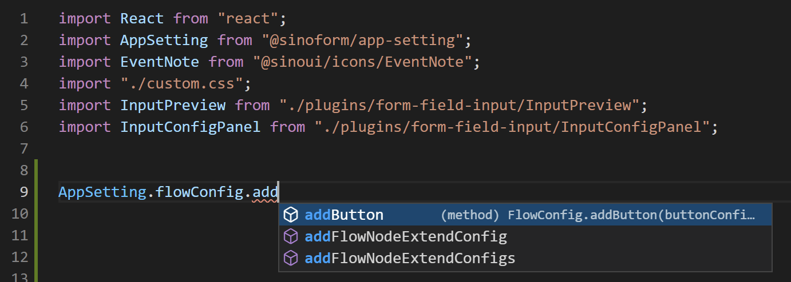
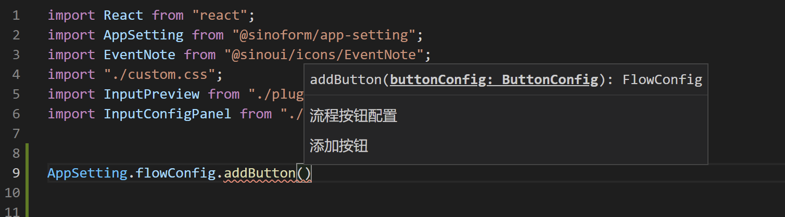
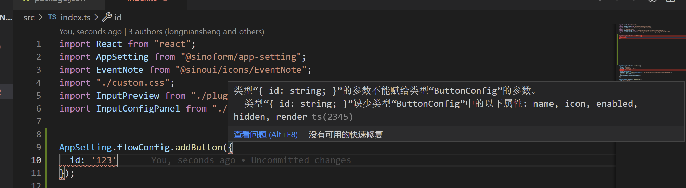

感谢您的坚持，学习完了智能表单插件开发的入门教程，恭喜您现在可以用插件的方式来满足用户的需求。🎉🎉🎉

## 回顾

通过学习入门教程，我们学会了以下技能：

- 开发插件
- 调试插件
- 部署插件
- 多种类型的插件
  - 流程按钮
  - 表单项
  - 详情页逻辑控制
- 定制表单样式

这些技能是我们开发智能表单插件的基石。

## 扬帆起航

有了基础技能包，我们就可以通过开发插件来满足用户的个性化需求。在开发插件时，建议您先阅读一下最佳实践中的内容，这样能够编写出合理的插件代码。我们会在高级教程中介绍详细的插件 API 细节，如果您开发时遇到不知道通过插件如何与智能表单中的数据、状态进行交互。可以参考相关的高级教程。

## 关于 TypeScript

我们强烈建议项目组采用 TypeScript 编写插件，TypeScript 给您带来非常好的编程体验（主要是代码提示非常强大），而只需要付出一点点代价：学习一下如何在 JavaScript 代码上添加类型。

智能表单提供的插件 API 都有 TypeScript 类型声明，并且有详细的注释说明，您可以通过 vscode 就能快速查看到插件 API 的注释。如下面的图片所示：

代码补全提示：

代码注释提示：

代码错误提示：

## 插件开发体验改进计划

我们非常重视插件开发体验，所以邀请您参与到插件开发体验改进计划中来。您在开发插件过程中发现阻碍您的问题，您都可以反馈给我们。有任何建议，请您不吝赐教，反馈给我们。

我们正在改进 API 的代码注释，尽量让您在编码过程中就知道如何使用插件 API，而不需要频繁查阅智能表单教程。有不合理的地方，请您指正。

欢迎您在 [智能表单问题清单](https://gitee.com/sinoui/sino-intellisense-form-test/issues) 中提交问题工单。
