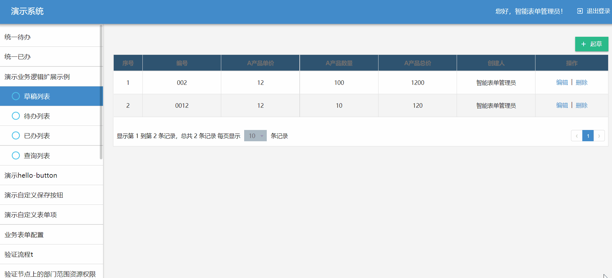

:::info 示例源码

本章节的示例代码可以在 [sinoform-plugins-web-component-examples/src/plugins/detail-page-extends](https://gitee.com/sinoui/sinoform-plugins-web-component-examples/tree/master/src/plugins/detail-page-extends) 中找到。

:::

## 钩子机制

智能表单通过钩子机制，对外提供内部业务逻辑的扩展定制能力。本小节会先带大家入门钩子机制，学会使用钩子来扩展智能表单的业务逻辑。

对于智能表单应用，大部分逻辑体现在详情页上。所以智能表单当前版本（v1.12.0）暴露的钩子与详情页相关。

当用户打开详情页时，会触发详情页钩子（`detailPage` hook）。如果您需要知道用户何时打开详情页的，可以监听详情页钩子，如下所示：

```typescript
import AppSetting from "@sinoform/app-setting";

// 扩展名称，即钩子监听者名称
const EXTEND_NAME = "firstExtendDemo";

// 监听详情页钩子，即打开详情页时，会调用此监听函数
AppSetting.hooks.detailPage.tap(EXTEND_NAME, (detailPageContext) => {
  const id = detailPageContext.formData?.id;
  if (id) {
    console.log(`打开了表单${id}详情页`);
  }
});
```

在详情页钩子中，你可以查看详情页数据，甚至可以变更详情页数据。在钩子监听函数中拿到详情页上下文（`detailPageContext`）后，我们可以监听详情页上下文中的钩子，扩展详情页内部的逻辑。例如我们通过详情页上的表单值变更钩子（`valueChange` hook）监听表单变化，示例代码如下：

```typescript
import AppSetting from "@sinoform/app-setting";

// 扩展名称，即钩子监听者名称
const EXTEND_NAME = "firstExtendDemo";

// 监听详情页钩子。即打开详情页时，会调用此监听函数
AppSetting.hooks.detailPage.tap(EXTEND_NAME, (detailPageContext) => {
  const id = detailPageContext.formData?.id;
  if (id) {
    console.log(`打开了表单${id}详情页`);
  }

  // 监听值变更钩子。用户在表单中输入值，就会触发值变更钩子，执行此监听函数。
  detailPageContext.hooks.valueChange(EXTEND_NAME, (prevValue, newValue) => {
    console.log("新的表单值", newValue);
  });
});
```

:::info 钩子机制

智能表单的钩子机制是通过 [tapable](https://github.com/webpack/tapable) 库实现的。想了解原理的同学，可以学习一下 [tapable](https://github.com/webpack/tapable)。

:::

说了很多理论部分，接下来我们进入实战吧。

在智能表单中，实现一个扩展需要两个步骤，即：

1. [创建扩展方法](#创建扩展方法)
2. [注册扩展方法](#注册扩展方法)

我们先实现一个简单的表单值变化监听功能——将变化的表单值输出到控制台，来掌握这两个步骤。

## 创建扩展方法

下面的示例中，我们在`src/plugins/detail-page-extends`文件夹下创建一个`helloExtends`文件，通过`valueChange`钩子监听表单值变化，然后控制台输出变化前后的值。

```ts title="src/plugins/detail-page-extends/helloExtends.ts" {12,13,14}
import AppSetting from "@sinoform/app-setting";
// 监听详情页创建
AppSetting.hooks.detailPage.tap(
  "helloExtends", // 详情页拓展逻辑钩子的名称
  (detailPageContext) => {
    const { hooks, formData, formState } = detailPageContext;
    const { formDesign: { id } = {} } = formData;

    // 根据表单设计id，判断拓展逻辑是否对该表单生效，如果不加这层判断，则默认拓展逻辑对所有表单都适用
    if (id === "612df55ac9327f1383eb4bbb") {
      // 监听表单值变化
      hooks.valueChange.tap(
        "helloExtends", // 拓展逻辑的事件名称，原则上与钩子的名称保持一致
        (prevValue, nextValue) => {
          // 控制台输出变化前后的值
          console.log(
            `表单值发生变化：${JSON.stringify(
              prevValue
            )}=======>${JSON.stringify(nextValue)}`
          );
        }
      );
    }
  }
);
```

## 注册扩展方法

拓展方法开发完成之后只需要在`src/index.ts`中引入该文件，即可完成该拓展方法的注册。

```ts title="src/index.ts"
import "./plugins/detail-page-extends/helloExtends";
```

## 表单设计 id 的获取方式

对于表单设计 id 的获取方式，我们可以从智能表单管理端打开需要绑定的表单，然后在 url 上截取，url 一般为`http://<网关ip:port>/intellisense-form-manager/:formDesignId?xxx=xxx`。如图：


## 示例：值关联

以一个产品采购表单为例，我们监听产品的`单价`和`数量`，自动计算出产品总价。具体代码如下：

```ts title="src/plugins/detail-page-extends/watchFormValuesExtends.ts"
import AppSetting from "@sinoform/app-setting";

AppSetting.hooks.detailPage.tap(
  "watchFormValuesExtends",
  (detailPageContext) => {
    const { hooks, formData, formState } = detailPageContext;
    const { formDesign: { id } = {} } = formData;

    if (id === "612df55ac9327f1383eb4bbb") {
      // 监听表单值变化
      hooks.valueChange.tap(
        "watchFormValuesExtends",
        (prevValue, nextValue) => {
          // 判断A产品的单价或数量有没有发生变化，如果有，设置A产品总价的值
          if (
            nextValue["price"] !== prevValue["price"] ||
            nextValue["count"] !== prevValue["count"]
          ) {
            formState.setFieldValue(
              "total",
              nextValue["price"] * nextValue["count"]
            );
          }
        }
      );
    }
  }
);
```

## 在智能表单产品中调试插件

本小节以智能表单外网演示环境来说明如何在智能表单产品中调试插件。

打开[登录页](http://121.30.232.162:18880/sso/)，使用账号 `智能表单管理员`（密码是：`1qaz2wsx!`） 登录系统，然后选择产品示例，进入智能表单管理页面。

打开表单`演示业务逻辑扩展示例`，起草页面，输入`A产品单价`和`A产品数量`，会自动写入`A产品总价`的值。


