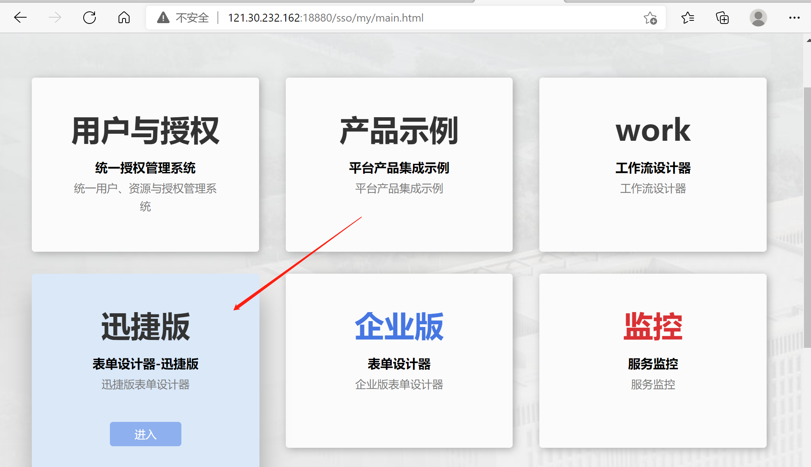
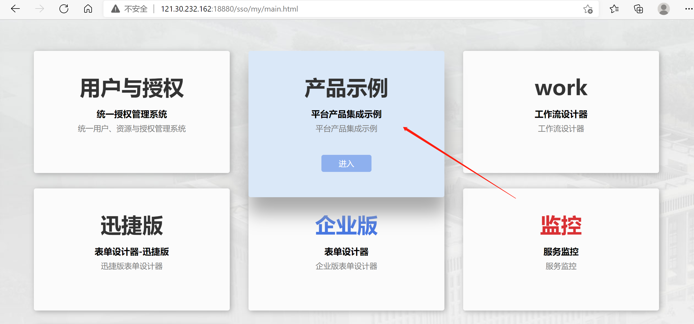

import AppVersion from "../src/oss/AppVersion";
import BundleLink from "../src/oss/BundleLink";

智能表单是一款快速搭建应用的平台。核心模块包括表单引擎、流程引擎和报表引擎。表单引擎中集成了大量表单控件，用户可以通过简单地拖拽操作完成表单制作过程；同样可以通过可视化图形工具，简单地鼠标操作完成流程的定制过程；将表单挂载流程 ，可快速实现数据上报、审批等过程。作为一款通用平台，提供强大的插件机制，允许您根据自身业务特性添加表单字段、按钮、控制表单逻辑、定制表单样式等。

## 当前版本

当前最新版本：<AppVersion />，您可以前往[下载页面](./download.mdx)，下载最新版本的安装包。

最佳搭档—— sinomatrix 最低版本号要求： [1.6.31](http://47.93.34.153:10080/sino-matrix/sino-matrix/blob/master/CHANGELOG.md) （注意：访问此地址时可能会出现 ERR_UNSAFE_PORT 的情况，请参看[这篇帖子](https://blog.csdn.net/kjcxmx/article/details/118122483)配置一下浏览器。）

## 在线体验

您可以访问[我们的外网站点](http://121.30.232.162:18880/sso/)，在线体验智能表单产品。

表单管理员：`admin`，密码是：`12345678`。其他账号的密码是 `12345678` 或者是 `1qaz2wsx!`。

登录系统之后，请选择“表单设计器-迅捷版”，进入智能表单管理端，设计表单。如下图所示：

设计并发布表单之后，通过“产品示例”系统，可以在线填报表单并发送流程。“产品示例”系统的入口如下图所示：

:::info 浏览器要求

本产品对浏览器有要求，如下的浏览器可以使用：

- IE 11
- Chrome
- Edge
- Firefox
- Safari

:::

## 操作手册

您在使用时，如果遇到使用上的问题，可以访问[智能表单产品操作手册](http://sinoui.gitee.io/intellisense-form-notebook/)，查看相关功能的说明。

## 部署

如果需要在您的私有环境搭建智能表单产品，请移步 [部署智能表单](./deployment.mdx)。

## 扩展与定制

智能表单有强大的插件机制，允许您扩展和定制智能表单产品。

您如果想控制智能表单前端行为，请移步 [智能表单前端插件开发教程](./plugin-index.md)。

关于智能表单后端的自定义扩展，我们为开发者提供了丰富多样的对外接口、简单易懂的扩展机制和轻量的开发工具包：

- [对外扩展接口](./extend-interface.md)
- [事件订阅](./sinoform-sdk-event-starter.md)

## 与其他平台集成

智能表单最佳搭档是 sinomatrix 平台，如果您需要将智能表单产品与其他平台集成，也是可以做的。但是我们现在没有时间和精力来编写这一块的集成文档，请您耐心等待。
