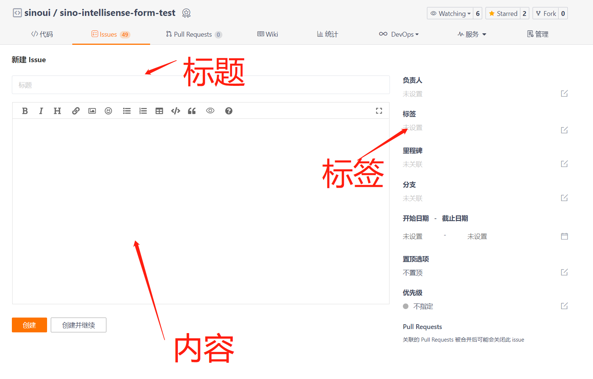
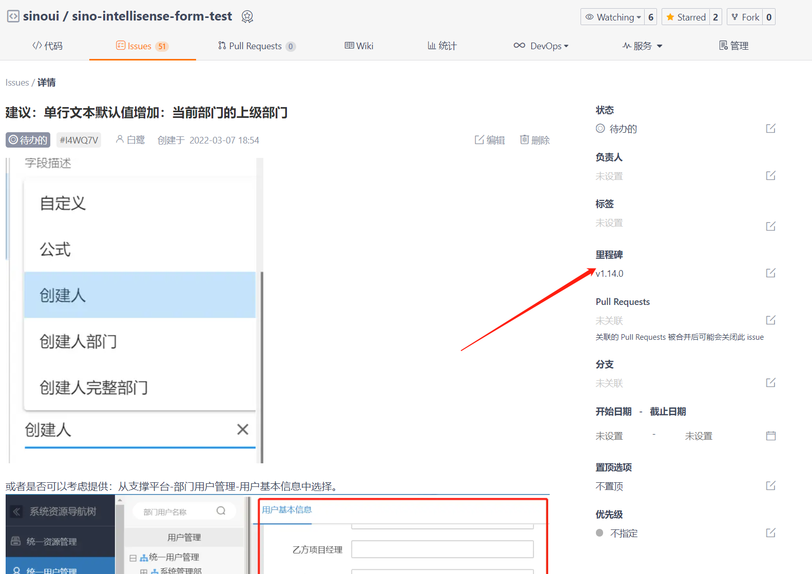
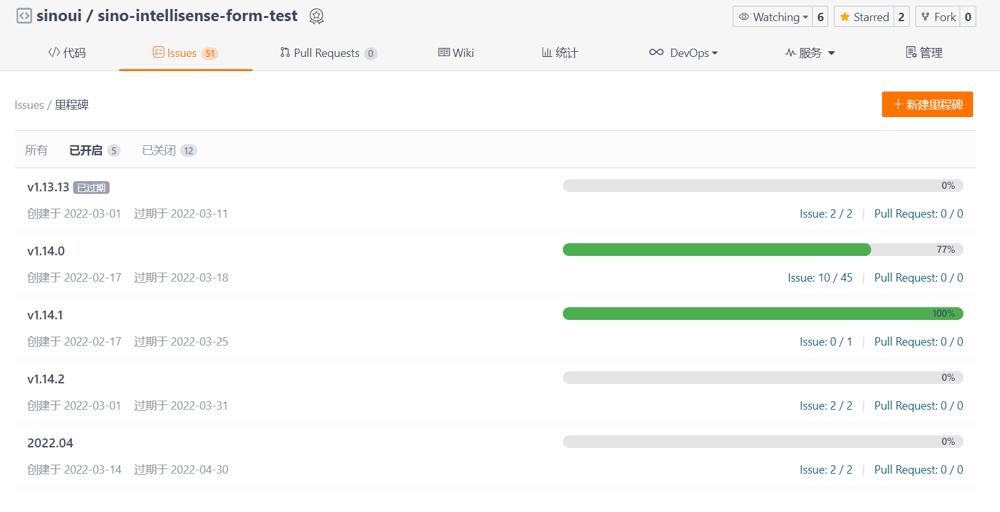
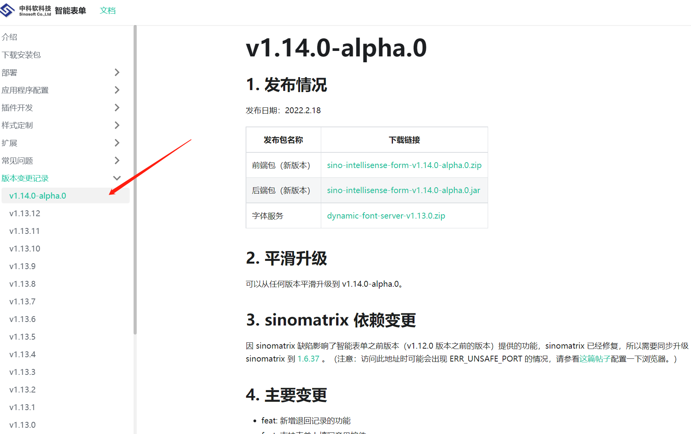

当您在使用智能表单产品时，遇到缺陷，或者有一些建议，请使用[工单系统](https://gitee.com/sinoui/sino-intellisense-form-test/issues)提交工单。本文档说明如何提交工单，以及如何查看工单的处理进度。

## 1. 提交工单

一件事情一个工单，不要在一个工单中提交多个缺陷、建议、需求。

工单由标题、内容和标签组成，如下图所示：



### 1.1. 工单标题

工单标题应言简意赅，且以`缺陷`、`建议`、`改进`或者`需求`开头，如下所示：

```markdown
缺陷：日期设置为不早于今日或不晚于今日无效。
```

### 1.2. 工单内容

在内容框中填入详细的内容，如果是缺陷，最好能配上截图。如果是需求、改进、建议，请详细描述诉求。

### 1.3. 工单标签

标签可以多选。请选择正确的工单标签：

| 标签 | 何时采用？                                                                                                                                         |
| ---- | -------------------------------------------------------------------------------------------------------------------------------------------------- |
| bug  | 产品的缺陷                                                                                                                                         |
| 改进 | 产品的功能设计、UI 操作不合理，需要改进的情况下，或者需要产品提供二次扩展的接口，选择此标签                                                        |
| 需求 | 需要一些产品目前不具备的功能                                                                                                                       |
| 建议 | 提出一些建议                                                                                                                                       |
| 紧急 | 比较重要的工单，有紧迫的时限要求的，可以标记为**紧急**。<br/> 如果您将工单标记为紧急，平台组会有相关人员与您联系，确认紧急的具体情况，并协商进度。 |

## 2. 查看工单进度

### 2.1. 里程碑

平台组会在提出工单的**五个工作日内**确定工单计划处理的版本（即里程碑）。如下图所示：



可以查看里程碑，看到智能表单近期版本规划，如下所示：



上图中的 **过期于** 是里程碑对应版本的发布日期。

:::tip 提示

注意：对于提的工单不够明确的，平台组会与工单提出人取得联系，了解明确意图。请及时回复。

:::

### 2.2. 版本发布

每个正式版本发布都会在微信群里发通知。临时版本（先行版本，版本号中带有 `alpha` 或者 `beta`）一般是让某个项目组提前验证相关功能而发布的，只会通知到相关项目组。

另外，大家也可以从智能表单站点上查看版本发布公告。如下图所示：



版本发布公告中会记录下此版本主要包含的内容，如果有对应的工单，会有工单链接（从 `1.14.0` 版本开始）。
