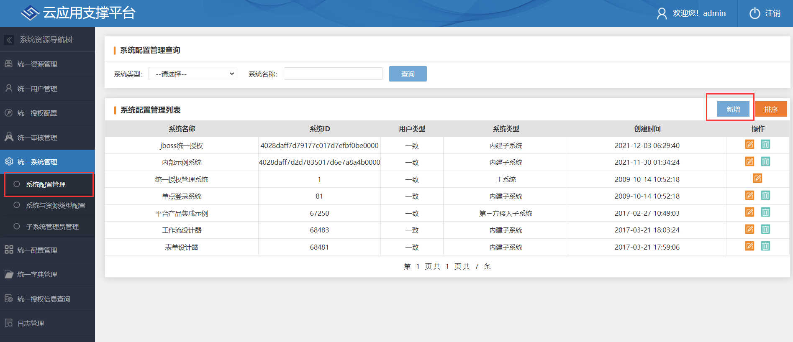
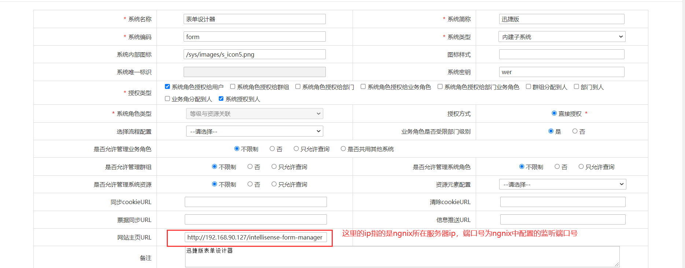
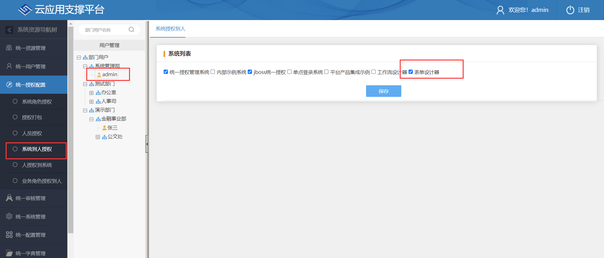
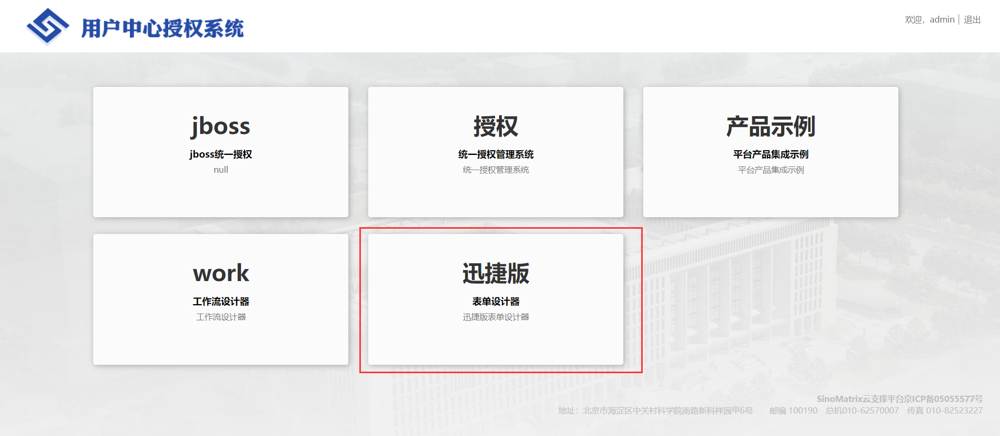

部署完成之后，为了方便验证，我们可以在 sino-matrix 中添加几个应用的快捷导航。

## 添加表单设计器的快捷导航

在【统一授权管理系统】的【统一系统管理】模块新增子系统。




添加完成后，需要将系统授权到人（即指定哪些用户可以可到此系统）。【统一授权配置】中选择【系统到人授权】，然后在左侧选择人员，再将创建的子系统勾选上，保存之后即完成授权。



登录进入系统，查看新建子系统是否能够正常访问。



:::info
若想通过同一地址（相同的网关和端口号）访问统一授权和智能表单服务，则需要在同一个 nginx 中代理 sino-matrix 的 sso（包括登录页和九宫格） 和智能表单。具体配置可参考：

```nginx title="nginx.conf"
  # 配置业务系统服务（以实际业务为准）
  upstream main_sso {
    server 127.0.0.1:8080;
  }

  server {
    # 启用 80 端口
    listen 80;
    server_name localhost;

    # sinomatrix访问地址
    location /sso {
      proxy_set_header Host $host;
      proxy_set_header X-Forwarded-For $proxy_add_x_forwarded_for;
      proxy_set_header X-Forwarded-Host $http_host;
      proxy_set_header X-Forwarded-Port $server_port;
      proxy_set_header X-Forwarded-Proto $scheme;
      proxy_set_header X-Real-IP $remote_addr;
      proxy_pass http://main_sso; # 对应upstream中的配置
    }
  }

```

:::

## 添加表单 PC 端应用的快捷导航

具体步骤与[添加设计器快捷导航](#添加表单设计器的快捷导航)基本一致。需要注意的是网站主页`URL`应调整为`http://<网关ip:port>/intellisense-form`。

## 添加表单移动端应用的快捷导航

具体步骤与[添加设计器快捷导航](#添加表单设计器的快捷导航)基本一致。需要注意的是网站主页`URL`应调整为`http://<网关ip:port>/intellisense-form-mobile`。
