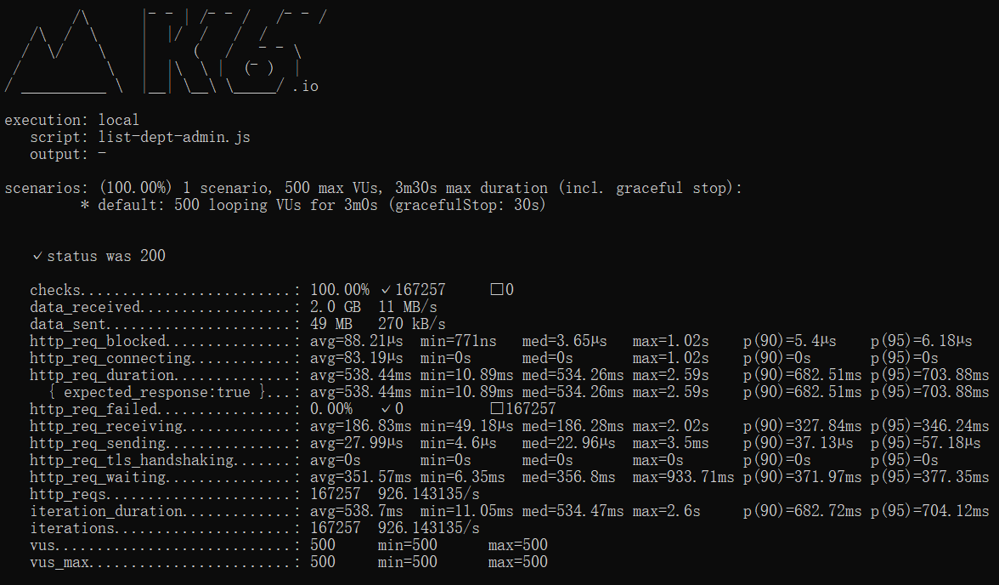

## 测试环境

- 测试服务器
  - 地址：192.168.90.128（单机）
  - cpu：32c
  - 内存：128G
- 测试数据库
  - 数据库：mysql
  - 版本：8.0.28-0ubuntu0.21.10.3
- 智能表单版本：1.15.0-alpha.49

## 测试数据准备

- 测试表单：性能测试-yyx （流程表单）
- 表单数据主表：form_xt02xpvze77zg9h9pm21  （200万数据）
- 表单数据子表：form_9ib0vgnw610l72ypkyb9  （400万数据）
- 权限表：sinoform_data_perm  （450万数据）

## 测试内容

- 查询全部数据 - 数据查看管理员打开查询列表
- 查询部门数据 - 部门数据管理员打开查询列表
- 查询本人数据 - 流程节点中设置的用户打开查询列表
- 查询起草数据 - 起草用户打开起草列表
- 查询表单设计数据 - 打开表单设计详情页
- 查询业务数据 - 打开业务数据详情页

## 测试工具

- 测试工具：k6
- 测试项目：[智能表单 - k6测试项目](https://e.gitee.com/sinoform/repos/sinoform/k6-test/sources)（readme文档中有使用说明）

## 测试指标

- 并发数：500并发/秒（约等于500请求/秒）
- 成功率（稳定性）：99.99%（四个九）
- 响应时长：3秒

## 测试结果

以下测试结果为并发500连续运行3分钟的测试结果，均满足测试指标。

| 测试场景     | 平均响应时间 | 最小响应时间 | 中位值   | 最大响应时间 | 90%的请求最大响应时间 | 95%的请求最大响应时间 | 请求处理速度 |
| ------------ | ------------ | ------------ | -------- | ------------ | --------------------- | --------------------- | ------------ |
| 查询全部数据 | 542.9ms      | 9.79ms       | 539.56ms | 1.31s        | 688.94ms              | 710.77ms              | 917.85/s     |
| 查询部门数据 | 538.44ms     | 10.89ms      | 534.26ms | 2.59s        | 682.51ms              | 703.88ms              | 926.14/s     |
| 查询本人数据 | 532.38ms     | 9.03ms       | 528.56ms | 1.68s        | 675.92ms              | 696.41ms              | 936.37/s     |
| 查询起草数据 | 581.35ms     | 19.54ms      | 579.56ms | 1.38s        | 740.89ms              | 764.28ms              | 858.70/s     |
| 查询表单设计 | 518.51ms     | 5.1ms        | 515.37ms | 1.07s        | 661.2ms               | 679.76ms              | 963.06/s     |
| 查询业务数据 | 525.46ms     | 8.86ms       | 522.26ms | 1.08s        | 667.57ms              | 686.41ms              | 950.27/s     |

## 测试截图

### 查询全部数据

### 查询部门数据

### 查询本人数据

### 查询起草数据

### 查询表单设计数据

### 查询业务数据

