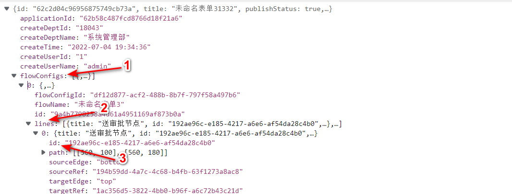

默认的工作流发送可选人员范围是解析工作流引擎返回的数据获得的，如果我们想要在不改变流程配置的情况下改变某个节点中的可选人员范围，可以通过在插件项目中指定自定义的人员范围来实现这种效果。

## 实现方式

可以通过新增的`appSetting.flowConfig.addFlowCandidates`方法来生成新的人员选择范围。

```typescript
import appSetting from '@sinoform/app-setting';

appSetting.flowConfig.addFlowCandidates(
  '62a6fdfd7fcd87bbbe7f621b', // formId
  '95d0b634-3c1e-45bc-a217-1ab3a9419c14', // flowLineId
  async (context) => {
    // fetchUserOrDept
    const nodes = await fetchFlowNodes(context); // 获取人员的异步方法

    return nodes;
  }
);
```

方法参数说明

- formId。表单设计 id
- flowLineId。单个路由 id 或者多路由 id 集合
- fetchUserOrDept。自定义的可选人员方法
  - 参数： 表单提交时工作流返回的数据
  - 返回值：人员选择集合

### flowLineId

因为存在多流程中两个流程中路由名称重复或单流程中多条路由名称重复的可能性，所以`addFlowCandidates`方法中使用了路由 id 作为筛选条件，但是我们没有办法直接在页面，所以就需要在控制台中查看。我们可以通过表单设计接口的返回数据来查看路由 id，在`flowConfigs`中找到对应的流程配置中的`lines`中想要配置的路由信息，这条配置中的 id 就是我们需要设置的路由 flowLineId。



### fetchUserOrDept

自定义流程发送人员方法的返回数据类型

```typescript
export interface UserNode {
  // 节点id
  id: string;
  // 节点名称
  name: string;
  // 节点类型，部门还是人员
  type: 'dept' | 'user';
  // 部门下人员集合
  nodes?: UserNode[];
  // 是否支持选中，'true'：可选中，'false'：不可选中
  checked: 'true' | 'false';
  // 是否被选中，'true：'已选中，'false：'未选中
  selected: 'true' | 'false';
}
```
