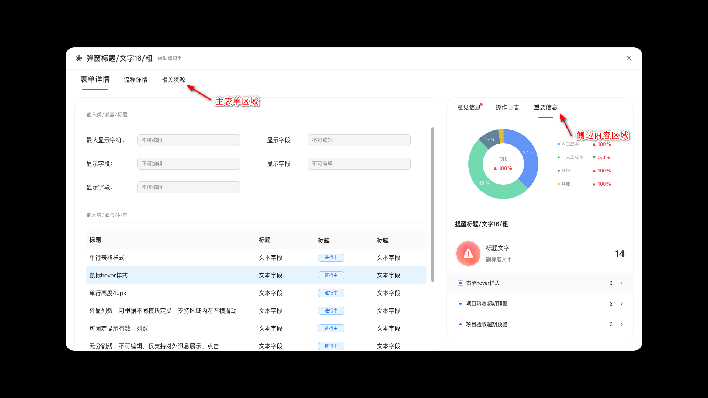

智能表单三套主题的表单详情页（包含流程表单详情页、无流程表单详情页）通过插件的方式为详情页注册 tab 页签，定制需要展示的内容。tab 标签类型分为两种：主表单内容区域的 tab 页签和侧边内容区域的 tab 页签。如下图所示：



## 注册主表单内容区域的 tab 页签

1. 定义 tab 页签的内容渲染组件。以 React 组件为例：

```tsx
import React from "react";
import type { FormData } from "@sinoform/types";

export interface Props {
  id: string;

  formData: FormData;
}

export default function MainContentTab(props: Props) {
  const { id } = props;

  // 示例：展示表单的设计id
  return <div>{id}</div>;
}
```

组件会接收两个参数：

- id: 表单设计 id
- formData: 当前表单数据，包含表单设计配置数据和当前表单的值等信息

2. 通过 appSetting 注册组件

```tsx
import appSetting from "@sinoform/app-setting";

appSetting.detailPageConfig.addDetailMainTabConfig({
  formId: "64f534ee3f2f40369cae83e8",
  title: "相关资源",
  render: React.lazy(() => import("./DetailPageMainTab")),
});
```

`addDetailMainTabConfig` 方法接收对象包含以下几个属性：

- formId: 表单设计 id。指定 Tab 页签绑定到哪个表单，如果需要绑定到多个表单，需要传字符串数组。
- title: Tab 页签的标题。
- render: Tab 页签组件。
- order: Tab 页签展示的优先级。如果一个表单绑定了多个页签，可以通过此属性来指定页面的展示顺序，值越大，展示越靠前。默认为 0
- availability: Tab 页签可见性控制回调函数。返回 true 展示页签，否则不展示。默认返回 true。方法接收两个参数
  - formData: 当前表单数据
  - currentUser: 当前登录用户

## 注册侧边内容区域的 tab 页签

1. 定义 tab 页签的内容渲染组件。参考上文中的示例。
2. 通过 appSetting 注册组件。

需求： 指定只有 id 为 admin 的用户可以看到此页签

```tsx
import appSetting from "@sinoform/app-setting";

appSetting.detailPageConfig.addDetailRightSideTabConfig({
  formId: "64f534ee3f2f40369cae83e8",
  title: "相关资源",
  render: React.lazy(() => import("./DetailPageRightSideTab")),
  availability: (formData, currentUser) => {
    return currentUser.userId === "admin";
  },
});
```

`addDetailRightSideTabConfig` 方法的参数定义参考上文
