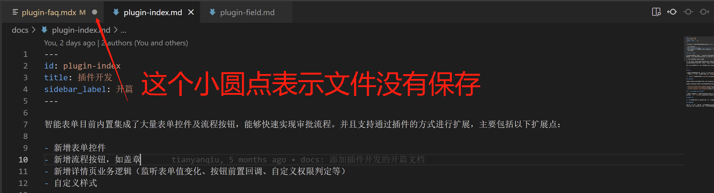
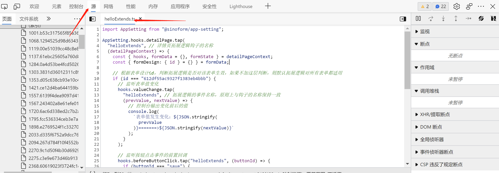
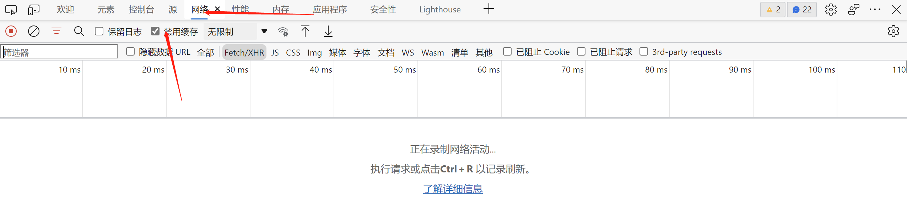

## 1. 在调试智能表单插件时，智能表单页面上不显示相关的插件，如自定义的流程按钮、表单控件等。

出现这种问题，有可能是以下几种情况导致的，请逐一排查：

### 情况一：未注册本地插件项目

要想在智能表单中调试插件项目，需要将插件项目注册到智能表单产品中。注册过程是：在浏览器中先打开智能表单页面，然后打开浏览器的控制台（devtools），在控制台执行下面的代码，完成注册：

```javascript {6}
localStorage.setItem(
  "sinoform-preview-plugins",
  JSON.stringify([
    {
      url: "http://localhost:8090/extend.js",
      name: "qxjoaPlugins",
    },
  ])
);
```

千万要注意 `name`，需要与插件项目名称保持一致（需要将连字符形式的插件项目名称转化为首字母小写的驼峰式名称）。

另外，如果您之前注册过，但是以下行为有可能会取消注册：

- 主动执行 `localStorage.removeItem("sinoform-preview-plugins");` 代码，取消插件项目的注册
- 清空了浏览器的缓存
- 您使用了其他的浏览器打开了智能表单

您可以打开浏览器开发者工具的`application`（`应用程序`）面板中查看一下`localStorage`（`本地存储`），如果有以下类似的内容，则表示注册成功：


### 情况二：注册的插件项目名称错误

有可能您的项目名称与您注册的插件项目名称不一致，您可以打开插件项目的 `webpack.base.config.js` 文件，查看库名称，如下图所示：


可以将上图与情况一中注册的名称对比一下，看一下是否一致。

### 情况三：插件项目未启动

有可能您忘记启动插件项目了。请确认一下。如果没有启动，则执行一下 `yarn start`，启动项目。

### 情况四：您动了 webpack 配置？

如果您调整了 webpack 相关配置，例如 `端口号`，那么您需要重新注册一下插件项目，使用正确的 `url`。

### 情况五：您的插件注册了么？

请打开插件项目入口文件 `src/index.ts`，检查是否注册了相关插件。例如：

注册流程按钮：

```typescript
// 注册 hello-button 插件（流程按钮）
AppSetting.flowConfig.addButton({
  id: "hello-button",
  name: "Hello World",
  render: React.lazy(() => import("./plugins/flow-button-hello")),
});
```

注册表单项：

```typescript
// 注册 custom-text-input 表单控件
AppSetting.formConfig.addField({
  type: "custom-text-input",
  title: "自定义单行文本",
  group: FormFieldGroup.normal,
  icon: EventNote,
  render: React.lazy(
    () => import("./plugins/form-field-custom-text-input/render")
  ),
  preview: React.lazy(
    () => import("./plugins/form-field-custom-text-input/preview")
  ),
  configPanel: React.lazy(
    () => import("./plugins/form-field-custom-text-input/config-panel")
  ),
});
```

注册扩展：

```typescript
import "./plugins/detail-page-extends/customPermissionExtends";
```

## 2. 新写的代码在调试过程中没有作用

导致出现此现象的原因有很多，我们可以按照下面的步骤逐一排查：

### 步骤一：查看一下代码文件是否保存

我们在开发智能表单产品过程中，出现过因为没有保存修改代码的文件，导致在页面上看不到应有的效果，我们偶尔还会花很多时间来调试代码为什么没有起作用。

所以，您可以先检查一下是否遇到与我们类似的情况。 您可以查看一下 vscode 的页签，看是否有带有圆点的页签，如果有，则保存一下。如下图所示：



### 步骤二：可能是浏览器缓存导致没有获取到最新的 js 文件

首先可以打开浏览器开发者工具（按 `F12` 可打开开发者工具）的 `source` （`源`）页签，按 `Ctrl + P` 快捷键，在出现的输入框中输入你的文件名，找到你的文件，然后打开此文件，看看是否包含了变更的代码。如下图所示：



如果没有包含变更代码，则可能是因为浏览器缓存导致的，可以打开 `network`（`网络面板`），勾选上 `Disable Cache`（`禁用缓存`）选项，如下图所示：



### 步骤三：使用大招：重新启动插件项目

如果通过上面两个步骤还是没能解决您的问题，您可以重新启动一下插件项目。出现这种情况的概率非常小，我们在开发智能表单过程中，遇到不到十次这样的情况。
